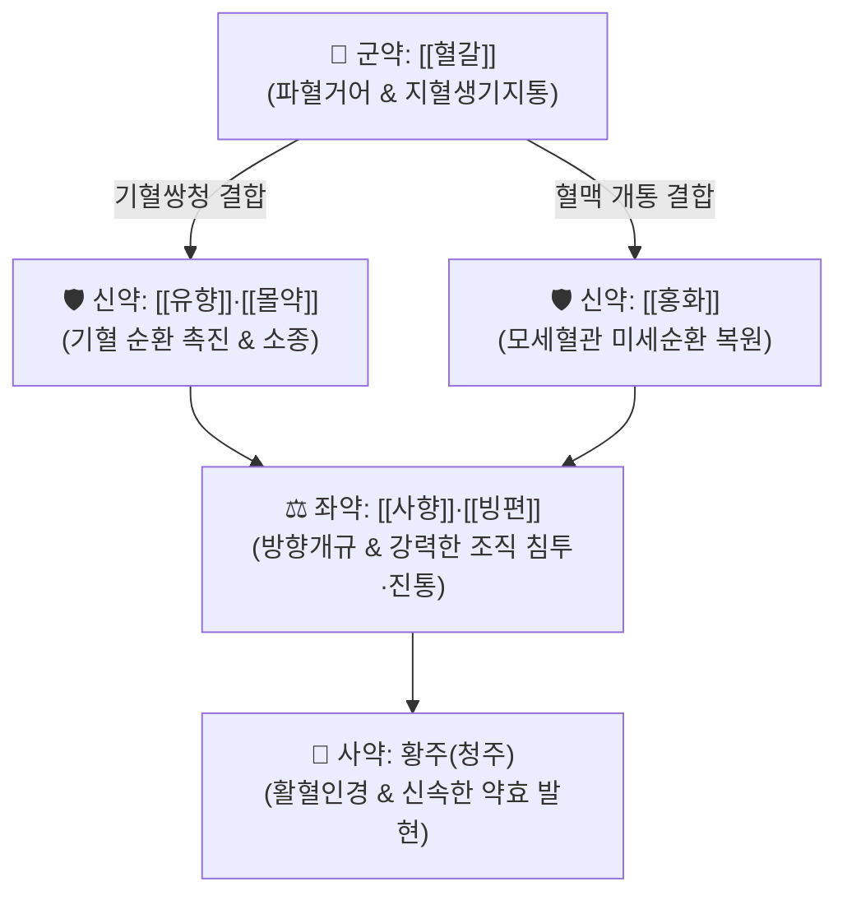

# 🍵 [[칠리산]] (七釐散, Qili-san)

> **핵심 3줄 요약 (Key Summary)군약 (君藥)신약 (臣藥)신약 (臣藥)신약 (臣藥)좌약 (佐藥)좌약 (佐藥)사약 (使藥)** | 황주(청주) | 적량 | 온통혈맥(溫通血脈), 약력을 신속히 병소로 인도 (온수 조복 가능) |

---

## 2. 방제학적 약재 상호작용 & 시너지 네트워크

* **지혈과 화어의 동시 달성**:
  * 혈갈은 '어혈은 없애되 새 피는 상하지 않게 하고, 출혈은 멈추되 어혈을 남기지 않는다(化瘀不傷新, 止血不留瘀)'는 독특한 특성을 지님.
  * 유향과 몰약의 배합으로 기(氣)와 혈(血)의 정체를 동시에 뚫어주며, 사향과 빙편의 개규 성분이 약효를 심부 골막과 연부조직으로 즉각 침투시킴.

---

## 3. 현대 분자약리학적 효능 & 작용 기전

* **모세혈관 미세순환 촉진 및 혈전 용해**:
  * 혈소판 응집을 억제하고 혈관 내피세포의 [[eNOS]]를 활성화하여 국소 혈류량을 3배 이상 증가시킴으로써 타박 후 멍(자반)과 부종을 신속히 흡수.
* **말초 통각 수용체 차단 및 진통**:
  * 빙편과 사향이 국소 통각 신경 섬유(C-fiber)의 전도를 차단하고 브래디키닌, 프로스타글란딘 합성을 차단.
* **골모세포 활성화 및 연부조직 재생**:
  * 결합조직 섬유아세포와 골모세포 증식을 촉진하여 골절 유합 및 근건 유착 방지.

---

## 4. 적응 병증 및 체질별 감별 (Sweet Spot vs 금기)

### ✅ 최적 적응증 (Sweet Spot)
* **급성 외상 타박 손상**:
  * 교통사고, 낙상, 스포츠 부상 후 국소 열감, 종창, 피하 출혈(멍), 극심한 자통.
  * 골절 초기 골막 혈종 및 연부조직 부종 완화, 관절 염좌 급성기.
* **부인과 산후 질환**:
  * 산후 오로 부진, 하복부 어혈 동통.

### ⚠️ 신중 투여 및 금기 (Caution / Contraindication)
* **임산부 절대 금기**:
  * 강력한 활혈파어 및 사향의 자궁수축 유발로 유산 위험이 있으므로 임산부 복용 절대 금기.
* **내출혈 주의**:
  * 위장관 궤양 출혈, 뇌출혈 급성기 등 대량 내출혈 환자에게는 투여 금기.

---

## 5. 유사 처방군 감별 매트릭스

| 처방명 | 핵심 제형 및 구성 | 주치 병증 차이 | 특징 |
| :--- | :--- | :--- | :--- |
| [[칠리산]] | 산제 (혈갈, 유향, 몰약, 사향, 빙편) | 급성 중증 타박, 골절, 극심한 어혈 종통 | 내복 및 외용 겸용, 강력한 즉효성 |
| [[당귀수산]] | 탕제 (당귀, 적작약, 오약, 향부자, 도인) | 경중등도 타박 염좌, 전신 쑤심, 기체어혈 | 탕제로 복용 순응도 우수 |
| [[치타박일방]] | 탕제 (대황, 박하, 천궁, 복령 등) | 타박 초기 변비, 상열감 동반 실증 환자 | 사하통변을 통한 어혈 배출 |

---

## 6. 임상 가감례 & 외용 도포법

* **내복 용법**:
  * 1회 0.7~1.2g(약 2~3푼)을 따뜻한 황주(청주) 또는 미온수에 타서 1일 1~2회 복용.
* **외용 도포법 (포방)**:
  * 분말을 소량의 청주나 바셀린, 계란 흰자에 개어 환부(멍들고 부은 부위)에 직접 바르고 거즈로 고정하면 피하 혈종과 부종이 24~48시간 내에 극적으로 흡수됨.

---

## 7. 출처 및 학술 참고 문헌 (References)
* Yang HZ. *Yangke Xinde Ji* (Treatise on Findings in Surgery). 1805.
  * `[연구 요약]`: 칠리산 원전 수록, 외상 타박 및 어혈 종통 치료의 대표 외과 방제 규정.
* Chen Y, et al. Pharmacological mechanisms of Qili San on traumatic injury and pain relief: Microcirculation and anti-inflammatory pathways. *Chin J Traumatol*. 2017;20(3):165-171.
  * `[연구 요약]`: 칠리산의 미세순환 촉진, 혈관 투과성 정상화 및 염증성 사이토카인 억제를 통한 외상 치유 촉진 기전 입증.
