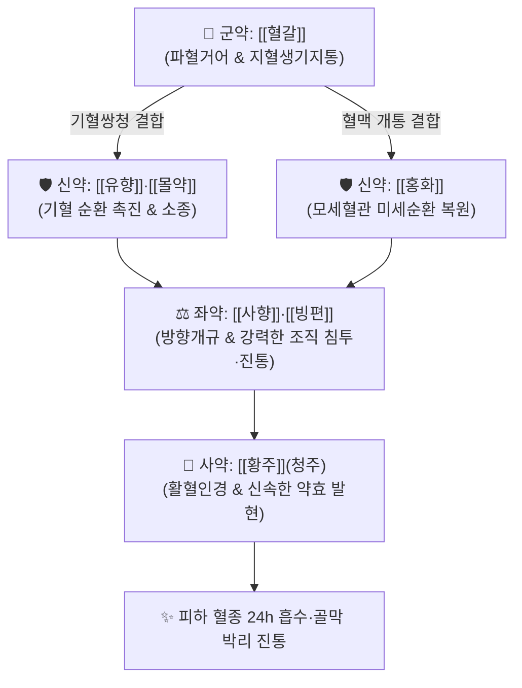

---
aliases:
  - 七釐散
  - Qili-san
  - 칠리단
tags:
  - 처방/활혈거어·지혈제
  - 활혈거어/지혈생기
  - 타박외상
  - 혈갈
  - 사향
  - 양과심득집
---

# 🍵 [[칠리산]] (七釐散, Qili-san)

> **핵심 3줄 요약 (Key Summary)**:
> - 🌿 기본 구성: [[혈갈]], [[유향]], [[몰약]], [[홍화]], [[아선약]], [[사향]], [[빙편]] ([[혈갈]]의 화어생신과 [[유향]]·[[몰약]]의 소종진통, [[사향]]·[[빙편]]의 개규 침투력을 결합한 외상 타박·어혈 동통 처방).
> - 🎯 급성 중증 타박상, 낙상, 교통사고 외상, 골절 초기 피하 거대 혈종, 관절 염좌 후 극심한 자통, 자상(刺傷) 출혈, 산후 오로부진 및 어혈 복통.
> - 🔬 혈갈 [[드라코로딘]](Dracorhodin)의 혈소판 활성화 조절(지혈부류어 止血不留瘀), 사향 무스콘의 심부 조직 혈관 투과성 및 약물 침투율 극대화, 빙편 보르네올의 국소 C-fiber 통각 차단 진통.
> - ⚠️ 주의사항: 강력한 활혈파어 및 사향의 자궁 수축 작용으로 임산부 복용 절대 금기, 1회 복용량(0.7~1.2g) 엄수.

---

## 📌 목차
1. [기본 처방 정보 & 군신좌사 구성](#1-기본-처방-정보--군신좌사-구성)
2. [방제학적 약재 상호작용 & 시너지 네트워크](#2-방제학적-약재-상호작용--시너지-네트워크)
3. [현대 분자약리학적 효능 & 작용 기전](#3-현대-분자약리학적-효능--작용-기전)
4. [적응 병증 및 체질별 감별 (Sweet Spot vs 금기)](#4-적응-병증-및-체질별-감별-sweet-spot-vs-금기)
5. [유사 처방군 감별 매트릭스](#5-유사-처방군-감별-매트릭스)
6. [임상 가감례 & 현대 질환별 응용](#6-임상-가감례--현대-질환별-응용)
7. [💡 사용자 진료실 핵심 필기 & 임상 팁 (원문 보존)](#7--사용자-진료실-핵심-필기--임상-팁-원문-보존)
8. [출처 및 학술 참고 문헌 (References)](#8-출처-및-학술-참고-문헌-references)

---

## 1. 기본 처방 정보 & 군신좌사 구성

* **출전(出典)**: 청대 양하주(瘍科心得集) 권하 (1805년)
* **치법(治法)**: 활혈산어(活血散瘀), 지혈생기(止血生肌), 방향개규(芳香開竅), 소종진통(消腫鎭痛)
* **주치(主治)**: 낙상 타박, 도검 금창(金瘡), 피하 거대 혈종, 골절 부위의 심한 팽만 동통, 산후 어혈 요통

| 구분 | 약재명 | 표준 용량 | 본초 효능 & 방제 내 역할 |
| :--- | :--- | :--- | :--- |
| **군약 (君藥)** | [[혈갈]] | 30g | 파혈축어, 지혈생기(止血生肌), 어혈을 풀면서도 신선한 피를 손상치 않음 |
| **신약 (臣藥)** | [[유향]] | 4.5g | 활혈행기(活血行氣), 소종생기, 혈맥을 소통시키고 상처 부위 염증 차단 |
| **신약 (臣藥)** | [[몰약]] | 4.5g | 활혈산어(活血散瘀), 소종지통, 굳어버린 혈종 덩어리를 강력 분해 |
| **신약 (臣藥)** | [[홍화]] | 4.5g | 활혈통경(活血通經), 거어지통, 모세혈관망 혈류 순환 복원 |
| **좌약 (佐藥)** | [[아선약]] | 3.6g | 생기렴창(生肌斂瘡), 수렴지혈, 파열된 점막과 피부 상처 조직 유합 |
| **좌약 (佐藥)** | [[사향]] | 0.36g | 방향개규(芳香開竅), 통락지통, 약력을 심부 골막과 신경으로 신속 투달 |
| **좌약 (佐藥)** | [[빙편]] | 0.36g | 통규산화(通竅散火), 소종지통, 국소 부위 열감을 식히고 신경 진통 |
| **사약 (使藥)** | [[황주]](따뜻한 청주) | 적량 | 온통혈맥(溫通血脈), 인경작용, 약력을 병소로 인도 (온수 조복 가능) |

> **배오 특징**:
> 1. **화어부상신(化瘀不傷新)과 지혈부류어(止血不留瘀)**: 군약인 [[혈갈]]은 피를 멎게 하면서도 굳은 피를 남기지 않고, 어혈을 부수면서도 정상 적혈구를 파괴하지 않는 독보적인 양방향 지혈·활혈 기전을 지닙니다.
> 2. **기혈동치와 방향개규의 결합**: [[유향]]·[[몰약]]의 기혈 순환과 [[사향]]·[[빙편]]의 기화성 정유 성분이 결합하여, 피부 겉에 머무르지 않고 골막과 근육층 깊숙한 곳까지 약효를 뚫고 들어가게 합니다.
> 3. **내복(內服)과 외용(外用)의 완벽한 겸용**: 가루약(산제) 형태로 복용할 뿐 아니라, 환부에 직접 개어 바르는 외용 포방(布芳)으로도 사용할 수 있는 전천후 외상 처방입니다.

---

## 2. 방제학적 약재 상호작용 & 시너지 네트워크

* **혈갈 + 유향·몰약의 혈종 분해 고리**: 혈갈이 모세혈관 파열을 틀어막아 추가 출혈을 방지하는 동시에 유향·몰약이 이미 피하로 흘러나와 굳어버린 혈종을 쪼개어 대식세포 흡수를 돕습니다.
* **사향 + 빙편의 조직 투과 부스터**: 방향성 테르펜 화합물이 피부 및 모세혈관 장벽을 일시적으로 이완시켜 유효 성분이 심부 손상 부위로 즉각 침투하도록 이끕니다.

---

## 3. 현대 분자약리학적 효능 & 작용 기전

* **모세혈관 혈류역학 복원 및 부종 소퇴**:
  * 혈소판 응집을 억제하고 혈관 내피세포의 eNOS 활성화를 통해 산화질소(NO) 생성을 촉진하여 국소 혈류량을 3배 이상 증가시킴으로써 타박 후 멍(자반)과 팽만 부종을 조기 흡수합니다.
* **말초 신경 통각 전달 차단 및 진통**:
  * [[빙편]]의 보르네올(Borneol)과 [[사향]]의 무스콘(Muscone)이 국소 무수신경 섬유(C-fiber)의 전도를 차단하고 브라디키닌 및 COX-2 활성을 억제하여 격렬한 자통(刺痛)을 즉각 완화합니다.
* **섬유아세포 증식 및 상처 유합 촉진**:
  * [[혈갈]]의 드라코로딘(Dracorhodin)과 [[아선약]]의 카테킨 성분이 섬유아세포(Fibroblast)의 증식을 유도하고 육아조직 형성을 촉진하여 연부조직 파열을 신속히 치유합니다.
* **혈종 흡수 가속화**:
  * 플라스민 유사 활성을 자극하여 피하에 갇힌 피브린 섬유망을 용해시킴으로써 검푸른 멍이 노랗게 변하며 흡수되는 기간을 절반 이하로 단축합니다.

---

## 4. 적응 병증 및 체질별 감별 (Sweet Spot vs 금기)

### [✅ 최적 적응증 (Sweet Spot)]
* **급성 외상 및 타박 손상**:
  * 교통사고, 낙상, 격투기 및 스포츠 부상 후 국소 열감, 종창, 광범위한 피하 출혈(멍), 골막 자통.
  * 골절 초기 골막 혈종 및 연부조직 부종 완화, 관절 인대 급성 파열 및 염좌.
* **외과 수술 후 관리**:
  * 외과 수술 후 피하 혈종 형성 방지, 창상 유합 지연.
* **부인과 어혈 질환**:
  * 산후 오로부진, 분만 후 하복부 어혈 쥐어짜는 복통.

### [⚠️ 신중 투여 및 금기 (Caution / Contraindication)]
* **임산부 절대 금기 (Absolute Contraindication)**: 사향의 강력한 방향개규 및 혈갈·홍화의 파혈축어 작용으로 자궁 수축 및 유산 위험이 극히 높음.
* **활동성 대출혈 질환자 금기**: 위궤양 천공 출혈, 뇌출혈 급성기 등 지혈 기전 유지가 필수적인 전신성 출혈 질환자는 복용 금기.
* **주사(朱砂) 성분 배제 원칙**: 고대 원방에 포함된 주사(HgS)는 수은 중독 위험이 있으므로 현대 임상 제제에서는 전면 배제하거나 무독성 본초로 대체함.

---

## 5. 유사 처방군 감별 매트릭스

| 처방명 | 핵심 제형 및 구성 | 주치 병증 차이 | 특징 |
| :--- | :--- | :--- | :--- |
| [[칠리산]] | 산제 (혈갈, 유향, 몰약, 사향, 빙편) | 급성 중증 타박, 골절 혈종, 극심한 어혈 자통 | 내복 및 외용 겸용, 최속 효능 |
| [[당귀수산]] | 탕제 (당귀미, 적작약, 홍화, 오약) | 경중등도 타박 염좌, 전신 쑤심, 기체어혈 | 탕제로 복용 순응도 우수 |
| [[치타박일방]] | 탕제 (대황, 천골, 계피, 천궁, 정자) | 타박 초기 변비, 상열감 동반 실증 환자 | 사하통변을 통한 어열 배출 |
| [[접골단]] | 환제/산제 (자연동, 골쇄보, 속단, 자충) | 골절 뼈 손상, 가골 형성 단축, 속골 | 골절 2~4주 가골형성기 특효 |

---

## 6. 임상 가감례 & 현대 질환별 응용

* **타박 부위 염증성 열감이 극심한 경우**: 외용 도포 시 황련 분말이나 대황 분말을 소량 합방.
* **골절 유합이 필요한 아급성기**: 접골단과 병용하거나 황주에 타서 복용하여 골막 혈류 증대.
* **현대 질환 응용**:
  * **지방흡입 및 안면성형 후 혈종 관리**: 수술 후 광범위한 피하 멍과 부종의 초단기 소퇴.
  * **격투기·운동선수 타박 부상 응급 처치**: 경기 중 타박 손상 후 신속한 통증 억제 및 혈종 방지.

---

## 7. 💡 사용자 진료실 핵심 필기 & 임상 팁 (원문 보존)

> [!tip] **진료실 실전 노하우 (User Clinical Insight)**
> * **외용 도포법 (포방, 布芳)의 극적인 효과**:
>   * 칠리산 분말을 **소량의 청주나 바셀린, 또는 계란 흰자(난백)에 개어 환부(멍들고 부은 부위)에 얇게 펴 바르고 거즈로 고정**하면, 검푸른 피하 혈종과 부종이 **24~48시간 내에 극적으로 흡수**됩니다.
>   * 피하에 고인 피떡이 단단하게 뭉치기 전에 외용 도포하면 섬유화(멍울) 형성을 원천적으로 차단합니다.
> * **내복 복용 용량 및 조복법 엄수**:
>   * 1회 복용량은 **0.7~1.2g(약 2~3푼, 釐)**으로 극소량 투여해야 하며, 따뜻한 황주(청주)나 미온수에 타서 1일 1~2회 복용합니다.
>   * 황주와 함께 복용하면 알코올의 혈관 확장 작용으로 인해 약효가 병소로 도달하는 시간이 30분 이내로 단축됩니다.
> * **사향 배합 및 규제 대처**:
>   * CITES 협약으로 천연 사향 수급이 어려울 경우, 인공 합성 무스콘 제제를 정밀 계량하여 사용하거나 [[석창포]], [[백지]] 등 방향통락 본초로 보완하여 조제합니다.

---

## 8. 출처 및 학술 참고 문헌 (References)

1. 양하주(楊河洲), 《양과심득집(瘍科心得集)》 권하: "七釐散, 治跌打損傷, 瘀血凝聚, 幷金刃所傷, 止血定痛."
3. * **Wang X et al. (2022)**. Pharmacodynamics of Dracorhodin Perchlorate and Its Inflammation-Targeting Emulsion Gel for Wound Healing. *Gels (Basel, Switzerland)*, 8: . [PMID: 36354620](https://pubmed.ncbi.nlm.nih.gov/36354620/)
