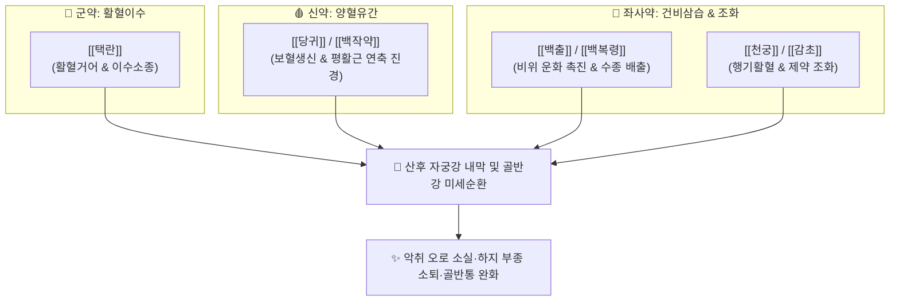

---
aliases:
  - 澤蘭湯
  - Zelan-tang
  - Taengnantang
tags:
  - 처방/활혈거어·지혈제
  - 활혈거어/이수소종
  - 산후어혈
  - 산후부종
  - 부인양방대전
  - 동의보감
---

# 🍵 [[택란탕]] (澤蘭湯, Zelan-tang)

> **핵심 3줄 요약 (Key Summary)**:
> - 🌿 기본 구성: [[택란]], [[당귀]], [[백작약]], [[백출]], [[백복령]], [[천궁]], [[감초]] (활혈이수의 성약인 [[택란]]을 중심으로 [[당귀]]·[[작약]]의 보혈양혈과 [[백출]]·[[복령]]의 건비이수를 결합하여 피는 상하지 않고 물만 빼내는 산후 어혈·부종의 대표 방제).
> - 🎯 산후 오로부진(惡露不盡), 산후 전신 및 하지 부종, 골반강 만성 울혈통, 어혈성 [[생리통]], 무월경, 타박상 후 부종과 멍이 결절화되어 빠지지 않는 상태.
> - 🔬 택란 페닐프로파노이드·플라보노이드의 혈관 내피세포 보호 및 혈소판 응집 억제, 복령·백출의 아쿠아포린(AQP-2) 조절을 통한 신장 수분 저류 억제, 작약 페오니플로린의 자궁 평활근 연축 진경.
> - ⚠️ 주의사항: 활혈이수제이므로 혈액과 진액이 완전히 고갈된 순수 혈허 환자 단독 투여 주의, 임산부 투약 금기.

---

## 📌 목차
1. [기본 처방 정보 & 군신좌사 구성](#1-기본-처방-정보--군신좌사-구성)
2. [방제학적 약재 상호작용 & 시너지 네트워크](#2-방제학적-약재-상호작용--시너지-네트워크)
3. [현대 분자약리학적 효능 & 작용 기전](#3-현대-분자약리학적-효능--작용-기전)
4. [적응 병증 및 체질별 감별 (Sweet Spot vs 금기)](#4-적응-병증-및-체질별-감별-sweet-spot-vs-금기)
5. [유사 처방군 감별 매트릭스](#5-유사-처방군-감별-매트릭스)
6. [임상 가감례 & 현대 질환별 응용](#6-임상-가감례--현대-질환별-응용)
7. [💡 사용자 진료실 핵심 필기 & 임상 팁 (원문 보존)](#7--사용자-진료실-핵심-필기--임상-팁-원문-보존)
8. [출처 및 학술 참고 문헌 (References)](#8-출처-및-학술-참고-문헌-references)

---

## 1. 기본 처방 정보 & 군신좌사 구성

* **출전(出典)**: 《부인양방대전(婦人良方大全)》 권제이십사, 《동의보감(東醫寶鑑)》 부인편 권삼
* **치법(治法)**: 활혈화어(活血化瘀), 이수소종(利水消腫), 보혈건비(補血健脾), 완급지통(緩急止痛)
* **주치(主治)**: 부인 산후에 어혈이 풀리지 않아 오로가 지속되고, 수습(水濕)이 정체되어 온몸이 붓고 아랫배가 당기며 아픈 병증

| 구분 | 약재명 | 표준 용량 | 본초 효능 & 방제 내 역할 |
| :--- | :--- | :--- | :--- |
| **군약 (君藥)** | [[택란]] | 12g | 활혈거어, 이수소종, 피를 상하지 않고 어혈을 몰아내며 수분을 소변으로 배출 |
| **신약 (臣藥)** | [[당귀]] | 10g | 보혈활혈(補血活血), 조경지통, 자궁 미세혈류를 개선하고 신선한 혈액 보충 |
| **신약 (臣藥)** | [[백작약]] | 8g | 양혈유간(養血柔肝), 완급지통, 자궁 평활근의 병적 연축과 하복부 산통 진통 |
| **좌약 (佐藥)** | [[백출]] | 8g | 건비익기(健脾益氣), 조습이수, 비위 운화 기능을 살려 정체된 수액 대사 촉진 |
| **좌약 (佐藥)** | [[백복령]] | 8g | 이수삼습(利水滲濕), 녕심안신, 신장 사구체 혈류 촉진 및 하지 수종 배출 |
| **좌약 (佐藥)** | [[천궁]] | 6g | 활혈행기(活血行氣), 거풍지통, 기혈 순환을 촉진하여 당귀·택란의 약력 보조 |
| **사약 (使藥)** | [[감초]] | 4g | 보기화중(補氣和中), 제약조화, 완급지통 및 위장관 점막 보호 |

> **배오 특징**:
> 1. **활혈부상정(活血不傷正)과 이수부상음(利水不傷陰)**: 군약인 [[택란]]은 어혈을 풀되 정혈을 손상시키지 않고, 부종을 빼내되 진액을 말리지 않는 가장 온화하고 탁월한 활혈이수 본초입니다.
> 2. **양혈보허(養血補虛)와 거습소종(祛濕消腫)의 융합**: [[당귀]]·[[백작약]]의 보혈 자양제와 [[백출]]·[[백복령]]의 비위 건비이수제가 합벽을 이루어, 산후 기혈이 쇠약해진 산모의 어혈과 수종을 탈진 없이 회복시킵니다.
> 3. **기혈수의 통합 조절**: 혈(당귀·작약·천궁) + 수(택란·복령·백출) + 기(천궁·감초)가 하나의 방제 안에서 정밀하게 연동됩니다.

---

## 2. 방제학적 약재 상호작용 & 시너지 네트워크

* **택란 + 당귀의 거어생신(祛瘀生新)**: 택란이 고인 어혈을 풀어 길을 열어주면 당귀가 신선한 혈액을 공급하여 자궁내막의 조기 상피화를 유도합니다.
* **택란 + 복령·백출의 이수소종**: 혈액 순환 개선과 림프·수분 대사 촉진이 동시에 일어나 산후 체액 저류와 함요부종을 신속히 제거합니다.

---

## 3. 현대 분자약리학적 효능 & 작용 기전

* **자궁 평활근 수축 조율 및 잔류 오로 배출**:
  * 택란 추출물이 자궁 평활근 세포막의 칼슘 이온 통로를 조절하여 과도한 강직성 경련을 막고, 규칙적인 율동적 수축을 유도하여 출혈 없이 자궁 내 잔류 혈종과 분비물을 배출합니다.
* **아쿠아포린(AQP-2) 억제 및 수분 저류 완화**:
  * 복령 다당체와 백출 세스퀴테르펜이 신장 집합관의 아쿠아포린-2(AQP-2) 발현을 하향 조절하여 수분 재흡수를 억제하고 소변량을 적정 수준으로 증가시킵니다.
* **자궁 평활근 연축 억제 및 진통**:
  * [[백작약]]의 [[페오니플로린]]과 [[감초]]의 [[글리시리진]]이 협력하여 세포막 칼슘 유입을 차단, 프로스타글란딘($PGF_{2\alpha}$) 매개 자궁 과수축과 허혈성 산통을 억제합니다.
* **미세혈관 내피세포 보호 및 혈전 예방**:
  * 당귀의 페룰산과 천궁의 리구스틸라이드가 혈소판 응집을 억제하고 혈관 내피세포의 산화 손상을 방어하여 골반강 울혈성 정맥염을 예방합니다.

---

## 4. 적응 병증 및 체질별 감별 (Sweet Spot vs 금기)

### [✅ 최적 적응증 (Sweet Spot)]
* **산후 부인과 병증**:
  * 산후 오로부진: 분만 후 2~3주가 지나도 검붉거나 갈색 분비물이 멎지 않는 상태.
  * 산후 전신 부종: 얼굴과 손발, 특히 하지에 손가락으로 누르면 쑥 들어가는 부종(Pitting edema)이 나타나며 소변이 시원치 않은 경우.
  * 산후 복통: 아랫배가 묵직하게 당기며 누르면 은은한 거안 통증이 있는 경우.
* **일반 부인과 및 외상 질환**:
  * 월경 전 증후군(PMS)의 전신 부종 및 어혈성 [[생리통]].
  * 타박상 후 피하 멍과 부종이 수개월간 빠지지 않고 딱딱하게 굳은 만성 부종.
* **설진·맥진**: 설질은 담암(淡暗)색이고 설변에 어반이 있으며, 맥상은 침완(沈緩)하거나 현세(弦細)함.

### [⚠️ 신중 투여 및 금기 (Caution / Contraindication)]
* **임산부 절대 금기 (Absolute Contraindication)**: 활혈통경 작용으로 유산 위험이 있으므로 임신 중 복용 금지.
* **음허내열(陰虛內熱) 환자**: 어혈과 수습이 없이 체내 진액이 고갈되어 번열과 구갈이 심한 환자에게는 이수약이 진액을 더욱 소모시킬 수 있어 금기.

---

## 5. 유사 처방군 감별 매트릭스

| 처방명 | 핵심 배오 차이 | 주치 및 임상 차별점 | 병태생리 특성 |
| :--- | :--- | :--- | :--- |
| [[택란탕]] | 택란, 당귀, 작약, 백출, 복령 | 산후 오로 정체 + 전신 부종 및 수종 동반 | 활혈(活血)과 이수(利水) 동시 주력 |
| [[생화탕]] | 당귀, 천궁, 도인, 포강, 감초 | 산후 극심한 한체어혈 복통, 오로 불통 | 온경산한(溫經散寒) 치중 (이수약 없음) |
| [[당귀작약산]] | 당귀, 작약, 천궁, 백출, 복령, 택사 | 임신 중 복통, 빈혈 체질의 만성 부종·어지럼 | 활혈보다 건비보혈·지통 중심 |
| [[익모초고]] | 익모초 단미 대량 농축 고제 | 산후 자궁복구 부전, 강력한 자궁 수축 필요 시 | 자궁 평활근 수축 위주 |

---

## 6. 임상 가감례 & 현대 질환별 응용

* **산후 아랫배 냉증과 산통이 극심한 경우**: [[육계]], [[포강]] 각 4g을 가하여 온경산한(溫經散寒).
* **소변이 잘 나오지 않고 부종이 심한 경우**: [[택사]], [[차전자]] 각 6g을 가하여 이수삼습력 증강.
* **기운이 없고 땀이 비 오듯 쏟아지는 기허증 동반**: [[황기]], [[인삼]] 각 8g을 가하여 보기고표.
* **현대 질환 응용**:
  * **산후 조기 회복 및 산후풍 예방**: 부종 제거와 오로 배출을 동시에 유도하는 1차 산후 보약.
  * **자궁선근증 환자의 월경 전 부종**: 골반 울혈성 골반통 및 월경 전 체중 증가 조절.

---

## 7. 💡 사용자 진료실 핵심 필기 & 임상 팁 (원문 보존)

> [!tip] **진료실 실전 노하우 (User Clinical Insight)**
> * **택란(澤蘭) vs 익모초(益母草)의 임상 감별 공식**:
>   * 익모초는 자궁 평활근을 강력하게 쥐어짜서(수축) 피떡을 밀어내는 약력이 강하므로 오로가 꽉 막혀 배출되지 않을 때 최우선 선택합니다.
>   * 택란은 자궁을 부드럽게 안정시키면서 전신 림프와 신장으로 수분을 빼내는 이수소종(利水消腫) 효능이 탁월하므로, 산후에 손발과 온몸이 퉁퉁 붓고 소변이 시원치 않은 산후 부종에 택란탕이 압도적으로 우수합니다.
> * **보혈이수(補血利水)의 안전성**:
>   * 일반적인 이뇨제(오령산, 저령탕 등)는 기혈이 허약한 산모에게 단독 투약하면 진액을 말려 산후풍이나 빈혈을 악화시킬 수 있습니다.
>   * 택란탕은 처방 내에 당귀·작약이라는 강력한 보혈제가 탄탄하게 받쳐주고 있으므로, 산모의 기혈을 전혀 손상시키지 않고 안전하게 부기를 뺄 수 있는 최고의 산후 붓기 처방입니다.

---

## 8. 출처 및 학술 참고 문헌 (References)

1. 진사량(陳師良), 《부인양방대전(婦人良方大全)》 권제이십사: "澤蘭湯, 治婦人産後, 瘀血不散, 水氣浮腫, 小便不利."
2. 허준(許浚), 《동의보감(東醫寶鑑)》 부인편 권삼: "澤蘭湯, 治産後浮腫, 惡露未盡, 腹中㽲痛."
3. * **Liu H et al. (2026)**. Lycopus lucidus Extract Improves Experimental Polycystic Ovary Syndrome with Gut Microbiota and Metabolome Remodeling. *Journal of visualized experiments : JoVE*. [PMID: 42667222](https://pubmed.ncbi.nlm.nih.gov/42667222/)
