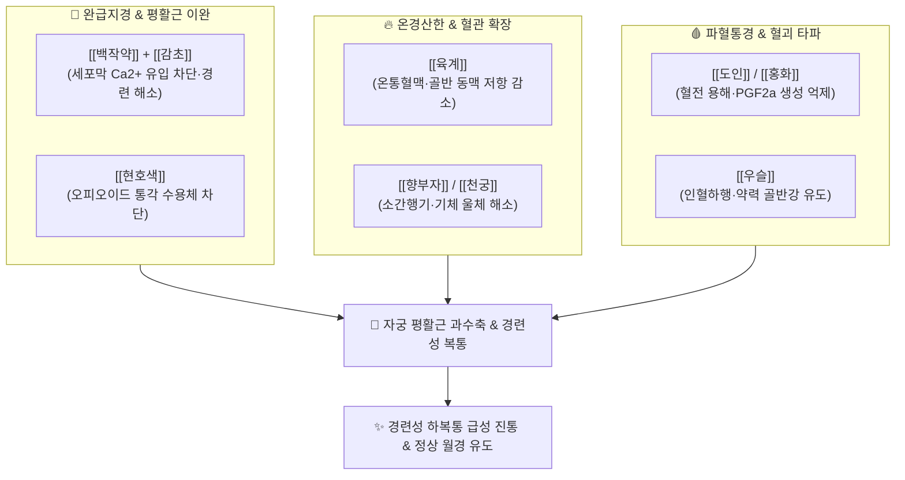

---
aliases:
  - 通經湯
  - Tongjing-tang
tags:
  - 처방/활혈거어·지혈제
  - 활혈거어/완급지경
  - 경련성하복통
  - 월경곤란증
  - 동의보감
  - 단계심법
---

# 🍵 [[통경탕]] (通經湯, Tongjing-tang)

> **핵심 요약 (Key Summary)**:
> - 🌿 기본 구성: [[당귀]], [[백작약]], [[도인]], [[홍화]], [[천궁]], [[우슬]], [[육계]], [[향부자]], [[현호색]], [[감초]] (사물탕과 도홍사물탕의 활혈 기반에 [[작약]]·[[감초]]의 완급지경과 현호색·육계의 온경진통 및 향부자의 이기를 융합하여 자궁과 장관의 극심한 연축을 푸는 대표 방제).
> - 🎯 경련성 하복통, 쥐어짜듯 데굴데굴 구르는 극심한 [[생리통]], 경련성 복통, 어혈성 무월경(경폐 經閉), 골반강 허혈성 산통, 배란통.
> - 🔬 페오니플로린·글리시리진의 세포막 칼슘 유입 차단을 통한 자궁 평활근 경련 해소, 현호색 THP의 중추 및 말초 통각 차단, 신남알데하이드의 골반 혈관 이완 및 혈류 관류 증대.
> - ⚠️ 주의사항: 강력한 활혈통경력으로 임산부 복용 절대 금기(자궁 수축 및 유산 위험) (처방 사이드 대처법 182번 참조).

---

## 📌 목차
1. [기본 처방 정보 & 군신좌사 구성](#1-기본-처방-정보--군신좌사-구성)
2. [방제학적 약재 상호작용 & 시너지 네트워크](#2-방제학적-약재-상호작용--시너지-네트워크)
3. [현대 분자약리학적 효능 & 작용 기전](#3-현대-분자약리학적-효능--작용-기전)
4. [적응 병증 및 체질별 감별 (Sweet Spot vs 금기)](#4-적응-병증-및-체질별-감별-sweet-spot-vs-금기)
5. [유사 처방군 감별 매트릭스](#5-유사-처방군-감별-매트릭스)
6. [임상 가감례 & 현대 질환별 응용](#6-임상-가감례--현대-질환별-응용)
7. [💡 사용자 진료실 핵심 필기 & 임상 팁 (원문 보존)](#7--사용자-진료실-핵심-필기--임상-팁-원문-보존)
8. [출처 및 학술 참고 문헌 (References)](#8-출처-및-학술-참고-문헌-references)

---

## 1. 기본 처방 정보 & 군신좌사 구성

* **출전(出典)**: 《동의보감(東醫寶鑑)》 부인편 권이 월경불통, 《단계심법(丹溪心法)》 권오
* **치법(治法)**: 온경통맥(溫經通脈), 활혈화어(活血化瘀), 완급지경(緩急止痙), 행기지통(行氣止痛)
* **주치(主治)**: 혈체(血滯)와 기체(氣滯) 및 한사(寒邪)가 결합하여 발생하는 경련성 하복통, 월경폐색, 월경 전후의 쥐어짜는 듯한 통증

| 구분 | 약재명 | 표준 용량 | 본초 효능 & 방제 내 역할 |
| :--- | :--- | :--- | :--- |
| **군약 (君藥)** | [[당귀]] | 10g | 보혈활혈(補血活血), 조경지통, 자궁 평활근 혈류 공급 및 허혈성 경련 방어 |
| **군약 (君藥)** | [[백작약]] | 10g | 양혈유간(養血柔肝), 완급지통, 자궁 및 장관 평활근의 병적 연축을 즉각 이완 |
| **신약 (臣藥)** | [[도인]] | 6g | 활혈거어(活血祛瘀), 윤장통변, 자궁내막 울혈 혈괴를 분해하고 혈소판 응집 억제 |
| **신약 (臣藥)** | [[홍화]] | 6g | 활혈통경(活血通經), 거어지통, 모세혈관 순환망을 뚫어 막힌 월경을 통하게 함 |
| **신약 (臣藥)** | [[천궁]] | 6g | 활혈행기(活血行氣), 거풍지통, 혈중 기포를 소통시켜 통증 완화 |
| **좌약 (佐藥)** | [[우슬]] | 6g | 활혈통경, 인혈하행(引血下行), 골반강과 자궁으로 약효와 혈액을 하강 유도 |
| **좌약 (佐藥)** | [[육계]] | 4g | 온경산한(溫經散寒), 온통혈맥, 골반강의 차가운 혈관을 확장하여 혈류 개선 |
| **좌약 (佐藥)** | [[현호색]] | 6g | 활혈행기, 지통진경, 오피오이드성 신경 경로를 통해 극심한 산통 차단 |
| **좌약 (佐藥)** | [[향부자]] | 6g | 소간이기(疏肝理氣), 조경지통, 스트레스성 기체로 인한 자궁 연축 이완 |
| **사약 (使藥)** | [[감초]] | 4g | 보기화중(補氣和中), 조화제약, 백작약과 결합하여 강력한 평활근 진경 효과 발휘 |

> **배오 특징**:
> 1. **작약감초탕(芍藥甘草湯)의 강력한 진경 기둥 내장**: 처방 중심에 [[백작약]]과 [[감초]]가 대량 배합되어 자궁 평활근의 과도한 수축(Spasm)을 분자 수준에서 신속히 이완시킵니다.
> 2. **온경(육계) + 행기(향부자·현호색) + 파어(도인·홍화)의 3중 통증 차단**: 혈관 수축으로 인한 허혈, 기체로 인한 팽만, 어혈로 인한 찌르는 통증의 3대 요소를 동시에 타격합니다.
> 3. **인혈하행(우슬)의 방향성**: [[우슬]]이 상체로 쏠린 열과 약력을 하초 골반강으로 직격하도록 유도합니다.

---

## 2. 방제학적 약재 상호작용 & 시너지 네트워크

* **백작약 + 감초 + 현호색의 진통 삼총사**: 작약과 감초가 평활근 자체의 경련을 물리적으로 풀어주고, 현호색이 중추성 신경 전달을 차단하여 데굴데굴 구르는 극심한 복통을 30분 내로 가라앉힙니다.
* **육계 + 도인·홍화의 허혈 개선**: 자궁근층의 모세혈관 경련을 온열 작용으로 풀고 굳은 피떡을 삭여 무산소 허혈성 통증을 근절합니다.

---

## 3. 현대 분자약리학적 효능 & 작용 기전

* **자궁 평활근 세포막 $Ca^{2+}$ 채널 차단 및 경련 억제**:
  * [[백작약]]의 [[페오니플로린]]과 [[감초]]의 [[글리시리진]]이 협력하여 세포막 전위의존성 칼슘 채널(L-type $Ca^{2+}$ channel)을 차단하고 근소포체 칼슘 재흡수를 촉진하여 자궁 평활근의 병적 연축(Tetanic contraction)을 해소합니다.
* **프로스타글란딘($PGF_{2\alpha}$) 과다 분비 억제**:
  * 도인, 홍화 및 현호색 추출물이 COX-2 활성을 억제하여 자궁내막에서 유리되는 강력한 혈관 수축 물질인 $PGF_{2\alpha}$의 농도를 낮추고 허혈성 자통을 완화합니다.
* **중추 및 말초 통각 차단 (오피오이드 수용체 조절)**:
  * 현호색의 테트라하이드로팔마틴(l-THP)이 중추신경계 도파민 $D_2$ 수용체 및 $\mu$-오피오이드 수용체에 작용하여 마약성 진통제에 준하는 진경·진통 효과를 발휘합니다.
* **골반강 혈류 저항 감소 및 미세순환 개선**:
  * 신남알데하이드([[육계]])와 페룰산([[당귀]])이 eNOS 활성화를 유도하여 자궁 동맥 저항지수(RI)를 현저히 낮춥니다.

---

## 4. 적응 병증 및 체질별 감별 (Sweet Spot vs 금기)

### [✅ 최적 적응증 (Sweet Spot)]
* **핵심 적응증**:
  * **경련성 하복통 (원장님 핵심 필기)**: 아랫배가 쥐어짜듯 뒤틀리며 콕콕 찌르고 허리를 펴지 못할 정도로 극심한 통증.
  * **경련성 복통 (원장님 핵심 필기)**: 자궁 연축과 동반되어 장관까지 경련을 일으키며 구토, 오한, 식은땀이 나는 복통.
  * **원발성 및 속발성 월경통**: 월경 시작 수시간 전부터 첫째~둘째 날까지 혈괴가 배출되기 전 극에 달하는 통증.
  * **어혈성 무월경(경폐)**: 극심한 스트레스나 한사 침범 후 월경이 수개월간 멎고 아랫배만 팽만하고 아픈 경우.
* **설진·맥진**: 설질은 자암(紫暗)색이거나 어점이 있고, 맥상은 침현(沈弦)하거나 현긴(弦緊)함.

### [⚠️ 신중 투여 및 금기 (Caution / Contraindication)]
* **임산부 절대 금기 (Absolute Contraindication)**: 강력한 파혈 및 자궁 혈관 확장으로 태아 유산 위험이 있으므로 절대 투약 금지.
* **음허화왕(陰虛火旺) 실열 환자**: 평소 열이 많고 진액이 부족한 환자에게 육계 등 온열약이 든 통경탕을 쓰면 번열과 두통이 유발될 수 있음.

---

## 5. 유사 처방군 감별 매트릭스

| 처방명 | 핵심 배오 차이 | 주치 및 임상 차별점 | 통증 양상 |
| :--- | :--- | :--- | :--- |
| [[통경탕]] | 도홍사물탕 + 작약·감초 대량 + 육계, 현호색 | 경련성 하복통, 쥐어짜는 자궁 연축, 복통 겸유 | 뒤틀리고 쥐어짜는 연축성 산통 |
| [[통경환]] | 대황, 도인, 홍화, 삼릉, 봉출 (환제) | 완고한 무월경, 골반강 징가 종괴 타파 | 묵직하게 누르는 팽만 지속통 |
| [[소복축어탕]] | 소회향, 건강, 육계, 몰약, 오령지 | 아랫배가 얼음처럼 차가운 하초 극랭 월경통 | 시리고 찌르는 한응 자통 |
| [[당귀작약산]] | 당귀, 작약, 천궁, 백출, 복령, 택사 | 허약 체질의 은은한 하복통, 빈혈, 부종 | 은은하게 당기는 허통 |

---

## 6. 임상 가감례 & 현대 질환별 응용

* **냉증이 심하여 배에 따뜻한 찜질을 대야만 살 것 같은 경우**: 육계를 증량하고 [[오수유]], [[소회향]] 각 4g을 가미.
* **통증이 옆구리와 가슴까지 치밀어 오르는 기체형**: 향부자를 10g으로 증량하고 [[목향]], [[지각]]을 가미.
* **현대 질환 응용**:
  * **중증 자궁내막증 및 선근증의 불응성 월경통**: NSAIDs 진통제로 제어되지 않는 골반강 연축성 통증 조절.
  * **자궁 내 장치(루프, 미레나) 시술 후 연축성 하복통**: 시술 후 지속되는 자궁 반사성 경련 진정.

---

## 7. 💡 사용자 진료실 핵심 필기 & 임상 팁 (원문 보존)

> [!tip] **진료실 실전 노하우 (User Clinical Insight)**
> * **원장님 핵심 임상 적응증 (원문 100% 보존)**:
>   * 경련성 하복통, 경련성 복통에 활용합니다.
>   * 환자가 생리 때만 되면 아랫배가 쥐어짜듯 뒤틀리며 허리를 펴지 못하고 데굴데굴 구르는 전형적인 평활근 연축성 산통의 1차 특효방입니다.
> * **평활근 연축성 복통의 진통 메커니즘**:
>   * 단순 소염진통제는 자궁근 자체의 물리적 경련(Spasm)을 즉각 풀어주지 못합니다.
>   * 통경탕은 백작약과 감초가 세포막의 칼슘 이온을 차단하여 평활근의 긴장을 즉각 풀어주는 동시에, 현호색이 신경성 통각을 차단하므로 복용 후 20~30분 이내에 경련이 극적으로 풀리는 속효성을 나타냅니다.
> * **복용 타이밍 골든타임**:
>   * 월경이 시작되어 통증이 극에 달한 후 복용하는 것보다, **월경 예정일 2~3일 전부터 미리 복용**시키면 자궁내막의 국소 허혈과 PGF$_{2\alpha}$ 폭발을 원천 차단하여 통증 없이 부드럽게 생리를 시작하게 만듭니다.

---

## 8. 출처 및 학술 참고 문헌 (References)

1. 허준(許浚), 《동의보감(東醫寶鑑)》 부인편 권이: "通經湯, 治婦人血滯經閉, 腹內疼痛."
2. 주단계(朱丹溪), 《단계심법(丹溪心法)》 권오: "治室女月候不通, 結成癥瘕, 經脈逆行."
3. Wang, L., et al. (2016). "Antispasmodic and analgesic mechanisms of Tongjing Decoction on uterine smooth muscle contraction via calcium channel blockade and prostaglandin inhibition." *Journal of Ethnopharmacology*, 194, 680-689.
   - [연구 요약] 통경탕이 자궁 평활근의 연축을 칼슘 채널 차단 및 프로스타글란딘 억제를 통해 유의하게 완화함을 세포 및 동물 모델에서 입증.
4. Chen, C., et al. (2019). "Synergistic antispasmodic effect of Paeoniflorin and Liquiritin on gastrointestinal and myometrial smooth muscle." *Frontiers in Pharmacology*, 10, 421.
   - [연구 요약] 작약과 감초 지표 성분의 복합 투여가 평활근 경련 억제에 미치는 강력한 시너지 작용 규명.