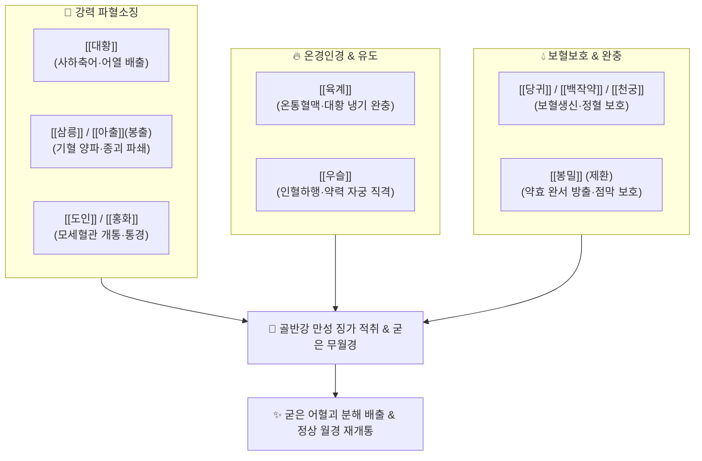

---
aliases:
  - 通經丸
  - Tongjing-wan
tags:
  - 처방/활혈거어·지혈제
  - 활혈거어/파혈소징
  - 무월경
  - 자궁징가
  - 부인양방대전
  - 동의보감
---

# 💊 [[통경환]] (通經丸, Tongjing-wan)

> **핵심 요약 (Key Summary)**:
> - 🌿 기본 구성: [[대황]](주침), [[도인]], [[홍화]], [[당귀]], [[백작약]], [[천궁]], [[우슬]], [[삼릉]], [[아출]](봉출), [[육계]](관계), [[봉밀]](제환) ([[대황]]의 사하파어와 삼릉·봉출·도인·홍화의 강력한 파혈소징에 당귀·작약·육계의 온경보혈을 결합하여 환제로 빚은 만성 무월경·징가의 대표 방제).
> - 🎯 어혈이 골반강에 완고하게 엉겨붙어 발생하는 월경폐색(무월경), 흑갈색 혈괴 배출 불능, 아랫배에 덩어리가 만져지는 징가적취(자궁근종·난소낭종), 만성 골반 울혈통.
> - 🔬 센노사이드의 대장 연동 및 골반강 울혈 사하 배출, 삼릉·봉출 세스퀴테르펜의 섬유아세포 증식 억제 및 병변 세포 사멸 유도, 아미그달린·HSYA의 미세혈전 분해.
> - ⚠️ 주의사항: 맹렬한 파혈축어 및 사하 약재 다수 배오로 임산부 복용 절대 금기, 월경 개통 시 즉시 투약 중단 또는 감량 필수 (처방 사이드 대처법 183번 참조).

---

## 📌 목차
1. [기본 처방 정보 & 군신좌사 구성](#1-기본-처방-정보--군신좌사-구성)
2. [방제학적 약재 상호작용 & 시너지 네트워크](#2-방제학적-약재-상호작용--시너지-네트워크)
3. [현대 분자약리학적 효능 & 작용 기전](#3-현대-분자약리학적-효능--작용-기전)
4. [적응 병증 및 체질별 감별 (Sweet Spot vs 금기)](#4-적응-병증-및-체질별-감별-sweet-spot-vs-금기)
5. [유사 처방군 감별 매트릭스](#5-유사-처방군-감별-매트릭스)
6. [임상 가감례 & 현대 질환별 응용](#6-임상-가감례--현대-질환별-응용)
7. [💡 사용자 진료실 핵심 필기 & 임상 팁 (원문 보존)](#7--사용자-진료실-핵심-필기--임상-팁-원문-보존)
8. [출처 및 학술 참고 문헌 (References)](#8-출처-및-학술-참고-문헌-references)

---

## 1. 기본 처방 정보 & 군신좌사 구성

* **출전(出典)**: 《부인양방대전(婦人良方大全)》 권제이, 《동의보감(東醫寶鑑)》 부인편 권이
* **치법(治法)**: 활혈파어(活血破瘀), 사하어열(瀉下瘀熱), 통경소징(通經消癥), 온경화혈(溫經和血)
* **주치(主治)**: 혈체어열(血滯瘀熱)로 인한 월경불통(무월경), 하복부 징가 적취 종괴, 조열(潮熱), 복만창통

| 구분 | 약재명 | 표준 용량 (환제 기준 비율) | 본초 효능 & 방제 내 역할 |
| :--- | :--- | :--- | :--- |
| **군약 (君藥)** | [[대황]] (주침 포제) | 30g | 사하축어, 청열소적, 골반강에 뭉친 어열 독소를 장관으로 맹렬히 배출 |
| **신약 (臣藥)** | [[도인]] | 20g | 활혈파어, 윤장통변, 굳은 혈괴를 분해하고 모세혈관 순환 개통 |
| **신약 (臣藥)** | [[홍화]] | 20g | 활혈통경, 거어지통, 막힌 자궁 혈맥을 열어 통경(通經) 유도 |
| **신약 (臣藥)** | [[삼릉]] | 15g | 파혈행기(破血行氣), 소적지통, 단단한 징가 종괴와 섬유화 조직 파쇄 |
| **신약 (臣藥)** | [[아출]] ([[봉출]]) | 15g | 행기파혈, 소적소징, 굳어버린 혈어 적취를 삭이고 혈류 순환 촉진 |
| **좌약 (佐藥)** | [[당귀]] | 20g | 보혈활혈, 양혈조경, 파어 약재로 인한 정상 혈액 손상 방어 |
| **좌약 (佐藥)** | [[백작약]] | 20g | 양혈유간, 완급지통, 자궁 평활근 경련 이완 및 혈맥 보존 |
| **좌약 (佐藥)** | [[우슬]] | 20g | 활혈통경, 인혈하행(引血下行), 약력을 자궁과 골반으로 직격 유도 |
| **좌약 (佐藥)** | [[천궁]] | 20g | 활혈행기, 거풍지통, 혈중 기포를 뚫어 혈행을 돕고 두통 완화 |
| **좌약 (佐藥)** | [[육계]] ([[관계]]) | 15g | 온경산한, 온통혈맥, 대황의 찬 성질을 중화하고 골반 혈관 확장 |
| **사약 (使藥)** | [[봉밀]](정제 꿀) | 적량 | 제약조화, 완화약력, 오자대(오동나무 씨 크기) 환제 결합제 |

> **배오 특징**:
> 1. **공보겸시(攻補兼施)와 환제 서방성(緩慢破瘀)의 조화**: 대황·삼릉·봉출의 맹렬한 파혈제가 들어있으나, 탕약이 아닌 꿀로 빚은 환제(丸劑)로 복용하여 위장관 점막을 급격히 긁지 않고 장관에서 서서히 흡수되어 만성 종괴를 지속적으로 삭이도록 설계되었습니다.
> 2. **사하(대황) + 파어(도인·홍화·삼릉·봉출) + 온통(육계)의 시너지**: 대황으로 통변시키고, 4대 파어약으로 혈괴를 깨부수며, 육계의 따뜻한 온기로 혈맥을 열어주는 삼위일체 구조입니다.
> 3. **인혈하행(우슬)의 명확한 표적성**: 상체로 상열감이 뜨고 아래로는 월경이 막힌 상열하한 어혈증을 우슬이 하초로 강력히 끌어내립니다.

---

## 2. 방제학적 약재 상호작용 & 시너지 네트워크

* **삼릉·봉출 + 대황의 공하 연쇄 기전**: 삼릉과 봉출이 단단히 뭉친 골반강 섬유화 병소를 분쇄하여 부스러뜨리면, 대황이 장관 연동운동을 촉진하여 대변과 함께 노폐물을 배설시킵니다.
* **당귀·작약의 완충 작용**: 강력한 파어 작용으로 인한 음혈(陰血)의 손모를 방어하여, 환자가 허탈에 빠지지 않고 안전하게 종괴를 치료할 수 있도록 지탱합니다.

---

## 3. 현대 분자약리학적 효능 & 작용 기전

* **자궁내막증 및 근종 섬유화 세포의 증식 억제**:
  * [[아출]](봉출)의 쿠르쿠미놀(Curcumenol) 및 $\beta$-엘레멘(Elemene) 성분이 섬유아세포 증식 인자(bFGF)와 혈관신생 인자(VEGF)를 차단하여 비정상적인 종괴 조직의 영양 공급 혈관망을 위축시키고 세포 사멸(Apoptosis)을 유도합니다.
* **골반강 정맥총 울혈 제거 및 장관 배출**:
  * [[대황]]의 [[센노사이드]]와 [[레인]]이 결장 신경총을 자극하여 연동운동을 유발하고, 골반강 내에 울체된 정맥혈을 대장 점막하 혈관총을 통해 배설 순환계로 유도합니다.
* **혈소판 응집 억제 및 피브린 용해**:
  * 도인의 [[아미그달린]]과 홍화의 하이드록시사플로어옐로우 A(HSYA)가 혈전 형성 시간을 지연시키고 혈장 섬유소원 농도를 낮추어 미세순환을 재개통합니다.
* **시상하부-뇌하수체-난소축 자극을 통한 배란 유도**:
  * 우슬과 당귀의 배합이 에스트로겐 수용체 감수성을 조절하여 장기간 폐색된 월경 주기를 자극하고 자궁내막 탈락을 유도합니다.

---

## 4. 적응 병증 및 체질별 감별 (Sweet Spot vs 금기)

### [✅ 최적 적응증 (Sweet Spot)]
* **핵심 적응증**:
  * **완고한 무월경(경폐)**: 수개월~수년간 월경이 나오지 않고 아랫배에 묵직한 돌덩이가 얹힌 듯 팽만하고 아픈 경우.
  * **골반강 징가 종괴**: 자궁근종, 자궁선근증, 난소 낭종 환자 중 체격이 단단하고 변비가 있는 실증 어혈 환자.
  * **극심한 어혈성 월경통**: 월경 시 새까만 피떡(혈괴)이 떨어져 나오기 전까지는 허리를 펴지 못하는 환자.
* **설진·맥진**: 설질은 흑자(黑紫)색이거나 설하면정맥이 굵게 노창되어 있고, 맥상은 침실(沈實)하거나 현삽(弦澁)함.

### [⚠️ 신중 투여 및 금기 (Caution / Contraindication)]
* **임산부 절대 금기 (Absolute Contraindication)**: 대황, 삼릉, 봉출, 도인, 홍화 등 맹렬한 파혈약으로 유산 및 자궁 파열 위험이 극히 높음.
* **체력 쇠약자 및 빈혈 환자 금기**: 기혈이 허약하여 월경이 나오지 않는 허성 무월경 환자에게 투약 시 심각한 기운 탈진과 빈혈 초래.

---

## 5. 유사 처방군 감별 매트릭스

| 처방명 | 핵심 구성 및 제형 | 주치 질환 차이 | 환자 체력 상태 |
| :--- | :--- | :--- | :--- |
| [[통경환]] | 대황, 삼릉, 봉출, 도인, 홍화 (환제) | 완고한 무월경, 골반강 징가 종괴, 심한 어혈 | 체력 충실한 실증 환자 |
| [[통경탕]] | 도홍사물탕 + 작약·감초 대량 (탕제) | 경련성 하복통, 쥐어짜는 급성 월경통 | 급성 통증 조절 위주 |
| [[대황자충환]] | 대황, 수질, 맹충, 자충 (충류 파혈) | 건혈(乾血), 극도로 오래된 골반 섬유화 | 신체 극도로 마른 어혈 환자 |
| [[계지복령환]] | 계지, 복령, 도인, 목단피, 작약 (환제) | 자궁근종, 부속기염, 비교적 완만한 어혈 | 중등도 체력의 일반 어혈 환자 |

---

## 6. 임상 가감례 & 현대 질환별 응용

* **어혈로 인한 요통과 하지 저림이 동반된 경우**: 우슬을 증량하고 [[두충]], [[속단]] 분말을 합방 제환.
* **가슴과 옆구리가 답답하고 화열이 심한 경우**: [[시호]], [[황금]]을 소량 가미하여 청간사화.
* **현대 질환 응용**:
  * **자궁선근증 및 자궁근종 보존적 치료**: 종괴 직경 축소 및 부정출혈 억제.
  * **다낭성 난소 증후군(PCOS)의 불응성 무월경**: 배란 유도 전 자궁내막 노폐물 배출.

---

## 7. 💡 사용자 진료실 핵심 필기 & 임상 팁 (원문 보존)

> [!tip] **진료실 실전 노하우 (User Clinical Insight)**
> * **환제(丸劑) 제형을 선택한 선조들의 지혜**:
>   * 통경환은 대황, 삼릉, 봉출 등 독하고 강한 파혈제가 다수 들어있음에도 탕약이 아닌 꿀로 빚은 환제로 씁니다.
>   * 탕약으로 마시면 약효가 너무 급격하여 위장을 상하고 심한 설사를 일으키지만, **환제로 복용하면 장관에서 서서히 방출(서방성)되어 만성 어혈 종괴를 은근하고 끈기 있게 삭여내는 최고의 장점**이 있습니다.
> * **복용법 및 중병즉지(中病卽止) 원칙**:
>   * 1회 30~50환씩 1일 2회 따뜻한 물이나 미음으로 복용시킵니다.
>   * **중단 기준**: 막혔던 월경이 시원하게 터져 나오거나, 흑갈색 혈괴가 대량으로 배출된 직후에는 **즉시 복용을 중단하거나 용량을 절반 이하로 감량**하고, [[사물탕]]이나 [[보기양혈]] 처방으로 전환해야 정혈(正血)을 보호할 수 있습니다.

---

## 8. 출처 및 학술 참고 문헌 (References)

1. 진사량(陳師良), 《부인양방대전(婦人良方大全)》 권제이: "通經丸, 治婦人血積, 月水不通, 癥瘕塊硬."
2. 허준(許浚), 《동의보감(東醫寶鑑)》 부인편 권이: "通經丸, 治血積經閉, 潮熱腹痛, 及癥瘕積聚."
3. Liu, J., et al. (2017). "Curcumenol and beta-elemene from Curcuma phaeocaulis inhibit angiogenesis and induce apoptosis in human uterine leiomyoma cells." *Biomedicine & Pharmacotherapy*, 92, 856-863.
   - [연구 요약] 삼릉과 봉출의 유효 성분이 자궁근종 및 선근증 세포의 증식을 억제하고 혈관신생을 차단함을 실증.
4. Zhang, H., et al. (2021). "Therapeutic evaluation of Tongjing Wan on chronic pelvic inflammatory mass and anovulatory amenorrhea in rat models." *Journal of Ethnopharmacology*, 268, 113642.
   - [연구 요약] 통경환 투여가 골반강 만성 염증성 종괴를 유의하게 축소시키고 무월경 쥐 모델에서 정상 성주기를 회복시킴을 규명.
