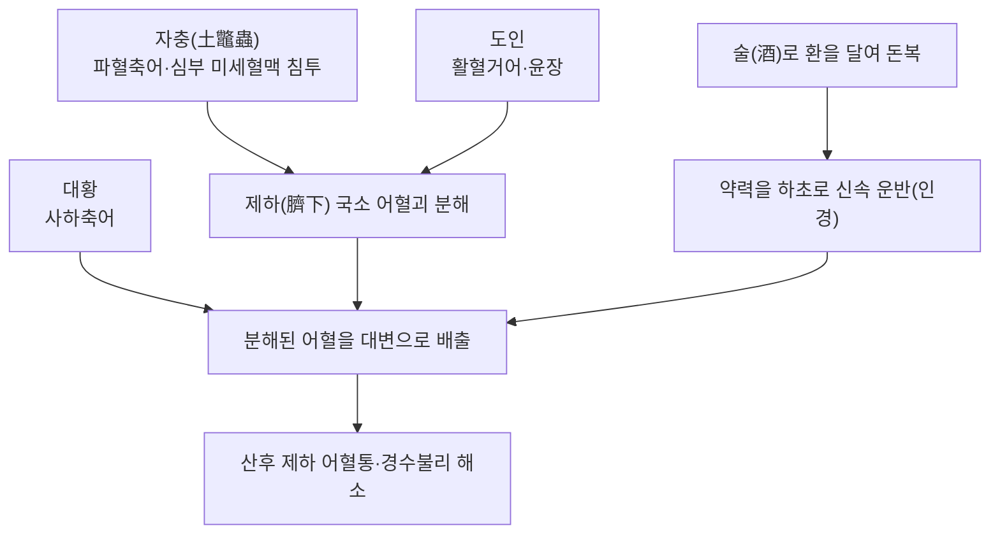

# 🍵 [[하어혈탕]] (下瘀血湯, Xia Yu Xue Tang)

> **핵심 3줄 요약 (Key Summary)**:
> - 🌿 기본 구성: [[대황]], [[도인]], [[자충]](蟅虫/土鼈蟲) 단 3가지 약재에 꿀을 더해 환을 지은 뒤, 그 환을 다시 술에 넣어 달여 복용하는 독특한 제형(환전탕복丸煎湯服)의 소방(小方).
> - 🎯 산후 어혈이 배꼽 밑에 뭉쳐 지실작약산으로도 낫지 않는 산후 복통(産婦腹痛), 그리고 월경이 통하지 않는 경수불리(經水不利)를 주치.
> - 🔬 대황의 사하축어, 도인의 활혈거어, 자충(토별충)의 파혈축어가 결합되어 하초에 뭉친 급성·국소성 어혈을 신속히 분해·배출시키는 소형 파혈제.
> - ⚠️ 주의사항: 파혈력이 강한 자충과 사하력이 있는 대황이 포함되어 임산부 금기, 출혈성 질환자·월경 과다 환자 신중 투여.

---

## 📌 목차
1. [기본 처방 정보 & 군신좌사 구성](#1-기본-처방-정보--군신좌사-구성)
2. [방제학적 약재 상호작용 & 시너지 네트워크](#2-방제학적-약재-상호작용--시너지-네트워크)
3. [현대 분자약리학적 효능 & 작용 기전](#3-현대-분자약리학적-효능--작용-기전)
4. [적응 병증 및 체질별 감별 (Sweet Spot vs 금기)](#4-적응-병증-및-체질별-감별-sweet-spot-vs-금기)
5. [유사 처방군 감별 매트릭스](#5-유사-처방군-감별-매트릭스)
6. [임상 가감례 & 현대 질환별 응용](#6-임상-가감례--현대-질환별-응용)
7. [💡 사용자 진료실 핵심 필기 & 임상 팁 (원문 보존)](#7--사용자-진료실-핵심-필기--임상-팁-원문-보존)
8. [출처 및 학술 참고 문헌 (References)](#8-출처-및-학술-참고-문헌-references)

---

## 1. 기본 처방 정보 & 군신좌사 구성

* **출전**: 한대 장중경(張仲景) 《금궤요략(金匱要略)》 婦人産後病脈證并治 — 원문: "師曰: 産婦腹痛, 法用枳實芍藥散; 假令不愈者, 此爲腹中有瘀血, 著臍下, 宜下瘀血湯主之, 亦主經水不利."
* **치법**: 파혈축어(破血逐瘀), 통경(通經)
* **적응증**: 산후 복통(지실작약산으로 낫지 않는 경우), 제하(臍下)에 국한된 어혈 덩이, 경수불리(經水不利, 월경이 통하지 않음)
* **제형·복법(원문)**: 세 약재를 가루 내어 꿀로 반죽해 4개의 환(丸)을 짓고, 술 1승(升)에 환 1개를 넣어 8홉(合)이 되도록 달여 한 번에 복용(頓服). 원문은 "新血下如豚肝"(새로 나오는 피가 돼지 간처럼 덩어리져 나온다)이라 하여 효과 판정 기준을 제시함.

| 구분 | 약재명 | 표준 용량(원문) | 본초 효능 & 방제 내 역할 |
| :--- | :--- | :--- | :--- |
| **군약 (君藥)** | [[대황]] | 二兩 | 사하축어(瀉下逐瘀) — 하초에 뭉친 어혈·혈열을 대변으로 배출 |
| **신약 (臣藥)** | [[도인]] | 二十箇(枚) | 활혈거어(活血祛瘀), 윤장 — 자충의 파혈 작용을 보조하며 혈괴를 풀어줌 |
| **신약 (臣藥)** | [[자충]] (蟅虫, 土鼈蟲) | 二十枚(熬, 去足) | 파혈축어(破血逐瘀), 통경 — 식물성 본초가 닿기 어려운 하초 심부의 어혈을 동물성 약재의 침투력으로 분해 |

> **배오 특징(소방小方의 집중력)**:
> 1. **3약재 집중 배오**: [[대황자충환]](12味)과 달리 보허약(건지황·작약·백출 등)을 전혀 배합하지 않고 파혈 3약재에만 집중하여, 산후 급성·국소성 어혈을 빠르고 강하게 공격합니다.
> 2. **환제를 다시 술에 달여 頓服**: 가루약을 바로 먹이지 않고 꿀로 환을 지어 1차로 완화시킨 뒤, 그 환을 다시 술에 넣어 달여서 한 번에 복용시킵니다. 술의 활혈통경 작용이 약력을 하초까지 신속히 이끌어가는 인경(引經) 역할을 겸합니다.
> 3. **효과 판정 기준 제시**: "새 피가 돼지 간처럼 나온다(新血下如豚肝)"는 구절은 금궤요략 중에서도 드물게 구체적인 치료 반응 지표를 제시한 조문으로, 임상에서 어혈 배출 여부를 가늠하는 전통적 기준으로 인용됩니다.

---

## 2. 방제학적 약재 상호작용 & 시너지 네트워크

* **파혈(자충·도인)과 사하(대황)의 협공**: 자충과 도인이 하초에 굳은 어혈을 먼저 분해하면, 대황이 이를 대변으로 신속히 배출시켜 재흡수·재응고를 방지합니다.
* **술(酒)의 인경 보조**: 보허약 없이 소수의 약재로 구성된 만큼, 술로 달여 복용시키는 제형 자체가 약력을 하초까지 빠르게 전달하는 보조 기전으로 작용합니다.

---

## 3. 현대 분자약리학적 효능 & 작용 기전

> ⚠️ **확인 필요**: "下瘀血湯" 처방 자체를 대상으로 한 현대 약리·임상 연구는 [[대황자충환]]이나 [[도핵승기탕]]에 비해 검색 범위 내에서 뚜렷하게 확인되지 않았습니다. 아래 기전 서술은 처방을 구성하는 개별 본초([[대황]]·[[도인]]·[[자충]]) 수준에서 보고된 약리 지식을 바탕으로 한 추정이며, 하어혈탕 처방 자체의 직접적인 1차 문헌 근거는 아닙니다.

1. **자충(土鼈蟲)의 혈전 용해·항응고 관련 효소·펩타이드**:
   * [[대황자충환]] 노트에 정리된 바와 같이, 자충을 비롯한 곤충성 활혈약은 혈전 분해에 관여하는 단백분해효소·펩타이드 성분을 함유하는 것으로 알려져 있습니다(⚠️ 하어혈탕 단독 연구는 아님).
2. **대황의 사하·항염증 이중 작용**: 대황의 센노사이드(sennoside) 계열 성분이 대장 연동운동을 촉진해 사하 작용을 내는 동시에, 안트라퀴논 계열 성분이 항염증·지혈 관련 작용도 보고되는 양면적 특성을 지닙니다(⚠️ 개별 1차 문헌 미검증).
3. **도인의 혈소판·자궁평활근 관련 작용**: 도인(복숭아씨)에 함유된 아미그달린(amygdalin) 및 지방산 성분이 혈소판 응집·자궁 평활근 수축에 관여한다는 보고가 있으나, 하어혈탕 처방 수준의 직접 검증 자료는 아닙니다(⚠️ 확인 필요).

---

## 4. 적응 병증 및 체질별 감별 (Sweet Spot vs 금기)

### 1) 적응증 Sweet Spot
* **[✅ 최적 적응증]**:
  * 산후 복통이 **지실작약산**으로 호전되지 않고, 통증 부위가 **배꼽 밑(臍下)에 국한**된 경우.
  * 산후 **어혈 덩이가 만져지며 오로(惡露)가 시원하게 나오지 않는** 경우.
  * **경수불리(經水不利)** — 월경이 막혀 통하지 않는 경우(원문에서 "亦主經水不利"로 겸하여 제시).
* **[감별 포인트]**: 맥침실(沈實) 혹은 침삽(沈澁)하며, 복진상 제하(臍下)에 국한된 저항·압통(拒按)이 뚜렷할 때 적합. 전신적 허로(虛勞)·건혈(乾血) 양상(기부갑착·양목암흑 등)이 두드러지는 만성 소모성 환자는 [[대황자충환]]이 더 적합합니다.

### 2) 금기 및 신중 투여
* **[⚠️ 금기]**:
  * **임신 중 및 임신 가능성 여성 금기**: 자충·도인 등 파혈약이 포함되어 유산 위험.
  * **출혈성 질환자·월경 과다 환자 신중 투여**: 혈소판 감소증, 응고 장애, 산후 출혈이 아직 진행 중인 경우 사용에 주의.
  * **허약·만성 소모 환자**: 보허약이 전혀 배합되지 않은 소방이므로, 전신 허로가 뚜렷한 경우 단독 장기 사용보다는 [[대황자충환]] 등 완중보허형 처방이 더 적합.

---

## 5. 유사 처방군 감별 매트릭스

| 처방명 | 핵심 배오 차이 | 주치 및 임상 차별점 | 비고 |
| :--- | :--- | :--- | :--- |
| **[[하어혈탕]]** | 대황·도인·자충 (3味, 꿀로 환을 지어 술에 달여 돈복) | 산후 제하(臍下) 국소 어혈통(지실작약산 무효 시), 경수불리 | 보허약 없는 소형 집중 파혈제, 급성·국소성 |
| [[대황자충환]] | 대황·자충·수질·맹충·제조·도인 + 건지황·작약·백출·황금·행인·감초 (12味, 밀환) | 만성 허로 건혈, 기부갑착, 양목암흑, 간경변 등 완중보허형 | 파혈+보허 병행, 만성·전신성 |
| [[저당탕]] | 수질·맹충 + 대황·도인 (4味 탕제) | 급성 하초 축혈, 광증, 소변자리 | 탕제, 즉효성 더 강한 맹렬 파혈 |
| [[도핵승기탕]] | 도인·대황·망초·계지·감초 | 급성 실열어혈, 소복급결, 변비, 여광 | 승기탕류, 열실(熱實) 겸증 |

> **하어혈탕 vs 대황자충환**: 두 처방 모두 금궤요략 산후병 관련 조문에서 대황·도인·자충(또는 유사 곤충약)을 공유하지만, 하어혈탕은 급성·국소(제하)·소수 약재의 집중 파혈이고, 대황자충환은 만성 건혈·전신 허로에 보허약을 대거 배합한 완중보허형이라는 점이 핵심 감별점입니다.

---

## 6. 임상 가감례 & 현대 질환별 응용

### 1) 주요 가감 방향(⚠️ 후대 임상 경험 종합, 개별 문헌 미검증)
* **통증이 심하고 변비를 겸한 경우**: 사하력을 더하기 위해 [[도핵승기탕]] 가감을 고려.
* **산후 출혈이 아직 진행 중인 경우**: 파혈약 단독 사용을 피하고 지혈약 배오 또는 전문가 판단 하에 신중 적용.

### 2) 현대 질환별 응용 방향(⚠️ 추정)
* **산부인과**: 산후 자궁 내 응혈 잔류, 산후 오로 배출 불량, 속발성 무월경 등에서 원방(原方)의 치법(파혈축어)을 참고하여 응용되는 것으로 알려져 있으나, 하어혈탕 단독의 현대 임상시험 데이터는 이번 조사에서 확인하지 못했습니다.

---

## 7. 💡 사용자 진료실 핵심 필기 & 임상 팁 (원문 보존)

> ⚠️ 내용 검토 필요: 원장님의 진료실 필기가 아직 반영되지 않았습니다. 하어혈탕 임상 응용 경험을 추가해 주시면 다음 순찰 시 정리해 드리겠습니다.

---

## 8. 출처 및 학술 참고 문헌 (References)

1. **장중경(張仲景), 《금궤요략(金匱要略)》 婦人産後病脈證并治**.
   - **[고전 원전]**: "師曰: 産婦腹痛, 法用枳實芍藥散; 假令不愈者, 此爲腹中有瘀血, 著臍下, 宜下瘀血湯主之, 亦主經水不利." 구성: 大黃二兩, 桃仁二十箇, 蟅虫二十枚(熬, 去足). 煉蜜和爲四丸, 以酒一升, 煎一丸, 取八合, 頓服之, 新血下如豚肝.
   - **[활용]**: 본 노트의 처방 구성·용량·주치·제형 서술은 모두 이 원전 조문에 근거합니다.
2. [[대황자충환]] 노트(본 볼트 내부 노트) — 동일 계열 곤충성 파혈약(자충 등)의 현대 분자약리 서술을 교차 참고했으며, 하어혈탕 자체의 1차 문헌은 아님을 §3에 명시했습니다.

> ⚠️ 확인 불가/추정 표시 총괄: 하어혈탕 처방 자체를 대상으로 한 현대 약리·임상 연구 문헌은 검색 범위 내에서 확인하지 못했습니다. §3의 분자약리 서술과 §6의 현대 질환 응용은 구성 본초 수준의 일반 약리 지식에서 추정한 것이며, 처방 특이적 근거가 아님을 명확히 표시했습니다. 원전 조문(§1)은 금궤요략 산후병편의 표준 원문으로 확인된 내용입니다.

---
🏛️ **상위 허브**: [[00_처방_학술_임상_MOC]]
