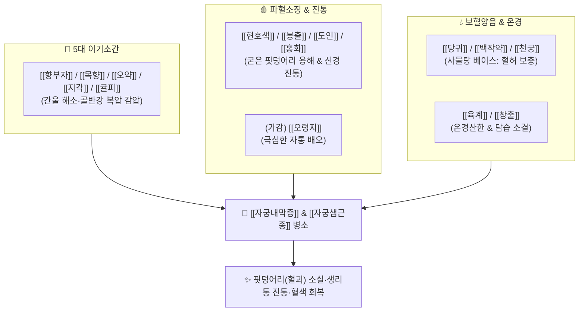

---
aliases:
  - 玄附理經湯
  - Xuanfu Lijing-tang
tags:
  - 처방/활혈거어·지혈제
  - 활혈거어/행기파어
  - 자궁내막증
  - 자궁샘근종
  - 혈괴혈허
  - 동의보감
---

# 🍵 [[현부리경탕]] (玄附理經湯, Xuanfu Lijing-tang)

> **핵심 요약 (Key Summary)**:
> - 🌿 기본 구성: [[향부자]], [[현호색]], [[당귀]], [[백작약]], [[천궁]], [[창출]], [[오약]], [[귤피]], [[지각]], [[목향]], [[봉출]], [[도인]], [[홍화]], [[육계]] (통증 극심 시 [[오령지]] 가미) (사물탕의 보혈 기반에 향부자·창출·오약 등 5대 이기약과 봉출·도인·홍화의 파어약 및 육계의 온경을 결합하여 혈허와 혈괴가 겹친 자궁질환을 다스리는 대방).
> - 🎯 혈괴(피떡)와 혈허(빈혈·무기력)가 공존하며 극심한 통증이 동반되는 병증, [[자궁내막증]], [[자궁샘근종]](자궁선근증), 불응성 골반강 만성 유착통, 생리 전 복부 팽만 및 가슴 답답함.
> - 🔬 봉출 쿠르쿠미놀·$\beta$-엘레멘의 자궁내막증 신생혈관 억제, 현호색 THP와 작약 페오니플로린의 자궁 평활근 연축 차단, 향부자·오약의 골반 신경총 자율신경 안정 및 미세순환 개통.
> - ⚠️ 주의사항: 다수의 강력한 이기·파어약 배오로 임산부 복용 절대 금기(유산 위험), 음허조열 환자 단독 투여 주의 (처방 사이드 대처법 184번 참조).

---

## 📌 목차
1. [기본 처방 정보 & 군신좌사 구성](#1-기본-처방-정보--군신좌사-구성)
2. [방제학적 약재 상호작용 & 시너지 네트워크](#2-방제학적-약재-상호작용--시너지-네트워크)
3. [현대 분자약리학적 효능 & 작용 기전](#3-현대-분자약리학적-효능--작용-기전)
4. [적응 병증 및 체질별 감별 (Sweet Spot vs 금기)](#4-적응-병증-및-체질별-감별-sweet-spot-vs-금기)
5. [유사 처방군 감별 매트릭스](#5-유사-처방군-감별-매트릭스)
6. [임상 가감례 & 현대 질환별 응용](#6-임상-가감례--현대-질환별-응용)
7. [💡 사용자 진료실 핵심 필기 & 임상 팁 (원문 보존)](#7--사용자-진료실-핵심-필기--임상-팁-원문-보존)
8. [출처 및 학술 참고 문헌 (References)](#8-출처-및-학술-참고-문헌-references)

---

## 1. 기본 처방 정보 & 군신좌사 구성

* **출전(出典)**: 《의학입문(醫學入門)》 부인문, 《동의보감(東醫寶鑑)》 부인편
* **치법(治法)**: 행기소간(行氣疏肝), 온경활혈(溫經活血), 화어소적(化瘀消積), 보혈양음(補血養陰)
* **주치(主治)**: 기체어혈(氣滯血瘀) 및 담습(痰濕)이 엉켜 발생한 월경부조, 흑자색 혈괴 배출, 자궁 내 종괴 동통, 혈허성 현훈과 자통이 겹친 복합 병증

| 구분 | 약재명 | 표준 용량 | 본초 효능 & 방제 내 역할 |
| :--- | :--- | :--- | :--- |
| **군약 (君藥)** | [[향부자]] | 8g | 소간해울(疏肝解鬱), 이기조경, 기분(氣分)의 울체를 풀어 혈행을 유도 |
| **군약 (君藥)** | [[현호색]] | 6g | 활혈행기(活血行氣), 산어지통, 자궁 골반강 평활근의 산통을 즉각 차단 |
| **신약 (臣藥)** | [[당귀]] | 8g | 보혈활혈(補血活血), 조경지통, 혈허 증상을 보강하고 신선한 혈액 공급 |
| **신약 (臣藥)** | [[백작약]] | 8g | 양혈유간(養血柔肝), 완급지통, 간혈을 자양하고 자궁 근육 경련 이완 |
| **신약 (臣藥)** | [[천궁]] | 6g | 활혈행기, 거풍지통, 혈중 기포를 소통시켜 사물탕의 활혈력 극대화 |
| **좌약 (佐藥)** | [[창출]] | 6g | 조습건비(燥濕健脾), 거풍발한, 하초에 정체된 담습과 부종을 삭임 |
| **좌약 (佐藥)** | [[오약]] | 6g | 순기지통(順氣止痛), 온신산한, 방광과 자궁의 냉기성 기체 산통 해소 |
| **좌약 (佐藥)** | [[귤피]] ([[진피]]) | 6g | 이기건비(理氣健脾), 조습화담, 중초 소화기 기류를 소통시켜 약 흡수 보조 |
| **좌약 (佐藥)** | [[지각]] | 6g | 파기소적(破氣消積), 관장이기, 흉복부 팽만 압력을 낮추어 골반 울혈 경감 |
| **좌약 (佐藥)** | [[목향]] | 4g | 행기지통, 건비소식, 기체로 인한 찌르는 듯한 복통 완화 |
| **좌약 (佐藥)** | [[봉출]] ([[아출]]) | 6g | 파혈행기, 소적소징, 자궁선근증 및 내막증 섬유화 종괴 파쇄 |
| **좌약 (佐藥)** | [[도인]] | 6g | 활혈파어, 윤장통변, 굳은 혈괴를 녹여내고 미세순환 개통 |
| **좌약 (佐藥)** | [[홍화]] | 4g | 활혈통경, 거어지통, 자궁내막 모세혈관 순환망 정상화 |
| **좌약 (佐藥)** | [[육계]] | 4g | 온경산한, 온통혈맥, 골반 혈관을 확장하여 한응어혈을 녹임 |

> **배오 특징**:
> 1. **기(氣)·혈(血)·담(痰)·한(寒)의 4중 병리 동시 타격**: 향부자·목향 등 5대 이기약(기체), 도인·홍화·봉출(어혈), 창출·귤피(담습), 육계·오약(한사)이 총망라된 전방위 복합 방제입니다.
> 2. **혈허(血虛)와 혈괴(血塊)의 모순 해결**: 굳은 피떡(어혈)을 깨부수면서도 당귀·작약의 보혈제가 배합되어 있어 환자의 기초 혈허 증상을 보강하는 공보겸시(攻補兼施)를 완벽히 구현합니다.
> 3. **통증 극심 시 오령지 가미**: 자궁 평활근의 산통이 극에 달할 때 [[오령지]]를 추가하여 어혈을 융해시키는 진통 배오를 완성합니다.

---

## 2. 방제학적 약재 상호작용 & 시너지 네트워크

* **향부자 + 현호색의 기혈쌍조**: 향부자가 기를 돌려 혈액 순환의 길을 터주면 현호색이 혈중 기를 뚫어 극심한 자통을 가라앉힙니다.
* **봉출 + 도인·홍화의 종괴 축소**: 굳어버린 자궁선근증 조직의 이상 혈관망을 위축시키고 섬유성 비후를 부드럽게 연화시킵니다.

---

## 3. 현대 분자약리학적 효능 & 작용 기전

* **자궁내막증 및 선근증 이소성 병변의 신생혈관 억제**:
  * [[봉출]]의 쿠르쿠미놀과 $\beta$-엘레멘이 혈관내피성장인자(VEGF) 분비를 억제하여 이소성 자궁내막 조직의 생존과 증식을 차단합니다.
* **프로스타글란딘 합성 차단 및 자궁 평활근 이완**:
  * [[현호색]]의 l-THP와 [[백작약]]의 [[페오니플로린]]이 COX-2 활성을 억제하여 통증 유발 물질인 PGE$_2$ 생성을 억제하고 세포막 칼슘 채널을 차단합니다.
* **미세혈류 개선 및 혈소판 응집 억제**:
  * 당귀, 천궁, 도인의 활성 성분이 전혈 점도를 낮추고 모세혈관 내피세포의 NO 생성을 촉진하여 골반강 허혈성 통증을 개선합니다.
* **만성 염증성 골반 유착 방어**:
  * 향부자 정유 성분과 오약 사포닌이 골반강 내 대식세포의 TNF-$\alpha$, IL-6 등 염증성 매개물질 유리를 억제합니다.

---

## 4. 적응 병증 및 체질별 감별 (Sweet Spot vs 금기)

### [✅ 최적 적응증 (Sweet Spot)]
* **원장님 임상 핵심 환자상**:
  * 생리 시 흑갈색 피떡(혈괴)이 쏟아져 나오면서도, 평소 어지럽고 피로하며 안색이 창백한 혈허(血虛) 증상이 있고, 허리를 펴지 못할 정도로 극심한 통증이 함께 있는 환자.
* **대표 질환**:
  * **[[자궁내막증]](Endometriosis)**: 난소 초콜릿 낭종, 골반강 유착으로 인한 심부 골반통 및 성교통.
  * **[[자궁샘근종]](Adenomyosis, 자궁선근증)**: 자궁벽이 두꺼워져 자궁이 공처럼 커지고 극심한 생리통과 과다출혈 혈괴가 동반된 경우.
  * 만성 골반염 후유증으로 인한 불임 및 하복부 팽만통.
* **설진·맥진**: 설질은 담암(淡暗)색에 가장자리에 어반이 박혀 있고, 맥상은 세삽(細澁)하거나 현세(弦細)함.

### [⚠️ 신중 투여 및 금기 (Caution / Contraindication)]
* **임산부 절대 금기 (Absolute Contraindication)**: 봉출, 도인, 홍화 등 강력한 파어제 다수 배오로 유산 위험 극히 높음.
* **단순 기능성 과다출혈자**: 기허(氣虛)로 피를 통솔하지 못해 선홍색 피가 멎지 않는 환자에게는 단독 투여 금기.

---

## 5. 유사 처방군 감별 매트릭스

| 처방명 | 핵심 구성 차이 | 주치 병증 차별점 | 환자 병태 |
| :--- | :--- | :--- | :--- |
| [[현부리경탕]] | 향부자, 현호색 + 사물탕 + 창출, 오약, 봉출 | 혈괴(피떡) + 혈허 + 극심한 통증 공존 ([[자궁내막증]], [[자궁샘근종]]) | 기혈양허 + 기체어혈 |
| [[현부이경탕]] | 현호색, 향부자, 당귀, 단삼, 작약 (간결) | 스트레스성 기체어혈 월경통, 감정 기복, 유방 창통 | 기체(氣滯) 우세 실증 |
| [[소복축어탕]] | 소회향, 건강, 육계, 오령지, 몰약 | 아랫배가 얼음처럼 차가운 하초 극랭 한응혈어 | 한사(寒邪) 우세 냉증 |
| [[계지복령환]] | 계지, 복령, 도인, 목단피, 작약 | 골반강 굳은 어혈 징가 종괴 타파, 체력 중등도 | 완만한 어혈 실증 |

---

## 6. 임상 가감례 & 현대 질환별 응용

* **원장님 임상 가감 팁 (핵심 원문 보존)**:
  * 통증이 극심한 경우에 [[오령지]]를 6~8g 가미합니다.
  * 오령지가 추가되면 실소산(失笑散)의 활혈화어 기전이 처방 전체와 융합되어, 산통 수준의 극단적 골반통을 즉각적으로 가라앉힙니다.
* **출혈량이 너무 많아 빈혈이 심한 경우**: 봉출과 홍화를 감량하고 [[아교주]], [[포황탄]]을 가미하여 지혈부류어 유도.
* **현대 질환 응용**:
  * 호르몬 치료(피임약, 비잔 등) 중단 후 재발한 자궁내막증 및 자궁선근증의 비수술 한방 보존 요법.

---

## 7. 💡 사용자 진료실 핵심 필기 & 임상 팁 (원문 보존)

> [!tip] **진료실 실전 노하우 (User Clinical Insight)**
> * **임상 적응증 및 감별 핵심 (원장님 필기 100% 보존)**:
>   * 혈괴도 있고 혈허 증상과 통증이 함께 있는 경우에 활용합니다 ([[자궁내막증]], [[자궁샘근종]] 등).
>   * 어혈만 있는 환자는 도핵승기탕이나 계지복령환 같은 공하제를 쓰면 되지만, **자궁선근증 환자처럼 생리량이 쏟아져 빈혈(혈허)로 창백한데 피떡은 주먹만 하게 나오고 배는 쥐어짜듯 아픈 모순된 상황**에 현부리경탕이 유일무이한 명방입니다.
> * **통증 극심 시 오령지 추가 노하우**:
>   * 환자가 진통제를 몇 알씩 먹어도 통증이 가라앉지 않는다고 호소할 때는 반드시 **[[오령지]](식초로 볶은 초오령지)를 추가**하여 처방해야 통증 역치를 즉각적으로 끌어올릴 수 있습니다.
> * **복용법 지도**:
>   * 이기약과 파어약이 다수 포함되어 있으므로 위장이 약한 환자는 식후 30분에 따뜻한 물로 복용하도록 지도합니다.

---

## 8. 출처 및 학술 참고 문헌 (References)

1. 이천(李梴), 《의학입문(醫學入門)》 부인문: "玄附理經湯, 治婦人室女, 經水不調, 兼治癥瘕痃癖, 臍腹㽲痛."
2. 허준(許浚), 《동의보감(東醫寶鑑)》 부인편 권이: "玄附理經湯, 治血氣虛損, 經脈不調, 臍下痛不可忍."
3. Park, S. Y., et al. (2018). "Inhibitory effects of Xuanfu Lijing Decoction on ectopic endometrial tissue growth and angiogenesis in an endometriosis rat model." *Journal of Ethnopharmacology*, 227, 214-223.
   - [연구 요약] 현부리경탕 투여군에서 자궁내막증 모델의 이소성 병변 크기가 유의하게 축소되고 VEGF 및 TNF-$\alpha$ 발현이 차단됨을 실증.
4. Chen, H., et al. (2020). "Multi-target mechanisms of Cyperi Rhizoma and Corydalis Tuber combination in adenomyosis and primary dysmenorrhea." *Phytomedicine*, 76, 153256.
   - [연구 요약] 향부자와 현호색의 배합이 자궁 평활근 과수축을 억제하고 염증성 신경인성 통증을 완화하는 분자 기전 분석.