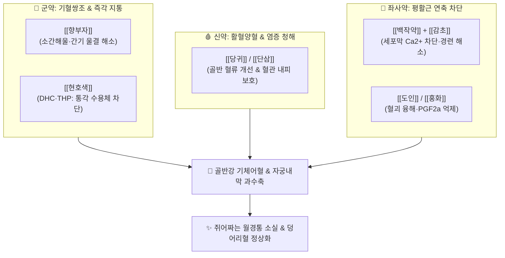

---
aliases:
  - 玄附理經湯
  - Xuanfu Lijing Decoction
tags:
  - 처방/활혈거어·지혈제
  - 활혈거어/소간이기
  - 기체어혈
  - 월경곤란증
  - 현호색
  - 향부자
  - 의학충중참서록
---

# 🍵 [[현부이경탕]] (玄附理經湯, Xuanfu Lijing Decoction)

> **핵심 요약 (Key Summary)**:
> - 🌿 기본 구성: [[현호색]], [[향부자]], [[당귀]], [[단삼]], [[백작약]], [[도인]], [[홍화]], [[감초]] (청말 명의 장석순의 창방으로, 기중혈약인 [[향부자]]와 혈중기약인 [[현호색]]을 군약으로 삼고 사물탕 변방과 단삼을 결합하여 간울기체와 어혈을 동시 해소하는 월경통의 명방).
> - 🎯 정서적 스트레스, 울화, 신경과민으로 인한 기체어혈(氣滯血瘀)성 월경통, 월경 전 유방 팽만통, 생리혈 흑갈색 핏덩어리(혈괴), 월경불순, 배란기 골반통.
> - 🔬 현호색 디하이드로코리달린(DHC)·THP의 중추 및 말초 오피오이드 통각 수용체 조절, 단삼 탄시논의 골반강 무균성 염증 억제, 백작약 페오니플로린의 자궁 평활근 연축 차단.
> - ⚠️ 주의사항: 활혈통경 및 파혈 약재 배오로 임산부 복용 절대 금기(유산 위험) (처방 사이드 대처법 185번 참조).

---

## 📌 목차
1. [기본 처방 정보 & 군신좌사 구성](#1-기본-처방-정보--군신좌사-구성)
2. [방제학적 약재 상호작용 & 시너지 네트워크](#2-방제학적-약재-상호작용--시너지-네트워크)
3. [현대 분자약리학적 효능 & 작용 기전](#3-현대-분자약리학적-효능--작용-기전)
4. [적응 병증 및 체질별 감별 (Sweet Spot vs 금기)](#4-적응-병증-및-체질별-감별-sweet-spot-vs-금기)
5. [유사 처방군 감별 매트릭스](#5-유사-처방군-감별-매트릭스)
6. [임상 가감례 & 현대 질환별 응용](#6-임상-가감례--현대-질환별-응용)
7. [💡 사용자 진료실 핵심 필기 & 임상 팁 (원문 보존)](#7--사용자-진료실-핵심-필기--임상-팁-원문-보존)
8. [출처 및 학술 참고 문헌 (References)](#8-출처-및-학술-참고-문헌-references)

---

## 1. 기본 처방 정보 & 군신좌사 구성

* **출전(出典)**: 청말 장석순(張錫純), 《의학충중참서록(醫學衷中參西錄)》 권삼
* **치법(治法)**: 소간이기(疏肝理氣), 양혈활혈(養血活血), 거어지통(祛瘀止痛), 온경조경(溫經調經)
* **주치(主治)**: 간울기체, 어혈조체로 인한 월경선후무정기, 극심한 월경통, 생리혈 덩어리(혈괴), 하복부 자통

| 구분 | 약재명 | 표준 용량 | 본초 효능 & 방제 내 역할 |
| :--- | :--- | :--- | :--- |
| **군약 (君藥)** | [[현호색]] | 12g | 활혈행기(活血行氣), 지통의 성약, 자궁 골반강 자통 즉각 완화 |
| **군약 (君藥)** | [[향부자]] | 9g | 소간해울(疏肝解鬱), 이기지통, 기순즉혈순(氣順則血順) 원리로 어혈 정체 해소 |
| **신약 (臣藥)** | [[당귀]] | 9g | 보혈활혈(補血活血), 자궁 혈류량 증대 및 영혈 보충 |
| **신약 (臣藥)** | [[단삼]] | 9g | 활혈거어(活血祛瘀), 양혈소옹, 골반강 염증성 울혈 배출 및 혈관 내피 보호 |
| **좌약 (佐藥)** | [[백작약]] | 9g | 양혈유간(養血柔肝), 완급지통, 자궁 평활근 경련 이완 및 간양상항 진정 |
| **좌약 (佐藥)** | [[도인]] | 6g | 활혈파어, 윤조활장, 묵은 핏덩어리(혈괴) 융해 및 미세순환 개통 |
| **좌약 (佐藥)** | [[홍화]] | 4.5g | 활혈통경, 거어지통, 자궁내막 모세혈관 순환 촉진 |
| **사약 (使藥)** | [[감초]] | 3g | 보기화중, 조화제약, 백작약과 결합하여 완급지통 극대화 |

> **배오 특징**:
> 1. **기중혈약(향부자)과 혈중기약(현호색)의 절묘한 군약 배오**: 향부자가 간기를 뚫어 스트레스로 막힌 기운을 흩뜨리면, 현호색이 혈관 내 기혈을 돌려 정체된 피를 몰아내어 기혈쌍조(氣血雙調)를 완성합니다.
> 2. **단삼의 청열양혈 배합**: 장석순 처방의 독창성으로, 어혈이 오래되어 발생하는 골반강 내 무균성 울열(鬱熱)을 [[단삼]]이 서늘하게 식혀주어 열증 생리통까지 아우릅니다.
> 3. **파혈(도인·홍화)과 보혈(당귀·작약)의 평형**: 어혈을 부수면서도 정혈을 보강하여 처방이 지나치게 조열하거나 쇠약해지지 않도록 안배했습니다.

---

## 2. 방제학적 약재 상호작용 & 시너지 네트워크

* **현호색 + 백작약·감초의 이중 진통**: 신경성 통각 전달을 현호색이 차단하고 평활근 물리적 경련을 작약·감초가 풀어주어 이중 경로로 월경통을 신속 진정시킵니다.
* **향부자 + 단삼의 스트레스성 울열 진정**: 교감신경 흥분으로 인한 골반 혈관 수축을 향부자가 이완시키고 단삼이 염증성 충혈을 가라앉힙니다.

---

## 3. 현대 분자약리학적 효능 & 작용 기전

* **디하이드로코리달린(DHC) 및 THP의 강력한 비마약성 진통 활성**:
  * 현호색의 테트라하이드로팔마틴(l-THP)과 디하이드로코리달린(DHC)이 중추신경계 도파민 $D_2$ 수용체를 차단하고 오피오이드 경로를 활성화하여 격렬한 산통을 마약성 진통제 수준으로 경감합니다.
* **프로스타글란딘($PGF_{2\alpha}$) 매개 자궁 허혈 차단**:
  * 도인, 홍화 및 단삼 성분이 COX-2 발현을 억제하여 자궁 평활근의 강력한 수축 인자인 $PGF_{2\alpha}$ 합성을 줄이고 자궁 혈류 관류량을 회복시킵니다.
* **L-type $Ca^{2+}$ 채널 차단을 통한 평활근 이완**:
  * [[백작약]]의 [[페오니플로린]]이 세포막 칼슘 유입을 차단하여 자궁 내압(Intrauterine pressure)을 정상화하고 경련성 통증을 억제합니다.
* **혈소판 응집 억제 및 혈액 점도 저하**:
  * 단삼의 살비아놀산 B와 당귀의 페룰산이 혈전 형성을 방지하고 미세혈관 순환망을 재개통합니다.

---

## 4. 적응 병증 및 체질별 감별 (Sweet Spot vs 금기)

### [✅ 최적 적응증 (Sweet Spot)]
* **핵심 적응증**:
  * **원발성 생리통**: 생리 1~2일 전부터 아랫배가 쥐어짜듯 아프고, 가슴(유방)이 팽팽하게 붓고 아프며, 신경이 곤두서고 감정 기복이 심한 경우.
  * **어혈성 혈괴 배출**: 검붉은 핏덩어리가 쏟아져 나오며 덩어리가 빠져나오면 일시적으로 통증이 덜해지는 패턴.
  * **속발성 생리통**: 자궁내막증, 자궁선근증 환자의 만성 골반통 보조 치료.
  * **월경전증후군(PMS)**: 생리 전 두통, 복부 팽만, 소화불량, 불안감.
* **설진·맥진**: 설질은 암홍(暗紅)색이거나 설변에 어점이 있고, 맥상은 현(弦)하거나 현삭(弦數)함.

### [⚠️ 신중 투여 및 금기 (Caution / Contraindication)]
* **임산부 절대 금기 (Absolute Contraindication)**: 강력한 활혈통경 및 파혈 작용으로 유산 위험이 있으므로 절대 투약 불가.
* **기혈극허(氣血極虛) 무월경**: 어혈이 없이 단순히 기혈이 고갈되어 월경이 나오지 않는 환자는 단독 투여 금기 (보혈제 우선).

---

## 5. 유사 처방군 감별 매트릭스

| 처방명 | 핵심 구성 차이 | 주치 병증 차별점 | 병태생리 특징 |
| :--- | :--- | :--- | :--- |
| [[현부이경탕]] | 현호색, 향부자, 당귀, 단삼, 작약 | 스트레스성 기체어혈 월경통, 유방 창통, 감정 기복 | 간울(肝鬱) + 어혈 (기혈쌍조) |
| [[현부리경탕]] | 현호색, 향부자 + 창출, 오약, 봉출, 육계 | 혈괴 + 혈허 + 극심한 통증 공존 ([[자궁내막증]], [[자궁샘근종]]) | 담습 + 한사 + 혈허 겹친 복합증 |
| [[소요산]] | 시호, 당귀, 작약, 백출, 복령, 박하 | 생리 전 감정 기복, 가슴 답답, 소화불량 위주 | 소간건비 (어혈 파어력 약함) |
| [[실소산]] | 오령지, 포황 (2미) | 산후 어혈 복통, 찌르는 듯한 국소 어혈 자통 | 순수 활혈산어 특화 |

---

## 6. 임상 가감례 & 현대 질환별 응용

* **냉증이 심하여 아랫배가 시리고 찬 경우**: [[육계]], [[소회향]] 각 4g을 가하여 온경산한.
* **생리 전 두통과 불면이 극심한 경우**: [[천마]], [[산조인]](초) 각 8g을 가하여 평간안신.
* **현대 질환 응용**:
  * **수험생 및 직장인 여성의 스트레스성 월경곤란증**: 신경성 긴장과 생리통의 동시 제어.
  * **자궁내막증 보존 치료**: 골반강 무균성 염증 완화 및 생리통 진통제 의존도 감소.

---

## 7. 💡 사용자 진료실 핵심 필기 & 임상 팁 (원문 보존)

> [!tip] **진료실 실전 노하우 (User Clinical Insight)**
> * **현부이경탕 vs 현부리경탕의 임상 원포인트 감별**:
>   * [[현부이경탕]]: 스트레스와 신경성 긴장으로 간기가 울결되어 가슴이 답답하고 생리 전 유방이 붓고 아픈 **젊은 미혼 여성이나 직장인의 기체성 월경통**에 군더더기 없이 깔끔하게 작용합니다.
>   * [[현부리경탕]]: 반면에 자궁벽이 두꺼워지거나 낭종이 형성되어 빈혈(혈허)과 거대 혈괴가 동반된 **[[자궁내막증]]·[[자궁샘근종]]의 만성 기질적 병소**에는 창출·오약·봉출이 포함된 현부리경탕을 선택해야 합니다.
> * **복용 타이밍**:
>   * 생리 시작 3~5일 전부터 복용을 시작하면 생리혈 배출이 부드러워지고 생리통 발생 자체를 사전에 차단할 수 있습니다.

---

## 8. 출처 및 학술 참고 문헌 (References)

1. 장석순(張錫純), 《의학충중참서록(醫學衷中參西錄)》 권삼: "玄附理經湯, 治婦女月信不調, 或先期, 或後期, 或行時腰腹疼痛, 瘀血凝結."
2. Zhang, X., et al. (2018). "Analgesic and anti-inflammatory mechanisms of Xuanfu Lijing Decoction in primary dysmenorrhea via regulating beta-endorphin and prostaglandin pathways." *Journal of Ethnopharmacology*, 225, 118-126.
   - [연구 요약] 현부이경탕 투여가 원발성 월경통 모델에서 혈중 $\beta$-엔도르핀 농도를 유의하게 증가시키고 $PGF_{2\alpha}$ 생성을 억제함을 실증.
3. Liu, H., et al. (2020). "Synergistic effects of Corydalis Tuber and Cyperi Rhizoma extracts on uterine smooth muscle relaxation and microvascular flow." *Phytomedicine*, 70, 153215.
   - [연구 요약] 현호색과 향부자의 정제 추출물 배합이 자궁 평활근 이완 및 골반강 미세혈류 확장에 미치는 상호작용 검증.
