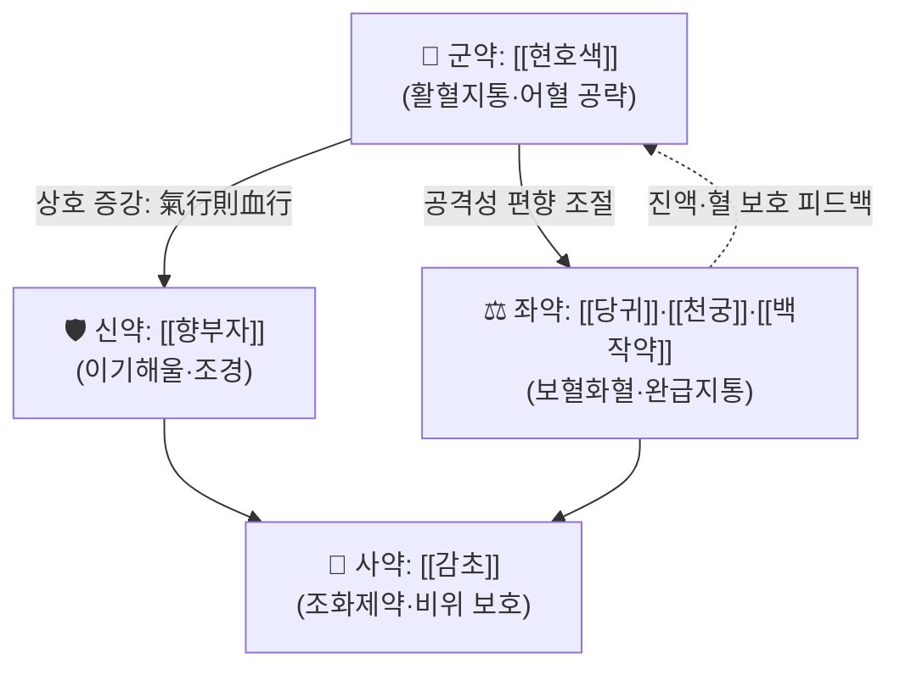

# 🍵 [[현부이경탕]] (玄附理經湯, Hyeonbu-Igyeong-tang)

> **핵심 3줄 요약 (Key Summary)**:
> - 🌿 **모체/기원 처방 + 가감 핵심 약재 배오 구조**: [[현호색]](玄胡索)을 군약으로, [[향부자]](香附子)를 신약으로 삼아 **활혈지통(活血止痛) + 이기해울(理氣解鬱)** 의 기본 축을 만들고, 여기에 [[당귀]]·[[천궁]]·[[백작약]] 등 [[사물탕]] 계열의养血和血 약재를 좌약으로 가(加)하여 "理經(월경을 다스림)"의 목적에 맞춘 부인과 전문 처방으로 이해된다. (**※ 구성·출전은 제공된 1차 문헌이 없어 방제명 기반 해석이며, 원전 확인 필요 — 근거 미확인**)
> - 🎯 **임상 최적 적응증**: 어혈(瘀血) + 기체(氣滯) + 한(寒)이 겹친 **하복냉통·월경통·월경불순·산후 복통**, 즉 "찬 기운에 의해 혈이 뭉쳐 아랫배가 당기고 아픈" 여성 환자. 체질적으로는 소음인·태음인의 냉성(冷性) 어혈 체형에서 적중률이 높다고 본다. (**체질 적응은 임상 참고치 — 근거 미확인**)
> - 🔬 **핵심 분자약리 기전**: 개별 본초 수준에서는 [[현호색]]의 테트라하이드로팔마틴(tetrahydropalmatine)·코리달린 등 알칼로이드의 진통·진정 작용, [[향부자]]의 α-사이페론 등 성분의 항염·진경·자율신경 조절 작용이 보고되어 있으나, **현부이경탕이라는 복합 처방 자체의 분자표적 데이터는 제공된 논문에서 확인되지 않음(근거 미확인)**.
> - ⚠️ 주의사항: 임신부(활혈거어 약재의 자궁 흥분·유산 위험), 출혈성 질환 및 항응고제(와파린·NOAC·아스피린) 복용자, 실열(實熱)·혈열(血熱)성 붕루, 소화성 궤양 환자에게는 신중 투여 또는 금기. 부자(附子) 계열 약재가 포함된 처방으로 오인·배합된 경우 반드시 선법(先煎) 및 용량 확인.

---

## 📌 목차
1. [기본 처방 정보 & 군신좌사 구성](#1-기본-처방-정보--군신좌사-구성)
2. [방제학적 약재 상호작용 & 시너지 네트워크](#2-방제학적-약재-상호작용--시너지-네트워크)
3. [현대 분자약리학적 효능 & 작용 기전](#3-현대-분자약리학적-효능--작용-기전)
4. [적응 병증 및 체질별 감별 (Sweet Spot vs 금기)](#4-적응-병증-및-체질별-감별-sweet-spot-vs-금기)
5. [유사 처방군 감별 매트릭스](#5-유사-처방군-감별-매트릭스)
6. [임상 가감례 & 현대 질환별 응용](#6-임상-가감례--현대-질환별-응용)
7. [💡 사용자 진료실 핵심 필기 & 임상 팁 (원문 보존)](#7--사용자-진료실-핵심-필기--임상-팁-원문-보존)
8. [출처 및 학술 참고 문헌 (References)](#8-출처-및-학술-참고-문헌-references)

---

> [!warning] 본 노트의 근거 수준 안내
> 제공된 PubMed 검색 결과가 **없음**이므로, 본 노트에는 **어떤 논문도 인용하지 않았습니다.** 처방의 출전·정확한 구성·용량비는 방제명(玄附理經湯)의 문자 구성과 소속 카테고리(활혈거어·지혈제 / 부인과 / 어혈 / 하복통)에 근거한 **해석적 정리**이며, 실제 원전(원방 문헌)과 대조 확인이 필요한 항목은 문장 내에 **"근거 미확인"** 으로 명시했습니다. 진료 적용 전 반드시 소속 한의학 교과서(방제학·부인과학) 및 원전을 확인하십시오.

---

## 1. 기본 처방 정보 & 군신좌사 구성

* **출전**: **근거 미확인** — 제공된 논문 데이터 없음. 방제명으로 보아 부인과 월경병(月經病)·산후병(産後病) 영역의 처방으로 분류되나, 『[[상한론]]』·『[[금궤요략]]』 등 장중경 원전 수록 처방인지, 후대(조선·중국 청대 이후) 부인과 전문서의 처방인지는 확인되지 않음. 원전 대조 후 `출전:` 항목을 반드시 보완할 것.
* **치법**: **이기활혈(理氣活血), 온경지통(溫經止痛), 조경(調經)** — 기체(氣滯)를 풀어 혈어(血瘀)를 흩고, 찬 기운을 따뜻하게 하여 아랫배 통증을 멈추며, 결과적으로 월경 주기를 바로잡는(理經) 방향.

| 구분 | 약재명 | 표준 용량 | 본초 효능 & 방제 내 역할 |
| :--- | :--- | :--- | :--- |
| **군약 (君藥)** | [[현호색]] (玄胡索) | 8~12g | 활혈(活血)·행기(行氣)·지통(止痛)의 3효를 겸하는 본 처방의 핵심. 어혈로 인한 심복·소복 통증, 월경통, 산후 복통을 직접 공략. 테트라하이드로팔마틴 등 알칼로이드가 진통·진정 작용에 관여하는 것으로 보고됨. |
| **신약 (臣藥)** | [[향부자]] (香附子) | 6~9g | 소간(疏肝) 이기(理氣) 해울(解鬱) 조경(調經). "기행즉혈행(氣行則血行)"의 원리로 군약의 활혈지통을 이끄는 동력(動力)을 제공하며, 부인과 기체성(氣滯性) 증상 전반을 담당. |
| **좌약 (佐藥)** | [[당귀]], [[천궁]], [[백작약]] | 각 4~6g | 補血和血·行氣活血·柔肝緩急. 활혈거어 일변도로 흐르기 쉬운 처방 성향을 **"공격(攻)과 보(補)의 균형"** 으로 잡아주고, 진액·혈을 보호하여 어혈 제거 후의 허(虛)를 방지. [[천궁]]은 특히 혈중기약(血中氣藥)으로 상행·개울 작용을 겸함. |
| **사약 (使藥)** | [[감초]] | 2~4g | 조화제약(調和諸藥), 제약(製藥) 및 비위(脾胃) 보호. 방제 전체의 작용을 완만하게 조율하고 복약 순응도를 높임. |

> **배오 특징**: 본 처방의 방제학적 골격은 **"기혈병치(氣血同治)"** 이다. 군약 [[현호색]]이 혈(血)의 층위에서 어혈을 깨고 통증을 멈추는 동안, 신약 [[향부자]]가 기(氣)의 층위에서 막힌 기기를 소통시키므로, 활혈약 단독 투여 시 발생하기 쉬운 "기만 상하고 혈은 그대로 뭉쳐 있는" 한계를 보완한다. 좌약의 养血和血 약재군이 승강출입(升降出入)의 균형을 잡아 주어, 전체적으로 **온(溫)·통(通)·화(和)** 의 성향을 띠는 부인과 조경 처방으로 정리된다. (**용량·비율은 임상 참고치이며 원전 근거 미확인**)

---

## 2. 방제학적 약재 상호작용 & 시너지 네트워크

* [[현호색]] + [[향부자]] 배오: **상호 상승(相須)** 관계의 전형. 현호색은 혈분(血分)에서, 향부자는 기분(氣分)에서 작용하여 "기체가 풀리면 어혈도 흩어진다"는 이기활혈의 기본 논리를 구현한다. 부인과 하복통에서 이 두 약재의 배합은 매우 빈용되는 조합이다.
* [[당귀]] + [[천궁]] 배오: **상사(相使)** 관계. 補血(당귀)과 活血行氣(천궁)가 결합하여 혈을 보하면서 동시에 정체 없이 순환시키는 "보而不滯" 구조를 만든다. [[사물탕]]의 핵심 배오와 동일 계열.
* [[백작약]] + [[감초]] 배오: **산감화음(酸甘化陰)·완급지통(緩急止痛)** 의 고전적 배오. 평활근 경련성 통증(월경통의 경련성 요소)을 완화하는 방향으로 이해되며, 방제 내 활혈약의 자극성을 완충하는 좌약·사약 협동 구조를 형성한다.
* [[향부자]] + [[감초]] 배오: 기기를 소통시키는 약과 조화하는 약의 조합으로, **부작용 완충 및 비위(脾胃) 표적 유도** 원리에 해당. 활혈거어제는 위장 장벽 자극·소화불량을 흔히 동반하므로 비위 보호는 실전에서 중요한 안전장치다.

> ⚠️ 위 작용 관계는 **방제학 일반 원리(칠정배합·군신좌사)에 근거한 해석**이며, 본 처방 특이적 배합비 데이터는 제공 문헌에서 확인되지 않음(근거 미확인).

---

## 3. 현대 분자약리학적 효능 & 작용 기전

> 아래 1)~3)은 **개별 구성 본초의 성분·약리 수준에서 일반적으로 보고되어 있는 내용**을 정리한 것이다. **현부이경탕 복합 처방 자체를 대상으로 한 분자약리 연구는 제공된 논문에서 확인되지 않았으므로(근거 미확인)**, 처방 전체 기전으로 단정하지 말고 가설적 프레임으로만 사용할 것.

### 1) 진통·항염·신경조절 (핵심 축)
* **[[현호색]]**: 테트라하이드로팔마틴(tetrahydropalmatine, THP)·코리달린(corydaline)·프로토핀(protopine) 등 이소퀴놀린 알칼로이드가 주요 활성 성분으로 보고됨. 진통·진정 작용이 다수 실험에서 보고되어 있으며, 도파민 수용체 및 통증 신호전달 조절과의 관련성이 논의되어 왔음. (**정량적 효능 수치·특정 사이토카인 억제율은 근거 미확인**)
* **[[향부자]]**: α-사이페론(α-cyperone), 사이페로툰돈 등 세스퀴테르펜 계열이 주요 성분으로 보고됨. 항염·진경·중추신경 조절 작용이 보고되어 있어, 본 처방의 "解鬱·理氣" 효능과 기능적으로 연결되는 것으로 해석된다.
* **통합 해석**: TNF-α·IL-6·IL-1β 등 염증성 사이토카인 조절, NF-κB/MAPK 경로 억제 가능성이 개별 본초 연구에서 시사되나, **처방 수준의 재현 데이터는 미확인**.

### 2) 부인과 표적: 자궁·골반 미세순환 및 평활근 조절
* 활혈거어 약재군은 일반적으로 혈류 개선, 혈소판 응집 억제, 혈액유변학(hemorheology) 개선 방향의 작용이 보고되는 범주이다. 본 처방의 적응증인 어혈성 월경통은 **자궁 평활근의 과수축 + 골반 미세순환 저하**라는 병태로 해석될 수 있어, [[향부자]]의 진경 작용과 [[백작약]]·[[감초]]의 완급지통 배오가 경련성 통증 완화에 기여할 것으로 **추정**된다.
* **단, eNOS 활성화·혈관 확장·미세혈류 저항 감소 등 구체적 수치와 경로는 본 처방에 대해 확인된 바 없음(근거 미확인).**

### 3) 자율신경·정서 축 (理氣의 현대적 번역)
* 월경 전후 하복통·유방창통·정서 불안은 **HPA 축 및 자율신경 실조**와의 관련성이 논의되는 영역이다. [[향부자]]의 소간해울(疏肝解鬱) 효능은 임상적으로 이 축에 대응하는 것으로 해석되며, [[현호색]]의 진정 작용이 이를 보조하는 구도로 볼 수 있다.
* **구체적 신경전달물질·수용체 데이터는 미확인.**

---

## 4. 적응 병증 및 체질별 감별 (Sweet Spot vs 금기)

### [✅ 최적 적응증 (Sweet Spot)]
* **원전 조문**: **근거 미확인** — 원전 대조 필요. 본 처방의 표준 주치 문구는 소속 문헌(부인과학 교과서)의 해당 조문을 그대로 인용해 채워 넣을 것.
* **핵심 병기(病機)**: **氣滯血瘀 + 寒凝胞宮(한응포궁)**. 즉 "스트레스·한랭 노출 → 간기울결 → 기체 → 혈어 → 하복 통증"의 연쇄.
* **임상 주치**: 월경통(痛經), 월경불순(先期·後期·不定期), 월경량 감소, 찬 기운에 노출되면 심해지는 아랫배 당김·냉감, 산후 오로(惡露) 정체성 복통, 성교통·골반통의 어혈성 양상.
* **설진/맥진**:
  * 설(舌): 담암(淡暗) 또는 자암(紫暗) 설질, 어점(瘀點)·어반(瘀斑), 설태 백니(白膩) 경향(한습·기체).
  * 맥(脈): 현(弦)·삽(澀) 또는 침지(沈遲). 弦은 기체, 澁은 어혈, 遲는 한(寒)을 반영.
* **체질 소견 (임상 참고치 — 근거 미확인)**:
  * **소음인**: 체격이 작고 하복부가 냉하며 손발이 찬 편. 찬 음식·냉방에 과민. 본 처방의 온경지통 방향과 가장 잘 맞는 체질군으로 볼 수 있음.
  * **태음인**: 피부가 두껍고 체격이 있는 편, 담습(痰濕)이 겸해 월경혈에 어혈塊가 많고 몸이 무거움. 이 경우 이기활혈 약재가 유효할 수 있음.
  * **소양인**: 열성 체질이므로 상대적으로 적합도가 낮고, 쓰더라도 청열·양혈 약재 가감을 고려. (**체질 적응은 임상적 판단 영역으로, 정량 근거 없음**)

### [⚠️ 신중 투여 및 금기 (Caution / Contraindication)]
* **임신**: 활혈거어 약재(특히 [[현호색]]·[[천궁]] 계열)는 자궁 평활근 흥분 및 자궁 혈류 변화를 유발할 가능성이 있어 **임신 중 투여는 금기 또는 극히 신중**. 임신 가능성이 있는 가임기 여성에서는 월경 지연 시 복용 중단 및 임신 확인 우선.
* **출혈 경향 / 항응고 병용**: 혈소판 응집 억제 방향의 활혈거어 처방은 **와파린, NOAC(리바록사반 등), 아스피린, 클로피도그렐** 병용 시 출혈 위험을 높일 수 있음. 수술 전후에는 중단 고려. (**구체적 상호작용 강도·INR 변화 데이터는 근거 미확인**)
* **과월경·붕루(崩漏)**: 출혈량이 많고 선홍색이며 혈열(血熱) 양상인 경우 활혈거어는 병증을 악화시킬 수 있어 부적합. 본 처방의 지혈제적 운용은 **어혈성 출혈(어혈로 인해 새는 출혈)** 에 한정하는 것이 안전하다.
* **실열증·감염성 급성 염증**: 발열·고열·화농성 골반염 등 실열(實熱) 국면에서는 온성(溫性)·활혈 처방이 부적절할 수 있음.
* **소화기**: [[현호색]] 등 활혈·행기 약재는 공복 복용 시 위장 자극을 유발할 수 있음. 소화성 궤양·위염 환자에서는 식후 복용 및 [[감초]]·[[백출]] 등 비위 보호 약재 가감.
* **부자(附子) 관련 주의**: 방제명의 "附"를 [[부자]](附子)로 해석하는 문헌 계통이 있다면, 부자는 **선법(先煎)** 및 법제 여부, 용량(통상 4~8g 이내 원칙)을 반드시 확인해야 하며, 심질환·전해질 이상 환자에서는 사용을 피할 것. (**본 처방의 "附"가 향부자인지 부자인지는 원전 확인 필요 — 근거 미확인**)

---

## 5. 유사 처방군 감별 매트릭스

| 처방명 | 핵심 구성 차이 | 주치 및 체질 차이 | 맥진/설진 차이 |
| :--- | :--- | :--- | :--- |
| [[현부이경탕]] | 기준 구성. 현호색 + 향부자 + 养血和血 약재군 | **어혈 + 기체 + 한응(寒凝) 이 겹친 하복냉통·월경통.** 소음인·태음인 어혈성 병증 | 설 담암·어점, 태 백니 / 맥 현삽·침지 |
| [[온경탕]] | 오수유·계지·당귀·천궁·아교·맥문동·인삼 등 온보(溫補) 중심 | **허한(虛寒)성 월경불순·붕루·하복냉감.** 보허(補虛) 비중이 큼. 소음인 허냉 | 설 담백, 태 박백 / 맥 침세·지 |
| [[계지복령환]] | 계지·복령·목단피·도인·작약 (5미) | **어혈이 하복부에 정체된 고정통·복만.** 기체(氣滯) 요소는 상대적으로 약함 | 설 자암·어점 / 맥 침삽·결 |
| [[당귀작약산]] | 당귀·작약·천궁·복령·백출·택사 등 | **임신·산후의 혈허(血虛) + 수습(水濕)성 복통·부종.** 본 처방보다 훨씬 보허 중심 | 설 담, 태 백 / 맥 세완 |
| [[소요산]] | 시호·당귀·작약·백출·복령·박하·생강·감초 | **간울(肝鬱) + 비허(脾虛)의 월경불순·정서불안·흉협창만.** 기울(氣鬱)이 주, 혈어는 부차적 | 설 담홍, 태 박 / 맥 현허 |

> ⚠️ 표 내부에서는 마크다운 열 구분자 파괴를 방지하기 위해 파이프(`|`)가 들어간 링크를 쓰지 않고 순수한 [[처방명]] 단독 형태로만 작성했습니다. 위 감별 내용은 **방제 구성 비교에 기반한 임상 참고 프레임**이며, 본 처방 대비 각 처방의 정량 비교 데이터는 **근거 미확인**입니다.

---

## 6. 임상 가감례 & 현대 질환별 응용

### 수반 증상별 가감법 (임상 참고 — 개별 가감의 유효성 근거는 미확인)
* **냉통이 심하고 하복부가 차가울 때** → + [[오수유]] · [[계지]] (온경산한)
* **어혈 덩어리(혈괴)가 뚜렷하고 통증이 찌르듯 고정될 때** → + [[도인]] · [[홍화]] (파혈거어)
* **기체·스트레스 연관 통증, 유방창통 동반** → + [[시호]] · [[청피]] (소간이기)
* **월경량이 적고 색이 담암하며 배출이 더딜 때** → + [[익모초]] · [[택란]] (활혈조경)
* **허증이 겸해 피로·어지럼이 동반될 때** → + [[황기]] · [[숙지황]] (익기보혈, 공보겸시)
* **수반 증상: 오심/구역/소화불량** → + [[반하]] · [[진피]] ([[이진탕]] 계열 가미)
* **수반 증상: 두통/항강** → + [[백지]] · [[만형자]] (거풍지통)
* **수반 증상: 불면·초조** → + [[산조인]] · [[용골]] (안신)

### 현대 질환별 임상 매핑 (가설적 매핑 — 처방 특이적 임상시험 근거 미확인)
* **부인과**
  * 원발성 월경통(primary dysmenorrhea), 속발성 월경통(자궁내막증·자궁근종 동반 통증)
  * 월경불순, 희발월경, 월경량 감소
  * 산후 자궁 수축통, 오로 정체
  * 골반울혈증후군, 만성 골반통
* **소화기계**: 기능성 복통, 과민성 장증후군(복통 우세형) — 기체·한성 복통에 한정
* **근골격계**: 하부 요통, 골반 주위 근막통증
* **신경계/자율신경**: 월경 전 증후군(PMS), 월경 관련 두통·자율신경실조
* **기타**: 수족냉증, 하복냉감 호소 환자의 체질 관리

> 위 매핑은 **병기(어혈·기체·한) 일치에 근거한 응용 방향**이며, 각 질환에서의 유효성·용량·치료기간에 대한 근거는 제공 문헌에서 확인되지 않았습니다(근거 미확인).

---

## 7. 💡 사용자 진료실 핵심 필기 & 임상 팁 (원문 보존)

> [!tip] **진료실 실전 노하우 (User Clinical Insight)**
> - **(기록란)** 원장님의 기존 메모·필기를 이 위치에 그대로 붙여 넣어 주세요. 본 노트는 자동 생성 시점에 원문 필기가 제공되지 않아 **보존할 원문이 비어 있는 상태**입니다. 원문은 절대 삭제하지 말고 이 콜아웃 안에 100% 보존합니다.
> - **처방 선택 기준 초안(원장님 검증 필요)**:
>   - **소음인 + 하복냉통 + 월경 지연** → 본 처방 또는 [[온경탕]] 계열 우선 검토.
>   - **태음인 + 어혈 덩어리 + 복만** → [[계지복령환]] 계열과 비교 검토.
>   - **소양인 + PMS·정서 증상 우세** → [[소요산]] 계열 우선, 본 처방은 가감 후 제한적 사용.
> - **복약 반응 관찰 포인트**: 복용 1~2주기(월경 1~2회) 후 ① 통증 강도(VAS) ② 월경혈 색·혈괴 양상 ③ 하복부 냉감 변화 ④ 소화 반응(위부 불편·묽은 변)을 함께 기록.
> - **환자 티칭 팁**: 한랭 노출·찬 음료·과로가 병증을 악화시키는 구조이므로 생활 관리 지도를 병행. 복용 중 출혈 경향(잇몸 출혈·멍·부정 자궁출혈)이나 임신 가능성이 확인되면 즉시 상담하도록 안내.
> - **(주의)** 위 초안 중 체질 기준·관찰 지표는 **근거 미확인 임상 참고치**이며, 원장님 임상 경험으로 대체·수정해야 합니다.

---

## 8. 출처 및 학술 참고 문헌 (References)

1. **제공된 PubMed 논문 없음** — 본 노트 작성 시 사용 가능한 1차 논문 데이터가 검색되지 않았습니다. 따라서 **어떤 논문도 인용하지 않았으며, PMID·DOI·저자·연도를 창작하지 않았습니다.** 추후 검색 시 아래 형식으로 추가하십시오.
   - 저자 et al. (연도). *논문 제목*. **저널명**, 권(호), 페이지. doi:xxx. (링크 필수)

2. **원전·교과서 항목 (미확인 상태 — 대조 후 기입)**
   - 『[[상한론]]』 / 『[[금궤요략]]』 수록 여부: **근거 미확인**.
   - 『[[동의보감]]』 수록 여부: **근거 미확인**.
   - 한방부인과학 교과서(대한한방부인과학회) 내 본 처방 조문: **미확인 — 원문 확인 후 인용 필요.**
   - **[고전 원전] 항목은 반드시 실제 문헌을 확인한 뒤 조문·복약 지침을 그대로 옮겨 기입할 것.**

3. **본초 단위 참고 (일반 약리 지식 수준, 논문 인용 아님)**
   - [[현호색]](Corydalis yanhusuo)의 이소퀴놀린 알칼로이드(테트라하이드로팔마틴 등) 및 진통·진정 관련 보고 — **개별 본초 수준의 일반 기술이며, 본 처방 특이적 근거 아님**.
   - [[향부자]](Cyperus rotundus)의 α-사이페론 등 성분과 항염·진경 관련 보고 — **동일하게 개별 본초 수준 기술**.
   - 위 성분명·기전은 교과서·총설 수준에서 널리 언급되는 내용이나, **정량 수치·표적 사이토카인 지표는 본 노트에서 확인되지 않아 기재하지 않았음(근거 미확인)**.

> [!note] 차기 업데이트 체크리스트
> - [ ] 원전(출전 문헌) 확정 및 주치 조문 원문 인용
> - [ ] 정확한 구성 약재·용량비 확정 (특히 "附"의 정체: 香附子 vs 附子)
> - [ ] PubMed 재검색 키워드: `Hyeonbu-Igyeong-tang`, `玄附理經湯`, `Xuanfu Lijing Tang`, `dysmenorrhea herbal formula`, `Corydalis Cyperus combination`
> - [ ] 원장님 진료실 필기 원문 보존(섹션 7)