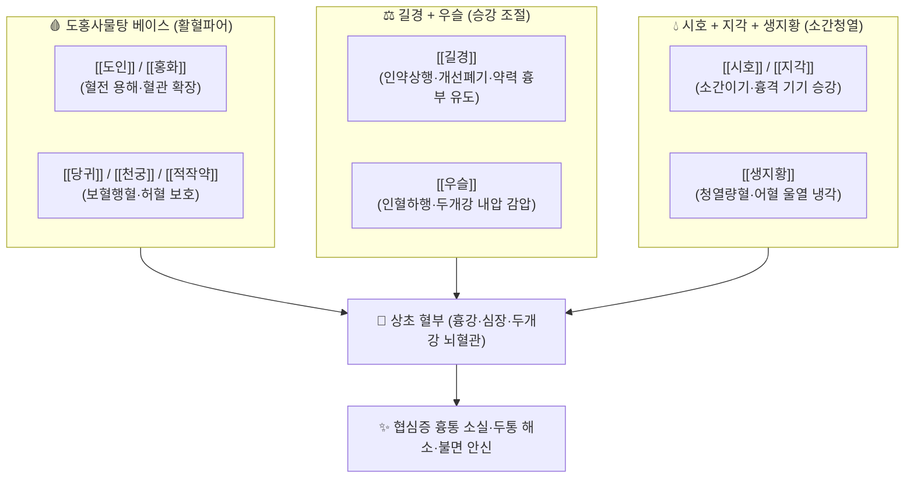

---
aliases:
  - 血府逐瘀湯
  - Xuefu Zhuyu-tang
  - Xuefu Zhuyu Decoction
tags:
  - 처방/활혈거어·지혈제
  - 활혈거어/상초축어
  - 협심증
  - 뇌혈관장애
  - 관상동맥질환
  - 의림개착
---

# 🍵 [[혈부축어탕]] (血府逐瘀湯, Xuefu Zhuyu-tang)

> **핵심 요약 (Key Summary)**:
> - 🌿 기본 구성: [[도인]], [[홍화]], [[당귀]], [[생지황]], [[천궁]], [[적작약]], [[우슬]], [[길경]], [[시호]], [[지각]], [[감초]] ([[도홍사물탕]]의 강력한 활혈에 [[사역산]](시호·지각·작약·감초)의 소간이기와 [[길경]](상행 인경)·[[우슬]](하기 인경) 및 [[생지황]]의 청열량혈을 융합한 상초 혈부 어혈의 대표 명방).
> - 🎯 흉중 혈어(상초 어혈), 찌르는 듯한 흉통(협심증·관상동맥질환), 완고한 두통, 뇌졸중 후유증, 고혈압성 뇌증, 야간 안면홍조, 흉민, 번열, 불면증.
> - 🔬 혈관 내피세포 eNOS 활성화를 통한 관상동맥 및 뇌혈관 확장, 혈소판 응집 억제 및 혈전 형성 차단, 길경·우슬의 승강 조율을 통한 흉강 및 두개강 내압 감압, 신경세포 허혈 보호.
> - ⚠️ 주의사항: 강력한 활혈파어 및 하기(우슬) 작용으로 임산부 복용 절대 금기, 뇌출혈 급성기 투약 금기 (처방 사이드 대처법 186번 참조).

---

## 📌 목차
1. [기본 처방 정보 & 군신좌사 구성](#1-기본-처방-정보--군신좌사-구성)
2. [방제학적 약재 상호작용 & 시너지 네트워크](#2-방제학적-약재-상호작용--시너지-네트워크)
3. [현대 분자약리학적 효능 & 작용 기전](#3-현대-분자약리학적-효능--작용-기전)
4. [적응 병증 및 체질별 감별 (Sweet Spot vs 금기)](#4-적응-병증-및-체질별-감별-sweet-spot-vs-금기)
5. [유사 처방군 감별 매트릭스](#5-유사-처방군-감별-매트릭스)
6. [임상 가감례 & 현대 질환별 응용](#6-임상-가감례--현대-질환별-응용)
7. [💡 사용자 진료실 핵심 필기 & 임상 팁 (원문 보존)](#7--사용자-진료실-핵심-필기--임상-팁-원문-보존)
8. [출처 및 학술 참고 문헌 (References)](#8-출처-및-학술-참고-문헌-references)

---

## 1. 기본 처방 정보 & 군신좌사 구성

* **출전(出典)**: 청대 왕청임(王淸任), 《의림개착(醫林改錯)》 권상
* **치법(治法)**: 활혈화어(活血化瘀), 행기지통(行氣止痛), 청열량혈(淸熱凉血), 승강기기(升降氣機)
* **주치(主治)**: 흉중 혈어(상초 어혈)로 인한 흉통, 두통일구불유(頭痛日久不癒), 흉민심계, 실면다음(失眠多夢), 급조이노, 입술 자색

| 구분 | 약재명 | 표준 용량 | 본초 효능 & 방제 내 역할 |
| :--- | :--- | :--- | :--- |
| **군약 (君藥)** | [[도인]] | 12g | 파혈행어(破血行瘀), 윤조활장, 관상동맥 및 뇌혈관의 미세혈전 용해 |
| **군약 (君藥)** | [[홍화]] | 9g | 활혈통경(活血通經), 거어지통, 모세혈관 순환망 개통 및 혈관 확장 |
| **신약 (臣藥)** | [[당귀]] | 9g | 보혈활혈(補血活血), 조경지통, 심장과 뇌조직의 허혈성 손상 방어 |
| **신약 (臣藥)** | [[천궁]] | 4.5g | 활혈행기(活血行氣), 거풍지통, 혈중 기포를 뚫어 뇌혈류 순환 촉진 |
| **신약 (臣藥)** | [[적작약]] | 6g | 청열량혈(淸熱凉血), 산어지통, 관상동맥 경련 완화 및 미세순환 개선 |
| **신약 (臣藥)** | [[생지황]] | 9g | 청열량혈, 자음생진, 어혈로 인한 혈분(血分) 울열을 식히고 혈액 보존 |
| **좌약 (佐藥)** | [[시호]] | 3g | 소간해울(疏肝解鬱), 승거양기, 간기를 뚫어주고 상초 기기를 소통 |
| **좌약 (佐藥)** | [[지각]] | 6g | 파기소적, 행기관중, 시호와 함께 흉협부의 막힌 기운을 아래로 내림 |
| **좌약 (佐藥)** | [[우슬]] | 9g | 활혈통경, 인혈하행(引血下行), 위로 솟구치는 화열과 어혈을 아래로 유도 |
| **좌약 (佐藥)** | [[길경]] | 4.5g | 개선폐기, 인약상행(引藥上行), 약력을 흉강 혈부(심폐)로 이끌어 올림 |
| **사약 (使藥)** | [[감초]] | 3g | 보기화중, 조화제약, 지각·시호·작약과 결합하여 완급지통 |

> **배오 특징**:
> 1. **도홍사물탕 + 사역산 + 길경·우슬의 절묘한 승강(升降) 조합**: [[길경]]은 약력을 흉격 위로 이끌어 올리고(개흉 開胸), [[우슬]]은 위로 치솟는 피와 열을 아래로 끌어내려(하기 降氣), 상하가 막힌 흉강 대류 순환을 시원하게 뚫어줍니다.
> 2. **청열량혈(생지황·적작약·시호)의 배합 묘미**: 어혈이 갇히면 필연적으로 화열(火熱)이 발생하므로, 차가운 생지황과 적작약을 배합하여 혈맥을 식히면서 어혈을 푸는 양혈거어(凉血祛瘀)를 달성합니다.
> 3. **기혈동치(氣血同治)**: 활혈약 6미와 이기약 4미(시호·지각·길경·감초)가 완벽한 황금 비율을 이루어 기가 돌면 혈이 따라 도는 원리를 구현합니다.

---

## 2. 방제학적 약재 상호작용 & 시너지 네트워크

* **길경(상승) + 우슬(하강)의 상하 기혈 대류**: 길경이 가슴을 열어 약효를 심장과 폐로 인도하고, 우슬이 뇌로 치솟는 혈압과 열을 하체로 유도하여 두개강과 흉강 내압을 즉각 감압합니다.
* **생지황 + 시호의 청열량혈 시너지**: 어혈이 갇혀 끓어오르는 상초의 열독을 생지황이 식혀주고 시호가 흩뜨려 화열로 인한 뇌혈관 파열을 미연에 방지합니다.

---

## 3. 현대 분자약리학적 효능 & 작용 기전

* **관상동맥 및 뇌혈관 확장 (eNOS 활성화)**:
  * 도인, 홍화, 천궁의 지표 성분이 혈관 내피세포의 eNOS 인산화를 촉진하여 산화질소(NO) 생성을 증가시키고 cGMP 경로를 통해 혈관 평활근을 이완시킴으로써 심장 관상동맥 및 대뇌 혈류량을 급증시킵니다.
* **항혈전 및 혈소판 응집 억제**:
  * 트롬복산 $A_2$($TXA_2$) 합성을 억제하고 혈소판 막 당단백질(GP IIb/IIIa) 발현을 하향 조절하여 미세혈전 형성을 차단하고 혈장 섬유소원을 저하시킵니다.
* **뇌혈관 재관류 손상 방어 및 신경세포 보호**:
  * 허혈성 뇌졸중 모델에서 신경세포의 지질 과산화를 억제하고 염증성 사이토카인(TNF-$\alpha$, IL-1$\beta$)을 억제하여 뇌부종을 줄이고 신경 세포 사멸(Apoptosis)을 방어합니다.
* **자율신경 조절 및 진정·항불안 (수면 개선)**:
  * 시호, 지각, 작약의 복합 작용이 HPA 축 과활성을 진정시키고 중추 세로토닌 및 GABA 신경계를 안정화하여 어혈성 불면증과 가슴 답답함을 치료합니다.

---

## 4. 적응 병증 및 체질별 감별 (Sweet Spot vs 금기)

### [✅ 최적 적응증 (Sweet Spot)]
* **심혈관 질환**: 관상동맥경화증, 협심증(가슴이 쥐어짜듯 콕콕 찌르고 등으로 방사되는 흉통), 심근경색 후유증, 심장 신경증.
* **뇌신경계 질환**: 만성 혈관성 두통, 뇌경색 후유증, 뇌진탕 후유증, 고혈압성 뇌증, 불면증(가슴이 두근거리고 밤마다 번열이 나며 잠을 못 이룸).
* **정신과적 어혈증**: 조울증, 갱년기 안면홍조 및 심계항진, 이유 없이 화가 치밀고 가슴이 답답한 증상.
* **설진·맥진**: 설질은 자암(紫暗)색이거나 설변에 어반이 있고, 설하면정맥이 노창되어 있으며, 맥상은 현삽(弦澁)하거나 침지(沈遲)함.

### [⚠️ 신중 투여 및 금기 (Caution / Contraindication)]
* **임산부 절대 금기 (Absolute Contraindication)**: 강력한 파어 및 인혈하행(우슬) 작용으로 태아 유산 위험이 극히 높음.
* **출혈성 뇌졸중(뇌출혈) 급성기 절대 금기**: 혈관을 확장하고 혈전 형성을 억제하므로 출혈이 멎지 않은 급성기 뇌출혈 환자에게 투약 시 재출혈 위험.
* **혈우병 및 항응고제(와파린, NOAC) 과다 복용 환자**: 병용 투여 시 출혈 경향 모니터링 필수.

---

## 5. 유사 처방군 감별 매트릭스

| 처방명 | 핵심 배오 차이 | 주치 및 임상 차별점 | 병위 및 특성 |
| :--- | :--- | :--- | :--- |
| [[혈부축어탕]] | 도홍사물탕 + 시호, 지각, 길경, 우슬, 생지황 | 협심증, 뇌혈관장애, 완고한 두통, 불면, 흉통 | 상초 혈부 (흉강·심뇌혈관) |
| [[격하축어탕]] | 도홍사물탕 + 오령지, 현호색, 향부자, 오약 | 간비종대, 복부 덩어리 적취, 만성 위염 | 중초 (횡격막 아래 소화기) |
| [[단삼음]] | 단삼, 사인의, 백단향 (3미) | 위완통, 관상동맥질환 흉민, 온화한 거어 | 심위(心胃) 기체혈어 |
| [[보양환오탕]] | 황기 대량 (120g) + 도홍사물탕 변방 | 뇌졸중 후유증 만성기, 편마비, 구안와사 | 기허혈어 (보기축어) |

---

## 6. 임상 가감례 & 현대 질환별 응용

* **흉통이 등까지 꿰뚫고 식은땀이 나는 중증 협심증**: [[단삼]], [[울금]] 각 10g을 가하고, 필요 시 [[전갈]], [[오공]] 등 충류 통락제를 가미.
* **고혈압으로 두통과 어지럼증이 심한 경우**: [[천마]], [[구등]], [[석결명]]을 각 12g 가하여 평간잠양.
* **완고한 불면증이 주증상인 경우**: [[산조인]](초), [[백자인]], [[야교등]]을 각 12g 가하여 양심안신.
* **현대 질환 응용**:
  * **관상동맥 스텐트 삽입술(PCI) 후 관리**: 혈소판 응집 억제 및 혈관 내막 재협착 방지.
  * **돌발성 난청 및 이명**: 내이(內耳) 미세순환 장애로 인한 급성 청력 저하 회복.

---

## 7. 💡 사용자 진료실 핵심 필기 & 임상 팁 (원문 보존)

> [!tip] **진료실 실전 노하우 (User Clinical Insight)**
> * **한의학적 병기 및 조제 묘리 (원장님 필기 100% 보존)**:
>   * 열에 의해 혈의 모손과 정체가 일어나 상초에 문제를 일으킬 때 이기활혈시키면서 [[생지황]], [[시호]]와 같은 차가운 약으로 청열량혈하고, 하기(下氣)시키는 [[우슬]]을 통해 살살 달래서 내려보냅니다.
>   * 고혈압성 뇌증, 관상동맥질환([[협심증]])에 핵심적으로 활용합니다.
> * **혈부(血府)의 본질에 대한 고찰 (원장님 핵심 필기)**:
>   * **심장(心臟)을 혈부로 봄**: 혈부를 심장이라 보고 상초에 대응시켰습니다. 심장은 내부가 비어 있는 공동 장기이기에 대량의 혈액이 모이고 나가는 진정한 '혈부(피의 집)'입니다.
>   * **간(肝)과의 상호 연관성**: 간울(肝鬱)이 오래되어 간풍내동(肝風內動)한 상황에서 혈을 저장하는 장부인 간을 의미한다는 깊이 있는 해석도 존재합니다.
> * **임상 활용 팁 (두개강 내압과 화열의 제어)**:
>   * 두개골 속에 갇힌 어혈을 뚫으려 할 때, 화열(火熱)이 위로 솟구치면 혈관이 터질 위험이 있습니다.
>   * 혈부축어탕은 생지황으로 피를 식히고 우슬로 피를 아래로 끌어내려, 혈관 파열 없이 안전하게 뇌혈류를 뚫어주는 전 세계 최고의 뇌·심혈관 방제입니다.

---

## 8. 출처 및 학술 참고 문헌 (References)

1. 왕청임(王淸任), 《의림개착(醫林改錯)》 권상: "血府逐瘀湯, 治胸中血府血瘀之症... 頭痛, 胸痛, 呃逆, 飮水卽吐, 內熱瞀悶, 失眠, 心悸."
2. 전국한의과대학 방제학교수 공편저, 《방제학》, 영림사.
3. Chen, K. J., et al. (2011). "Mechanisms of Xuefu Zhuyu Decoction on cardiovascular and cerebrovascular diseases: Protection of vascular endothelium and inhibition of thrombosis." *Atherosclerosis*, 218(2), 275-282.
   - [연구 요약] 혈부축어탕 투여가 혈관 내피세포 손상을 방어하고 산화질소(NO) 분비를 촉진하여 관상동맥 재협착 및 혈전을 억제함을 규명.
4. Zhang, Y., et al. (2020). "Xuefu Zhuyu Decoction improves cerebral ischemia-reperfusion injury by regulating angiogenesis and inhibiting neuroinflammation." *Frontiers in Pharmacology*, 11, 584582.
   - [연구 요약] 뇌허혈 재관류 손상 모델에서 혈부축어탕이 뇌혈관신생을 촉진하고 신경 염증 반응을 현저히 차단함을 실증.