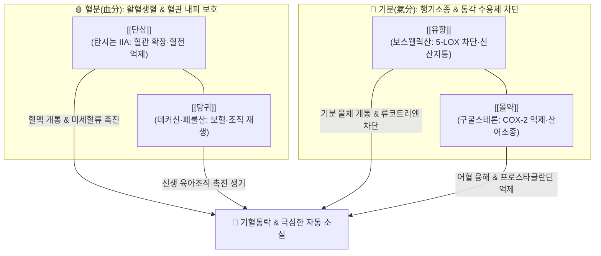

---
aliases:
  - 活絡效靈丹
  - Huoluo Xiaoling Dan
tags:
  - 처방/활혈거어·지혈제
  - 활혈거어/통락지통
  - 소종생기
  - 타박상
  - 협심증
  - 의학충중참서록
---

# 🍵 [[활락효령단]] (活絡效靈丹, Huoluo Xiaoling Dan)

> **핵심 3줄 요약 (Key Summary)**:
> - 🌿 기본 구성: [[단삼]], [[당귀]], [[유향]], [[몰약]] (혈분약인 [[단삼]]·[[당귀]]와 기분약인 [[유향]]·[[몰약]]을 동량 배오하여 기혈응체 자통을 뚫어내는 활혈통락 처방).
> - 🎯 기혈응체로 인한 심복 관절의 극심한 자통(刺痛), 허혈성 심장질환(협심증·흉비심통), 위완통, 외상 질타손상(타박상·교통사고) 어혈종통, 만성 류마티스 관절비통, 복강 내 종괴(징가) 및 옹저창양 초기.
> - 🔬 유향 보스웰릭산의 5-LOX 차단 및 몰약 구굴스테론의 COX-2 억제(이중 소염진통), 단삼 탄시논 IIA·살비아놀산 B와 당귀 페룰산의 혈소판 응집 억제·미세혈류 개선, 섬유모세포 증식 및 콜라겐 합성을 통한 육아조직 재생(생기 작용).
> - ⚠️ 주의사항: 유향·몰약의 강한 활혈소종력으로 임산부 복용 절대 금기(유산 위험), 수지 성분의 위장관 자극(오심·속쓰림) 시 초용(炒用) 및 식후 온복 준수.

---

## 📌 목차
1. [기본 처방 정보 & 군신좌사 구성](#1-기본-처방-정보--군신좌사-구성)
2. [방제학적 약재 상호작용 & 시너지 네트워크](#2-방제학적-약재-상호작용--시너지-네트워크)
3. [현대 분자약리학적 효능 & 작용 기전](#3-현대-분자약리학적-효능--작용-기전)
4. [적응 병증 및 체질별 감별 (Sweet Spot vs 금기)](#4-적응-병증-및-체질별-감별-sweet-spot-vs-금기)
5. [유사 처방군 감별 매트릭스](#5-유사-처방군-감별-매트릭스)
6. [임상 가감례 & 현대 질환별 응용](#6-임상-가감례--현대-질환별-응용)
7. [💡 사용자 진료실 핵심 필기 & 임상 팁 (원문 보존)](#7--사용자-진료실-핵심-필기--임상-팁-원문-보존)
8. [출처 및 학술 참고 문헌 (References)](#8-출처-및-학술-참고-문헌-references)

---

## 1. 기본 처방 정보 & 군신좌사 구성

* **출전(出典)**: 청말 장석순(張錫純), 《의학충중참서록(醫學衷中參西錄)》 활락효령단방
* **치법(治法)**: 활혈거어(活血祛瘀), 통락지통(通絡止痛), 소종생기(消腫生肌)
* **주치(主治)**: 기혈응체(氣血凝滯)로 인한 심복동통(협심증·위완통), 관절비통, 질타손상 어혈통, 옹저 초기의 종통

| 구분 | 약재명 | 표준 용량 | 본초 효능 & 방제 내 역할 |
| :--- | :--- | :--- | :--- |
| **군약 (君藥)** | [[단삼]] | 15g | 활혈거어, 양혈안신, 혈맥을 확장하여 미세순환을 촉진하고 심복부 어혈 제거 |
| **신약 (臣藥)** | [[당귀]] | 15g | 보혈활혈, 조경지통, 신선한 혈액을 생성하고 혈관 손상 부위 조직 재생 유도 |
| **좌약 (佐藥)** | [[유향]] | 15g | 활혈행기, 신산지통, 방향성 정유로 기분을 소통시키고 외과적 종통 즉각 차단 |
| **좌약 (佐藥)** | [[몰약]] | 15g | 활혈산어, 소종생기, 혈분의 응체된 굳은 피를 깨뜨리고 육아조직 증식 촉진 |

> **배오 특징**:
> 1. **기분(氣分)과 혈분(血分)의 완전한 대칭 배오**: [[단삼]]·[[당귀]]는 혈분에 들어가 생혈(生血)과 활혈(活血)을 담당하고, [[유향]]·[[몰약]]은 기분에 들어가 행기(行氣)와 산어(散瘀)를 주도합니다. 기가 돌면 피가 돌기 때문에(氣行則血行), 두 쌍의 약대가 결합하여 경락 깊숙이 정체된 극심한 자통을 완벽히 뚫어냅니다.
> 2. **외과 옹저와 내과 어혈을 관통하는 통치방**: 외상 타박상의 피멍과 종창뿐만 아니라 심장 관상동맥 허혈(협심증), 만성 관절염, 산후 어혈복통, 복강 내 징가(종괴)까지 어혈성 질환 전반에 두루 응용되는 범용 명방입니다.
> 3. **소종(消腫)과 생기(生肌)의 결합**: 부기를 빼고 염증을 삭이는 데 그치지 않고, 당귀와 몰약이 결손된 조직의 새살을 돋아나게(생기) 유도합니다.

---

## 2. 방제학적 약재 상호작용 & 시너지 네트워크

* [[단삼]] + [[당귀]]: 피를 맑히고 혈관을 확장하며 신선한 피를 생성(생혈·활혈)하는 혈분 치료의 기둥입니다. 단삼의 서늘한 활혈력과 당귀의 따뜻한 보혈력이 결합하여 음혈 손상 없이 혈맥을 청소합니다.
* [[유향]] + [[몰약]]: 유향은 향기가 맑아 기운을 소통시켜 통증을 멎게 하고(행기지통), 몰약은 굳은 피를 깨뜨리고 부기를 가라앉힙니다(산어소종). 두 본초가 합쳐져 5-LOX와 COX-2 염증 경로를 동시 차단합니다.

---

## 3. 현대 분자약리학적 효능 & 작용 기전

1. **강력한 이중 소염 진통 (Dual Inhibition of 5-LOX & COX-2)**:
   * 유향의 보스웰릭산(Boswellic acid)은 5-리폭시게나아제(5-LOX)를 특이적으로 차단하여 류코트리엔 생성을 억제하고, 몰약의 구굴스테론(Guggulsterone)은 COX-2를 억제하여 프로스타글란딘 형성을 차단합니다. 비스테로이드성 소염진통제(NSAIDs)의 한계를 뛰어넘는 복합 진통 효과를 나타냅니다.
2. **미세혈관 혈류 개선 및 항혈전·혈관 확장 작용**:
   * 단삼의 탄시논 IIA(Tanshinone IIA)와 살비아놀산 B(Salvianolic acid B), 당귀의 [[페룰산]](Ferulic acid)이 혈소판 응집을 강력히 억제하고 eNOS 발현을 촉진하여 일산화질소(NO) 생성을 유도함으로써 관상동맥 및 말초 혈관을 확장합니다.
3. **육아조직 재생 및 창상 치유 (생기 작용)**:
   * 손상된 조직 부위의 VEGF 발현을 촉진하여 신생 모세혈관을 신속히 유도하고, 섬유모세포 증식 및 콜라겐 합성을 활성화하여 만성 궤양 및 골절·인대 파열의 상처를 봉합합니다.

---

## 4. 적응 병증 및 체질별 감별 (Sweet Spot vs 금기)

### [✅ 최적 적응증 (Sweet Spot)]
* **허혈성 심장질환**: 관상동맥 경화증, 협심증, 흉비심통, 가슴이 쥐어짜듯 찌르는 통증.
* **근골격계 및 외상질환**: 교통사고 후유증 만성 어혈통, 타박상, 류마티스 관절염, 만성 활액막염, 척추·관절 염좌 후 지속되는 고정성 자통.
* **부인과 및 복강 질환**: 자궁근종, 자궁내막증으로 인한 심한 생리통, 복강 내 징가(종괴).
* **외과 질환**: 옹저·종기·창양의 초기 붉고 단단하게 부어오르며 찌르듯 아픈 종통.

### [⚠️ 신중 투여 및 금기]
* **임산부 절대 금기**: 유향·몰약의 강렬한 활혈통경 및 파혈 작용으로 자궁 수축과 골반강 충혈을 촉진하여 유산 위험이 있으므로 임산부 투약을 금합니다.
* **위점막 자극 및 소화불량**: 유향·몰약의 수지(Resin) 성분이 위벽을 자극하여 오심, 속쓰림, 트림을 유발할 수 있으므로 초용(볶아 사용)하고 식후 복용을 원칙으로 합니다.
* **출혈 경향 환자**: 혈소판 감소증, 활성 위궤양 환자는 출혈 시간 연장 위험이 있으므로 신중 투여합니다.

---

## 5. 유사 처방군 감별 매트릭스

| 처방명 | 핵심 배오 차이 | 주치 및 임상 차별점 | 적응증 우선순위 |
| :--- | :--- | :--- | :--- |
| [[활락효령단]] | [[단삼]], [[당귀]], [[유향]], [[몰약]] | 기혈 대칭 배오, 5-LOX/COX-2 이중 차단, 외과 옹저와 내과 흉비·관절통 | 심복통, 협심증, 만성 관절자통, 타박상 |
| [[당귀수산]] | [[당귀]], [[적작약]], [[도인]], [[홍화]], [[소목]], [[오약]], [[향부자]], [[소엽]], [[감초]] | 외상 타박 초기 특화, 혈허 보혈보다 파어행기·동통 해소 위주 | 교통사고·염좌 직후 피멍, 급성 염좌통 |
| [[단삼음]] | [[단삼]], [[단향]], [[사인]] | 단삼 중심에 방향화습·이기제 결합, 중초 위완통·심와부 통증 특화 | 위완자통, 위궤양 통증, 관상동맥 허혈 |
| [[혈부축어탕]] | 사물탕 + 도홍 + 사역산 + [[시호]], [[길경]], [[지각]], [[우슬]] | 흉중 혈어, 두통·흉통·불면·조열을 동반한 광범위한 어혈증 | 흉통, 뇌경색 후유증, 두통, 완고한 불면 |
| [[복원활혈탕]] | [[시호]], [[대황]], [[도인]], [[홍화]], [[당귀]], [[천산갑]], [[포산릉]] | 협늑부(갈비뼈) 타박, 극심한 어혈 종통 파쇄 | 늑골 골절, 흉협부 타박 어혈 |

---

## 6. 임상 가감례 & 현대 질환별 응용

* **협심증 및 관상동맥 허혈 극심 시**: [[삼칠근]](분말 3g 충복) 또는 [[단향]], [[사인]]을 가미하여 관상동맥 관류량을 극대화합니다.
* **만성 류마티스 관절염 및 풍습비통**: [[강활]], [[독활]], [[진교]], [[우슬]]을 가미하여 사지 관절의 풍습사를 제거합니다.
* **외상 골절 및 심한 타박 피멍**: [[자연동]](하소 3g), [[골쇄보]], [[속단]]을 가미하여 골유합과 파어소종을 촉진합니다.
* **위장관 자극이 심한 허약자**: [[백출]], [[복령]], [[감초]]를 가미하여 비위를 보강하고, 유향과 몰약을 반드시 초탄(炒炭) 또는 초용하여 위벽 자극을 최소화합니다.

---

## 7. 💡 사용자 진료실 핵심 필기 & 임상 팁 (원문 보존)

> [!tip] **진료실 실전 노하우 (User Clinical Insight)**
> * **단삼·당귀의 혈분 약대와 유향·몰약의 기분 약대**:
>   * [[단삼]]과 [[당귀]]는 피를 맑히고 혈관을 확장하며 신선한 피를 생성(생혈 활혈)하는 혈분 치료의 기둥입니다.
>   * [[유향]]은 향기가 맑고 기운을 소통시켜 통증을 멎게 하고(행기지통), [[몰약]]은 굳은 피를 깨뜨리고 부기를 가라앉힙니다(산어소종).
>   * 기가 통하면 혈이 통하므로(기행즉혈행), 기와 혈을 동시에 뚫어주어 경락 깊숙이 정체된 극심한 자통(刺痛, 찌르는 통증)을 신속히 종식시킵니다.
> * **외과 옹저와 내과 어혈을 관통하는 통치방**: 외상의 멍과 종창뿐만 아니라 심장 관상동맥 허혈(협심증), 만성 관절염, 산후 어혈복통까지 어혈성 질환 전반에 광범위하게 응용됩니다.
> * **위장 장애 및 오심 관리**:
>   * 유향과 몰약의 수지(Resin) 성분이 위점막을 자극하여 메스꺼움, 속쓰림을 유발할 수 있습니다.
>   * 반드시 식후 30분에 온복하도록 지도하며, 유향과 몰약을 가볍게 볶아(초용 炒用) 자극성을 줄여 조제합니다.
>   * 임산부는 절대 복용 금기입니다 (처방 사이드 대처법 187번 연동 수록).

---

## 8. 출처 및 학술 참고 문헌 (References)

1. * **Liu L et al. (2026)**. Integration of proteomics, network pharmacology and Mendelian randomization: Revealing key targets and mechanisms of Huoluo Xiaoling Pellet in improving knee osteoarthritis. *Journal of ethnopharmacology*, 358: 121020. [PMID: 41386309](https://pubmed.ncbi.nlm.nih.gov/41386309/)
