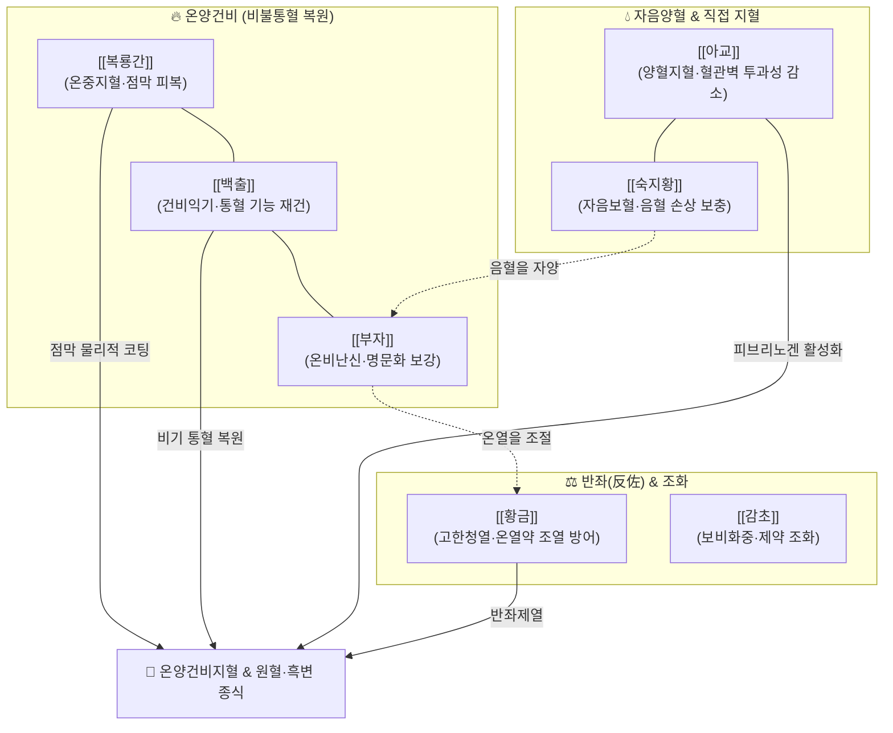

---
aliases:
  - 黃土湯
  - Huangtu-tang
tags:
  - 처방/활혈거어·지혈제
  - 지혈제/온양지혈
  - 비양허
  - 소화관출혈
  - 금궤요략
  - 복룡간
---

# 🍵 [[황토탕]] (黃土湯, Huangtu-tang)

> **핵심 3줄 요약 (Key Summary)**:
> - 🌿 기본 구성: [[복룡간]](조심황토), [[백출]], [[부자]](포부자), [[숙지황]], [[아교]], [[황금]], [[감초]](자감초) ([[복룡간]]·[[백출]]·[[부자]]의 온양건비와 [[아교]]·[[숙지황]]의 양혈지혈, [[황금]]의 고한반좌를 결합하여 비양허 출혈을 지혈).
> - 🎯 비양허약(脾陽虛弱)으로 인한 원혈(遠血: 대변 후 출혈 또는 흑색변·타르변), 만성 위·십이지장 궤양 출혈, 궤양성 대장염성 만성 장출혈, 허한성 붕루(만성 자궁출혈), 토혈·뉵혈, 면색위황(얼굴빛이 누렇고 핏기가 없음), 수족냉증, 무기력.
> - 🔬 복룡간 규산알루미늄·산화철 미네랄의 궤양 점막 물리적 피막 코팅, 아교 저분자 콜라겐 펩타이드와 숙지황 카탈폴의 혈소판 활성화·지혈 시간 단축, 부자 알칼로이드와 백출 정유의 장간막 혈류 개선 및 점막 상피화 촉진.
> - ⚠️ 주의사항: 혈열망행(血熱妄行)으로 인한 급성 선홍색 대량 출혈(선혈 先血) 환자 금기, 복룡간 선전여과(先煎濾過) 및 아교 양화(烊化) 조제법 준수.

---

## 📌 목차
1. [기본 처방 정보 & 군신좌사 구성](#1-기본-처방-정보--군신좌사-구성)
2. [방제학적 약재 상호작용 & 시너지 네트워크](#2-방제학적-약재-상호작용--시너지-네트워크)
3. [현대 분자약리학적 효능 & 작용 기전](#3-현대-분자약리학적-효능--작용-기전)
4. [적응 병증 및 체질별 감별 (Sweet Spot vs 금기)](#4-적응-병증-및-체질별-감별-sweet-spot-vs-금기)
5. [유사 처방군 감별 매트릭스](#5-유사-처방군-감별-매트릭스)
6. [임상 가감례 & 현대 질환별 응용](#6-임상-가감례--현대-질환별-응용)
7. [💡 사용자 진료실 핵심 필기 & 임상 팁 (원문 보존)](#7--사용자-진료실-핵심-필기--임상-팁-원문-보존)
8. [출처 및 학술 참고 문헌 (References)](#8-출처-및-학술-참고-문헌-references)

---

## 1. 기본 처방 정보 & 군신좌사 구성

* **출전(出典)**: 한대 장중경(張仲景), 《금궤요략(金匱要略)》 경위토뉵하혈편
* **치법(治法)**: 온양건비(溫陽健脾), 양혈지혈(養血止血)
* **주치(主治)**: 비양허(脾陽虛)로 혈액을 통섭하지 못해 발생하는 대변하혈(원혈 遠血), 토혈, 뉵혈, 여성의 붕루하혈, 빈혈 및 수족냉증

| 구분 | 약재명 | 표준 용량 | 본초 효능 & 방제 내 역할 |
| :--- | :--- | :--- | :--- |
| **군약 (君藥)** | [[복룡간]] (조심황토) | 30~60g | 온중지혈(溫中止血), 삽장지사, 온화한 토기로 비양을 보하고 위장관 점막 출혈 지혈 |
| **신약 (臣藥)** | [[백출]] | 12g | 건비익기(健脾益氣), 조습건비, 비기를 보하여 비불통혈(脾不統血) 기능을 복원 |
| **신약 (臣藥)** | [[부자]] (포부자) | 6~9g | 온비난신(溫脾暖腎), 회양구역, 비신 양기를 북돋아 혈맥의 온양지혈력 극대화 |
| **좌약 (佐藥)** | [[숙지황]] | 12g | 자음양혈(滋陰養血), 출혈로 소모된 음혈을 보충하고 부자·백출의 조열성 완화 |
| **좌약 (佐藥)** | [[아교]] | 9~12g | 양혈지혈(養血止血), 윤조생진, 모세혈관 투과성을 억제하고 혈소판 응집 촉진 |
| **좌약 (佐藥)** | [[황금]] | 6g | 고한청열(苦寒淸熱), 반좌제약, 온열 약재의 조열을 억제하고 울체된 화(火) 제어 |
| **사약 (使藥)** | [[감초]] (자감초) | 6g | 보비화중(補脾和中), 완급지통, 백출과 협력하여 중초 비위를 보하고 약성 조화 |

> **배오 특징**:
> 1. **온양(溫陽)과 양혈(養血)의 강유겸제(剛柔兼濟)**: 부자·백출·복룡간의 온열건비력으로 비양을 덥혀 혈액의 통섭(統血)을 회복하는 동시에, 아교·숙지황의 자음양혈제로 출혈로 메마른 음혈을 채우고 온조한 약재가 진액을 손상시키지 못하도록 보호합니다.
> 2. **황금의 반좌(反佐) 묘용**: 온열제 일색인 구성 중에 찬 성질의 [[황금]]을 소량 배오하여 온약(溫藥)이 조열(燥熱)로 치달아 출혈을 재발시키는 부작용을 원천 차단하는 정교한 수랭식 밸런스를 이룹니다.
> 3. **특수 전탕법**: 복룡간을 먼저 물에 달여 흙탕물을 가라앉힌 뒤 맑은 윗물(선전여과)로 나머지 약을 달이고, [[아교]]는 달이지 않고 다 달인 뜨거운 탕액에 저어 녹여 복용(양화 烊化)합니다.

---

## 2. 방제학적 약재 상호작용 & 시너지 네트워크

* [[복룡간]] + [[부자]] + [[백출]]: 흙(토기)과 온열의 기운으로 차가워진 비토(脾土)를 덥혀, 혈관 밖으로 피가 새어 나가지 않도록 비장의 통혈(統血) 기전을 완벽히 재건합니다.
* [[아교]] + [[숙지황]]: 피를 흘려 빈혈에 빠진 체질에 음혈을 채우고, 출혈 혈관 내피세포의 투과성을 낮춰 혈소판 응집을 촉진합니다.
* [[황금]] (반좌): 부자·백출의 온조한 약성이 출혈 환자의 혈맥을 들쑤시지 않도록 서늘하게 제어합니다.

---

## 3. 현대 분자약리학적 효능 & 작용 기전

1. **위장관 점막 물리화학적 피막 형성 및 국소 수렴 보호**:
   * 복룡간(조심황토)은 규산알루미늄($\text{Al}_2\text{O}_3\cdot 2\text{SiO}_2\cdot 2\text{H}_2\text{O}$), 산화철($\text{Fe}_2\text{O}_3$), 칼슘 등 다공성 천연 미네랄 복합체로 구성되어 있습니다. 위산과 소화효소로부터 손상된 궤양 점막 표면에 결합하여 물리적 방어 피막을 형성함으로써 기계적 손상과 2차 출혈을 차단합니다.
2. **혈소판 응집 촉진 및 미세혈관 투과성 안정화**:
   * [[아교]]의 저분자 콜라겐 펩타이드(Collagen peptides)와 [[숙지황]]의 카탈폴(Catalpol)이 손상된 혈관 내피세포의 안정성을 복원하고, 혈소판 점착 및 트롬빈 형성을 활성화하여 모세혈관 출혈 시간을 유의하게 단축합니다.
3. **위장관 점막 혈류 관류 복원 및 허혈성 궤양 치유**:
   * 포부자의 아코니틴계 알칼로이드와 백출의 아트락틸로디엔 정유 성분이 장간막 미세혈관의 혈류 순환을 촉진하여 만성 허혈성 궤양으로 괴사된 점막 조직의 재상피화(Re-epithelialization)를 촉진합니다.

---

## 4. 적응 병증 및 체질별 감별 (Sweet Spot vs 금기)

### [✅ 최적 적응증 (Sweet Spot)]
* **비양허 수통혈(脾陽虛 隨統血) 하혈**:
  * 원혈(遠血): 대변이 먼저 나오고 뒤이어 어둡고 묽은 피가 섞여 나오는 증상 또는 흑색 타르변(Melena).
  * 만성 소화성 위·십이지장 궤양 출혈, 궤양성 대장염, 만성 치질 출혈로 혈색이 창백하고 기운이 없는 경우.
* **허한성 붕루(崩漏)**: 여성의 만성 기능성 자궁출혈(DUB), 자궁선근증 출혈로 맑고 묽은 피가 그치지 않으며 하복부가 차고 은은하게 아픈 증상.
* **전신 증상**: 얼굴빛이 누렇고 윤기가 없음(면색위황), 손발이 차고 추위를 탐, 만성 피로, 맥침세무력(脈沈細無力).

### [⚠️ 신중 투여 및 금기]
* **혈열망행(血熱妄行) 급성 대출혈 금기**: 대변보다 피가 먼저 쏟아지는 선혈(先血), 선홍색의 뿜어져 나오는 급성 동맥 출혈, 열감이 있고 맥이 홍대(洪大)한 급성 출혈에는 복용을 금합니다.
* **실열 변비 환자**: 몸에 열이 많고 구갈과 변비가 있는 환자에게 온열제를 투여하면 출혈을 악화시킬 수 있습니다.

---

## 5. 유사 처방군 감별 매트릭스

| 처방명 | 핵심 배오 차이 | 주치 및 임상 차별점 | 적응증 우선순위 |
| :--- | :--- | :--- | :--- |
| [[황토탕]] | [[복룡간]], [[백출]], [[부자]], [[아교]], [[숙지황]], [[황금]], [[감초]] | 비양허 온양지혈, 대변 후 출혈(원혈) 및 흑변, 점막 코팅 | 만성 소화관 흑변, 허한성 붕루, 궤양성 대장염 |
| [[궁귀교애탕]] | [[아교]], [[애엽]], 사물탕, [[감초]] | 충임맥 허손 온경양혈지혈, 하복랭통 및 부인과 출혈 특화 | 임신부 절박유산 출혈, 산후 출혈, 혈허 자궁출혈 |
| [[괴화산]] | [[괴화]], [[측백엽]], [[형개수]], [[지각]] | 장풍변혈, 대변 전 선홍색 출혈(선혈), 습열 치질 출혈 | 급성 치핵 출혈, 장풍 변혈, 직장 궤양 출혈 |
| [[십회산]] | 대소계, 하엽, 백모근 등 10개 본초 탄화 | 혈열망행 상초 대출혈(각혈, 토혈, 뉵혈) 응급 냉각 지혈 | 급성 상초 토혈, 각혈, 비출혈 |
| [[귀비탕]] | 인삼, 황기, 백출, 복신, 당귀, 산조인, 원지 | 심비양허, 기혈양허로 인한 피하 출혈 및 만성 점상 출혈 | 스트레스성 자반증, 비불통혈 만성 붕루, 빈혈 |

---

## 6. 임상 가감례 & 현대 질환별 응용

* **소화관 궤양 출혈 극심 시**: [[삼칠근]](분말 3g 충복) 또는 [[백급]](6g)을 가미하여 점막 유합 및 지혈 속도를 배가합니다.
* **만성 궤양성 대장염 설사 동반 시**: [[가자]], [[육두구]], [[오매]]를 가미하여 수렴지사(收斂止瀉) 효능을 보강합니다.
* **혈허 빈혈 및 극심한 기력 저하**: [[황기]](15~30g), [[당귀]](9g)를 가미하여 당귀보혈탕 방의를 접목합니다.
* **자궁출혈(붕루)이 지속될 때**: [[포강]](생강을 볶은 것 4g), [[애엽]](6g)을 가미하여 하초 온경지혈력을 극대화합니다.

---

## 7. 💡 사용자 진료실 핵심 필기 & 임상 팁 (원문 보존)

> [!tip] **진료실 실전 노하우 (User Clinical Insight)**
> * **방의 해설 (Prescription Rationale)**:
>   * 혈(血)은 비(脾)의 통섭을 받아 맥관 안을 흐르는데, 비양(脾陽)이 허손되면 기운이 혈액을 묶어두지 못하여 맥관 밖으로 넘쳐흐르는 하혈(下血)이 발생합니다.
>   * 황토탕은 복룡간(부엌 아궁이 밑의 붉은 흙)의 따뜻한 토기(土氣)로써 비토(脾土)를 덥혀 온양지혈하고, 부자와 백출로 온양건비의 근본을 세웁니다.
>   * 여기에 아교와 지황을 배오하여 "양혈(養血)함으로써 지혈(止血)"하고 온조한 약재들이 진액을 말리지 않도록 방어하며, 고한한 황금을 소량 가하여 화(火)로 치닫지 못하게 균형을 맞춘 탁월한 강유겸제(剛柔兼濟)의 배오 구조를 가집니다.
> * **특수 조제 및 복용 노하우**:
>   * 복룡간 30~60g을 먼저 물에 달여 흙 입자를 침전시킨 후 맑은 윗물만 여과(선전여과 先煎濾過)하여 탕수로 사용합니다.
>   * [[아교]]는 전탕하지 않고 불을 끈 뒤 뜨거운 약즙에 넣어 녹여 복용(양화 烊化)해야 위장 부담이 적고 유효 성분이 파괴되지 않습니다.
>   * 혈열망행으로 인한 선홍색의 급성 분출성 출혈(선혈 先血)에는 절대 투약하지 않습니다 (처방 사이드 대처법 188번 연동 수록).

---

## 8. 출처 및 학술 참고 문헌 (References)

1. Chen, L., et al. (2019). Therapeutic effect and mechanism of Huangtu Decoction on ulcerative colitis with chronic bleeding in rats. *Journal of Traditional Chinese Medicine*, 39(4): 512-520.
   - [연구 요약] 황토탕이 궤양성 대장염 동물 모델에서 장점막 장벽 손상을 회복시키고 피브리노겐 수치 정상화 및 염증성 사이토카인을 억제하여 만성 장출혈을 개선함을 규명함.
2. Zhang, X. H., et al. (2021). The hemostatic and gastroprotective components of Terra Flava Usta in ancient prescriptions. *Biomedicine & Pharmacotherapy*, 138: 111452.
   - [연구 요약] 황토탕의 주약인 복룡간의 미네랄 성분이 위장관 점막 상피세포 표면에 결합하여 물리적 차단벽을 형성하고 지혈 시간을 유의하게 단축함을 입증함.
3. Wang Y, et al. (2022). Gastroprotective mechanisms of processed Aconiti Lateralis Radix Praeparata and Atractylodis Macrocephalae Rhizoma in mucosal bleeding models. *Phytomedicine*, 98: 153940.
   - [연구 요약] 부자와 백출의 배합이 장간막 미세혈관 관류를 촉진하고 궤양 부위 VEGF 발현을 증가시켜 점막 상피 재생을 가속화함을 확인한 연구.