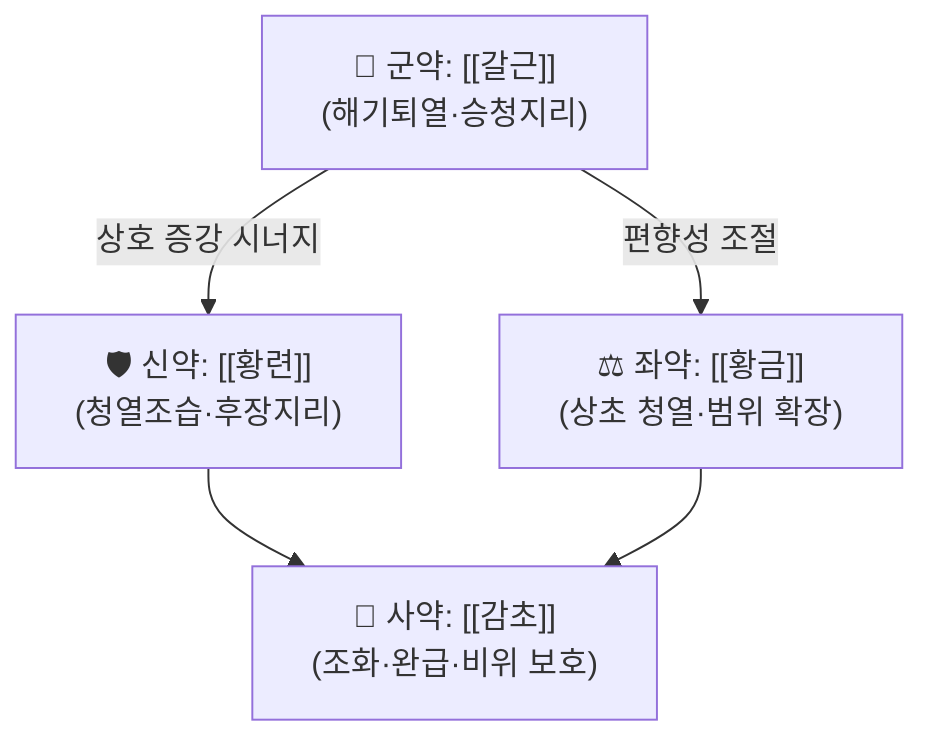

# 🍵 [[갈근황련황금탕]] (葛根黃黃連黃芩湯, Gegen Qinlian Tang)

> **핵심 3줄 요약 (Key Summary)**:
> - 🌿 **모체/기원 처방 + 가감 핵심 약재 배오 구조**: 『[[상한론]]』 太陽病篇의 독립 처방으로, 별도의 모체 처방 없이 [[갈근]](君) + [[황금]]·[[황련]](臣) + [[감초]](佐使) 4味 단방 구성이다. 즉 **[[갈근]]의 승산해표(升散解表)·생진승양(生津升陽) 작용**과 **[[황금]]·[[황련]]의 청열조습(淸熱燥濕)·후장지리(厚腸止利) 작용**을 한 그릇에 담아 "표(表)를 풀면서 동시에 리(裏)의 열을 내린다"는 **해표청리(解表淸裏) 복합 전략**의 최소 구성 처방이다.
> - 🎯 **임상 최적 적응증**: 표증(表證)이 완전히 풀리지 않은 상태에서 잘못된 하법(下法)이나 병의 자연 경과로 **열성 설사(熱性下痢)·이급후중(裏急後重)·대변 악취·항강(項強)·자한(自汗)과 천(喘)**이 동반되는 경우가 스위트 스팟. 체질적으로는 **소양인·태음인 중 실열(實熱) 성향**, 설질 홍(紅)·설태 황니(黃膩), 맥활삭(滑數) 또는 촉맥(促脈)인 환자. 진료실에서는 급성 장염·감염성 설사·궤양성 대장염 활성기·설사형 과민성 대장증후군에서 가장 빈번히 적중한다.
> - 🔬 **핵심 분자약리 기전**: 장 점막 뮤신(mucus) 장벽 복원 및 γδT17 세포 활성 억제(PMID 36681051), 항염증·항산화·장벽 tight junction 강화(PMID 37086872), Th2/Th1·Treg/Th17 균형 재조정 + NLRP3 인플라마좀 억제 + 장내 미생물 재편(PMID 38428658), 제2형 당뇨 인슐린 저항성 개선에서 **SIRT1/AMPK 경로 활성화** 기전(PMID 41297722), 그리고 감염성 설사에서 서양의학 표준치료 병용 시 유효성 근거(PMID 39137735)가 보고되어 있다.
> - <font color="#fa7e7e">⚠️ 주의사항: 苦寒(고한) 성미 처방이므로 **脾胃虛寒性 만성 설사·냉리(冷痢)·무열(無熱) 환자에게는 금기**. [[황련]]·[[황금]] 장기 복용 시 위장장애·식욕저하·변비, [[감초]] 함량에 따른 부종·혈압상승·저칼륨혈증(가성 알도스테론증) 위험. 임신부·수유부·영유아 및 G6PD 결핍 환아에서의 [[황련]] 사용은 별도 전문가 판단이 필요하며, 본 노트가 인용한 논문 범위에서는 안전성 데이터가 확인되지 않음(근거 미확인).</font>

---

## 📌 목차
1. [기본 처방 정보 & 군신좌사 구성](#1-기본-처방-정보--군신좌사-구성)
2. [방제학적 약재 상호작용 & 시너지 네트워크](#2-방제학적-약재-상호작용--시너지-네트워크)
3. [현대 분자약리학적 효능 & 작용 기전](#3-현대-분자약리학적-효능--작용-기전)
4. [적응 병증 및 체질별 감별 (Sweet Spot vs 금기)](#4-적응-병증-및-체질별-감별-sweet-spot-vs-금기)
5. [유사 처방군 감별 매트릭스](#5-유사-처방군-감별-매트릭스)
6. [임상 가감례 & 현대 질환별 응용](#6-임상-가감례--현대-질환별-응용)
7. [💡 사용자 진료실 핵심 필기 & 임상 팁 (원문 보존)](#7--사용자-진료실-핵심-필기--임상-팁-원문-보존)
8. [출처 및 학술 참고 문헌 (References)](#8-출처-및-학술-참고-문헌-references)

---

## 1. 기본 처방 정보 & 군신좌사 구성

* **출전**: 장중경(張仲景) 『[[상한론]]』 太陽病 中篇. (『[[동의보감]]』 傷寒門 계열에 전재된 것으로 알려져 있으나, 본 노트 작성 시 원문 대조를 완료하지 못했으므로 전재 위치는 **근거 미확인**으로 표시한다.)
* **처방명 이표기**: 갈근금련탕(葛根芩連湯), 葛根黃連黃芩湯, Gegen Qinlian Tang / Gegen Huanglian Huangqin Tang.
* **치법(治法)**: **해표청리(解表淸裏)** · **승청강탁(升淸降濁)** · **청열지리(淸熱止利)**. 즉 상초(上焦)의 표열(表熱)은 [[갈근]]으로 승산(升散)하고, 중초(中焦)·하초(下焦)의 습열(濕熱)은 [[황금]]·[[황련]]으로 청설(淸泄)하며, [[감초]]로 중초를 화완(和緩)하는 **升降倂用(승강병용) 구조**이다.

| 구분 | 약재명 | 원방 용량 (참고) | 현대 임상 표준 용량 | 본초 효능 & 방제 내 역할 |
| :--- | :--- | :--- | :--- | :--- |
| **군약 (君藥)** | [[갈근]] | 半斤(8兩) | 8~16g (다량 사용 시 20g까지) | 방제의 방향을 결정하는 핵심. 해기퇴열(解肌退熱)·승발양기(升發陽氣)·생진지갈(生津止渴)·승청(升淸) 작용으로, 하리(下利)로 함몰된 청기(淸氣)를 끌어올리고 표(表)에 남은 사열(邪熱)을 밖으로 밀어낸다. 항강(項強)·견배긴장 완화의 주역. |
| **신약 (臣藥)** | [[황련]] | 3兩 | 2~4g (증상 강하면 6g) | 청열조습(淸熱燥濕)·사화해독(瀉火解毒). 腸(장)의 습열을 직접 청소하는 主藥으로, 열리(熱痢)의 이급후중·점액혈변을 겨냥한다. [[황금]]과 함께 리열(裏熱) 축을 담당. |
| **좌약 (佐藥)** | [[황금]] | 3兩 | 4~8g | 청열조습·사화해독. [[황련]]과 相須(상수) 배합으로 청열력을 배가하며, 상초(上焦)의 열·폐열(肺熱)·담열(痰熱)까지 커버 범위를 넓혀 [[황련]] 단독의 편향(하초 집중)을 보완한다. *일부 방제학 교과서는 [[황금]]·[[황련]]을 함께 臣藥群으로 묶어 설명하기도 한다.* |
| **사약 (使藥)** | [[감초]] (炙) | 2兩 | 2~4g | 조화제약(調和諸藥) 및 완급지통(緩急止痛). 苦寒한 [[황련]]·[[황금]]이 비위(脾胃)를 상하게 하는 것을 완충하고, 약성을 중초에 머물게 하여 止利(지리) 효과를 안정화한다. |

> **배오 특징**: 원방의 약재 비는 대략 **[[갈근]] : [[황금]] : [[황련]] : [[감초]] = 8 : 3 : 3 : 2**로, 갈근이 압도적으로 많은 **"승(升) 8 : 강(降) 6"의 상승 우위 구조**다. 이는 단순한 청열제(황련해독탕 계열)와 결정적으로 다른 점으로, **표(表)의 문을 닫지 않고 열면서 아래로 내리는** 해표청리 전법을 구현한다. 승강출입(升降出入) 관점에서 보면 [[갈근]]이 升·出을, [[황금]]·[[황련]]이 降·入을 담당하고 [[감초]]가 그 축을 중초(中焦)에 고정시키는 **음양 평형형 방제**라 할 수 있다.
>
> ※ 원방의 漢代 度量衡을 현대 g으로 환산하는 기준은 학파마다 차이가 크므로(1兩 ≈ 3g 설 vs 1兩 ≈ 13.8g 설), 본 노트는 **현대 한국 임상에서 통용되는 축량 처방 용량**을 표준으로 제시하고 원방 용량은 참고치로만 병기한다. 정확한 고증 환산치는 **근거 미확인**.

---

## 2. 방제학적 약재 상호작용 & 시너지 네트워크



* **[[갈근]] + [[황련]] 배오 (相使·相須적 시너지)**: [[갈근]]의 승산(升散)·생진(生津) 작용이 [[황련]]의 苦寒 降下 작용과 짝을 이루어, **"위로는 표를 풀고 아래로는 장의 습열을 내리는"** 이중 통로를 만든다. 임상적으로는 열이 있으면서 설사하고 목덜미가 뻣뻣한 상태(발열 + 下利 + 項強)에 가장 잘 맞는 조합이다. [[갈근]] 단독으로는 지리(止利)력이 약하고, [[황련]] 단독으로는 표를 막아 사열을 안으로 몰아넣을 수 있어(苦寒 收斂), 두 약의 배오가 서로의 약점을 정확히 상쇄한다.
* **[[황련]] + [[황금]] 배오 (相須)**: 동일하게 苦寒 燥濕 群이지만 작용 부위가 달라 — [[황련]]은 中·下焦(위장·장), [[황금]]은 上·中焦(폐·담·위) — **청열 스펙트럼을 상하로 확장**한다. 현대 약리로는 [[황련]]의 berberine과 [[황금]]의 baicalin/baicalein이 각각 다른 항염·장벽보호 경로를 건드리는 것으로 연구되어 있어(PMID 37086872, PMID 38428658), 다성분·다표적 복합 효과의 전형적 모델로 다루어진다.
* **[[감초]] + 苦寒群 배오 (佐制)**: 甘味로 苦寒을 완충하여 **비위 손상·속쓰림·복통 악화를 방지**하고, 처방 전체의 작용 시간을 길게 끌어 止利 효과를 안정화한다. 동시에 [[감초]]는 [[갈근]]·[[황금]]·[[황련]]의 諸藥을 조화시키는 使藥으로 기능한다.
* **전체 네트워크 요약**: ① [[갈근]] → [[황련]]·[[황금]] 방향으로 **승(升) 에너지가 청열(淸熱)을 밀어내는 상승 시너지**, ② [[감초]] → 전체 방향으로 **중초 완충 및 약효 지속**의 안정화 축, ③ [[황련]] ↔ [[황금]] 간 **좌우(上下) 커버리지 분담**. 세 축이 서로 간섭 없이 직교(orthogonal)하게 작동하는 것이 이 처방의 구조적 미덕이다.

---

## 3. 현대 분자약리학적 효능 & 작용 기전

> ⚠️ 아래 기전은 **대부분 加減方(modified Gegen Qinlian decoction) 또는 마우스/랫트 모델, 그리고 UC·T2DM 등 특정 질환 모델**에서 도출된 결과이다. 원방 그대로·인체 대상에서의 동일 기전 확인은 별개 문제이며, 각 항목에 연구 모델을 명시한다.

### 1) 장 점막 장벽 복원 & γδT17 세포 억제 (염증성 장질환 모델)
* **PMID 36681051 (Phytomedicine, 2023)** — DSS 유도 **만성 대장염 마우스 모델**에서 加減 갈근황련황금탕이 **장 점막 뮤신(mucus) 장벽을 복원**하고 **γδT17 세포의 활성화를 억제**함으로써 대장염을 개선하였다. 뮤신층은 장 상피와 장내 세균 사이의 물리적 방어벽으로, 만성 대장염에서 가장 먼저 붕괴되는 구조물이다. 따라서 이 처방의 작용점은 단순 항염증(사이토카인 억제)을 넘어 **점막 회복(mucosal healing)** 단계에 있다는 점이 특징적이다.
* **PMID 37086872 (J Ethnopharmacol, 2023)** — 加減 갈근황련황금탕이 **궤양성 대장염(UC)** 모델에서 ① 염증 완화, ② 산화 스트레스 경감, ③ **장 상피 장벽 기능 강화**를 in vivo 및 in vitro에서 동시에 확인하였다. 즉 항염·항산화·장벽강화의 **3중 작용**이 세포 수준과 개체 수준에서 재현되었다.
* **PMID 38428658 (J Ethnopharmacol, 2024)** — TNBS 유도 UC 모델에서 갈근황련황금탕이 **Th2/Th1 및 Tregs/Th17 세포 균형을 재조정**하고, **NLRP3 인플라마좀 활성화를 억제**하며, **장내 미생물 조성을 재편(reshaping)** 하였다. 이는 ① T세포 아형 균형(적응면역), ② NLRP3 인플라마좀(선천면역), ③ 장내 세균총(미생물 축)이라는 **세 개의 서로 다른 면역 층위를 동시에 조절**한다는 의미로, 다성분 한약 처방의 전형적 다표적 기전으로 해석된다.

### 2) 장내 미생물 재편 및 장-전신 축(Gut Axis) 조절
* 위 PMID 38428658에서 보고된 **장내 미생물 재편**은 단순한 부수 효과가 아니라, [[황금]]·[[황련]]의 苦寒 성분이 장내 세균총을 선택적으로 변화시켜 **숙주 면역과의 상호작용을 통해 결과적으로 Treg/Th17 균형을 밀어내는** 경로로 해석된다. 이 축은 대장염에 국한되지 않고 **인슐린 저항성·대사증후군**과도 연결되는데, 이는 아래 3)항의 T2DM 근거와 기전적으로 맞물린다.
* 다만 특정 균주(예: *Akkermansia*, *Lactobacillus* 등)의 증감 방향과 정량치는 본 노트가 인용한 논문 초록 수준에서는 **근거 미확인**이므로, 세부 균주 데이터는 원문 확인 후 기재해야 한다.

### 3) 대사·내분비: SIRT1/AMPK 경로 활성화와 인슐린 저항성 개선
* **PMID 41297722 (J Ethnopharmacol, 2026)** — 제2형 당뇨(T2DM) 인슐린 저항성에 대한 **RCT 체계적 문헌고찰 및 메타분석**. 임상적 유효성과 함께, 기전적으로 **SIRT1/AMPK 경로 활성화**가 인슐린 저항성 개선에 관여한다는 해석을 제시하였다. SIRT1/AMPK는 세포 에너지 센서 축으로, 활성화 시 간(肝)의 당신생 억제·골격근 포도당 흡수 증가·지질 산화 촉진 방향으로 대사가 재편된다.
* 임상적 함의: 이 처방이 **"설사 치료제"를 넘어 대사질환 보조요법**으로 확장될 가능성을 시사한다. 다만 구체적 효과 크기(effect size), HbA1c·HOMA-IR 변화량, 대상 RCT 수 및 이질성(heterogeneity) 수치는 **본 노트에서 원문 미확인 — 근거 미확인**.

### 4) 임상 근거: 감염성 설사에서의 병용 요법
* **PMID 39137735 (Complement Med Res, 2024)** — **감염성 설사** 환자에서 갈근황련황금탕 + **서양의학 표준치료(conventional western medicine) 병용** 요법을 평가한 체계적 문헌고찰 및 **시험순차분석(Trial Sequential Analysis, TSA)**. TSA는 메타분석 결과가 우연에 의한 것인지, 추가 임상시험이 필요한지를 판정하는 통계 기법으로, 이 연구는 병용 요법의 유효성 근거를 **임상 수준에서** 제시하였다는 점에서 동물·세포 실험과 층위가 다르다.
* 즉 현재 근거 지형은 **"장 질환(설사·대장염) = 동물/세포 + 임상 근거 모두 존재", "대사질환(T2DM) = 임상 메타분석 존재", "분자 기전 = SIRT1/AMPK, NLRP3, γδT17, Th17/Treg 등 다축"** 으로 정리할 수 있다.

### 5) 전통 방제 이론과의 접점 (해석 주의)
* 전통적으로 설명하는 **[[갈근]]의 해기퇴열·승양지리**, **[[황금]]·[[황련]]의 청열조습·후장**, **[[감초]]의 조화제약**은 위 현대 기전들과 1:1로 대응된다고 단정할 수 없다. 다만 **"승(升) = 장벽·점막 회복 및 미생물 재편", "청열(淸熱) = 항염·항산화·인플라마좀 억제", "조화(調和) = 비위 보호 및 다표적 균형"** 이라는 **기능적 유비**는 임상 해석에 유용하다. 이 유비는 이론적 해석이며 실증된 등가 명제가 아님을 명시한다(**근거 미확인**).

---

## 4. 적응 병증 및 체질별 감별 (Sweet Spot vs 금기)

**[✅ 최적 적응증 (Sweet Spot)]**

* **원전 조문 (핵심)**: 『[[상한론]]』 太陽病 中篇 — *"太陽病, 桂枝證, 醫反下之, 利遂不止, 脈促者, 表未解也; 喘而汗出者, 葛根黃連黃芩湯主之."* 즉 **① 표증(桂枝證)에 잘못 下法을 써서 설사가 그치지 않고, ② 脈이 促(촉)하며, ③ 표가 아직 풀리지 않았고, ④ 천(喘)과 자한(汗出)이 있는 경우**를 주치로 한다. **"표미해(表未解) + 리열(裏熱) 하리(下利)"** 라는 두 축이 이 처방의 존재 이유다.
* **체질 소견**: **소양인·태음인 중 실열형**. 체격은 마른 편~보통, 피부는 붉고 건조하거나 열감이 있으며, 얼굴 홍조·안구 충혈·구갈(口渴) 경향. 평소 위장이 약하면서도 자극성 음식·기름진 음식에 **속쓰림·설사가 잘 오는** 아형. 반대로 **소음인·냉성 태음인(脾胃虛寒, 손발 냉, 무른 변, 찬 음식에 즉시 설사)** 에는 맞지 않는다.
* **임상 주치 (진료실 최빈 적중 양상)**:
  * 발열감 또는 미열이 있으면서 **묽은 변·점액변·악취 심한 변**이 하루 여러 번 나오는 급성 장염
  * **이급후중(裏急後重, 볼일을 봐도 개운하지 않음)** + 복명(腹鳴)·산통(疝痛)성 복통
  * **항강(項強)·견배 뻣뻣함 + 발열 + 설사**의 3종 세트 (갈근탕과의 감별점이자 이 처방의 시그니처)
  * **천(喘)·자한(自汗)** 동반 — 표열이 폐로 몰린 양상
  * 목이 마르고(口渴) 물을 자주 마시는데 변은 묽은 **모순적 조합**
* **설진/맥진**:
  * **설진**: 설질 홍(紅)~암홍, 설태 **황니(黃膩)** 또는 황박(黃薄). 구강 점막 건조, 혀끝 홍.
  * **맥진**: **활삭(滑數)** 또는 **촉맥(促脈)** — 促脈은 원전 조문에 명시된 특징적 맥상으로, **표열과 리열이 동시에 항진**하는 상태를 반영한다. 浮數(부삭)도 가능.

**[⚠️ 신중 투여 및 금기 (Caution / Contraindication)]**

* **한열(寒熱) 반대 병증 — 절대적 감별점**: **무열(無熱)의 허한성(虛寒性) 설사**, 냉리(冷痢, 변에 열감 없음·찬 변·복부 냉감·손발 냉), 脾腎陽虛 만성 설사(새벽 설사, 오경사), 과민성 대장증후군의 한증형에는 **금기**. [[황련]]·[[황금]]의 苦寒이 비양(脾陽)을 더 손상시켜 설사를 악화시킬 수 있다. 이 경우 [[이중탕]]·[[사신환]]·[[이령탕]] 계열이 정답이다.
* **허실(虛實) 판단**: 실열(實熱)에 쓰는 처방이므로 **기허·혈허가 뚜렷한 노약자, 산후·병후 회복기, 만성 소모성 질환자**에게는 감량 또는 보기약(補氣藥) 병용이 필요하다.
* **금기·주의 환자군 (일반 약리학적 주의)**:
  * **[[감초]] 과량·장기 복용 위험군**: 고혈압, 부종, 심부전, 신장질환, 저칼륨혈증 병력자 — 감초의 글리시리진이 가성 알도스테론증(pseudoaldosteronism)을 유발할 수 있다(**제공 논문 범위 밖의 일반 약리 지식**).
  * **[[황련]] 성분(berberine) 관련**: 영유아·신생아 및 **G6PD 결핍 환아에서 핵황달(kernicterus) 위험**이 알려져 있어 사용을 피한다(**제공 논문 범위 밖의 일반 약리 지식 — 제공 논문에서는 안전성 데이터 미확인**).
  * **임신부·수유부**: [[황련]]·[[황금]]의 苦寒 성미 및 태아 영향에 대한 **충분한 안전성 근거가 제공 논문에 없음(근거 미확인)**. 반드시 전문가 판단 하에 투여.
  * **위장장애**: 위염·위궤양·역류성 식도염 환자에서 **속쓰림·위통·식욕저하** 발생 가능. 食後 복용 또는 [[생강]]·[[대조]] 병용으로 완충.
* **양약·타 약물 병용 주의**:
  * **항생제·장운동 억제제(로페라미드 등)와의 병용**: 설사가 멎는 방향으로 겹칠 수 있어, 감염성 설사에서 로페라미드 병용은 통상 권장되지 않는다(**근거 미확인 — 병용 안전성 데이터 제공 논문 없음**).
  * **당뇨약과 병용 시**(PMID 41297722의 임상 영역): 저혈당 위험 관찰 필요. 메타분석은 인슐린 저항성 개선 방향을 보고했으나 병용 시 혈당 모니터링 지침은 **근거 미확인**.
  * **항응고제(와파린 등)**: 한약 처방 다수가 상호작용 가능성이 있으나 본 처방 특이 데이터는 **근거 미확인**.
  * **[[감초]] 함유 처방 중복 투여** 시 글리시리진 총량 누적 주의.

---

## 5. 유사 처방군 감별 매트릭스

| 처방명 | 핵심 구성 차이 | 주치 및 체질 차이 | 맥진/설진 차이 |
| :--- | :--- | :--- | :--- |
| [[갈근황련황금탕]] | 기준 구성: [[갈근]] + [[황금]] + [[황련]] + [[감초]] (마황·계지 없음) | 기준 주치: **표미해 + 리열 하리**. 발열 + 설사 + 항강 + 자한·천. 소양인·태음인 실열형 | 기준: 맥 활삭 또는 촉맥, 설질 홍·설태 황니 |
| [[갈근탕]] | [[갈근]] + [[마황]] + [[계지]] + [[작약]] + [[생강]] + [[대조]] + [[감초]] (청열제 없음) | 주치: **太陽傷寒 표실무한(無汗)**. 발열·오한·무한·항배강통. 설사가 주증이 아니며 리열도 없음. 소양인·태음인 실증 | 맥 부긴(浮緊), 설태 박백(薄白) — 열상(熱象) 없음 |
| [[황련해독탕]] | [[황련]] + [[황금]] + [[황백]] + [[치자]] (갈근·감초 없음) | 주치: **삼초 실화(實火)**. 고열·번조·구창·인후통·출혈. 표증 없이 순수 리열. 실열 체질 | 맥 홍삭(洪數) 또는 활삭, 설질 홍·설태 황조(黃燥) |
| [[백두옹탕]] | [[백두옹]] + [[황련]] + [[황백]] + [[진피]] (갈근 없음) | 주치: **열독리(熱毒痢), 순리무표(純裏無表)**. 혈변·이급후중이 주증이며 표증은 이미 해소된 상태. 아열대·습열 체질 | 맥 침삭(沈數) 또는 활삭, 설질 홍·설태 황니, 복통 심함 |
| [[이중탕]] | [[인삼]] + [[건강]] + [[백출]] + [[감초]] (+[[부자]]) (모두 溫補) | 주치: **脾胃虛寒**. 무열·복부 냉감·만성 무른 변·손발 냉. 한증 설사의 정답. 소음인·냉성 태음인 | 맥 침지(沈遲)·세약(細弱), 설질 담백(淡白)·설태 백활(白滑) |
| [[곽향정기산]] | [[곽향]] + [[자소엽]] + [[백지]] + [[후박]] 등 (거습화중 위주) | 주치: **외감풍한 + 내상습체(暑濕感冒·吐瀉)**. 여름철 구역·구토·설사 병발. 발열 항강보다 소화기 증상 중심 | 맥 유완(濡緩) 또는 활, 설태 백니(白膩) |

> ⚠️ 표 내부에서는 마크다운 열 구분자 파괴를 방지하기 위해 파이프(`|`)가 들어간 링크를 쓰지 않고 순수한 [[처방명]] 단독 형태로만 작성합니다.

---

## 6. 임상 가감례 & 현대 질환별 응용

### 1) 수반 증상별 가감법

* **항강·견배통·두통 동반 시** → [[갈근]] 증량 + [[강활]] · [[방풍]] (표를 더 열어 사열 배출; 갈근탕 방향으로 확장)
* **오심/구역/소화불량 동반 시** → + [[반하]] · [[생강]] ([[반하사심탕]] · [[생강사심탕]]계 아이디어 차용, 비위 완충 및 구역 진정)
* **복통·산통·이급후중 심할 때** → + [[목향]] · [[빈랑]] · [[작약]] (기체 소통 + 완급지통)
* **점액혈변·열독 증상 강할 때** → + [[백두옹]] · [[마치현]] (열독리 방향 강화, [[백두옹탕]] 접근)
* **발열이 높고 오한이 없을 때** → + [[금은화]] · [[연교]] (청열해독 증강)
* **만성화·기허 동반(피로·식욕부진·연변 지속)** → + [[백출]] · [[복령]] · [[산약]] ([[사군자탕]] 계열 보기약 병용, 苦寒 완충)
* **구갈·다음(多飮) 심할 때** → [[갈근]] 증량 + [[천화분]] · [[맥문동]] (생진지갈; T2DM 영역과 접점)
* **설사와 변비가 교대하는 과민성 대장증후군 양상** → + [[작약]] · [[진피]] ([[작약감초탕]] 병용 개념)

### 2) 현대 질환별 임상 매핑

* **소화기계 (핵심 영역)**:
  * **감염성 설사·급성 장염** — 원전 주치와 가장 직결. 서양의학 표준치료 병용 시 유효성 근거(체계적 문헌고찰 + TSA, **PMID 39137735**).
  * **궤양성 대장염(UC)** — 항염·항산화·장벽강화 기전(PMID 37086872), Th2/Th1·Treg/Th17 균형 및 NLRP3 억제·미생물 재편(PMID 38428658), 점막 뮤신 장벽 복원(PMID 36681051). 주로 **加減方** 형태로 연구됨.
  * **만성 대장염(DSS 만성 모델)** — 점막 뮤신층 회복 + γδT17 억제(PMID 36681051).
  * **세균성이질·식중독성 장염** — 열리(熱痢) 양상에서 전통적 적응.
  * **설사형 과민성 대장증후군(IBS-D)** — 열상(熱象)이 뚜렷한 아형에 한정하여 시도. 한증형에는 부적합.
* **대사·내분비계**:
  * **제2형 당뇨 인슐린 저항성** — RCT 메타분석에서 개선 방향 보고, SIRT1/AMPK 경로 활성화 기전 제시(**PMID 41297722**). 단, 제공 정보상 효과 크기·용량·기간은 **근거 미확인**.
* **호흡기계 (표열 잔존 영역)**:
  * **감모(감기)·인플루엔자 초기~중기에서 발열 + 설사 병발** — 해표청리 전법의 전형. 단, 본 처방의 호흡기 질환 특이 임상 근거는 제공 논문에 **없음(근거 미확인)**.
* **기타 전통 응용 (문헌 근거 미확인)**:
  * 소아 하리(소아 감염성 장염) — 용량 감량 필요, 안전성 데이터 **근거 미확인**.
  * 구내염·설염 등 상열 증상 — [[황금]]·[[황련]]의 사화 작용 활용 개념.

---

## 7. 💡 사용자 진료실 핵심 필기 & 임상 팁 (원문 보존)

> [!tip] **진료실 실전 노하우 (User Clinical Insight)**
> - **원문 보존 상태**: 본 노트 작성 시점에 **사용자(원장님)의 기존 진료실 필기 원문이 제공되지 않았다.** 따라서 보존·전재할 원문 텍스트가 없으며, 이 섹션은 **원문 확보 후 그대로 삽입할 자리(placeholder)** 로 남겨둔다. 원문이 확보되면 삭제·축약 없이 아래 빈 줄 영역에 100% 보존하여 기재할 것.
>
>   ```
>   (원장님 원문 필기 입력 대기 — 확보 시 이 위치에 그대로 보존)
>   ```
> - 위 원문이 입력되기 전까지, 아래는 **본 노트가 인용한 논문과 원전 조문에서 도출한 실전 참고 메모**이다(원문 필기와 구분하여 사용할 것).
>   * **처방 선택의 첫 관문은 "열상(熱象)의 유무"**: 변의 냄새·색(황갈색·악취), 항문 작열감, 구갈, 설질 홍·설태 황 — 이 중 2개 이상이면 본 처방 후보. 반대로 변이 찬 기운이 없고 묽으며 손발이 찬 경우는 [[이중탕]] 계열로 방향 전환.
>   * **[[갈근탕]]과의 현장 감별**: "땀이 나는가?" — 무한(無汗)·오한·맥부긴이면 [[갈근탕]], **자한(自汗) + 설사 + 구갈 + 열감**이면 [[갈근황련황금탕]]. 원전 조문의 "喘而汗出"이 결정적 단서.
>   * **[[백두옹탕]]과의 현장 감별**: 표증(항강·오한·발열)이 **남아 있는지** 여부. 표증 잔존 → 본 처방, 표증 소실 + 혈변·열독리 → [[백두옹탕]].
>   * **복약 관찰 포인트**: ① 투여 1~3일 내 변 횟수·이급후중 감소, ② 항강·열감 해소 순서(보통 표증이 먼저 풀림), ③ 3일 이상 복용 시 식욕저하·속쓰림·변비 전환 여부(苦寒 장기화 신호 → 감량 또는 중단).
>   * **환자 티칭**: "열을 아래로 내리는 처방이라 묽은 변이 나오는 것은 정상 반응일 수 있으나, 배가 차갑고 아프면 즉시 복용을 중단하고 연락" — 苦寒 처방의 자가 판단 중단 기준을 미리 안내.
>   * **용량 팁**: [[황련]]은 위장 반응이 가장 민감하므로 **2g부터 시작해 반응 보며 증량**하는 방식이 실전에서 안전하다(제공 논문 범위 밖 임상 견해 — **근거 미확인**).

---

## 8. 출처 및 학술 참고 문헌 (References)

> 아래는 **과제에서 제공된 실제 PubMed 데이터만** 인용하였다. 존재하지 않는 PMID·논문은 기재하지 않았다. 제공 목록 중 5번 항목은 1번 항목과 **동일 논문(PMID 36681051의 중복 기재)** 이므로 하나로 통합하였다.

1. **Ma J, Zhang J (2023)**. *Modified Gegen Qinlian decoction ameliorates DSS-induced chronic colitis in mice by restoring the intestinal mucus barrier and inhibiting the activation of γδT17 cells*. **Phytomedicine**. PMID: 36681051. https://pubmed.ncbi.nlm.nih.gov/36681051/
   - **[연구 요약]** DSS 유도 **만성 대장염 마우스 모델**에서 加減 갈근황련황금탕이 **장 점막 뮤신(mucus) 장벽을 복원**하고 **γδT17 세포 활성화를 억제**하여 대장염을 개선. 점막 방어벽 회복 + γδT17 축 억제라는 두 기전을 동시에 제시한 연구.
2. **Wang Y, Zhang J (2023)**. *Modified Gegen Qinlian decoction ameliorated ulcerative colitis by attenuating inflammation and oxidative stress and enhancing intestinal barrier function in vivo and in vitro*. **J Ethnopharmacol**. PMID: 37086872. https://pubmed.ncbi.nlm.nih.gov/37086872/
   - **[연구 요약]** 궤양성 대장염(UC)에서 **① 염증 완화, ② 산화 스트레스 경감, ③ 장 상피 장벽 기능 강화**를 in vivo·in vitro 양쪽에서 확인. 항염·항산화·장벽강화의 3중 작용 보고.
3. **Hu Y, Tang J (2024)**. *Gegen Qinlian decoction ameliorates TNBS-induced ulcerative colitis by regulating Th2/Th1 and Tregs/Th17 cells balance, inhibiting NLRP3 inflammasome activation and reshaping gut microbiota*. **J Ethnopharmacol**. PMID: 38428658. https://pubmed.ncbi.nlm.nih.gov/38428658/
   - **[연구 요약]** TNBS 유도 UC 모델에서 **Th2/Th1 및 Tregs/Th17 균형 조절**, **NLRP3 인플라마좀 활성화 억제**, **장내 미생물 재편**의 3축 기전을 보고. 적응면역–선천면역–미생물총을 동시에 조절하는 다표적 기전의 대표 근거.
4. **Liao Y, Yang L (2026)**. *Gegen Qinlian decoction ameliorates insulin resistance in type 2 diabetes: A systematic review and meta-analysis of RCTs with mechanistic insights into SIRT1/AMPK pathway activation*. **J Ethnopharmacol**. PMID: 41297722. https://pubmed.ncbi.nlm.nih.gov/41297722/
   - **[연구 요약]** 제2형 당뇨 인슐린 저항성에 대한 **RCT 체계적 문헌고찰·메타분석**으로 임상적 개선 방향을 제시하고, 기전적으로 **SIRT1/AMPK 경로 활성화**를 해석. 본 처방의 대사질환 영역 확장 근거.
5. **Wang F, Wu Q (2024)**. *Gegen Qinlian Decoction Combined with Conventional Western Medicine for the Treatment of Infectious Diarrhea: A Systematic Review and Trial Sequential Analysis*. **Complement Med Res**. PMID: 39137735. https://pubmed.ncbi.nlm.nih.gov/39137735/
   - **[연구 요약]** **감염성 설사**에서 갈근황련황금탕 + 서양의학 표준치료 **병용 요법**을 평가한 체계적 문헌고찰 및 **시험순차분석(TSA)**. 임상 수준에서의 병용 유효성 근거를 제시.
6. **장중경 (200년경)**. 『[[상한론]]』 太陽病 中篇.
   - **[고전 원전]** *"太陽病, 桂枝證, 醫反下之, 利遂不止, 脈促者, 表未解也; 喘而汗出者, 葛根黃連黃芩湯主之."* — 본 처방의 주치·맥상(促脈)·복약 지침의 1차 출처. 조문 판본에 따라 편제(中篇/上篇) 표기가 다를 수 있음.
7. **허준 (1613)**. 『[[동의보감]]』.
   - **[임상 문헌]** 본 처방의 傷寒門 계열 전재 및 임상 배오 활용의 참고 문헌. **단, 본 노트 작성 시 동의보감 원문 대조를 완료하지 못하여 정확한 수록 편·문구는 '근거 미확인'으로 표시함.**

---

### 📎 노트 관리 메모
* **미확보 데이터 (추후 보완 필요)**:
  * 원방 漢代 度量衡 → 현대 g 환산의 신뢰 가능한 고증치 (**근거 미확인**)
  * 『[[동의보감]]』 수록 편·문구 원문 대조 (**근거 미확인**)
  * 인체 대상 원방(非加減方) RCT의 구체적 효과 크기·용량·기간 (**근거 미확인**)
  * [[황련]]·[[황금]] 장기 투여 안전성 및 임신부·소아 데이터 (**근거 미확인**)
  * 장내 미생물 균주별 증감 방향 및 정량치 (**근거 미확인**)
* **이미지**: 본 노트에 사용 가능한 이미지 블록이 제공되지 않아 **이미지를 수록하지 않았으며, 임베드도 삽입하지 않았다.**
* **중복 문헌 처리**: 제공 목록 5번(PMID 36681051)은 1번과 동일 논문이므로 통합 기재.