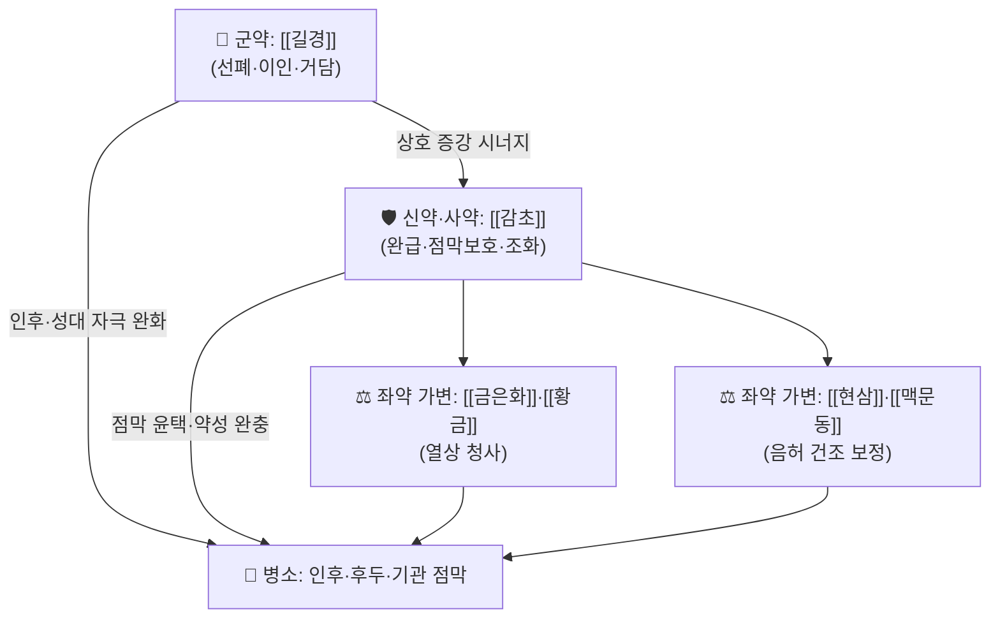

# 🍵 [[감길탕]] (甘桔湯, Kikyo-to / Jiegeng Tang)

> **핵심 3줄 요약 (Key Summary)**:
> - 🌿 단 두 味의 方: [[길경]] (君) + [[감초]] (臣·使). 『[[상한론]]』 桔梗湯의 구성과 동일 계열이며, 『[[동의보감]]』에는 甘桔湯 명칭으로 인후 질환에 운용된 것으로 알려진 최소 구성 방제.
> - 🎯 임상 최적 적응증은 **인후통·인후 이물감·성대 자극·건성 해수**이다. 체질 편향이 큰 처방이 아니어서 태음인·소양인·소음인 모두에서 인후 국소 증상 위주로 응용되며, 특히 급성 상기도감염(감기) 동반 인후통의 대증 처방으로 진료실에서 즉시 사용 가능한 폭넓은 처방이다.
> - 🔬 길경 사포닌(platycodin 계열)의 항염·거담·항바이러스 기전과 감초(glycyrrhizin)의 항염·점막 보호 기전이 결합된 구조이며, 동일 구성 처방인 Jiegeng Gancao Decoction이 궤양성 대장염 모델에서 다중 표적 개선 효과를 보였다는 네트워크약리학·프로테오믹스 연구가 보고되었다(PMID 40544735).
> - ⚠️ 주의사항: 감초 함량이 높은 방제이므로 고혈압·부종·저칼륨혈증·신기능 저하 환자에서 장기 복용 시 가성 알도스테론증(저칼륨혈증, 혈압 상승, 부종) 위험. 길경 사포닌의 위장 자극으로 구역·구토감이 나타날 수 있으며, 이뇨제·강심배당체(디기탈리스)와의 병용은 전해질 이상 위험으로 신중 투여.

---
## 📌 목차
1. [기본 처방 정보 & 군신좌사 구성](#1-기본-처방-정보--군신좌사-구성)
2. [방제학적 약재 상호작용 & 시너지 네트워크](#2-방제학적-약재-상호작용--시너지-네트워크)
3. [현대 분자약리학적 효능 & 작용 기전](#3-현대-분자약리학적-효능--작용-기전)
4. [적응 병증 및 체질별 감별 (Sweet Spot vs 금기)](#4-적응-병증-및-체질별-감별-sweet-spot-vs-금기)
5. [유사 처방군 감별 매트릭스](#5-유사-처방군-감별-매트릭스)
6. [임상 가감례 & 현대 질환별 응용](#6-임상-가감례--현대-질환별-응용)
7. [💡 사용자 진료실 핵심 필기 & 임상 팁 (원문 보존)](#7--사용자-진료실-핵심-필기--임상-팁-원문-보존)
8. [출처 및 학술 참고 문헌 (References)](#8-출처-및-학술-참고-문헌-references)
---
## 1. 기본 처방 정보 & 군신좌사 구성

* **출전**: 장중경(張仲景) 『[[상한론]]』 소음병(少陰病) 편의 **桔梗湯**이 모체이며, **甘桔湯**이라는 명칭으로 『[[동의보감]]』 등 후대 문헌에서 인후 질환 처방으로 정착한 것으로 알려져 있다. 판본에 따라 처방명(桔梗湯 / 甘桔湯)과 배오 용량에 차이가 있으므로, 임상에서는 "길경 + 감초 2味"라는 구성 자체를 기준으로 삼는 것이 안전하다. (세부 판본 차이는 **근거 미확인**)
* **치법**: 선폐이인(宣肺利咽) · 청열해독(淸熱解毒) · 거담지해(祛痰止咳) · 화중완급(和中緩急)
* **구성 원리**: 군약인 [[길경]]이 폐기(肺氣)를 열어 인후(咽喉)를 통리(通利)하고, 감초가 인후 점막을 윤택하게 하며 諸藥을 조화시킨다. 약미가 2味뿐인 **소방(小方)**이므로 가감(加減)을 전제로 운용되는 처방이라는 점이 실전 운용의 핵심이다.

| 구분 | 약재명 | 표준 용량 | 본초 효능 & 방제 내 역할 |
| :--- | :--- | :--- | :--- |
| **군약 (君藥)** | [[길경]] | 4~8g (임상 3~6g 빈용) | 폐기 선산(宣散), 인후 통리, 거담·배농. 사포닌(platycodin 계열) 성분에 의한 거담·항염 작용으로 인후 자극·가래·성대 부종의 주증을 직접 공략. |
| **신약 (臣藥)** | [[감초]] | 2~4g | 감미(甘味)로 인후를 윤택하게 하고(緩急), 길경의 선산(宣散) 작용을 과하지 않게 조절하며 독성·자극을 완충. glycyrrhizin 계열 성분의 항염 작용. |
| **좌약 (佐藥)** | — (원방 2味) | — | 원방은 좌약이 별도로 없으며, 임상에서는 수반 증상에 따라 [[금은화]]·[[현삼]]·[[반하]] 등을 좌약으로 가미한다. |
| **사약 (使藥)** | [[감초]] (겸임) | 2~4g | 조화제약(調和諸藥) + 인경(引經). 인후·폐로 약세를 이끄는 실질적 使藥 역할까지 겸한다. |

> **배오 특징**: 『상한론』 桔梗湯의 원방 용량비는 판본에 따라 차이가 있어 **확정적 수치 제시가 어렵다(근거 미확인)**. 다만 임상적으로는 ①급성 인후통에는 길경을 상대적으로 중용(4~8g)하여 통리·거담을 앞세우고, ②만성 인후 건조·실성(嘶聲)에는 감초 비중을 유지하거나 높여 점막 윤택을 도모하는 방향으로 운용한다. 승강(升降) 관점에서는 길경의 **승산(升散)**과 감초의 **감완(甘緩)**이 짝을 이뤄 "올리되 지나치지 않게" 하는 균형 구조로 해석된다.

---
## 2. 방제학적 약재 상호작용 & 시너지 네트워크

* **[[길경]] + [[감초]] 배오**: 방제학적으로는 **상사(相使)** 관계로 볼 수 있다. 길경의 신산(辛散)·통리(通利) 작용을 감초가 감완(甘緩)으로 받쳐 주어, 자극이 강한 인후 부위에 약성이 "빠르게 도달하되 자극적이지 않게" 작용하도록 만든다. 두 약재 모두 항염 지향성을 가지므로 염증성 인후 점막 부종·통증 완화에서 시너지가 기대된다.
* **[[감초]] 단독 운용(감초탕)과의 관계**: 『[[상한론]]』 소음병 편에는 인후통에 먼저 甘草湯(감초 단미)을 쓰고, 차도가 없으면 桔梗湯을 쓰라는 취지의 조문이 전하는 것으로 알려져 있다. 즉 감길탕은 **"감초탕 → 감길탕"이라는 단계적 처방 상승 구조** 속에서 이해할 수 있으며, 실제 진료에서도 경증 인후 불편감은 감초 단미·감초차 수준에서, 통증·이물감·가래가 뚜렷하면 길경을 더하는 방식으로 계단식 접근이 가능하다.
* **[[좌약 가변 약재]] + [[감초]] 배오**: 감초는 가미된 청열약(금은화·연교·황금 등)의 한열(寒熱) 편향을 완충하고, 자음약(현삼·맥문동)의 자윤(滋潤) 작용과 함께 인후 건조를 교정하는 완충·조화 축을 담당한다.

---
## 3. 현대 분자약리학적 효능 & 작용 기전

### 1) 항염증 · 점막 면역 조절
* **동일 구성 처방(Jiegeng Gancao Decoction)에 대한 통합적 연구**: 네트워크 약리학(network pharmacology)과 프로테오믹스(proteomics)를 결합한 in silico + in vivo 연구에서, 길경감초탕(감길탕)이 **궤양성 대장염(ulcerative colitis)을 개선**하는 것으로 보고되었다(PMID 40544735, *Phytomedicine* 2025). 이 연구는 감길탕이 단일 표적이 아닌 **다중 표적·다중 경로**를 통해 염증성 질환을 완화할 가능성을 제시하였다는 점에서 의미가 크다.
* 다만 해당 연구에서 특정된 개별 사이토카인(TNF-α, IL-6, IL-1β 등)의 정량적 변화값과 상위 신호경로(NF-κB, MAPK 등)의 세부 결과는 본 노트 작성 시 초록 수준 정보만 확인 가능하여 **수치·경로 특이성은 근거 미확인**으로 표기한다. 원문 대조 후 보완 필요.
* **구성 약재 차원의 기전**: 길경 사포닌(platycodin 계열)과 감초 성분(glycyrrhizin 및 그 대사체)은 전통적으로 항염·점막 보호 방향의 활성이 보고되어 온 대표적 성분군이다(개별 실험 수치는 **근거 미확인**).

### 2) 항바이러스 · 호흡기 감염 관련 기전
* **길경 유래 화합물의 항코로나바이러스 활성**: delphinidin과 길경 사포닌 유도체인 **deapio platycodin D**의 이중 바이러스 표적 억제 및 항SARS-CoV-2 효능이 보고되었다(PMID 40512442, *Nat Prod Bioprospect* 2025). 이는 감길탕의 군약인 [[길경]] 유래 성분이 호흡기 바이러스에 대해 직접적 억제 가능성을 갖는다는 근거이다.
* **길경·감초를 포함하는 관련 처방의 인플루엔자 폐렴 억제**: 청금화담탕(淸金化痰湯, [[길경]]·[[감초]] 포함)에 대한 혈청 약물화학(serum pharmacochemistry) 연구 및 인플루엔자 A 바이러스 폐렴 모델 연구에서, 해당 처방이 **케모카인 신호전달 경로(chemokine signaling pathways)**를 통해 바이러스성 폐렴을 보호하는 것으로 보고되었다(PMID 38185258, 2023; PMID 37336335, 2024). 이는 "길경·감초 배오 → 인후·기도 국소 염증 및 바이러스성 폐 손상 완화"라는 임상 응용 방향에 실험적 뒷받침을 제공한다.
* 바이러스 역가 억제율 등 정량 지표는 **근거 미확인**.

### 3) 인후통 · 진통 관련 임상 근거
* **Kikyo-to(桔梗湯) 무작위 대조시험**: 급성 상기도감염에 동반된 인후통에 대해 Kikyo-to를 평가한 무작위 대조시험이 2건 보고되어 있다(PMID 31178508, *Intern Med* 2019; PMID 35648044, *J Integr Complement Med* 2022, 다기관 RCT). 두 연구 모두 **인후통이라는 특정 증상에 대한 표적 임상시험**이라는 점에서 감길탕의 현대적 적응을 뒷받침하는 직접 근거에 해당한다.
* 두 시험의 위약 대비 통증 감소 폭, 시점별 VAS 변화량, 통계적 유의성 여부 등 **세부 결과 수치는 근거 미확인**이며, 원문(PubMed) 확인 후 이 섹션에 정량 데이터를 보완할 것. (해석 시 "인후통 완화에 대한 근거 수준은 연구별로 상이할 수 있음"을 전제로 인용할 것.)

### 4) 거담 · 기도 점액 조절
* [[길경]]은 전통적으로 거담·배농(排膿) 약재로 분류되며, 기도 점액 분비 조절 및 배출 촉진 방향의 작용이 보고되어 왔다. 감길탕의 "가래가 붙고 목이 답답한" 증상 적응과 직결되는 부분이나, 구체적 분자 표적·정량 지표는 **근거 미확인**.

---
## 4. 적응 병증 및 체질별 감별 (Sweet Spot vs 금기)

**[✅ 최적 적응증 (Sweet Spot)]**
* **원전 조문 계열**: 『[[상한론]]』 소음병(少陰病) 편의 인후통(咽痛) 처방 계열(甘草湯 → 桔梗湯)에서 출발. 즉 **"인후가 아프고 붙는 느낌, 삼킴 시 통증"**이 출발점이다.
* **체질 소견**: 특정 체질에 국한되지 않는 **범용 인후 처방**이다. 문헌상 감길탕 고유의 체질 감별 기준(태음인/소음인/소양인)은 **근거 미확인**이며, 실제로는 ①소양인·태음인의 담열상(痰熱象) 인후통, ②소음인·노인·허약자의 건조성 인후 불편감 모두에서 가감을 통해 운용된다. 체형·근육량보다 **국소 증상(인후 소견)과 전신 열상(熱象) 유무**가 처방 선택의 실질 지표이다.
* **임상 주치**:
  * 급성 인후통(급성 인후염·편도염 초기), 상기도감염 동반 인후통
  * 성대 피로·실성(嘶聲), 과용성 음성 손상(교사·강사·가수)
  * 인후 이물감(매핵기 양상), 인후 건조감, 잦은 헛기침
  * 기침·가래가 인후에 붙어 잘 떨어지지 않는 증상
* **설진/맥진**: 인후 점막 발적·경도 종대, 설질 홍·설태 박백 또는 미황, 맥은 부삭(浮數)~부현(浮弦) 계열을 참고. 만성 건조형에서는 설홍소태(舌紅少苔) 경향. (맥·설 소견의 처방 특이성은 **근거 미확인**, 임상 참고 수준)

**[⚠️ 신중 투여 및 금기 (Caution / Contraindication)]**
* **감초 과량·장기 복용 위험 (가장 중요)**: 감길탕은 약미가 적어 감초 비중이 상대적으로 높아질 수 있다. 감초의 glycyrrhizin은 11β-HSD2 억제를 통해 미네랄코르티코이드 작용을 증가시켜 **가성 알도스테론증**(저칼륨혈증, 부종, 혈압 상승, 근무력감)을 유발할 수 있다. 다음 환자군에서는 감량·단기 처방 또는 감초 제외 가감을 고려한다.
  * 고혈압, 만성 부종, 심부전, 신기능 저하 환자
  * 저칼륨혈증 기왕력자, 이뇨제(특히 thiazide·loop) 복용자
  * 강심배당체(digoxin 등) 복용자 — 저칼륨혈증이 배당체 독성을 증폭시킬 수 있음
  * 임신부·고령자 — 장기 연용 회피, 단기 처방 원칙
* **길경 사포닌의 위장 자극**: 다량 복용 시 구역·구토감, 위부 불쾌감이 나타날 수 있어 위장 허약자·만성 위염 환자에서는 소량부터 시작한다.
* **허실·한열 반대 병증**: 감길탕은 청열·이인 지향 처방이므로, **한성(寒性) 인후 불편(찬 바람에 심해지고 열감 없는 자한성 인후 이물감)**이나 순수 허한(虛寒) 증상에는 부적합할 수 있다. 반대로 고열·화농성 편도 주위 농양, 심한 연하곤란, 기도 폐색 징후가 있는 경우는 한방 단독 처방에 의존하지 말고 **즉시 서양의학적 평가·항생제·배농 치료**를 우선한다.
* 소아: 용량 감량(체중 기준), 감초 함량 누적에 주의.
* 서양의학 및 타 약물과의 병용 시 상호작용 정보는 개별 약물별 확인이 필요하며, 본 노트에서는 **근거 미확인** 항목으로 남겨둔다.

---
## 5. 유사 처방군 감별 매트릭스

| 처방명 | 핵심 구성 차이 | 주치 및 체질 차이 | 맥진/설진 차이 |
| :--- | :--- | :--- | :--- |
| [[감길탕]] | 기준 구성: [[길경]] + [[감초]] 2味 | 기준 주치: 인후통·성대 자극·인후 이물감. 체질 편향 없이 국소 증상 위주로 선택 | 인후 발적, 설태 박백~미황, 맥 부삭 계열 |
| [[감초탕]] | [[감초]] 단미 | 경증 인후 불편·인후 건조의 최소 처방, 단계적 상향의 1단계 | 증상 경미, 설·맥 특이 소견 적음 |
| [[현맥감길탕]] | 감길탕 + [[현삼]] + [[맥문동]] | 만성·음허형 인후 건조, 쉽게 쉬는 목소리. 건조·허열 경향 환자에 적합 | 설홍소태, 맥 세삭(細數) 경향 |
| [[청금화담탕]] | [[길경]]·[[감초]]에 [[황금]] 등 청열·화담약 가미 | 담열(痰熱)성 해수·기관지염·바이러스성 폐렴 보호 목적(PMID 38185258, 37336335) | 설태 황니, 맥 활삭(滑數) |
| [[반하후박탕]] | [[반하]]·[[후박]]·[[복령]] 등 이기·화담 중심 | 인후 이물감(매핵기)·기역·불안 동반. 신경성 인후 증상에 특화 | 설태 백니(白膩), 맥 현활(弦滑) |

> ⚠️ 표 내부에서는 마크다운 열 구분자 파괴를 방지하기 위해 파이프(`|`)가 들어간 링크를 쓰지 않고 순수한 [[처방명]] 단독 형태로만 작성합니다.

---
## 6. 임상 가감례 & 현대 질환별 응용

* **수반 증상별 가감법**:
  * 인후 통증 심 · 발적 뚜렷(열상) → + [[금은화]], [[연교]], [[우방자]] (청열이인 방향 강화)
  * 인후 건조 · 야간 악화 · 음허 경향 → + [[현삼]], [[맥문동]] ([[현맥감길탕]] 방향)
  * 가래 많고 답답 · 담열 → + [[황금]], [[패모]], [[천화분]] 또는 [[청금화담탕]] 방향으로 확장
  * 기침 · 담음 동반 → + [[반하]], [[진피]], [[복령]] (이진탕 계열 합방), 필요 시 [[행인]]·[[전호]]
  * 인후 이물감 · 기역 · 신경성 → + [[반하]], [[후박]] ([[반하후박탕]] 합방), [[소엽]] 가미
  * 표증(오한·발열·콧물) 동반 → + [[형개]], [[방풍]], [[박하]] (형방패독산 계열 합방)
  * 소아 해수·가래 → + [[행인]], [[전호]] 소량, 감초 감량
* **현대 질환별 임상 매핑**:
  * **호흡기계**: 급성 상기도감염(감기) 동반 인후통(PMID 31178508, 35648044), 급성 인후염·편도염 초기, 인플루엔자·바이러스성 폐렴 관련 보조(길경·감초 포함 처방 연구: PMID 38185258, 37336335), SARS-CoV-2 관련 길경 유래 성분 연구(PMID 40512442)
  * **이비인후·음성**: 성대 피로·실성, 만성 인후염, 인후 이물감, 교사·강사·가수 등 직업적 음성 과용군
  * **소화기·염증성 질환(확장 응용)**: 동일 구성 처방이 궤양성 대장염 모델에서 개선 효과를 보인 연구(PMID 40544735) — 다만 이는 전임상·네트워크 약리 수준 근거로, 인후 적응과는 별개의 확장 연구 영역임을 명확히 구분해 인용할 것.

---
## 7. 💡 사용자 진료실 핵심 필기 & 임상 팁 (원문 보존)

> [!tip] **진료실 실전 노하우 (User Clinical Insight)**
> - **원문 필기 미제공 안내**: 본 노트 작성 시점에 제공된 사용자(원장님) 진료실 필기 원문은 없습니다. 따라서 이 섹션은 **삭제·변형 없이 원문을 그대로 보존하기 위한 예약 공간**으로 비워 두며, 아래 내용은 필기 대체가 아닌 일반 임상 참고 사항입니다.
> - (일반 참고 · 근거 수준: 한의학 통설/임상 경험) 감길탕은 약미가 2味인 **최소 처방**이므로, 단독으로 오래 끌기보다 초기 3~5일 이내 반응을 보고 가감·확장 여부를 판단하는 방식이 실전적이다.
> - (일반 참고) 인후 증상이 **열상(발적·통증·삼킴통)** 중심인지, **건조·허상(마름·쉰 목소리)** 중심인지에 따라 각각 청열약(금은화·연교) 또는 자음약(현삼·맥문동) 가미 방향을 먼저 결정한다.
> - (일반 참고 · 복약 관찰 포인트) 감초 누적에 따른 **부종·혈압·근무력감** 확인, 위장 예민자에서 **구역감** 확인. 장기 복용 예정이면 감초 감량 또는 주기적 전해질·혈압 점검을 환자에게 안내.
> - (환자 티칭) "목을 따뜻하게 유지, 소리 사용 절제, 수분 섭취"라는 비약물 요법 병행을 반드시 함께 안내하고, 2주 이상 지속되는 인후통·연하곤란·목소리 변화는 이비인후과 평가가 필요함을 고지.
> - ※ 위 항목들은 **사용자 필기 원문이 아니며**, 추후 원장님 필기를 확보하면 이 블록 하단에 원문 그대로 이관·보존할 것.

---
## 8. 출처 및 학술 참고 문헌 (References)

1. **Shi R, Chan SI et al. (2025)**. *Jiegeng Gancao Decoction Ameliorates Ulcerative Colitis: An Integrative Approach Combining Network Pharmacology and Proteomics via in silico and in vivo studies*. **Phytomedicine**. PMID: 40544735
   - **[연구 요약]**: 감길탕과 동일 구성 처방(Jiegeng Gancao Decoction)에 대해 네트워크 약리학 + 프로테오믹스를 통합한 in silico·in vivo 연구로, 궤양성 대장염 개선 효과를 보고. 단일 표적이 아닌 **다중 표적·다중 경로 기전** 가능성을 제시. ※ 개별 사이토카인·경로의 정량 결과는 원문 확인 필요(근거 미확인).
2. **Liu M, Li Z et al. (2024)**. *Integrated serum pharmacochemistry and investigation of the anti-influenza A virus pneumonia effect of Qingjin Huatan decoction*. **J Ethnopharmacol**. PMID: 38185258
   - **[연구 요약]**: [[길경]]·[[감초]]를 포함하는 청금화담탕의 혈청 약물화학 성분 분석과 인플루엔자 A 바이러스 폐렴에 대한 보호 효과를 통합적으로 규명.
3. **Liu M, Zhao F et al. (2023)**. *Qingjin Huatan decoction protects mice against influenza A virus pneumonia via the chemokine signaling pathways*. **J Ethnopharmacol**. PMID: 37336335
   - **[연구 요약]**: 인플루엔자 A 바이러스 폐렴 마우스 모델에서 청금화담탕이 **케모카인 신호전달 경로**를 매개로 폐 손상을 보호함을 보고.
4. **Lu J, Tang Y et al. (2025)**. *Exploring anti-SARS-CoV-2 natural products: dual-viral target inhibition by delphinidin and the anti-coronaviral efficacy of deapio platycodin D*. **Nat Prod Bioprospect**. PMID: 40512442
   - **[연구 요약]**: delphinidin의 이중 바이러스 표적 억제 및 길경 유래 사포닌 유도체 **deapio platycodin D**의 항코로나바이러스 효능을 보고. 길경 성분의 항바이러스 가능성에 대한 근거.
5. **Ishimaru N, Suzuki S et al. (2022)**. *Kikyo-to for Acute Upper Respiratory Tract Infection-Associated Sore Throat Pain: A Multicenter Randomized Controlled Trial*. **J Integr Complement Med**. PMID: 35648044
   - **[연구 요약]**: 급성 상기도감염에 동반된 인후통 통증에 대한 Kikyo-to(桔梗湯)의 다기관 무작위 대조시험. 감길탕의 인후통 적응에 대한 직접 임상 근거. ※ 통증 감소 폭·유의성 등 정량 결과는 원문 확인 필요(근거 미확인).
6. **Ishimaru N, Kinami S et al. (2019)**. *Kikyo-to vs. Placebo on Sore Throat Associated with Acute Upper Respiratory Tract Infection: A Randomized Controlled Trial*. **Intern Med**. PMID: 31178508
   - **[연구 요약]**: 급성 상기도감염 관련 인후통에 대한 Kikyo-to 대 위약 무작위 대조시험. 인후통이라는 특정 증상에 대한 표적 임상 연구. ※ 결과 지표의 세부 수치는 원문 확인 필요(근거 미확인).
7. **장중경 (200년경)**. 『[[상한론]]』 (桔梗湯, 甘草湯 조문).
   - **[고전 원전]**: 소음병(少陰病) 편의 인후통 처방 계열로, 감초 단미 처방 후 차도가 없으면 길경을 더한 처방을 쓰는 단계적 구조로 전해진다. 판본에 따라 처방명·용량에 차이가 있으므로 원문 대조 필요.
8. **허준 (1613)**. 『[[동의보감]]』.
   - **[임상 문헌]**: 인후(咽喉) 관련 문헌에서 甘桔湯 명칭으로 길경·감초 배오가 인후 종통·성대 질환에 운용된 것으로 알려져 있다. 세부 조문·용량은 원문 대조 필요(근거 미확인).