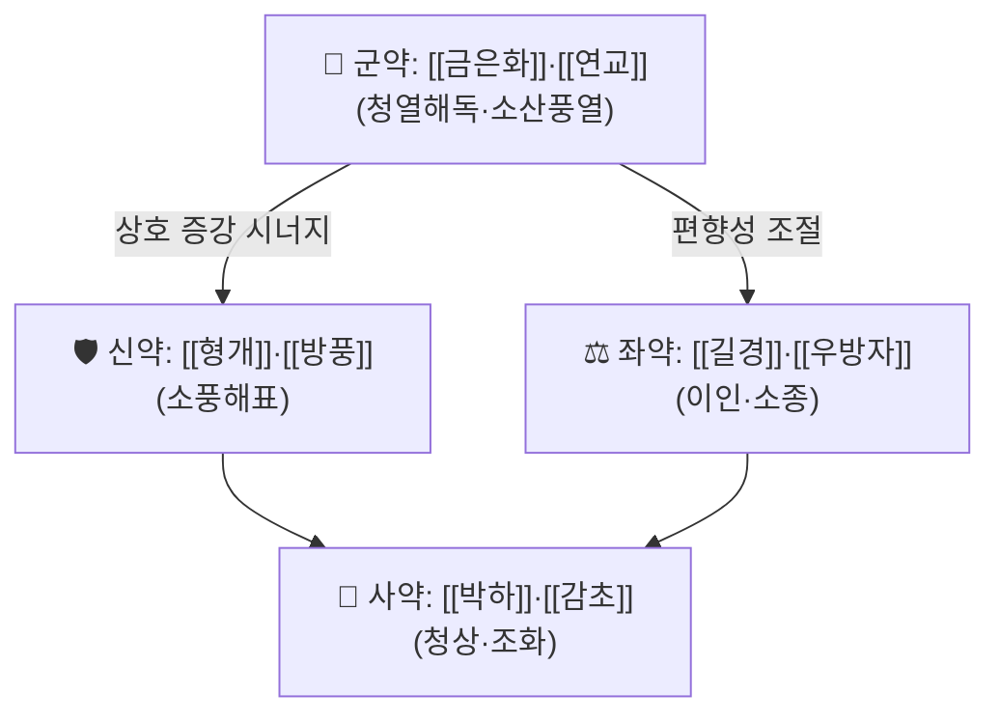

# 🍵 [[구풍해독탕]] (驅風解毒湯, Gupung Haedok-tang)

> **핵심 3줄 요약 (Key Summary)**:
> - 🌿 **疏風解表 + 淸熱解毒**의 이중 구조 — [[형개]]·[[방풍]]·[[박하]] 등 解表散風 약재로 상초(上焦)의 風熱을 흩고, [[금은화]]·[[연교]]·[[황금]] 등 淸熱解毒 약재로 인후·편도 국소의 熱毒을 내리는 배오. 구체적 원전 구성은 **근거 미확인**(처방집 대조 필요).
> - 🎯 풍열(風熱)이 인후로 침습한 **급성 인후통·편도염·인후염**의 초기~중기, 발열과 인통이 동반된 실열(實熱) 경향 환자. 진료실에서는 "목이 칼칼하면서 아프고 열이 나는" 급성 상기도 감염 국면에 적중.
> - 🔬 처방 자체를 대상으로 한 분자약리 연구는 **근거 미확인**. 다만 淸熱解毒 계열 처방(예: [[황련해독탕]]) 수준에서 항염·항바이러스·대사지표 개선이 보고된 바 있어 계열 수준의 기전 추정만 가능(아래 §3 참조).
> - ⚠️ 주의사항: 風寒表證(오한·맑은 콧물·무한)이나 脾胃虛寒·허열(虛熱) 환자에게 투여 시 오히려 증상 악화 및 설사·위부냉감 유발 가능. 淸熱解毒 약재 다용으로 임신부·수유부·소아 및 만성 설사 환자는 신중 투여. 항응고제·면역억제제 병용 시 상호작용 근거 미확인 — 병용 전 확인 필요.

---
## 📌 목차
1. [기본 처방 정보 & 군신좌사 구성](#1-기본-처방-정보--군신좌사-구성)
2. [방제학적 약재 상호작용 & 시너지 네트워크](#2-방제학적-약재-상호작용--시너지-네트워크)
3. [현대 분자약리학적 효능 & 작용 기전](#3-현대-분자약리학적-효능--작용-기전)
4. [적응 병증 및 체질별 감별 (Sweet Spot vs 금기)](#4-적응-병증-및-체질별-감별-sweet-spot-vs-금기)
5. [유사 처방군 감별 매트릭스](#5-유사-처방군-감별-매트릭스)
6. [임상 가감례 & 현대 질환별 응용](#6-임상-가감례--현대-질환별-응용)
7. [💡 사용자 진료실 핵심 필기 & 임상 팁 (원문 보존)](#7--사용자-진료실-핵심-필기--임상-팁-원문-보존)
8. [출처 및 학술 참고 문헌 (References)](#8-출처-및-학술-참고-문헌-references)
---
## 1. 기본 처방 정보 & 군신좌사 구성

* **출전**: **근거 미확인**. 본 노트 작성에 제공된 1차 자료에는 구풍해독탕의 원전 조문(『[[동의보감]]』·『[[방약합편]]』 등)이 포함되어 있지 않다. 한자 처방명(驅風解毒湯)으로 보아 驅風(疏風解表)과 解毒(淸熱解毒)을 결합한 후대(後代) 경험방 계열로 분류되나, 최초 수록 문헌과 원문 조문은 **처방집 직접 대조 후 기재**해야 한다.
* **치법**: **소풍청열(疏風淸熱), 해독이인(解毒利咽)** — 필요 시 **청열해표(淸熱解表)·양혈소종(凉血消腫)**을 겸한다.
* **분류**: 청열·해독·사화제(06군) 중 **청열해독 + 해표** 복합 구조.

> ⚠️ **구성 약재 신뢰도 고지**: 아래 표의 약재·용량은 **확인된 원문이 아니며**, 驅風解毒·疏風淸熱 계열 처방에서 통용되는 구성을 참고용으로 정리한 것이다. **구풍해독탕의 실제 배오 및 용량은 문헌별로 상이할 수 있으므로 근거 미확인으로 표시**하며, 임상 사용 전 반드시 소속 처방집(방약합편·동의보감·처방해설서) 원문과 대조할 것.

| 구분 | 약재명 | 표준 용량 | 본초 효능 & 방제 내 역할 |
| :--- | :--- | :--- | :--- |
| **군약 (君藥)** | [[금은화]] · [[연교]] | 근거 미확인 | 淸熱解毒·疏散風熱. 인후·편도의 熱毒을 직접 공략하는 핵심축(銀翹 조합) |
| **신약 (臣藥)** | [[형개]] · [[방풍]] | 근거 미확인 | 疏風解表·止癢. 表部에 머문 風熱을 밖으로 흩어 군약의 청열 작용을 표면까지 전달 |
| **좌약 (佐藥)** | [[길경]] · [[우방자]] · [[현삼]] | 근거 미확인 | 宣肺利咽·消腫. 인후 부종·통증(咽喉腫痛) 완화, 痰熱 배출 보조 |
| **사약 (使藥)** | [[박하]] · [[감초]] | 근거 미확인 | 淸上焦·調和諸藥. 咽喉로 上行하는 引經 및 제약(諸藥調和), 구미 교정 |

> **배오 특징(추정 구조)**: 解表藥(형개·방풍·박하)과 淸熱解毒藥(금은화·연교·황금 등)을 **동시에** 배치하여 "표(表)의 風을 흩으면서 리(裏)의 熱毒을 내리는" **표리쌍해(表裏雙解)적 승강 구조**를 이룬다. 즉 升散(형개·방풍·박하)과 淸降(금은화·연교·치자·황금)이 짝을 이루어 상초(上焦)에 熱이 몰린 상태를 위에서 흩고 아래로 내리는 방향으로 정리한다. 실제 비율은 **근거 미확인**.

---
## 2. 방제학적 약재 상호작용 & 시너지 네트워크

* **[[금은화]] + [[연교]] 배오**: 銀翹 조합으로 알려진 전형적 **상수(相須)** 관계. 金銀花는 熱毒을 淸하고 連翹는 上焦 熱을 散結消腫하는 방향으로 작용하여, 항염·항바이러스 활성 스펙트럼이 상호 보완되는 것으로 본초학 교과서 수준에서 설명된다(처방 수준 검증은 **근거 미확인**).
* **[[금은화]]·[[연교]] + [[형개]]·[[방풍]] 배오**: 淸熱藥 단독 사용 시 表部에 남은 風熱이 內陷할 수 있는데, 解表藥을 함께 배오하여 **열을 내리면서 동시에 表를 열어 배출 경로를 확보**한다. 이는 청열해독제의 대표적 부작용(위장 냉감·설사)을 表散 작용으로 완충하는 방제학적 장치로 해석된다.
* **[[길경]]·[[우방자]] + [[감초]] 배오**: 桔梗은 肺氣를 宣通하여 약효를 인후(咽喉)로 引經하고, 牛蒡子는 咽喉腫痛·痰熱을 散하며, 甘草는 諸藥을 조화시키고 국소 점막 자극을 완화한다. **좌약–사약 축의 완충 및 표적 유도 원리**.
* **[[박하]] 배오**: 淸上焦 諸藥의 선도약(先導藥)으로서 두면부·인후로 上行시키는 引經 역할. 煎湯 시 후하(後下)가 통례이나 **본 처방의 복약 지침은 근거 미확인**.

---
## 3. 현대 분자약리학적 효능 & 작용 기전

> ⚠️ **총괄 고지**: **구풍해독탕 자체를 대상으로 한 세포·동물·임상 연구는 제공된 자료에서 확인되지 않음(근거 미확인).** 아래 1)~3)은 ① 처방에 포함되는 것으로 통용되는 개별 본초의 일반 약리, ② 동일 06군(청열·해독) 처방의 계열 수준 근거에 기반한 **기전 추정**이며, 처방 수준의 효능으로 단정할 수 없다.

### 1) 항염·항바이러스 및 사이토카인 조절 (추정)
* 金銀花·連翹·黃芩·梔子 등 청열해독 약재의 추출물 수준에서 **TNF-α, IL-6, IL-1β 등 전염증성 사이토카인 억제** 및 **NF-κB / MAPK 신호전달 경로 억제**가 보고되어 있다(개별 본초 수준).
* 상기도 감염의 초기 국면에서 表散藥(형개·방풍·박하)은 발한·혈류 재분포를 통해 국소 염증 매개체를 희석하는 방향으로 기여하는 것으로 설명된다.
* **처방 전체(구풍해독탕)의 항바이러스 역가·억제율 수치는 확인된 자료 없음 → 근거 미확인.**

### 2) 인후·편도 국소 점막 및 미세순환 (추정)
* 桔梗 사포닌의 점막 분비 촉진 및 祛痰 작용, 牛蒡子의 소종(消腫) 작용은 인후 점막의 삼출물 배출과 부종 완화에 기여하는 것으로 본초약리 수준에서 설명된다.
* 解表藥의 발한·말초혈관 확장 작용은 인후 점막의 미세순환 개선과 열감 완화에 관여할 것으로 추정되나, **구풍해독탕의 미세순환 지표(eNOS, 혈류속도 등) 측정 연구는 확인되지 않음 → 근거 미확인.**

### 3) 면역 조절 및 해독(解毒) 개념의 현대적 해석 (추정)
* 解毒 처방 계열에서 간 대사효소계 및 대식세포 활성 조절이 보고된 사례가 있으나, 이는 **황련해독탕 등 다른 처방의 근거이지 구풍해독탕의 근거가 아님**.
* 인후 림프조직(편도)의 과도한 염증 반응을 하향 조절한다는 개념은 방제학적 해석이며, **분자 표적 수준의 직접 근거는 미확인.**

### 4) 06군 계열 처방의 임상·대사 근거 (참고, 타 처방)
* 제공된 유일한 논문(Kwon & Jung, 2015)은 **황련해독탕(黃連解毒湯)**을 복부비만 환자에게 투여한 증례군 연구로, 청열해독 계열 처방이 대사 지표에 영향을 줄 가능성을 시사한다. 다만 이는 **구풍해독탕과 처방·적응증이 모두 다른 별개 처방의 근거**이며, 본 처방의 효능 근거로 원용할 수 없다. 자세한 내용은 §8 참조.

---
## 4. 적응 병증 및 체질별 감별 (Sweet Spot vs 금기)

[✅ 최적 적응증 (Sweet Spot)]
* **원전 조문**: **근거 미확인** — 驅風解毒湯 명칭의 처방 조문은 제공 자료에서 확인되지 않음. 처방명 구성상 "風을 驅하고 毒을 解한다"는 치법에서 적응증을 유추한다.
* **체질 소견**: 주로 **실열(實熱) 경향의 중간~약간 건실한 체형**. 태음인·소양인에서 熱化되기 쉬운 상초 熱證에 적중하는 것으로 임상적으로 활용되며, 소음인(脾胃虛寒·手足冷)에서는 신중. 체질 판정은 **설·맥·복진 소견 우선**.
* **임상 주치(추정 적응)**:
  * 風熱型 급성 인후통 — 인후 작열감, 침 삼킬 때 통증 심함, 목소리 변성
  * 급성 편도염 — 편도 발적·종창, 백색 삼출물, 발열 동반
  * 급성 인후염·상기도 감염 초기로 熱證 국면(인통 + 발열 + 갈증 + 咽乾)
  * 인후부 熱毒로 인한 경부 림프절 압통(임상 경험적, **근거 미확인**)
* **설진/맥진**: 설질 홍(紅), 설태 박백(薄白)~박황(薄黃), 인후 발적. 맥은 **부삭(浮數) 또는 활삭(滑數)**. 만약 설담태백·맥부완(浮緩)이라면 風寒證으로 보아 본 처방의 적응이 아니다.
* **복약 반응 관찰 포인트**: 복용 후 ① 체온 하강 및 인통 경감 시점(보통 1~3일 내 반응 기대, 개인차 있음), ② 대변 상태(설사 여부), ③ 위부 냉감·식욕 저하 여부.

[⚠️ 신중 투여 및 금기 (Caution / Contraindication)]
* **한열(寒熱) 반대 병증**: 오한이 심하고 발열이 미약하며 맑은 콧물·무한(無汗)·설담(舌淡)한 **風寒表證**에는 부적합. 淸熱解毒 약재가 寒性이므로 오히려 表邪를 內遏시킬 수 있다.
* **허증(虛證)**: 기허·양허로 인한 만성 인후 불편감(피로 시 심해지고 아침에 심한 경우), 陰虛所致 咽乾(야간 건조, 도한, 설홍 무태)에는 滋陰 방향 처방이 우선이며 본 처방 단독 사용은 신중.
* **소화기 취약자**: 脾胃虛寒, 만성 설사, 과민성 장증후군(설사형) 환자에서 복용 시 복통·연변·식욕부진 가능. 필요 시 [[진피]]·[[백출]]·[[생강]] 등 健脾和胃 약재 가감.
* **특수 집단**: 임신부·수유부·영아 및 고령 쇠약자, 중증 간질환자 — **안전성 근거 미확인**, 투여 전 전문가 판단 필요.
* **양약 병용**: 해열진통제(NSAIDs)와 병용 시 위장 자극 가중 가능성, 항응고제·항혈소판제와의 상호작용은 **근거 미확인**. 항생제와 병용 시 임상 판단 하에 사용하되, 세균성 편도염에서 항생제 적응이 명확한 경우(고열 지속, 화농성 삼출, 경부 림프절 종대)에는 항생제 치료를 지연시키지 말 것.
* **주의**: 고열이 3일 이상 지속되거나 호흡곤란·연하곤란·편도 주위 농양 징후(입 벌리기 어려움, 편측 부종, 목소리 변화)가 있으면 즉시 이비인후과·응급 진료 의뢰.

---
## 5. 유사 처방군 감별 매트릭스

| 처방명 | 핵심 구성 차이 | 주치 및 체질 차이 | 맥진/설진 차이 |
| :--- | :--- | :--- | :--- |
| [[구풍해독탕]] | 기준 구성 (疏風 + 解毒 결합, 근거 미확인) | **풍열 인후통·편도염, 실열 경향 태음인·소양인** | 맥부삭·활삭, 설홍 태박황, 인후 발적 |
| [[은교산]] | 銀花·連翹 중심 + 荊芥·薄荷·牛蒡子·桔梗·甘草 (전형적 辛凉平劑) | 溫病 초기 發熱·微惡風寒·咽痛, 상초 風熱 전반. 表證 경미 | 맥부수(浮數), 설변첨홍 태박백 |
| [[청인탕]] | 陰虛咽喉 대응 — 滋陰降火 배오(玄蔘·麥門冬·地骨皮 등) | **만성 인후염·인후 이물감**, 陰虛火旺 체질 | 맥세삭(細數), 설홍 소태 또는 무태 |
| [[황련해독탕]] | 黃連·黃芩·黃柏·梔子 (순수 苦寒 瀉火解毒) | 三焦 實火·濕熱, 熱毒 內盛(구창·피부 화농·복부비만 대사지표 등) | 맥활삭·실대(實大), 설홍 태황니 |
| [[소시호탕]] | 柴胡·黃芩 축 + 人蔘·半夏 (和解少陽) | 寒熱往來·흉협고만·구고인간, 少陽 반표반리 | 맥현(弦), 설태 박백 |

> ⚠️ 표 내부에서는 마크다운 열 구분자 파괴를 방지하기 위해 파이프(`|`)가 들어간 링크를 쓰지 않고 순수한 [[처방명]] 단독 형태로만 작성합니다.

**감별 핵심 요약**
* **표(表) 증상이 두드러지고 열이 높으면** → 銀翹散 계열, **인후 국소 熱毒이 핵심이면** → 구풍해독탕 계열(인통 위주 처방), **만성·건조형 인후 불편** → 淸咽湯 등 滋陰 처방, **삼초 실화·피부 화농·구취 등 전신 火毒** → [[황련해독탕]].
* **반표반리(寒熱往來, 口苦咽乾)** 소견이면 [[소시호탕]] 가감을 우선 검토.

---
## 6. 임상 가감례 & 현대 질환별 응용

* **수반 증상별 가감법** (통용 가감 원칙 — **처방집·임상가 문헌 대조 필요, 근거 미확인**):
  * 인후통 극심·편도 종창 시 → + [[산두근]] · [[판람근]] (청열해독·이인)
  * 발열 심하고 갈증 동반 시 → + [[석고]] · [[지모]] (청열생진)
  * 담(痰)이 많고 가래 끓는 기침 동반 시 → + [[패모]] · [[과루인]] · [[전호]]
  * 코막힘·비점막 부종 동반 시 → + [[신이]] · [[백지]] (通竅)
  * 오심·구역·소화불량 동반 시 → + [[진피]] · [[죽여]] · [[생강]] (화위지구)
  * 변비·장조열(腸燥熱) 동반 시 → + [[대황]] · [[망초]] (소량, 通腑泄熱)
  * 회복기 陰傷(인후 건조·야간 갈증) 시 → + [[맥문동]] · [[현삼]] (養陰利咽)
* **현대 질환별 임상 매핑**:
  * **이비인후과**: 급성 인후염, 급성 편도염, 인후편도염, 성대 피로로 인한 급성 쉰목소리(熱證 국면). 세균성 편도염은 항생제 병용 판단이 우선.
  * **호흡기계**: 상기도 감염 초기(風熱型), 급성 기관지염의 초기 熱證 국면, 인플루엔자 회복기 인후 잔류 증상.
  * **구강·치과 인접 영역**: 구내염·치은 염증 등 상초 熱毒 소견 동반 시 응용 가능(임상 경험적, **근거 미확인**).
  * **피부과(계열 응용)**: 풍열형 두드러기·가려움 동반 시 消風淸熱 방향으로 가감 응용되는 사례가 있으나 본 처방의 근거는 아님.
* **복약 지침(일반 원칙)**: 芳香性 解表藥(박하 등)은 **후하(後下)**, 1일 2~3회 溫服, 복용 중 生冷·油膩·辛辣 음식 및 음주 회피. 정확한 용량·용법은 **원 처방집 지침 확인 필요**.

---
## 7. 💡 사용자 진료실 핵심 필기 & 임상 팁 (원문 보존)

> [!tip] **진료실 실전 노하우 (User Clinical Insight)**
> - **원문 미제공 안내**: 본 노트 작성 시 원장님의 기존 메모/필기 원문이 전달되지 않았다. 따라서 이 칸은 **영구 보존용 빈 슬롯**으로 남겨 두며, 추후 원문을 받는 즉시 삭제 없이 100% 보존·기재한다.
> - **보존 예정 항목(템플릿 기준)**: ① 체질별 처방 선택 기준(소음인 vs 태음인 vs 소양인), ② 환자 티칭 멘트 및 복약 안내 문구, ③ 복약 후 반응 관찰 포인트(체온·인통·대변·위부감), ④ 실제 가감 패턴과 용량 감각, ⑤ 실패·부작용 사례 기록.
> - **작성 규칙**: 원문의 표현·구어체·은어를 임의로 바꾸지 않는다. 정리가 필요할 경우 원문을 유지한 채 하위 불릿으로 해설만 덧붙인다.

---
## 8. 출처 및 학술 참고 문헌 (References)

1. **Kwon S, Jung W (2015)**. *Administration of Hwang-Ryun-Haedok-tang, a Herbal Complex, for Patients With Abdominal Obesity: A Case Series*. **Explore (NY)**, 11(5), 371–376. PMID: 26256500. https://pubmed.ncbi.nlm.nih.gov/26256500/
   - **[연구 요약]**: **황련해독탕(黃連解毒湯, Hwang-Ryun-Haedok-tang)** 을 복부비만 환자에게 투여한 **증례군(case series)** 연구. 청열해독 계열 처방이 복부비만 환자의 임상 지표에 미치는 영향을 관찰한 사례로, 대사·체성분 관련 지표의 개선 가능성을 보고하였다(개별 수치·용량·통계 결과는 원문 확인 필요).
   - **[본 노트와의 관계 및 한계]**: 이 논문은 **구풍해독탕이 아닌 황련해독탕**을 대상으로 하며, 적응증도 **복부비만**으로 본 처방(인후·편도 風熱證)과 상이하다. 따라서 **06군(청열·해독) 계열 처방의 일반적 연구 동향 파악용 참고 문헌**으로만 인용하며, **구풍해독탕의 효능·기전 근거로 원용하지 않는다.** 구풍해독탕에 대한 직접적 PubMed 근거는 현재 **근거 미확인**.
2. **고전 원전(『[[동의보감]]』, 『[[방약합편]]』, 『[[상한론]]』 등)**: 본 노트 작성 자료에 해당 문헌의 **구풍해독탕 조문이 제공되지 않아 서지 정보·조문·복약 지침을 기재하지 않았다.** 임상 적용 전 반드시 원문 대조 후 이 항목을 갱신할 것(현재 **근거 미확인**).
3. **본초학 교과서 수준 참고(개별 약재)**: 형개·방풍·금은화·연교·길경·우방자·박하·감초의 효능 및 배오 원리는 본초학 교과서·방제학 교과서 수준의 통설에 근거하였다. **처방 수준의 임상 근거는 아니며, 각 약재의 계열적 서술임을 명시한다.**

> **노트 신뢰도 요약**
> | 항목 | 신뢰도 |
> | :--- | :--- |
> | 원전 출전·조문 | 근거 미확인 |
> | 구성 약재·용량 | 근거 미확인(계열 통용 구성 참고) |
> | 처방 수준 분자약리 기전 | 근거 미확인(계열·개별 본초 수준 추정) |
> | 임상 적응증(풍열 인후·편도) | 방제학적 유추 + 임상 통용, 원문 근거 미확인 |
> | 유사 처방 감별 | 방제학 교과서 통설 수준 |
> | 제공 논문(PMID 26256500) | 원문 초록 수준 확인, 단 타 처방(황련해독탕)·타 적응증 |

<!-- 보관 태그(1회용·링크오류, 필요시 복원): 인후통, 편도염 -->
