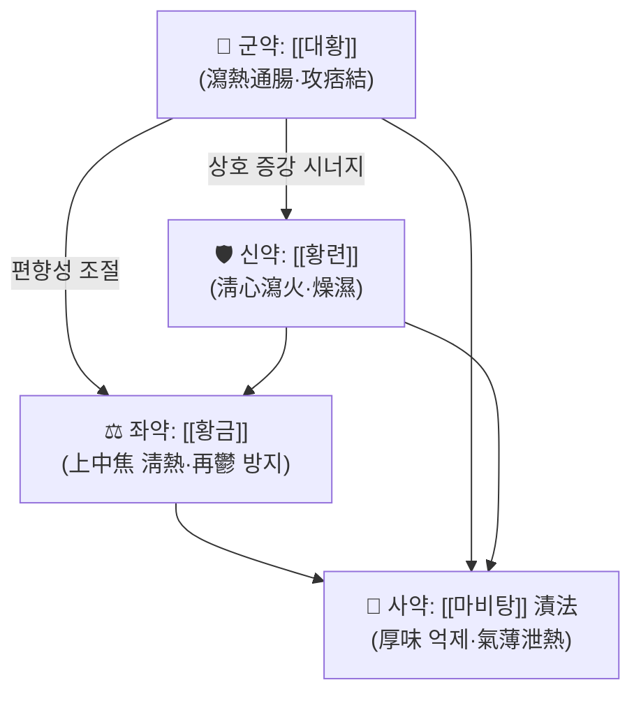

# 🍵 [[대황황련사심탕]] (大黃黃連瀉心湯, Dahuang Huanglian Xiexin Tang)

> **핵심 3줄 요약 (Key Summary)**:
> - 🌿 **모체/기원 처방 + 가감 핵심 약재 배오 구조**: 『[[상한론]]』의 瀉心湯類(사심탕류) 가운데 가장 苦寒·峻烈한 축에 속하는 처방으로, **[[대황]] + [[황련]]**의 2미 구성을 기본으로 하며(개금(開金) 계열 판본·후대 방서에서는 **[[황금]]**을 더한 3미 구성, 즉 [[삼황사심탕]] 형태로 통용) 오심(五心)의 열을 直折하는 구조이다. [[반하사심탕]]·[[생강사심탕]]·[[감초사심탕]]이 甘味·辛味 약재로 寒熱錯雜을 조화시키는 것과 달리, 본방은 **감초·인삼·대조 등 甘緩之品을 전혀 쓰지 않고 苦寒直折(고한직절)** 만으로 心下痞를 공격하는 순수 攻下·瀉火 배오라는 점이 방제학적 정체성이다.
> - 🎯 **임상 최적 적응증**: 心下痞(심하비) — 명치 부위가 막힌 듯 답답하나 **按之濡(안지유, 눌러보면 물렁물렁함)** 하고, **其脈關上浮(기맥관상부)** 하는 실열(實熱) 방증. 얼굴이 붉고 번조(煩躁)·구고(口苦)·구갈, 변비 또는 변이 불결한 경향, 설홍태황(舌紅苔黃), 소변 황적(黃赤)한 **실열·양명열 결체(結滯) 체질**에서 적중률이 높다. 태음인·소양인 중 실열형, 근육이 단단하고 복벽 긴장도가 있는 편(마름/비만 무관, 腹證이 기준).
> - 🔬 **핵심 분자약리 기전**: (i) 장내 미생물 불균형(dysbiosis) 개선 — **IL-17 신호경로** 조절 및 **GBP5/NLRP3 신호 억제 → 결장 상피세포 파이롭토시스(pyroptosis) 억제**(PMID: 38688354, 40513920) (ii) 지방세포 분화 조절 및 지질 분해 촉진 — **소포체 스트레스(ER stress) 억제** 경유(PMID: 39002709) (iii) 화학성분·전통용도·임상응용 총설에서 항염·항균·대사개선 활성 정리(PMID: 40962155).
> - ⚠️ 주의사항: 대황의 峻下 작용과 황련·황금의 大苦大寒으로 인해 **脾胃虛寒證(위장 허냉, 연변·냉복통·식욕부진)**, **음허(陰虛)·기허(氣虛)로 인한 痞滿**, 孕婦·수유부, 월경기, 소아·노약자, 허약 체질에는 신중 투여 또는 금기. 장기 연용 시 전해질 이상·설사·복통, 만성 변비 목적의 무분별한 상용은 금물이며, 항응고제·혈당강하제·일부 항생제와의 병용 시 반응 관찰이 필요하다.
---
## 📌 목차
1. [기본 처방 정보 & 군신좌사 구성](#1-기본-처방-정보--군신좌사-구성)
2. [방제학적 약재 상호작용 & 시너지 네트워크](#2-방제학적-약재-상호작용--시너지-네트워크)
3. [현대 분자약리학적 효능 & 작용 기전](#3-현대-분자약리학적-효능--작용-기전)
4. [적응 병증 및 체질별 감별 (Sweet Spot vs 금기)](#4-적응-병증-및-체질별-감별-sweet-spot-vs-금기)
5. [유사 처방군 감별 매트릭스](#5-유사-처방군-감별-매트릭스)
6. [임상 가감례 & 현대 질환별 응용](#6-임상-가감례--현대-질환별-응용)
7. [💡 사용자 진료실 핵심 필기 & 임상 팁 (원문 보존)](#7--사용자-진료실-핵심-필기--임상-팁-원문-보존)
8. [출처 및 학술 참고 문헌 (References)](#8-출처-및-학술-참고-문헌-references)
---
## 1. 기본 처방 정보 & 군신좌사 구성

* **출전**: 장중경(張仲景) 『[[상한론]]』 瀉心湯類 조문. 후대 『[[동의보감]]』 및 각 방서(方書)에도 收載되어 임상 활용되었으며, 『[[금궤요략]]』 계통의 [[삼황사심탕]](三黃瀉心湯)과 자주 혼용·병기된다.
* **치법**: **사열공하(瀉熱攻下) · 청심사화(淸心瀉火) · 소비산결(消痞散結)** — 苦寒直折로 心下의 熱結·氣結을 직접 泄하는 치법.
* **방제 유형**: 瀉心湯類 중 寒劑(實熱·實痞) 계열. 甘緩·辛開之品이 없는 **순수 苦寒 공격형** 방제.

| 구분 | 약재명 | 표준 용량 (관용) | 본초 효능 & 방제 내 역할 |
| :--- | :--- | :--- | :--- |
| **군약 (君藥)** | [[대황]] | 4~8g (원전 二兩) | 瀉熱通腸·攻積導滯·凉血解毒. 心下의 熱結을 大腸으로 引而下之하는 方의 主力. 關上浮脈·按之濡의 心痞를 通泄하는 핵심. |
| **신약 (臣藥)** | [[황련]] | 4~8g (원전 一兩) | 淸心瀉火·燥濕解毒. 心火(心中懊憹·心煩)를 直折하고 大黃의 下泄을 上焦 鬱熱 방향으로 連結. 苦寒의 主軸. |
| **좌약 (佐藥)** | [[황금]] (3미 구성 시) | 4~8g | 淸熱燥濕·瀉火解毒. 上焦 肺熱·少陽 鬱熱을 淸泄하여 大黃·黃連의 瀉下 편향을 上中焦까지 확장, 熱의 再鬱을 방지. 2미 원방(原方)에서는 佐藥 개념이 大黃·黃連 상호 작용에 내재한다. |
| **사약 (使藥)** | [[마비탕]](麻沸湯, 끓는 물) | 漬之須臾 | 使藥 개념의 煎法. 원전은 **탕약을 달이지 않고 끓는 물에 잠깐 漬(침지)하여 즙을 짜서 복용**하도록 하여, 苦寒의 厚味(설사 유발 성분)를 억제하고 **氣薄한 泄熱之氣**만 취하는 服用法을 使藥役으로 삼는다. (조문·복약 지침의 세부 표현은 판본에 따라 차이가 있음.) |

> **배오 특징**: 감초·인삼·대조 등 **甘味의 완충제가 전무**하다는 것이 최대 특징이다. 大黃(降·下) + 黃連·黃芩(苦寒·淸·降)으로 전 방제가 **純降·純寒·純泄**의 방향으로 정렬되어 있어, "虛痞를 泄하면 氣가 陷한다"는 위험과 "實痞를 補하면 痞가 增한다"는 위험이 한 끗 차이로 갈린다. 따라서 본방의 운용은 약재 가감이 아니라 **腹證(按之濡 여부)과 脈象(關上浮) 감별**이 처방 성패를 결정한다. 원전 煎法인 麻沸湯 漬法은 "탕액을 오래 끓여 攻下之力을 强하게 하지 않고, 熱만 泄한다"는 設計로, 근현대 임상에서는 心下痞·實熱이 뚜렷하면 通常 煎湯(전탕)하되 大黃은 後下(후하)하여 瀉下力을 조절하는 방식이 흔히 쓰인다(관용이며 논문 근거 아님).

---
## 2. 방제학적 약재 상호작용 & 시너지 네트워크

* **[[대황]] + [[황련]] 배오 (君 + 臣)**:
  상호 **상사(相使)** 관계. 大黃은 味厚·性走而不守하여 積滯를 通하고, 黃連은 味厚·性守하여 心火를 淸한다. 두 약재 모두 苦寒이지만 **작용 부위(대황=中下焦 腸胃, 황련=上焦 心·中焦 胃)가 달라**, 배합 시 上焦 心熱 → 中焦 胃熱 → 下焦 腸結까지 **열의 배출 통로를 縱으로 관통**하는 시너지가 형성된다. 이것이 單味 大黃이나 單味 黃連으로는 얻을 수 없는 "痞를 泄하면서 心煩을 함께 治"하는 본방의 기본 골격이다.
* **[[황련]] + [[황금]] 배오 (臣 + 佐)**:
  상호 **상수(相須)** 관계로 苦寒淸熱之力을 倍加한다. 黃連이 心·胃를, 黃芩이 肺·膽(上焦 表部)을 담당하여 **三焦의 火를 分擔 청소**하는 구조를 만든다. 이 배합이 추가되면 방제는 [[삼황사심탕]]과 사실상 동일해지며, 上焦 熱象(인후통·안충혈·두면부 熱感)이 동반된 心下痞에 운용 폭이 넓어진다.
* **[[대황]] + [[마비탕]] 漬法 배오 (君 + 使)**:
  가장 독특한 "약재-조제법" 배오. 大黃의 瀉下 成分(안트라키논 배당체 등, 개별 성분 규명은 인용 논문 범위 밖)을 **고온 장시간 추출로 과도하게 끌어내지 않음**으로써 攻下力을 눌러 泄熱만 남기려는 설계로 해석된다. 즉 본방의 使藥은 약재가 아니라 **용매와 시간**이다.
* **부작용 완충 구조의 부재**: 甘緩之品이 없으므로 胃氣를 保護하는 완충막이 없다. 이는 곧 **"효력 = 부작용"의 이중성**을 의미하며, 감별 진단(實熱 vs 虛寒)이 곧 안전성 관리의 전부가 된다.

---
## 3. 현대 분자약리학적 효능 & 작용 기전

> 아래 기전은 **제공된 4편의 논문 제목·주제 범위 내**에서 서술하며, 구체적 수치(억제율·혈중 농도·유의수준 등)는 초록 원문이 제공되지 않아 **근거 미확인**으로 표기한다.

### 1) 핵심 분자 표적 및 면역/항염증 조절 — IL-17 · NLRP3 파이롭토시스 축
* **IL-17 신호경로 조절을 통한 장내 불균형(dysbiosis) 개선**: 네트워크 약리학 분석 + 실험 검증을 결합한 연구에서, 大黃黃連瀉心湯이 **IL-17 신호경로를 조절**하여 장내 미생물 불균형을 완화하는 기전이 제시되었다 (Ren T, Feng H, 2024; PMID: 38688354). IL-17은 점막 염증과 장벽 손상의 핵심 사이토카인 축으로, 이 경로 조절은 "心下痞 = 胃腸 氣機阻滯"라는 전통 주치와 현대적 접점을 만든다. (구체적 표적 유전자 목록·발현 변화 배수는 **근거 미확인**.)
* **GBP5/NLRP3 신호 억제 → 결장 상피세포 파이롭토시스(pyroptosis) 억제**: 대황황련 계열 처방이 **GBP5/NLRP3 신호경로를 억제**하여 결장 상피세포의 파이롭토시스성 세포사를 줄임으로써 dysbiosis를 완화한다는 실험적 근거가 보고되었다 (Ren T, Yin Y, 2025; PMID: 40513920). NLRP3 인플라마좀 억제는 苦寒藥의 전형적 항염 기전과 맥락을 같이하며, 대황의 안트라키논류·황련의 베르베린 등이 후보 성분으로 거론되나 **본 노트에서 성분-표적 대응의 확정 근거는 미확인**이다.
* **항염증·항균 활성 총설적 정리**: 화학성분·약리효과·전통용도·현대 임상응용을 종합한 리뷰에서 본 처방 계열의 항염·항균·대사조절 활성이 정리되었다 (Chen N, Tian R, 2025; PMID: 40962155).

### 2) 대사·순환 및 지질 대사 개선 — 소포체 스트레스(ER stress) 축
* **지방세포 분화 조절 + 지질 분해 촉진**: 비만 모델에서 大黃黃連瀉心湯이 **소포체 스트레스(ER stress) 억제를 매개로 지방세포 분화(adipocyte differentiation)를 조절하고 지질 분해(lipid degradation)를 촉진**하여 비만을 개선한다는 기전이 보고되었다 (Hao L, Li M, 2024; PMID: 39002709).
* 이 기전은 본방의 전통 치법(瀉熱·攻下)이 단순한 腸管 刺激이 아니라 **지질대사·내분비 축에 대한 전신적 조절**로 확장될 수 있음을 시사한다. 다만 인체 대상 임상 지표(체중·허리둘레·지질 프로파일 등)에 대한 구체적 수치는 **근거 미확인**이며, 동물/세포 수준 결과의 인체 외삽에는 주의가 필요하다.
* 혈관·미세순환 관련 기전(eNOS 등)에 대한 직접 근거는 **제공 논문 범위에서 확인되지 않음(근거 미확인)**.

### 3) 장내 미생물총-숙주 상호작용 (Gut–Immune Axis)
* 위 세 기전(IL-17 경로, NLRP3 파이롭토시스, 대사 조절)은 모두 **"장내 미생물총 ↔ 장 상피 장벽 ↔ 전신 염증·대사"** 라는 동일 축 위에 놓여 있다. 즉 본방의 현대적 작용상은 **①미생물 조성 교정 → ②상피 파이롭토시스 억제로 장벽 보호 → ③IL-17 매개 염증 감소 → ④전신 대사(지질) 개선**이라는 연쇄로 요약될 수 있다(각 단계의 인과 연쇄를 단일 논문에서 직접 검증한 것은 아니므로 **통합 해석은 근거 미확인 부분 포함**).

---
## 4. 적응 병증 및 체질별 감별 (Sweet Spot vs 금기)

### [✅ 최적 적응증 (Sweet Spot)]

* **원전 조문 핵심**: 『[[상한론]]』에서 **"心下痞, 按之濡, 其脈關上浮者"** 를 본방의 主治로 제시한다. 또한 表證이 남아 있는 상태에서 痞를 攻하면 안 되며, **"當先解表, 表解乃可攻痞"** 라는 先表後攻의 원칙이 함께 제시된다. 附子瀉心湯 조문에서는 心下痞 + 惡寒汗出(양허) 시 附子를 加함이 제시되어, **본방이 純實熱 專用方**임을 傍證한다. (조문 번호와 판본별 자구 차이는 존재하므로 원문 대조 권장.)
* **체질 소견**:
  * **소양인 실열형**: 얼굴 홍조, 성격 급함, 번조·불면 경향, 구고·구취, 변비 경향. 본방의 최우선 적중 체질.
  * **태음인 실열·담열형**: 체격이 건실하거나 비만 경향이면서 복부 긴장도가 있고 舌苔가 黃厚한 경우. (비만 개선 기전 논문 PMID: 39002709와 임상적으로 연결되는 지점.)
  * **소음인**: 원칙적으로 **부적합**. 苦寒峻下는 少陰人의 脾胃虛寒을 악화시킨다.
  * 피부 성상: 유분·홍조·여드름성, 안면 熱感.
* **임상 주치**: 명치 부위 痞悶感(막힘·답답함), 心煩·懊憹(가슴 속 답답하고 속이 쓰린 느낌), 口苦·口乾, 頭部 熱感·두통, 변비 또는 불쾌한 배변, 口內炎·잇몸 붓기, 안충혈, 피부 化膿性 炎症, 소변 黃赤.
* **복진(腹診)**: **心下痞 + 按之濡(누르면 부드럽고 저항·압통이 심하지 않음)**. 단, 心下가 단단하고 압통이 극심하면 大柴胡湯·結胸 類와 감별이 필요하다.
* **설진/맥진**: 설질 홍(紅)·설태 황(黃) 또는 황후(黃厚)·황조(黃燥). 맥은 **관상부(關上) 부(浮)** 또는 활삭(滑數)·실(實) 계열. 맥이 침세(沈細)·지완(遲緩)하면 본방 금기 방향.

### [⚠️ 신중 투여 및 금기 (Caution / Contraindication)]

* **허실(虛實) 반대 병증**: 脾胃虛寒(냉복통·연변·식욕부진·手足冷)에 본방을 투여하면 설사·복통·기력저하가 악화된다. 虛痞(기허·음허로 인한 痞滿)에 攻下하면 氣陷·탈수 위험.
* **한열(寒熱) 반대 병증**: 寒性 心下痞(찬 것을 싫어하고 得溫則快)에는 금기. 이 경우 [[이중탕]]·[[이진탕]]·[[향사육군자탕]] 계열이 적합.
* **금기 환자군**:
  * 孕婦·수유부, 월경기 여성(대황의 下血·자궁 흥분 작용 우려, 세부 근거는 문헌별 차이).
  * 소아·고령자·쇠약자, 만성 소화기 질환자(과민성장증후군 설사형, 궤양성 대장염 급성기 등).
  * 탈수·전해질 이상·신기능 저하 환자.
* **복약 반응 및 부작용 주의점**:
  * 설사·복명·복통(대황 峻下), 胃痛·속쓰림(황련·황금 大苦大寒), 미각 이상, 식욕저하.
  * 장기 연용 시 전해질(칼륨 등) 소실, 변비의 반동성 악화, 대장 흑색증(melanosis coli) 등이 일반적으로 보고되는 대황 장기복용 관련 소견(본 노트 인용 논문에서 직접 검증된 내용은 **근거 미확인**).
  * 임상에서는 **"증상 소실 시 즉시 中止"**, 3~7일 단기 투여를 원칙으로 하는 경우가 많다(관용적 지침).
* **양약·타 약물 병용 주의**: 항응고·항혈소판제(출혈 경향 가중 가능), 혈당강하제(저혈당), 이뇨제·강심배당체(전해질 이상 시 상호 영향), 위산억제제·일부 항생제(장내 균총 변화로 약효 변동 가능). 병용 시 환자 상태 관찰을 강화한다.

---
## 5. 유사 처방군 감별 매트릭스

| 처방명 | 핵심 구성 차이 | 주치 및 체질 차이 | 맥진/설진 차이 |
| :--- | :--- | :--- | :--- |
| [[대황황련사심탕]] | 기준 구성 (대황 + 황련, 3미 시 황금) | **實熱 心下痞, 按之濡, 心煩·변비. 소양인·태음인 실열형** | **관상부(關上) 부맥, 설홍태황후·건조** |
| [[삼황사심탕]] | 본방 + 황금 (사실상 동일 구성으로 운용) | 上中焦 熱象(인후통·안충혈·구내염)을 동반한 心下痞 | 설홍태황, 맥활삭·부삭 |
| [[반하사심탕]] | 본방 계열 + 반하·건강·인삼·대조·감초 (辛開·苦降·甘補) | **寒熱錯雜 痞證**. 嘔逆·장명·설사·식욕부진 동반. 위장 허약자·소음인·노인 | 설태 白黃 混在(번잡), 맥현·완, 心下 痞硬·압통 |
| [[생강사심탕]] | 본방 계열 + 생강·반하·인삼·대조·감초 (乾薑 代 生薑) | 水氣와 食滯가 섞인 痞. 애역(噯氣, 트림)·구취·噁心 | 설태 白膩·후니, 心下 痞硬 |
| [[감초사심탕]] | 본방 계열 + 감초·인삼·대조·건강 (대황 없음) | **虛痞**. 설사·장명·기핍(氣乏), 中氣虛. 허약자·만성 소화불량 | 설담(淡)·태백, 맥허완·결대(結代) |
| [[부자사심탕]] | 본방 + 부자 (또는 三黃 + 附子) | 邪熱結痞 + **惡寒汗出(陽虛)** 의 寒熱 겸증 | 설 紅하면서도 윤택, 맥 浮數中 重按則無力 |
| [[황련탕]] | 황련 단미 중심 (황금·대황 없음) | 心火 항진(번조·불면·구설생창), 痞·변비 없음 | 설홍 첨단(舌尖), 맥 數 |

> ⚠️ 표 내부에서는 마크다운 열 구분자 파괴를 방지하기 위해 파이프(`|`)가 들어간 링크를 쓰지 않고 순수한 [[처방명]] 단독 형태로만 작성합니다.

---
## 6. 임상 가감례 & 현대 질환별 응용

* **수반 증상별 가감법 (고전·방제학 관용 지식, 특정 논문 검증 아님)**:
  * **便祕 심하고 腹滿痛 동반 시** → + [[망초]](芒硝) 또는 [[지실]]·[[후박]] (조위승기탕·대승기탕 방향으로 확장)
  * **心下痞 + 惡寒汗出(陽虛 兼)** → + [[부자]] ([[부자사심탕]] 구성)
  * **嘔逆·噁心·장명(腸鳴)·설사 동반 시** → + [[반하]]·[[건강]]·[[인삼]]·[[대조]]·[[감초]] ([[반하사심탕]] 구성, 본방의 峻烈함을 甘緩으로 완충)
  * **트림·애역(噯氣) 심한 경우** → + [[생강]]·[[반하]] ([[생강사심탕]] 방향)
  * **咽喉痛·口內炎·안충혈 등 上部 熱象 동반 시** → + [[황금]]·[[치자]]·[[연교]] ([[황련해독탕]]·[[양격산]] 방향)
  * **피부 화농·여드름·모낭염 등 熱毒 兼** → + [[금은화]]·[[연교]]·[[조각자]] (청열해독 방향)
  * **脾胃가 약하거나 노약자·허약자** → 감초·대조·생강 등 甘緩之品을 加하거나, 아예 [[반하사심탕]]·[[감초사심탕]]으로 전환. **원방 그대로의 사용은 피한다.**
* **현대 질환별 임상 매핑 (증후 기준 매핑이며, 인용 논문의 직접 임상 검증 결과는 아래 표시된 범위 외에는 근거 미확인)**:
  * **소화기계**: 급·만성 위염, 역류성 식도염(熱象 동반), 위·십이지장 궤양의 熱型, 과민성장증후군(변비형), 기능성 소화불량(實熱·痞滿型), 구내염·구취, 장내 dysbiosis 관련 증상(→ PMID: 38688354, 40513920의 연구 맥락).
  * **대사·내분비**: 비만, 대사증후군, 이상지질혈증의 實熱型 환자에서 보조적 운용 가능성(→ PMID: 39002709 동물·세포 수준 기전 근거. **인체 임상 근거는 미확인**).
  * **피부과**: 여드름, 화농성 피부염, 두면부 熱感·지루성 피부염(청열해독 목적).
  * **구강·이비인후과**: 구내염, 치은염, 인후통, 안면 홍조.
  * **정신·신경**: 불면·번조(心火型), 두통(熱型), 스트레스성 上部 熱感.
  * **기타**: 고혈압·뇌졸중 급성기의 實熱 兼證(변비·안면 홍조)에 通腑瀉熱 목적으로 응용된 예가 있으나, 본 노트 인용 논문 범위에서는 **근거 미확인**.

---
## 7. 💡 사용자 진료실 핵심 필기 & 임상 팁 (원문 보존)

> [!tip] **진료실 실전 노하우 (User Clinical Insight)**
> - 제공된 진료실 메모 원문이 없어 **본 섹션은 공란으로 유지**한다. 추후 원장님의 실전 필기(체질별 선택 기준, 환자 티칭 문구, 복약 반응 관찰 포인트, 특정 환자 증례 등)를 **삭제 없이 원문 그대로** 이 위치에 보존한다.
> - 원문이 입력되기 전까지는 아래 일반 원칙만 임시 기재한다(원장님 필기 확인 후 대체 예정).
>   - ① 처방 선택의 1차 관문은 **복진(按之濡 여부)**. 心下部가 딱딱하고 압통이 강하면 본방이 아니라 [[대시호탕]]·결흉 類를 먼저 검토.
>   - ② 2차 관문은 **대변 상태**. 변비·변이 불결하지 않으면 大黃 배량을 줄이거나 [[황련탕]]·[[반하사심탕]]으로 전환 검토.
>   - ③ 복약 후 **설사 횟수와 복통**을 반드시 확인. 1일 2회 이상 묽은 변 또는 복통 발생 시 즉시 감량·중지.
>   - ④ 환자 티칭 시 "찬 음식·생냉식·기름진 음식·음주는 피하시고, 증상이 사라지면 스스로 연장 복용하지 마십시오"를 반드시 안내.
>   - ⑤ 단기 처방 원칙(3~7일) 후 반응 재평가.

---
## 8. 출처 및 학술 참고 문헌 (References)

1. **Hao L, Li M (2024)**. *Dahuang Huanglian Xiexin Decoction ameliorates obesity via modulating adipocyte differentiation and lipid degradation through inhibiting endoplasmic reticulum stress*. **Prostaglandins Other Lipid Mediat**. PMID: 39002709.
   - 🔗 https://pubmed.ncbi.nlm.nih.gov/39002709/
   - **[연구 요약]**: 비만 모델에서 본 처방이 **소포체 스트레스(ER stress) 억제**를 매개로 **지방세포 분화 조절 및 지질 분해 촉진**을 유도하여 비만을 개선함을 보고. 세부 수치·용량·동물 모델 정보는 초록 원문 미제공으로 **근거 미확인**.
2. **Ren T, Feng H (2024)**. *Revealing the mechanism of Dahuang Huanglian Xiexin Decoction attenuates dysbiosis via IL-17 signaling pathway based on network pharmacology and experimental validation*. **J Ethnopharmacol**. PMID: 38688354.
   - 🔗 https://pubmed.ncbi.nlm.nih.gov/38688354/
   - **[연구 요약]**: 네트워크 약리학 + 실험 검증을 통해, 본 처방이 **IL-17 신호경로**를 조절하여 장내 미생물 불균형(dysbiosis)을 완화하는 기전을 제시. 표적 유전자·경로 목록의 세부 내용은 **근거 미확인**.
3. **Chen N, Tian R (2025)**. *A review of the traditional uses, chemical compounds, pharmacological effects and modern clinical applications of Dahuang Huanglian Xiexin Decoction*. **Fitoterapia**. PMID: 40962155.
   - 🔗 https://pubmed.ncbi.nlm.nih.gov/40962155/
   - **[연구 요약]**: 본 처방의 **전통 용도·화학성분·약리효과·현대 임상응용**을 총괄 정리한 리뷰. 성분 목록과 임상응용 질환의 개별 세부 내용은 **근거 미확인**(리뷰 원문 확인 필요).
4. **Ren T, Yin Y (2025)**. *Dahuang Huanglian Decoction alleviates dysbiosis by inhibiting GBP5/NLRP3 signaling pathway-mediated pyroptosis of colonic epithelial cells*. **J Ethnopharmacol**. PMID: 40513920.
   - 🔗 https://pubmed.ncbi.nlm.nih.gov/40513920/
   - **[연구 요약]**: 대황황련 계열 처방이 **GBP5/NLRP3 신호경로를 억제**하여 **결장 상피세포의 파이롭토시스(pyroptosis)** 를 줄임으로써 dysbiosis를 완화함을 보고. 처방 구성·용량 및 정량적 결과는 **근거 미확인**.
5. **장중경 (200년경)**. 『[[상한론]]』.
   - **[고전 원전]**: 心下痞 主治 조문 — "心下痞, 按之濡, 其脈關上浮者" 및 **先表後攻(表解乃可攻痞)** 원칙, 附子瀉心湯 조문의 惡寒汗出(陽虛 兼證) 감별, 麻沸湯 漬法의 복약 지침 제시. 판본에 따라 조문 번호·자구에 차이가 있어 원문 대조를 권장.
6. **허준 (1613)**. 『[[동의보감]]』.
   - **[임상 문헌]**: 瀉心湯類 처방의 주치·가감 및 국내 임상 운용의 역사적 근거. 본 노트에서는 일반적 참조로만 인용하며, 구체 조문 인용은 원문 대조 후 보완 예정(**근거 미확인**).

<!-- 보관 태그(1회용·링크오류, 필요시 복원): 사화제, 사심탕 -->
