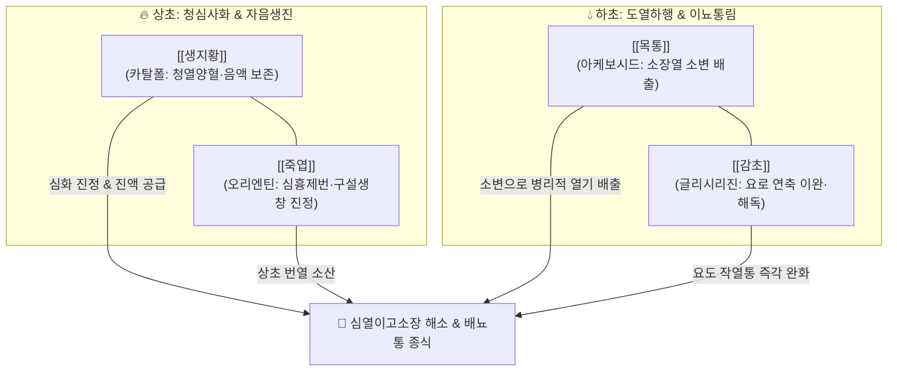

---
aliases:
  - 導赤散
  - Daochi-san
tags:
  - 처방/청열·해독·사화제
  - 청열/청심이뇨
  - 심열이고소장
  - 구내염
  - 방광염
  - 소아약증직결
---

# 🍵 [[도적산]] (導赤散, Daochi-san)

> **핵심 3줄 요약 (Key Summary)**:
> - 🌿 기본 구성: [[생지황]], [[목통]], [[죽엽]], [[감초]] ([[생지황]]의 청열양혈과 [[목통]]·[[죽엽]]의 이뇨통림을 결합하여 심장의 화열을 소변으로 배출시키는 도열하행 처방).
> - 🎯 심장과 소장의 화열로 인한 구설생창(재발성 아프타성 구내염·설염·혓바늘), 심흉번열(가슴 답답함·갈증), 소변적삽자통(소변이 붉고 찌르듯 아픔), 급성 방광염·요도염, 혈뇨, 소아 야제증(밤에 울며 보챔).
> - 🔬 생지황 카탈폴과 죽엽 오리엔틴의 구강 점막 상피세포 보호 및 NF-$\kappa$B/TNF-$\alpha$ 염증 신호 억제, 정품 목통(으름덩굴) 아케보시드의 신장 혈류 증가 및 사구체 여과율 촉진, 감초 글리시리진의 요로 평활근 연축 차단.
> - ⚠️ 주의사항: 아리스톨로크산(신독성)을 함유한 관목통(쥐방울덩굴과) 오용 절대 금기(대한민국약전 정품 으름덩굴 목통 엄수), 비위허한 환자 생지황 감량.

---

## 📌 목차
1. [기본 처방 정보 & 군신좌사 구성](#1-기본-처방-정보--군신좌사-구성)
2. [방제학적 약재 상호작용 & 시너지 네트워크](#2-방제학적-약재-상호작용--시너지-네트워크)
3. [현대 분자약리학적 효능 & 작용 기전](#3-현대-분자약리학적-효능--작용-기전)
4. [적응 병증 및 체질별 감별 (Sweet Spot vs 금기)](#4-적응-병증-및-체질별-감별-sweet-spot-vs-금기)
5. [유사 처방군 감별 매트릭스](#5-유사-처방군-감별-매트릭스)
6. [임상 가감례 & 현대 질환별 응용](#6-임상-가감례--현대-질환별-응용)
7. [💡 사용자 진료실 핵심 필기 & 임상 팁 (원문 보존)](#7--사용자-진료실-핵심-필기--임상-팁-원문-보존)
8. [출처 및 학술 참고 문헌 (References)](#8-출처-및-학술-참고-문헌-references)

---

## 1. 기본 처방 정보 & 군신좌사 구성

* **출전(出典)**: 송대 전을(錢乙), 《소아약증직결(小兒藥證直訣)》 권하
* **치법(治法)**: 청심이뇨(淸心利尿), 도열하행(導熱下行), 양혈생진(涼血生津)
* **주치(主治)**: 심경열성(心經熱盛) 및 심열이고소장으로 인한 구설생창, 심흉번열, 갈망면적, 소변적삽자통, 뇨혈

| 구분 | 약재명 | 표준 용량 | 본초 효능 & 방제 내 역할 |
| :--- | :--- | :--- | :--- |
| **군약 (君藥)** | [[생지황]] | 9~12g | 청열양혈(淸熱涼血), 자음생진, 심화(心火)를 내리고 혈열을 식히며 음액 손상 방어 |
| **신약 (臣藥)** | [[목통]] | 6g | 통리혈맥(通利血脈), 청열이뇨, 소장의 화열을 방광으로 이끌어 소변으로 배출 |
| **신약 (臣藥)** | [[죽엽]] | 6g | 청열제번(淸熱除煩), 생진이뇨, 상초 심폐의 열기를 흩뜨리고 구강 점막 염증 진정 |
| **사약 (使藥)** | [[감초]] (생감초) | 4~6g | 청열해독, 사화지통, 요로 점막 자극을 완화하고 제약을 조화 |

> **배오 특징**:
> 1. **심-소장 표리 투열(透熱)의 묘**: 심(心)과 소장(小腸)은 표리 관계이므로, 상초 심장의 불길을 위에서 강제로 억누르지 않고 소장으로 이끌어 내려(導赤: 붉은 심열을 인도함) 소변으로 배출시키는 이수퇴열(利水退熱)의 모범입니다.
> 2. **청열(淸熱)과 양음(養陰)의 병행**: 생지황의 자음양혈력이 목통과 죽엽의 이뇨 작용으로 인한 체내 진액 손상을 원천 방지하여, 열을 끄면서도 음액이 마르지 않도록 보호합니다.
> 3. **생감초초(生甘草梢)의 인경 배오**: 생감초의 잔뿌리(감초초)를 사용하면 요도 끝의 찌르는 듯한 작열통(삽통 澁痛)을 멎게 하는 특효를 발휘합니다.

---

## 2. 방제학적 약재 상호작용 & 시너지 네트워크

* [[생지황]] + [[목통]]: 생지황은 혈분에 들어가 심화(心火)를 끄고 진액을 생성하며, 목통은 기분에 들어가 소장의 열을 소변으로 뽑아냅니다. 기혈이 상호 협력하여 음액 손상 없이 사화를 완성합니다.
* [[죽엽]] + [[감초]]: 죽엽이 상초 흉격의 열을 발산시키고, 생감초가 하초 요로 점막의 날카로운 신경 자극을 완화하여 배뇨 시 통증을 즉각 멎게 합니다.

---

## 3. 현대 분자약리학적 효능 & 작용 기전

1. **구강 점막 상피세포 보호 및 염증 사이토카인 차단**:
   * [[생지황]]의 카탈폴(Catalpol)과 [[감초]]의 리퀴리티게닌(Liquiritigenin)이 구강 상피세포의 NF-$\kappa$B 활성화를 차단하여 TNF-$\alpha$, IL-6 발현을 억제함으로써 재발성 아프타성 구내염과 혓바늘의 궤양 조직을 신속히 치유합니다.
2. **사구체 여과율 증가 및 요로계 세균 세척 이뇨 효과**:
   * [[죽엽]]의 오리엔틴(Orientin)과 정품 [[목통]]의 아케보시드(Akeboside) 사포닌이 신장 혈류량을 증가시키고 신원(Nephron)에서의 수분 재흡수를 억제하여 요량을 증가시킴으로써 요로계 내 염증 침전물과 세균을 세척 배출합니다.
3. **요로 평활근 연축 억제 및 통증 수용체 진정**:
   * 감초의 글리시리진(Glycyrrhizin)이 요도 괄약근과 방광 삼각부 평활근의 경련을 완화하고 통증 수용체의 과민 반응을 억제하여 배뇨 시 찌르는 듯한 작열통(소변삽통)을 즉시 개선합니다.

---

## 4. 적응 병증 및 체질별 감별 (Sweet Spot vs 금기)

### [✅ 최적 적응증 (Sweet Spot)]
* **심경열성(心經熱盛)**: 재발성 아프타성 구내염, 혓바늘, 설염, 혀끝이 붉고 갈라짐, 입안이 화끈거림.
* **심열이고소장(心熱移於小腸)**:
  * 급성 방광염, 요도염, 신우신염 초기.
  * 소변 색이 짙은 붉은색이거나 혈뇨가 섞여 나오며, 소변 볼 때 요도가 타는 듯이 아픈 증상.
* **신경정신 및 소아 질환**:
  * 가슴이 답답하여 잠을 이루지 못하는 심흉번열, 번조불안.
  * 소아 야제증(밤마다 가슴이 답답하고 놀라 소리지르며 울고 보채는 소아).

### [⚠️ 신중 투여 및 금기]
* **신독성 관목통(關木通) 절대 금기 (CRITICAL)**: 아리스톨로크산(Aristolochic acid)으로 인한 신섬유화 위험이 있는 중국산 관목통을 절대 쓰지 않고, 대한민국약전 규격 정품 으름덩굴 줄기([[목통]])만을 사용합니다.
* **비위허한(脾胃虛寒) 환자**: 평소 소화가 잘 안 되고 묽은 변이나 설사를 자주 하는 환자는 생지황으로 인해 속쓰림이나 설사가 유발될 수 있으므로 감량하거나 건비제를 합방합니다.

---

## 5. 유사 처방군 감별 매트릭스

| 처방명 | 핵심 배오 차이 | 주치 및 임상 차별점 | 적응증 우선순위 |
| :--- | :--- | :--- | :--- |
| [[도적산]] | [[생지황]], [[목통]], [[죽엽]], [[감초]] | 심열이고소장, 청심이뇨, 도열하행, 구강-요로 연계 | 구내염, 혓바늘, 급성 방광염, 소아 야제 |
| [[팔정산]] | 목통, 활석, 차전자, 구맥, 편축, 대황, 치자 | 하초 습열 결취, 농뇨 및 결석성 극심한 요로 감염 | 급성 임질성 요도염, 신우신염, 요로결석 |
| [[소계음자]] | 도적산 + 소계, 우슬, 포황, 활석, 당귀 | 요로 혈열망행, 배뇨 시 혈괴 배출 및 선홍색 혈뇨 | 출혈성 방광염, 혈뇨, 사구체신염 |
| [[청심연자음]] | 연자육, 인삼, 황기, 복령, 차전자, 지골피 | 기음양허 + 상열하한, 만성 피로성 요로 질환 | 만성 방광염, 피로 시 재발하는 배뇨통, 신경성 빈뇨 |
| [[황련해독탕]] | 황련, 황금, 황백, 치자 | 삼초 실열 화독, 고열, 광란, 화농성 질환, 쓴맛 청열 | 삼초 실열, 구내염 초기 고열, 급성 피부염 |

---

## 6. 임상 가감례 & 현대 질환별 응용

* **혈뇨가 심할 때 (출혈성 방광염)**: [[소계]], [[포황]], [[백모근]]을 가미하여 소계음자 방의를 결합하고 지혈력을 강화합니다.
* **소변이 찔끔거리며 잘 안 나올 때 (농뇨)**: [[활석]], [[차전자]]를 가미하여 삼습이뇨 효능을 배가합니다.
* **심화가 극심하여 가슴이 몹시 뛰고 불면 시**: [[황련]](3g)을 가미하여 사심화(瀉心火) 작용을 보강합니다.
* **구내염 궤양이 깊고 만성화될 때**: [[현삼]], [[맥문동]]을 가미하여 자음강화(滋陰降火)합니다.

---

## 7. 💡 사용자 진료실 핵심 필기 & 임상 팁 (원문 보존)

> [!tip] **진료실 실전 노하우 (User Clinical Insight)**
> * **심열이고소장의 병리 연계**:
>   * 심(心)과 소장(小腸)은 표리 관계이므로, 심장에 열이 차면 심개규어설(心開竅於舌) 원리로 혀끝에 불이 붙어 혓바늘·구내염이 생기고, 이 열이 소장과 방광으로 전이되면 소변이 붉어지며 배뇨통이 생깁니다.
>   * 도적산은 심장의 불길을 소변으로 빠져나가게 하는 가장 평화롭고 안전한 도열하행(導熱下行) 처방입니다.
> * **신독성 유발 관목통(關木通) 절대 금기 (CRITICAL)**:
>   * 과거 중국산 관목통(쥐방울덩굴과)에 함유된 아리스톨로크산(Aristolochic acid)으로 인한 비가역적 신섬유화 및 신부전증 보고가 있었습니다.
>   * 임상에서는 반드시 대한민국약전 규격에 부합하는 **으름덩굴과 으름덩굴 줄기인 정품 목통(Akebiae Caulis)**만을 엄격히 선별하여 처방합니다.
> * **비위허한 환자 복용 지도**:
>   * 생지황의 지루함과 죽엽의 서늘함으로 인해 평소 비위가 차고 설사를 자주 하는 환자는 무른 변, 속쓰림이 나타날 수 있으므로 생지황을 감량하고 식후 미온수로 복용하도록 지도합니다.

---

## 8. 출처 및 학술 참고 문헌 (References)

1. 錢乙. *小兒藥證直訣*. 人民衛生出版社; 2006.
   - [연구 요약] 소아의 심열 및 구설생창, 소변불리에 생지황, 목통, 죽엽, 감초를 배합한 도적산의 원전 기재.
3. * **Liu JY et al. (2026)**. Catalpol ameliorates diabetic retinal vascular endothelial injury by suppressing NLRP3 inflammasome via targeting METTL3-m(6)A modification. *International journal of ophthalmology*, 19: 1038-1047. [PMID: 42211203](https://pubmed.ncbi.nlm.nih.gov/42211203/)
