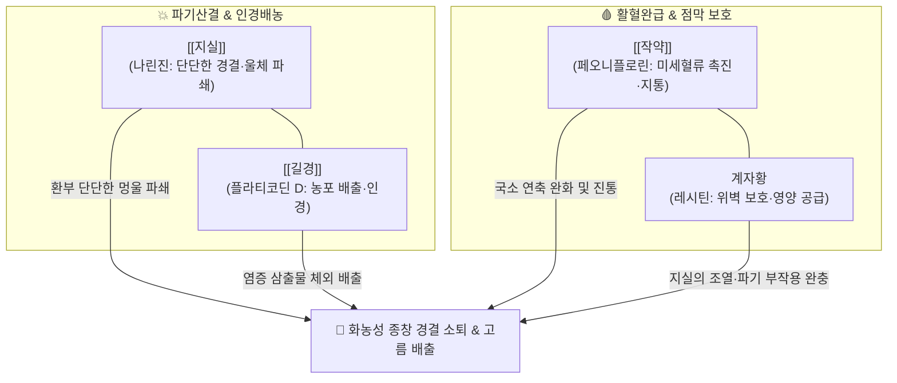

---
aliases:
  - 排膿散
  - Painong-san
tags:
  - 처방/청열·해독·사화제
  - 청열/배농소종
  - 화농성질환
  - 모낭염
  - 종기
  - 맥립종
  - 금궤요략
---

# 🍵 [[배농산]] (排膿散, Painong-san)

> **핵심 3줄 요약 (Key Summary)**:
> - 🌿 기본 구성: [[지실]], [[작약]], [[길경]] (복용 시 [[계란]] 노른자 배합, [[지실]]의 파기소적과 [[작약]]의 활혈완급 및 [[길경]]의 인경배농 결합).
> - 🎯 국소 피부 및 점막의 화농성 염증으로 **단단한 융기(부어오름)와 경결(딱딱한 멍울)**이 뚜렷한 병증, 급성 화농성 모낭염, 종기(Furuncle), 여드름, 눈다래끼(맥립종), 결막염, 치은염, 급성 유선염, 소아 항문주위농양 초기.
> - 🔬 길경 [[플라티코딘 D]](Platycodin D)의 호중구·대식세포 활성화 및 고름 배출 촉진, 지실 나린진·헤스페리딘의 혈관 투과성 정상화 및 국소 염증 부종 소퇴, 작약 [[페오니플로린]]의 말초 미세순환 개선 및 통증 역치 상승.
> - ⚠️ 주의사항: 지실의 강력한 파기(破氣) 작용으로 기허약자 및 임산부 신중 투여, 이미 농이 터져 맑은 물만 나오는 만성 허증 궤양 금기.

---

## 📌 목차
1. [기본 처방 정보 & 군신좌사 구성](#1-기본-처방-정보--군신좌사-구성)
2. [방제학적 약재 상호작용 & 시너지 네트워크](#2-방제학적-약재-상호작용--시너지-네트워크)
3. [현대 분자약리학적 효능 & 작용 기전](#3-현대-분자약리학적-효능--작용-기전)
4. [적응 병증 및 체질별 감별 (Sweet Spot vs 금기)](#4-적응-병증-및-체질별-감별-sweet-spot-vs-금기)
5. [유사 처방군 감별 매트릭스 (배농 3대 방제 비교)](#5-유사-처방군-감별-매트릭스-배농-3대-방제-비교)
6. [임상 가감례 & 현대 질환별 응용](#6-임상-가감례--현대-질환별-응용)
7. [💡 사용자 진료실 핵심 필기 & 임상 팁 (원문 보존)](#7--사용자-진료실-핵심-필기--임상-팁-원문-보존)
8. [출처 및 학술 참고 문헌 (References)](#8-출처-및-학술-참고-문헌-references)

---

## 1. 기본 처방 정보 & 군신좌사 구성

* **출전(出典)**: 한대 장중경(張仲景), 《금궤요략(金匱要略)》 창옹옹저익병맥증병치(瘡癰癰疽浸淫病脈證幷治)편
* **치법(治法)**: 파기파적(破氣破積), 배농소종(排膿消腫), 활혈지통(活血止痛)
* **주치(主治)**: 체표 및 점막의 화농성 종양으로 환부에 단단한 멍울(경결 硬結)과 부종이 있고 찌르는 듯이 아픈 실증(實證) 화농 초기

| 구분 | 약재명 | 표준 용량 | 본초 효능 & 방제 내 역할 |
| :--- | :--- | :--- | :--- |
| **군약 (君藥)** | [[지실]] | 10~15g | 파기소적(破氣消積), 화담산결, 환부 주변의 완고한 기체와 단단한 경결을 깨뜨림 |
| **신약 (臣藥)** | [[길경]] | 6~9g | 개제폐기(開提肺氣), 배농생기, 약력을 체표로 이끌어 고름을 밖으로 밀어냄 |
| **좌약 (佐藥)** | [[작약]] ([[백작약]]) | 9~12g | 양혈유간(養血柔肝), 활혈완급, 국소 혈관 연축을 풀고 혈행을 열어 통증 억제 |
| **보조 (使藥)** | 계자황 ([[계란]] 노른자) | 1개 | 자음보혈, 윤조점막, 지실의 맹렬한 파기 작용으로부터 위벽을 보호하고 영양 공급 |

> **배오 특징**:
> 1. **기혈동치와 파적배농의 극치**: 기를 깨는 [[지실]]과 피를 돌리는 [[작약]]이 합쳐져 국소 혈류 울체를 뚫고, [[길경]]이 약력을 상부 및 피부 체표로 쏘아 올려 농포(Pustule)를 밖으로 배출(배농)시킵니다.
> 2. **계자황(鷄子黃) 배합의 묘용**: 분말을 복용할 때 날달걀 노른자 1개와 버무려 복용하도록 설계되어, 지실의 신랄한 맛과 위장 자극을 완화하고 세포 재생에 필요한 레시틴과 지질을 공급합니다.
> 3. **배농탕과의 확실한 분업**: 융기와 경결이 두드러진 병변에는 [[지실]]이 주축이 된 [[배농산]]을 쓰고, 융기가 없이 통증과 발적 위주인 초기에는 [[감초]]가 주축이 된 [[배농탕]]을 사용합니다.

---

## 2. 방제학적 약재 상호작용 & 시너지 네트워크

* [[지실]] + [[작약]]: 사역산의 핵심 약대로, 기분(지실)과 혈분(작약)의 울체된 압력을 해소하여 국소 조직의 팽창성 압통을 신속히 제거합니다.
* [[지실]] + [[길경]]: 지실은 아래로 깎아내리고(강기 파적), 길경은 위와 겉으로 띄워 올림(승제 배농)으로써 체표와 점막의 막힌 기류를 개통시켜 농(膿)의 자가 흡수 또는 체외 배출을 유도합니다.

---

## 3. 현대 분자약리학적 효능 & 작용 기전

1. **대식세포 탐식능 활성화 및 화농 배출 촉진**:
   * [[길경]]의 사포닌 복합체인 플라티코딘 D(Platycodin D)는 국소 대식세포와 중구의 탐식 작용을 촉진하고 리소좀 효소 활성을 유도하여 괴사된 세포 잔해와 세균 군집을 신속히 분해·배출합니다.
2. **모세혈관 투과성 억제 및 염증성 경결 소퇴**:
   * [[지실]]의 플라보노이드 성분인 나린진(Naringin)과 헤스페리딘(Hesperidin)이 히스타민 및 브라디키닌에 의한 모세혈관 과투과성을 정상화시켜 국소 조직의 부종액 저류를 차단하고 단단하게 뭉친 결절을 부드럽게 연화시킵니다.
3. **말초 미세순환 개선 및 염증성 통증 차단**:
   * [[작약]]의 페오니플로린(Paeoniflorin)이 국소 혈관 내피세포의 eNOS를 활성화하여 혈류를 재개통시키고, 통각 신경 말단의 Substance P 분비를 억제하여 욱신거리는 박동성 염증 통증을 차단합니다.

---

## 4. 적응 병증 및 체질별 감별 (Sweet Spot vs 금기)

### [✅ 최적 적응증 (Sweet Spot)]
* **단단한 융기와 멍울이 만져지는 급성 화농증**:
  * 급성 모낭염, 종기, 절종(Furuncle), 옹종(Carbuncle) 초기.
  * 안과 질환: 눈다래끼(맥립종), 급성 결막염으로 눈꺼풀이 붉고 단단하게 부어오를 때.
  * 치과 및 이비인후과: 잇몸이 붓고 피고름이 나는 치은염, 치주염, 편도선 주위염.
  * 소아 및 외과 질환: 소아 항문주위농양(Perianal abscess) 초기, 급성 유선염 초기.

### [⚠️ 신중 투여 및 금기]
* **만성 허증성 음저(陰疽) 금기**: 피부색이 변하지 않고 멍울만 있으며 열감이 없고, 이미 터져 묽은 맑은 물만 질질 나오는 만성 허약성 궤양에는 투약을 금합니다(보익배농제인 탁리소독음이나 십전대보탕 적용).
* **기허 허약자 및 임산부 주의**: 지실의 파기 작용이 강하므로 원기가 쇠약한 환자는 기력 저하가 올 수 있으며, 임산부는 자궁 수축 위험이 있으므로 신중을 기합니다.

---

## 5. 유사 처방군 감별 매트릭스 (배농 3대 방제 비교)

| 처방명 | 핵심 구성 약재 | 병증 특성 및 방제학적 차별점 | 적응증 우선순위 |
| :--- | :--- | :--- | :--- |
| [[배농산]] | [[지실]], [[작약]], [[길경]] (+ 계자황) | **환부의 융기(부종)와 단단한 경결(멍울)** 파쇄 특화, 파기활혈 위주 | 딱딱한 멍울 종기, 눈다래끼, 급성 모낭염 |
| [[배농탕]] | [[감초]], [[길경]], [[생강]], [[대추]] | **융기 없이** 국소 발적과 찌르는 듯한 통증 위주인 화농 초기 | 초기 발적 여드름, 궤양 없는 구내염·인후통 |
| [[배농산급탕]] | [[지실]], [[작약]], [[길경]], [[감초]], [[생강]], [[대추]] | 배농산과 배농탕의 합방, 융기·경결과 극심한 염증 통증 복합 제어 | 심재성 농양, 항문주위농양, 진행성 모낭염 |
| [[선방활명음]] | 금은화, 당귀, 천화분, 유향, 몰약, 조각자 등 | 옹저 초기의 군왕방, 청열해독과 활혈파어·투농의 거대 복합방 | 대형 옹저창양, 유선염, 피부 심재성 감염 |
| [[십미패독탕]] | 시호, 형개, 방풍, 복령, 독활, 천궁 등 | 체표 풍습열 독소 발산, 재발성 알레르기성 피부염 및 습진 | 만성 여드름, 화농성 습진, 두드러기 |

---

## 6. 임상 가감례 & 현대 질환별 응용

* **염증 열감이 극심하고 붉게 번질 때**: [[황련]], [[황금]], [[연교]]를 가미하여 청열해독력을 대폭 강화합니다.
* **통증이 극심하여 잠을 이루지 못할 때**: [[금은화]], [[현호색]]을 가미하여 소염진통을 배가합니다.
* **소아 항문주위농양**: 본 방제 분말을 계란 노른자와 섞어 소량씩 온복시키며 환부 청결을 병행합니다.
* **복용 편의성을 높이고자 할 때**: 날달걀 알레르기가 있거나 휴대가 필요한 경우 배농산과 배농탕이 합방된 엑스과립제([[배농산급탕]])로 전환 투여합니다.

---

## 7. 💡 사용자 진료실 핵심 필기 & 임상 팁 (원문 보존)

> [!tip] **진료실 실전 노하우 (User Clinical Insight)**
> * **핵심 구성 원리**:
>   * [[길경]], [[지실]], [[작약]]
>   * 지실이 기운의 멍울을 깨뜨리고, 작약이 혈액의 울혈을 풀며, 길경이 고름을 체표 밖으로 배출시킵니다.
> * **배농산 vs 배농탕 감별 포인트**:
>   * 환부에 융기 등이 나타나지 않는 염증 초기에는 [[배농탕]]을 사용합니다.
>   * 환부에 **융기와 단단한 경결(딱딱한 멍울)**이 나타나면 [[배농산]]을 사용합니다.
> * **실전 복약 지도법**:
>   * 복약순응도를 높이고 지실의 위장 자극을 줄이기 위해 **계란 노른자(계자황)와 함께 버무려 복용**하는 것이 원전의 비법입니다.
>   * 특히 외과적 절개가 어려운 **소아 항문주위농양** 초기에 투여하여 비수술적 소퇴를 유도하는 데 탁월한 효과가 있습니다.

---

## 8. 출처 및 학술 참고 문헌 (References)

1. 張仲景. *金匱要略*. 瘡癰癰疽浸淫病脈證幷治 第十八.
   - [연구 요약] 옹저로 농이 형성되려 할 때 지실, 작약, 길경을 가루 내어 계자황과 복용하는 배농산의 최초 원전 기재.
