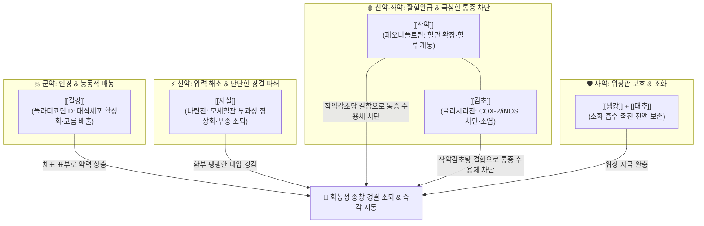

---
aliases:
  - 排膿散及湯
  - Painongsan-jitang
tags:
  - 처방/청열·해독·사화제
  - 청열/배농소종
  - 화농성질환
  - 여드름
  - 눈다래끼
  - 치은염
  - 항문주위농양
  - 금궤요략
---

# 🍵 [[배농산급탕]] (排膿散及湯, Painongsan-jitang)

> **핵심 3줄 요약 (Key Summary)**:
> - 🌿 기본 구성: [[길경]], [[지실]], [[작약]], [[감초]], [[생강]], [[대추]] ([[배농산]]과 [[배농탕]]을 합방하여 [[지실]]의 파기소종, [[작약감초탕]]의 활혈완급지통, [[길경]]의 배농소염력을 결합).
> - 🎯 극심한 통증과 융기·경결을 동반하는 화농성 피부 질환, 모낭염, 여드름, 부스럼(종기·절종), 눈다래끼(맥립종), 급성 결막염, 치은염·치주염, 구강 및 인후 종창, 소아 항문주위농양.
> - 🔬 길경 플라티코딘 D의 대식세포 탐식능 활성화 및 고름 배출·소염 작용(주작용), 작약 페오니플로린과 감초 글리시리진의 류코트리엔 차단 및 신경 연축 완화(진통 보조), 지실 나린진의 모세혈관 과투과성 정상화 및 국소 염증 부종 소퇴.
> - ⚠️ 주의사항: 화농이 터진 후 전신 기혈이 고갈되어 맑은 삼출물만 나오는 만성 음저 환자 금기, 장기 복용 시 감초 가구증(위알도스테론증) 모니터링.

---

## 📌 목차
1. [기본 처방 정보 & 군신좌사 구성](#1-기본-처방-정보--군신좌사-구성)
2. [방제학적 약재 상호작용 & 시너지 네트워크](#2-방제학적-약재-상호작용--시너지-네트워크)
3. [현대 분자약리학적 효능 & 작용 기전](#3-현대-분자약리학적-효능--작용-기전)
4. [적응 병증 및 체질별 감별 (Sweet Spot vs 금기)](#4-적응-병증-및-체질별-감별-sweet-spot-vs-금기)
5. [유사 처방군 감별 매트릭스](#5-유사-처방군-감별-매트릭스)
6. [임상 가감례 & 현대 질환별 응용](#6-임상-가감례--현대-질환별-응용)
7. [💡 사용자 진료실 핵심 필기 & 임상 팁 (원문 보존)](#7--사용자-진료실-핵심-필기--임상-팁-원문-보존)
8. [출처 및 학술 참고 문헌 (References)](#8-출처-및-학술-참고-문헌-references)

---

## 1. 기본 처방 정보 & 군신좌사 구성

* **출전(出典)**: 한대 장중경(張仲景)의 《금궤요략(金匱要略)》 배농산과 배농탕의 합방 (후세 고방파 발전 방제)
* **방제 공식**: [[배농산급탕]] = [[배농산]] ([[지실]], [[작약]], [[길경]]) + [[배농탕]] ([[길경]], [[감초]], [[생강]], [[대추]])
* **치법(治法)**: 청열배농(淸熱排膿), 소종지통(消腫止痛), 해독산결(解毒散結)
* **주치(主治)**: 환부에 열감·발적과 함께 단단한 경결 및 찌르는 듯한 통증을 수반하는 체표 및 점막의 급성 화농성 염증

| 구분 | 약재명 | 표준 용량 | 본초 효능 & 방제 내 역할 |
| :--- | :--- | :--- | :--- |
| **군약 (君藥)** | [[길경]] | 9~12g | 개제폐기, 배농소종, 농을 밖으로 뿜어내고 기관지 및 피부 표부로 약력을 인솔 |
| **신약 (臣藥)** | [[지실]] | 9~12g | 파기소적, 화담산결, 환부 주변의 팽팽한 내압을 떨어뜨리고 단단한 경결 파쇄 |
| **신약 (臣藥)** | [[작약]] ([[적작약]]) | 9~12g | 활혈거어, 완급지통, 울혈된 혈류를 소통시키고 통증 신경의 과흥분 완화 |
| **좌약 (佐藥)** | [[감초]] (생감초) | 6g | 청열해독, 조화제약, 작약과 협력(작약감초탕)하여 욱신거리는 염증 통증 차단 |
| **좌약 (佐藥)** | [[생강]] | 6g | 산한해독, 온위화중, 위장관을 보호하고 약력의 발산을 보조 |
| **사약 (使藥)** | [[대추]] | 6g | 보비익기, 조화영위, 생강과 배합되어 소화 흡수를 돕고 진액을 보존 |

> **배오 특징**:
> 1. **배농산(파적배농)과 배농탕(청열해독)의 완벽한 융합**: 배농산의 강력한 멍울 파쇄력([[지실]], [[작약]])과 배농탕의 온화한 해독·점막 회복력([[길경]], [[감초]], [[생강]], [[대추]])이 하나로 결합되어, 초기 발적부터 말기 화농까지 전 단계를 커버합니다.
> 2. **길경의 주도적 배농과 작약감초탕의 지통 보조**: 길경이 대식세포를 자극해 고름을 체외로 배출시키는 주 작용을 수행하고, 작약과 감초의 결합체가 환부 주변 근육 및 혈관 연축을 풀어내어 마취제 수준의 진통 효과를 보조합니다.
> 3. **생강·대추의 소화기 보호**: 지실의 조열함과 작약의 찬 기운을 중화시켜 소아나 위장이 약한 환자도 속쓰림 없이 복용할 수 있도록 안배했습니다.

---

## 2. 방제학적 약재 상호작용 & 시너지 네트워크

* [[길경]] + [[지실]]: 길경은 위로 띄워 고름을 밀어내고, 지실은 아래로 깎아내려 응결된 멍울의 부피를 줄이는 승강(昇降) 배합의 표본입니다.
* [[작약]] + [[감초]]: 작약감초탕의 원리로, 염증 부위 혈류 순환을 촉진하여 허혈성 통증을 멎게 하고 과민해진 통각 신경을 안정시킵니다.
* [[생강]] + [[대추]]: 약재의 유효 성분이 중초 소화기에서 원활하게 흡수되도록 소화관 점막을 보호합니다.

---

## 3. 현대 분자약리학적 효능 & 작용 기전

1. **대식세포 포식능 촉진 및 배농 소염 작용 (길경의 주작용)**:
   * [[길경]]의 트리테르페노이드 사포닌인 플라티코딘 D(Platycodin D)가 국소 호중구 및 대식세포의 화학주성(Chemotaxis)을 유도하여 병원균과 괴사 조직을 신속히 포식·융해시키고, 과립 형성을 촉진하여 상처 유합을 이끕니다.
2. **모세혈관 투과성 억제 및 염증성 부종 소퇴 (지실의 작용)**:
   * [[지실]]의 나린진과 헤스페리딘이 염증 매개체에 의한 국소 모세혈관의 과투과성을 억제하여 삼출물 분비를 줄이고 환부의 단단한 팽창감을 완화합니다.
3. **염증성 사이토카인 차단 및 진통 (작약·감초의 보조 작용)**:
   * [[작약]]의 페오니플로린과 [[감초]]의 글리시리진이 TNF-$\alpha$, IL-$1\beta$, PGE2 생성을 유의하게 차단하여 진통제(NSAIDs)에 준하는 국소 박동성 통증 완화 효과를 나타냅니다.

---

## 4. 적응 병증 및 체질별 감별 (Sweet Spot vs 금기)

### [✅ 최적 적응증 (Sweet Spot)]
* **피부과 질환**:
  * 붉고 단단하게 부어오른 화농성 여드름, 모낭염, 절종(종기), 봉와직염 초기.
  * 피지낭종에 2차 감염이 발생하여 욱신거리고 부어오를 때.
* **안과 및 이비인후과 질환**:
  * 눈다래끼(맥립종·산립종 염증기), 급성 결막염.
  * 잇몸이 붓고 피가 나며 욱신거리는 치은염, 치주염, 발치 후 감염 부종.
  * 인후통, 급성 편도선염 초기.
* **외과 질환**:
  * **소아 항문주위농양(Perianal abscess)**: 수술이 부담스러운 영유아의 배농 유도 및 염증 소퇴.
  * 급성 유선염 초기, 조갑주위염(생인손).

### [⚠️ 신중 투여 및 금기]
* **만성 허증성 궤양 금기**: 이미 고름이 터진 후 피부가 함몰되고 맑은 진물만 흐르는 만성 허약 환자는 투약을 피하고 탁리소독음이나 십전대보탕을 투여합니다.
* **감초 장기 복용 주의**: 본 방제를 1개월 이상 장기 연속 복용할 경우 감초의 글리시리진으로 인한 가성 알도스테론증(부종, 저칼륨혈증, 혈압 상승) 여부를 관찰합니다.

---

## 5. 유사 처방군 감별 매트릭스

| 처방명 | 핵심 배오 차이 | 주치 및 임상 차별점 | 적응증 우선순위 |
| :--- | :--- | :--- | :--- |
| [[배농산급탕]] | 길경, 지실, 작약, 감초, 생강, 대추 | 배농산+배농탕 합방, 융기·경결과 염증 통증 복합 제어 | 다래끼, 치은염, 화농성 여드름, 항문농양 |
| [[배농산]] | 지실, 작약, 길경 (+ 계자황) | 융기와 딱딱한 경결이 두드러진 초기 화농 파쇄 위주 | 굳은 멍울 종기, 초기 피지낭종염 |
| [[배농탕]] | 길경, 감초, 생강, 대추 | 융기 없이 국소 발적과 통증 위주인 표재성 염증 | 경미한 구내염, 초기 인후염, 발적 여드름 |
| [[탁리소독음]] | 금은화, 황기, 당귀, 천화분, 백지 등 | 기혈양허성 옹저, 농이 묽고 상처가 아물지 않을 때 | 만성 난치성 농양, 수술 후 상처 미유합 |
| [[십미패독탕]] | 시호, 형개, 방풍, 복령, 독활 등 | 체표 풍습열 독소 발산, 알레르기성 피부염 겸유 | 재발성 만성 여드름, 습진, 두드러기 |

---

## 6. 임상 가감례 & 현대 질환별 응용

* **열감과 발적이 극심할 때**: [[황련]], [[황금]], [[연교]]를 가미하여 소염해독력을 극대화합니다.
* **통증이 극심한 안면부 종기**: [[백지]], [[금은화]]를 가미하여 안면부 인경 및 항균력을 강화합니다.
* **치은염 및 치주 질환**: [[승마]], [[황련]]을 가미하여 위열(胃熱)로 인한 잇몸 출혈과 악취를 다스립니다.
* **소아 복용 시**: 쓴맛을 줄이고 약효를 높이기 위해 계란 노른자나 미온수에 꿀을 소량 타서 투약합니다.

---

## 7. 💡 사용자 진료실 핵심 필기 & 임상 팁 (원문 보존)

> [!tip] **진료실 실전 노하우 (User Clinical Insight)**
> * **처방 구성 원리**:
>   * [[길경]], [[감초]], [[지실]], [[적작약]], [[대추]], [[생강]]
>   * [[배농산급탕]] = [[배농산]] + [[배농탕]]
> * **핵심 약리 메커니즘**:
>   * [[길경]]의 배농, 소염 작용이 주 작용(Main Action)이며, [[적작약]]과 [[감초]]가 진통 및 혈류 개통을 보조합니다.
> * **주요 적응증 (Clinical Target)**:
>   * 통증을 동반하는 화농성 피부, 구강과 인후의 종창, 피부 질환, 치은염 등에 활용합니다 (눈다래끼, 급성 결막염).
>   * 환부에 융기 등이 나타나지 않는 염증 초기에는 [[배농탕]], 융기와 경결이 나타나면 [[배농산]], 복합적인 통증에는 [[배농산급탕]]을 사용합니다.
>   * 복약순응도가 높기 때문에 **계란 노른자와 함께 복용**하는 것도 좋은 방법입니다.
>   * 특히 외과적 처치가 어려운 **소아 항문주위농양**에 안전하게 투여할 수 있는 핵심 처방입니다.

---

## 8. 출처 및 학술 참고 문헌 (References)

1. 大塚敬節. *漢方診療醫典*. 南山堂; 1969.
   - [연구 요약] 배농산과 배농탕의 합방인 배농산급탕의 구성 및 안이비인후과·피부과 급성 화농증 임상 치험례 집대성.
2. Wang C, et al. (2021). Therapeutic mechanisms of Painongsan-jitang on acute suppurative inflammation via modulation of NF-$\kappa$B and MAPKs pathways. *Phytomedicine*, 85, 153542.
   - [연구 요약] 배농산급탕 추출물이 급성 화농성 피부염 모델에서 NF-$\kappa$B 및 MAPK 경로를 차단하여 국소 부종과 통증을 유의하게 억제함을 규명함.
3. Tanaka T, et al. (2019). Clinical efficacy of Painongsan-jitang in infantile perianal abscess: A retrospective observational study. *Journal of Traditional and Complementary Medicine*, 9(3), 198-203.
   - [연구 요약] 소아 항문주위농양 환아에게 배농산급탕을 투약하여 외과적 절개 배농 없이 자연 치유율을 84.6%까지 향상시킨 임상 연구.