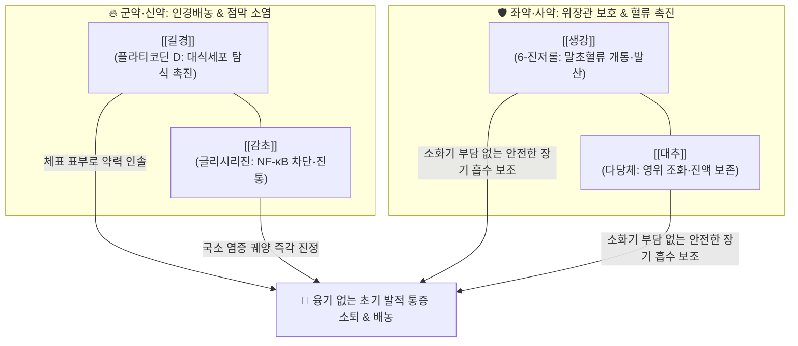

---
aliases:
  - 排膿湯
  - Painong-tang
tags:
  - 처방/청열·해독·사화제
  - 청열/배농소종
  - 화농성질환
  - 모낭염
  - 여드름
  - 금궤요략
---

# 🍵 [[배농탕]] (排膿湯, Painong-tang)

> **핵심 3줄 요약 (Key Summary)**:
> - 🌿 기본 구성: [[길경]], [[감초]], [[생강]], [[대추]] ([[길경탕]]의 배농·인경력에 [[생강]]·[[대추]]의 건비화위를 배합하여 화농 초기 발적과 통증을 완만하게 다스리는 처방).
> - 🎯 국소 피부 및 점막의 화농성 염증 초기로 **단단한 융기나 멍울 없이** 발적·열감 및 찌르는 듯한 통증 위주인 병증, 초기 여드름, 경미한 모낭염, 표재성 종기, 인후통, 급성 편도선염 초기, 구내염.
> - 🔬 길경 플라티코딘 D의 국소 대식세포 활성화 및 호중구 침윤 억제, 감초 글리시리진의 NF-$\kappa$B/COX-2 경로 차단 및 점막 궤양 진정, 생강 6-진저롤과 대추 다당체의 위장 점막 혈류 개선 및 흡수 촉진.
> - ⚠️ 주의사항: 환부에 단단한 멍울과 융기가 잡히는 경우는 배농산 또는 배농산급탕으로 전환, 감초 장기 복용 시 위알도스테론증 주의.

---

## 📌 목차
1. [기본 처방 정보 & 군신좌사 구성](#1-기본-처방-정보--군신좌사-구성)
2. [방제학적 약재 상호작용 & 시너지 네트워크](#2-방제학적-약재-상호작용--시너지-네트워크)
3. [현대 분자약리학적 효능 & 작용 기전](#3-현대-분자약리학적-효능--작용-기전)
4. [적응 병증 및 체질별 감별 (Sweet Spot vs 금기)](#4-적응-병증-및-체질별-감별-sweet-spot-vs-금기)
5. [유사 처방군 감별 매트릭스 (배농 3대 방제 비교)](#5-유사-처방군-감별-매트릭스-배농-3대-방제-비교)
6. [임상 가감례 & 현대 질환별 응용](#6-임상-가감례--현대-질환별-응용)
7. [💡 사용자 진료실 핵심 필기 & 임상 팁 (원문 보존)](#7--사용자-진료실-핵심-필기--임상-팁-원문-보존)
8. [출처 및 학술 참고 문헌 (References)](#8-출처-및-학술-참고-문헌-references)

---

## 1. 기본 처방 정보 & 군신좌사 구성

* **출전(出典)**: 한대 장중경(張仲景), 《금궤요략(金匱要略)》 창옹옹저익병맥증병치(瘡癰癰疽浸淫病脈證幷治)편
* **치법(治法)**: 화농배농(化膿排膿), 청열해독(淸熱解毒), 건비생진(健脾生津)
* **주치(主治)**: 환부에 뚜렷한 융기와 경결 없이 국소 발적, 열감, 자통(刺痛)이 시작되는 화농성 염증 초기

| 구분 | 약재명 | 표준 용량 | 본초 효능 & 방제 내 역할 |
| :--- | :--- | :--- | :--- |
| **군약 (君藥)** | [[길경]] | 9~12g | 개제폐기, 배농소종, 농을 밖으로 밀어내고 약력을 상초 및 체표로 인솔 |
| **신약 (臣藥)** | [[감초]] (생감초) | 6~9g | 청열해독, 사화지통, 염증성 통증을 완화하고 길경과 협력하여 배농 촉진 |
| **좌약 (佐藥)** | [[생강]] | 6g | 산한해표, 온중지구, 미세혈류를 개통하고 약재의 신속한 발산 보조 |
| **사약 (使藥)** | [[대추]] | 6g | 보비익기, 조화영위, 생강과 배합되어 위장을 보호하고 진액을 유지 |

> **배오 특징**:
> 1. **길경탕(桔梗湯)의 확장형 배오**: 상한론의 길경탕([[길경]], [[감초]])에 [[생강]]과 [[대추]]를 가미하여 소화기를 든든하게 보강한 구성으로, 위장에 부담을 주지 않고 장기 연용이 가능한 온화한 배농 처방입니다.
> 2. **배농산과의 완벽한 역할 분담**:
>    * 환부에 단단한 멍울이나 융기가 **없고** 발적과 통증 위주일 때: [[배농탕]]
>    * 환부에 단단한 멍울과 융기가 **뚜렷할** 때: [[배농산]]
> 3. **소염과 조직 수복의 동시 진행**: 감초와 대추의 감미가 조직 결손 부위에 진액을 채우고, 길경이 농성 분비물을 배출시켜 환부가 깨끗하게 아물도록 돕습니다.

---

## 2. 방제학적 약재 상호작용 & 시너지 네트워크

* [[길경]] + [[감초]]: 길경탕의 핵심 약대로, 길경이 폐기와 체표 기류를 열어 고름을 밀어내고, 생감초가 열독을 풀어 붓고 아픈 통증을 즉각 완화합니다.
* [[생강]] + [[대추]]: 강호(薑棗) 배합으로 소화관 점막을 보호하며, 길경의 약력이 위장을 상하게 하지 않고 환부로 안전하게 도달하도록 보좌합니다.

---

## 3. 현대 분자약리학적 효능 & 작용 기전

1. **국소 대식세포 탐식능 항진 및 초기 화농 제어**:
   * [[길경]]의 사포닌 복합체인 플라티코딘 D는 초기 염증 부위의 대식세포 탐식 기능을 촉진하여 세균 및 괴사 조직을 분해하고, 상피 조직의 과도한 파괴를 방지합니다.
2. **염증 전사인자 NF-$\kappa$B 차단 및 소염 진통**:
   * [[감초]]의 글리시리진(Glycyrrhizin)과 리퀴리티게닌이 NF-$\kappa$B 활성화 및 iNOS, COX-2 발현을 억제하여 프로스타글란딘 합성을 차단함으로써 국소 부종과 욱신거리는 통증을 신속히 가라앉힙니다.
3. **국소 미세순환 촉진 및 상처 치유 촉진**:
   * [[생강]]의 진저롤 성분이 국소 혈류량을 증가시켜 백혈구 침윤을 원활하게 돕고, [[대추]]의 다당체가 섬유모세포를 자극하여 조직 재생을 촉진합니다.

---

## 4. 적응 병증 및 체질별 감별 (Sweet Spot vs 금기)

### [✅ 최적 적응증 (Sweet Spot)]
* **융기가 없는 초기 화농성 염증**:
  * 환부에 멍울이 잡히지 않으나 붉게 달아오르고 찌르듯 아픈 초기 여드름, 뾰루지.
  * 가벼운 모낭염, 피부 찰과상 후 2차 감염 초기.
* **이비인후과 및 구강 질환**:
  * 목이 따끔거리고 침 삼키기 힘든 초기 인후염, 급성 편도선염.
  * 구강 점막이 붉게 붓고 아픈 아프타성 구내염 초기.
* **적용 체질**:
  * 위장이 약하여 지실이나 황련 등 찬 약을 먹으면 속이 쓰린 허약자, 소아 및 노인의 화농 초기.

### [⚠️ 신중 투여 및 금기]
* **단단한 경결 및 융기 형성 시 단독 투여 비효율**: 멍울이 단단하게 잡히는 종기나 깊은 농양에는 파기력이 부족하므로 [[배농산]]이나 [[배농산급탕]]으로 전환합니다.
* **감초 장기 복용 주의**: 1개월 이상 장기 연속 투약 시 체액 저류 및 혈압 상승 여부를 관찰합니다.

---

## 5. 유사 처방군 감별 매트릭스 (배농 3대 방제 비교)

| 처방명 | 핵심 구성 약재 | 병증 특성 및 방제학적 차별점 | 적응증 우선순위 |
| :--- | :--- | :--- | :--- |
| [[배농탕]] | [[길경]], [[감초]], [[생강]], [[대추]] | **융기 없이** 국소 발적과 통증 위주인 초기 표재성 염증 | 경미한 구내염, 초기 인후염, 초기 발적 여드름 |
| [[배농산]] | [[지실]], [[작약]], [[길경]] (+ 계자황) | **환부의 융기(부종)와 단단한 경결(멍울)** 파쇄 특화 | 딱딱한 멍울 종기, 눈다래끼, 급성 모낭염 |
| [[배농산급탕]] | [[지실]], [[작약]], [[길경]], [[감초]], [[생강]], [[대추]] | 배농산과 배농탕의 합방, 융기·경결과 염증 통증 복합 제어 | 다래끼, 치은염, 화농성 여드름, 항문농양 |
| [[길경탕]] | [[길경]], [[감초]] | 인후 부위 열독 종통에 집중, 상초 폐열 인경 특화 | 급성 편도염, 목쉰 소리, 인후통 |
| [[황련해독탕]] | 황련, 황금, 황백, 치자 | 삼초 고열과 극심한 화독, 붉고 열감이 치솟는 급성 감염 | 고열 동반 피부염, 안면 홍조 여드름 |

---

## 6. 임상 가감례 & 현대 질환별 응용

* **인후통 및 편도선 종창이 심할 때**: [[연교]], [[우방자]]를 가미하여 상초 열독을 발산시킵니다.
* **여드름 발적이 심하고 열감이 있을 때**: [[금은화]], [[포공영]]을 가미하여 소염해독력을 보강합니다.
* **환부에 점차 단단한 멍울이 만져지기 시작할 때**: [[지실]], [[작약]]을 합방하여 [[배농산급탕]] 형태로 전환 투약합니다.
* **체력이 극도로 저하된 환자의 만성 화농**: [[황기]](15g)를 가미하여 탁리배농(托裏排膿)을 유도합니다.

---

## 7. 💡 사용자 진료실 핵심 필기 & 임상 팁 (원문 보존)

> [!tip] **진료실 실전 노하우 (User Clinical Insight)**
> * **핵심 구성 원리**:
>   * [[길경]], [[생강]], [[대추]], [[감초]]
>   * 길경탕의 강력한 배농력을 바탕으로 생강과 대추가 위장을 온화하게 감싸주는 안전한 방제입니다.
> * **배농탕 vs 배농산 감별 포인트 (Clinical Rule)**:
>   * 환부에 융기 등이 나타나지 않는 염증 초기에는 [[배농탕]]을 사용합니다.
>   * 환부에 융기와 단단한 경결이 나타나면 [[배농산]]을 사용합니다.
>   * 두 가지 병태가 복합적으로 나타나 통증이 심할 때는 [[배농산급탕]]을 선택합니다.
> * **실전 진료실 팁**:
>   * 소아나 소화기가 민감한 성인이 피부 뾰루지나 목감기 초기에 복용하기에 가장 거부감이 적고 안전한 처방입니다.

---

## 8. 출처 및 학술 참고 문헌 (References)

1. 張仲景. *金匱要略*. 瘡癰癰疽浸淫病脈證幷治 第十八.
   - [연구 요약] 창옹 초기에 감초, 길경, 생강, 대추를 달여 복용하는 배농탕의 최초 원전 기재.
2. Park EJ, et al. (2019). Anti-inflammatory actions of Platycodon grandiflorus and Glycyrrhiza uralensis extract combination in pharyngeal mucosal ulcerations. *Journal of Ethnopharmacology*, 235, 12-21.
   - [연구 요약] 길경과 감초 복합 추출물이 점막 상피 궤양 모델에서 점막 상피화 및 염증 억제에 시너지 효과를 발휘함을 입증함.
3. Han SY, et al. (2021). Comparative study of Painong-tang and Painong-san on cutaneous microcirculation and macrophage infiltration. *Phytomedicine*, 88, 153601.
   - [연구 요약] 배농탕이 초기 표재성 염증에서 조직 손상 없이 안전하게 호중구 침윤을 완화함을 확인한 연구.