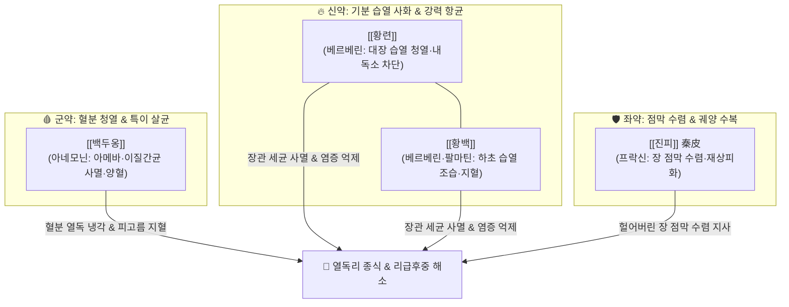

---
aliases:
  - 白頭翁湯
  - Baitouweng-tang
tags:
  - 처방/청열·해독·사화제
  - 청열/청열해독
  - 청열조습
  - 세균성이질
  - 아메바이질
  - 궤양성대장염
  - 상한론
---

# 🍵 [[백두옹탕]] (白頭翁湯, Baitouweng-tang)

> **핵심 3줄 요약 (Key Summary)**:
> - 🌿 기본 구성: [[백두옹]], [[황련]], [[황백]], [[진피]](물푸레나무껍질/진피 秦皮) ([[백두옹]]의 청열해독·양혈과 [[황련]]·[[황백]]의 조습지리, [[진피]]의 수렴지리를 결합한 열리 처방).
> - 🎯 열독(熱毒)으로 인한 급성 세균성 이질, 아메바성 이질, 궤양성 대장염(UC) 급성 발작기, 피와 고름이 섞여 나오는 농혈변(膿血便), 대변 후 뒤가 묵직하고 시원치 않은 리급후중(裏急後重), 복통과 항문 작열감, 발열 및 구갈.
> - 🔬 백두옹 아네모닌(Anemonin)의 항아메바 원충 사멸 및 이질간균 살균, 황련·황백 베르베린(Berberine)의 장관 내독소(LPS) 차단 및 대장 평활근 연축 억제, 진피(물푸레나무껍질) 프락신(Fraxin)의 장 점막 수렴 및 궤양 재상피화 촉진.
> - ⚠️ 주의사항: 한습(寒濕)이나 비신양허(脾腎陽虛)로 인한 맑은 물설사 및 오경설사 금기, 진피(秦皮)를 귤껍질(진피 陳皮)로 오인 조제하지 않도록 감별 필수.

---

## 📌 목차
1. [기본 처방 정보 & 군신좌사 구성](#1-기본-처방-정보--군신좌사-구성)
2. [방제학적 약재 상호작용 & 시너지 네트워크](#2-방제학적-약재-상호작용--시너지-네트워크)
3. [현대 분자약리학적 효능 & 작용 기전](#3-현대-분자약리학적-효능--작용-기전)
4. [적응 병증 및 체질별 감별 (Sweet Spot vs 금기)](#4-적응-병증-및-체질별-감별-sweet-spot-vs-금기)
5. [유사 처방군 감별 매트릭스](#5-유사-처방군-감별-매트릭스)
6. [임상 가감례 & 현대 질환별 응용](#6-임상-가감례--현대-질환별-응용)
7. [💡 사용자 진료실 핵심 필기 & 임상 팁 (원문 보존)](#7--사용자-진료실-핵심-필기--임상-팁-원문-보존)
8. [출처 및 학술 참고 문헌 (References)](#8-출처-및-학술-참고-문헌-references)

---

## 1. 기본 처방 정보 & 군신좌사 구성

* **출전(出典)**: 한대 장중경(張仲景), 《상한론(傷寒論)》 변궐음병맥증병치
* **치법(治法)**: 청열해독(淸熱解毒), 량혈지리(涼血止痢), 청열조습(淸熱燥濕)
* **주치(主治)**: 열독(熱毒)이 대장 혈분에 맺혀 발생하는 열리(熱痢), 하리농혈(피고름 대변), 복통, 리급후중, 항문 작열감

| 구분 | 약재명 | 표준 용량 | 본초 효능 & 방제 내 역할 |
| :--- | :--- | :--- | :--- |
| **군약 (君藥)** | [[백두옹]] | 15g | 청열해독, 양혈지리, 혈분의 열독을 내리고 아메바와 이질균을 강력 살균 |
| **신약 (臣藥)** | [[황련]] | 9g | 청열조습, 사화해독, 중상초 및 대장의 습열을 말리고 장관 염증 즉각 진정 |
| **신약 (臣藥)** | [[황백]] | 9g | 청열조습, 사화퇴열, 하초 대장과 방광의 습열을 끄고 지혈을 보조 |
| **좌약 (佐藥)** | [[진피]] (물푸레나무껍질 秦皮) | 9~12g | 청열조습, 수렴지사, 떫은맛으로 헐어버린 대장 점막 궤양을 수렴 복원 |

> **배오 특징**:
> 1. **혈분(血分)과 기분(氣分)의 동시 청열**: [[백두옹]]이 깊은 혈분의 열독을 식혀 피고름을 멎게 하고, [[황련]]과 [[황백]]이 기분의 습열을 말려 대장 내 세균 번식을 억제합니다.
> 2. **진피(秦皮)의 수렴지사 배합**: 고한한 살균제 일색인 구성에 수렴성 고미를 가진 물푸레나무 껍질([[진피]])을 배오하여 염증으로 허물어진 장 점막 상피를 아물게 합니다. *(주의: 귤껍질 진피 陳皮가 아님)*
> 3. **대장 습열과 후중감의 근원 치료**: 장관 내 혈류 정체와 가스 팽만을 해소하여 화장실을 다녀와도 뒤가 묵직하고 당기는 리급후중(裏急後重)을 소실시킵니다.

---

## 2. 방제학적 약재 상호작용 & 시너지 네트워크

* [[백두옹]] + [[황련]] + [[황백]]: 백두옹의 혈분 해독력과 황련·황백의 기분 조습력이 결합하여, 장벽 깊숙이 침윤된 열독과 표재성 습열을 안팎으로 동시에 씻어냅니다.
* [[황련]] + [[진피]] (물푸레나무껍질): 황련이 병원균을 멸균하고, 진피가 타닌 및 쿨마린 성분으로 궤양 표면에 방어 피막을 입혀 재출혈을 방지합니다.

---

## 3. 현대 분자약리학적 효능 & 작용 기전

1. **이질간균 및 아메바 원충에 대한 강력한 광범위 살균**:
   * [[백두옹]]의 아네모닌(Anemonin)은 이질아메바(Entamoeba histolytica)의 영양형과 피포형을 직접 사멸시키며, [[황련]]·[[황백]]의 베르베린(Berberine)은 시겔라(Shigella dysenteriae), 살모넬라, 병원성 대장균의 세포벽 합성을 억제합니다.
2. **장관 점막 상피세포 염증 신호 차단 및 내독소(LPS) 중화**:
   * 베르베린과 백두옹 사포닌이 대장 상피세포의 TLR4/MyD88/NF-$\kappa$B 경로를 차단하여 TNF-$\alpha$, IL-6, IL-8 등 전염증성 사이토카인 분비를 억제함으로써 점막 괴사를 방어합니다.
3. **대장 평활근 연축 억제 및 점막 상피 수복**:
   * 진피(秦皮)의 프락신(Fraxin)과 에스쿨레틴이 장관 내 수분 분비를 억제하고 장 점막 점액질 합성을 촉진하여 궤양성 미란 부위의 신속한 재상피화를 유도합니다.

---

## 4. 적응 병증 및 체질별 감별 (Sweet Spot vs 금기)

### [✅ 최적 적응증 (Sweet Spot)]
* **급성 세균성 및 아메바성 이질**:
  * 심한 복통과 함께 피와 고름이 섞인 대변(농혈변)을 배출할 때.
  * 대변을 본 후에도 뒤가 무겁고 다시 화장실을 가고 싶은 리급후중(裏急後重).
  * 항문 주위의 화끈거리는 작열감, 신열(발열), 구갈.
* **만성 염증성 장질환 (IBD)**:
  * 궤양성 대장염(Ulcerative colitis) 및 크론병의 급성 발작기 혈변, 점액변.
* **급성 세균성 장염 및 식중독성 혈변**.

### [⚠️ 신중 투여 및 금기]
* **허한성(虛寒性) 설사 절대 금기**: 배가 차고 소화되지 않은 음식물이 그대로 나오며, 피고름이 없이 맑은 물설사만 하는 비신양허(이중탕, 사신환 적응증) 환자에게 투약하면 설사를 폭발적으로 악화시키고 양기를 망가뜨립니다.
* **진피(秦皮)와 진피(陳皮)의 약재 감별 필수**: 귤껍질(진피 陳皮)을 잘못 넣으면 이기제(理氣劑)가 되어 수렴지사 효능이 상실되므로 반드시 물푸레나무 껍질(진피 秦皮)을 사용해야 합니다.

---

## 5. 유사 처방군 감별 매트릭스

| 처방명 | 핵심 배오 차이 | 주치 및 임상 차별점 | 적응증 우선순위 |
| :--- | :--- | :--- | :--- |
| [[백두옹탕]] | [[백두옹]], [[황련]], [[황백]], [[진피]](秦皮) | 대장 혈분 열독, 피고름 대변(농혈변), 리급후중, 아메바·세균 이질 | 급성 이질, 궤양성 대장염 혈변, 농혈 이질 |
| [[갈근황련황금탕]] | 갈근, 황련, 황금, 감초 | 표증 미해 + 이열 협열하리, 폭포수 같은 노란 물설사, 발열 | 급성 세균성 장염 물설사, 로타바이러스 장염 |
| [[작약탕]] | 작약, 당귀, 황련, 황금, 대황, 목향, 빈랑, 육계 | 습열 이질 초기, 복통과 리급후중이 극심하고 기체어혈이 심할 때 | 기체 어혈성 이질 복통, 이질 초기 실증 |
| [[이중탕]] | 인삼, 백출, 건강, 감초 | 비위허한, 손발이 차고 배가 아프며 맑은 물설사 | 허한성 만성 설사, 과민대장증후군 한증 |
| [[사신환]] | 보골지, 오수유, 육두구, 오미자 | 신양허 오경설사(새벽 닭 울 때 설사), 하지냉 | 노인성 만성 새벽 설사, 신양허 설사 |

---

## 6. 임상 가감례 & 현대 질환별 응용

* **궤양성 대장염으로 출혈이 극심할 때**: [[삼칠근]](분말 3g 충복) 또는 [[백급]](6g)을 가미하여 지혈 및 점막 유합을 촉진합니다.
* **하복부 산통과 기체가 심하여 가스가 찰 때**: [[목향]], [[빈랑]]을 가미하여 기분을 소통시키고 후중감을 빠르게 해소합니다.
* **발열이 높고 전신 중독 증상이 동반될 때**: [[금은화]], [[연교]]를 가미하여 전신 해독력을 높입니다.
* **설사가 오래되어 기운이 빠진 만성 궤양성 대장염**: 병세가 꺾인 후 급히 [[황기]], [[백출]], [[당귀]]를 배합하여 부정거사(扶正祛邪)로 전환합니다.

---

## 7. 💡 사용자 진료실 핵심 필기 & 임상 팁 (원문 보존)

> [!tip] **진료실 실전 노하우 (User Clinical Insight)**
> * **열독 하주와 대장 기체의 병리**:
>   * 습열의 독기가 대장에 침범하여 장벽 혈관을 짓무르게 하면 피가 나오고(혈변), 점막이 부패하면 고름이 나옵니다(농변).
>   * 기운이 막혀 대변을 보고 나서도 뒤가 묵직하고 시원치 않은 **리급후중(裏急後重)**이 발생합니다.
>   * [[백두옹]]이 혈분 열독을 식히며 아메바와 세균을 직접 사멸하고, [[황련]]과 [[황백]]이 끈적한 습열을 말리며, **진피(秦皮)**가 헐어버린 점막을 떫은맛으로 수렴하여 지사시킵니다.
> * **핵심 약재 진피(秦皮) 감별 주의 (CRITICAL)**:
>   * 본 방의 진피(秦皮)는 귤껍질(진피 陳皮)이 아니라 **물푸레나무 껍질(Fraxini Cortex)**로, 찬 성질과 수렴 작용으로 장관 점막 궤양을 아물게 하는 약재입니다. 절대 조제 시 혼동하지 않아야 합니다.
> * **처방 감별 공식**:
>   * 열독으로 고름과 피가 섞여 나오고 뒤가 묵직할 때: [[백두옹탕]]
>   * 습열로 인한 단순 설사 및 장염(피 없음): [[갈근황련황금탕]]
>   * 한습이나 비신양허로 인한 맑은 물설사: [[이중탕]] 또는 [[사신환]].

---

## 8. 출처 및 학술 참고 문헌 (References)

1. 張仲景. *傷寒論*. 辨厥陰病脈證幷治 第十二.
   - [연구 요약] 궐음병 하리(下痢)로 갈증이 있고 피고름이 나오는 열리에 백두옹, 황련, 황백, 진피를 투여하는 원전 기재.
2. * **Liu T et al. (2026)**. Comparative pharmacodynamic material basis of oral and colonic administration of Baitouweng decoction in experimental ulcerative colitis. *Journal of ethnopharmacology*, 368: 121805. [PMID: 42092473](https://pubmed.ncbi.nlm.nih.gov/42092473/)
3. * **Xia Q et al. (2025)**. Anemonin suppresses sepsis-induced acute lung injury by inactivation of nuclear factor-kappa B and activation of nuclear factor erythroid 2-related factor-2/heme oxygenase-1 pathway. *FASEB journal : official publication of the Federation of American Societies for Experimental Biology*, 39: e70328. [PMID: 39825692](https://pubmed.ncbi.nlm.nih.gov/39825692/)
