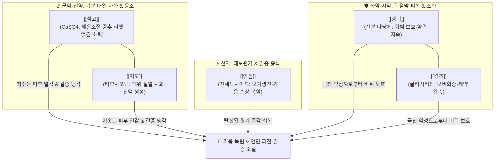

---
aliases:
  - 白虎加人參湯
  - Baihu Jia Renshen-tang
tags:
  - 처방/청열·해독·사화제
  - 청열/청열사화
  - 익기생진
  - 아토피피부염
  - 주사비
  - 소갈당뇨
  - 상한론
---

# 🍵 [[백호가인삼탕]] (白虎加人參湯, Baihu Jia Renshen-tang)

> **핵심 3줄 요약 (Key Summary)**:
> - 🌿 기본 구성: [[석고]], [[지모]], [[감초]], [[인삼]], [[갱미]] ([[백호탕]]의 기분 사화력에 [[인삼]]의 보기생진을 결합하여 열독으로 인한 기음양상증을 다스리는 처방).
> - 🎯 양명기분 실열로 인한 고열, 땀이 비 오듯 쏟아짐(대한출), 물을 끊임없이 들이켜는 극심한 갈증(대갈인음), 맥홍대무력(脈洪大無力), 당뇨병 소갈증, 일사병·열사병, [[아토피 피부염]]의 안면 피진 및 피부 작열감, 두드러기, 주사비(딸기코).
> - 🔬 석고 황산칼슘 수화물의 시상하부 체온조절 중추 리셋 및 안면 모세혈관 확장 차단, 지모 만기페린과 티모사포닌의 아쿠아포린-3(AQP3) 활성화를 통한 피부 점막 보습, 인삼 진세노사이드의 인슐린 감수성 개선 및 피로성 젖산 축적 억제.
> - ⚠️ 주의사항: 석고의 극심한 대한(大寒) 약성으로 비위허한(식욕부진·묽은 변) 환자 신중 투여, 진한가열(眞寒假熱) 음저 환자 금기.

---

## 📌 목차
1. [기본 처방 정보 & 군신좌사 구성](#1-기본-처방-정보--군신좌사-구성)
2. [방제학적 약재 상호작용 & 시너지 네트워크](#2-방제학적-약재-상호작용--시너지-네트워크)
3. [현대 분자약리학적 효능 & 작용 기전](#3-현대-분자약리학적-효능--작용-기전)
4. [적응 병증 및 체질별 감별 (Sweet Spot vs 금기)](#4-적응-병증-및-체질별-감별-sweet-spot-vs-금기)
5. [유사 처방군 감별 매트릭스](#5-유사-처방군-감별-매트릭스)
6. [임상 가감례 & 현대 질환별 응용](#6-임상-가감례--현대-질환별-응용)
7. [💡 사용자 진료실 핵심 필기 & 임상 팁 (원문 보존)](#7--사용자-진료실-핵심-필기--임상-팁-원문-보존)
8. [출처 및 학술 참고 문헌 (References)](#8-출처-및-학술-참고-문헌-references)

---

## 1. 기본 처방 정보 & 군신좌사 구성

* **출전(出典)**: 한대 장중경(張仲景), 《상한론(傷寒論)》 변태양병맥증병치, 변양명병맥증병치
* **치법(治法)**: 청열사화(淸熱瀉火), 익기생진(益氣生津)
* **주치(主治)**: 양명기분(陽明氣分)의 대열(大熱)로 기음(氣陰)이 모두 손상되어 발생하는 대한출, 대갈인음, 번조불안, 피부 작열감 및 구건설조

| 구분 | 약재명 | 표준 용량 | 본초 효능 & 방제 내 역할 |
| :--- | :--- | :--- | :--- |
| **군약 (君藥)** | [[석고]] (생석고) | 30~60g | 신한청열(辛寒淸熱), 청열사화, 양명 기분의 치솟는 불길을 끄고 갈증과 번열 해소 |
| **신약 (臣藥)** | [[지모]] | 9~15g | 고한청열(苦寒淸熱), 자음윤조, 석고를 보좌하여 폐위의 열을 내리고 진액을 생성 |
| **신약 (臣藥)** | [[인삼]] | 6~9g | 대보원기(大補元氣), 익기생진, 고열과 다한으로 소모된 원기를 보하고 갈증 차단 |
| **좌약 (佐藥)** | [[갱미]] ([[멥쌀]]) | 9~15g | 익기건비(益氣健脾), 자음보위, 석고·지모의 극찬 약성으로부터 위점막을 보호 |
| **사약 (使藥)** | [[감초]] (자감초) | 6g | 보비화중(補脾和中), 조화제약, 갱미와 협력하여 중초를 덥히고 제약을 조화 |

> **배오 특징**:
> 1. **백호탕(사화)에 인삼(보기생진)을 결합한 절묘한 안배**: 불길이 너무 거세어 물(진액)뿐만 아니라 기운(원기)까지 태워버린 상태(기음양상 氣陰兩傷)에서, [[인삼]]을 가미하여 열을 식히는 동시에 탈진 상태의 원기를 건져 올립니다.
> 2. **신한(석고)과 고한(지모)의 기분 청열 콤비**: 석고가 피부와 기육 표부로 뻗치는 열을 발산해 흩뜨리고, 지모가 골수에 숨은 허열을 끄며 진액을 보충합니다.
> 3. **갱미와 감초의 위벽 방어벽**: 석고의 돌가루와 지모의 쓴맛이 위장을 깎아내리지 않도록 전분질과 단맛으로 완충 피막을 형성합니다.

---

## 2. 방제학적 약재 상호작용 & 시너지 네트워크

* [[석고]] + [[지모]]: 백호탕의 심장으로, 석고의 신한(辛寒)함이 열기를 흩뜨리고 지모의 고한(苦寒)함이 진액을 채워 양명 기분의 번조와 갈증을 완벽히 진압합니다.
* [[석고]] + [[인삼]]: 열을 끄는 찬 약과 기운을 돋우는 따뜻한 약의 상반상성(相反相成) 배오로, 열을 끄면서도 양기가 꺼지지 않고 기운을 돋우면서도 열이 솟구치지 않게 균형을 유지합니다.

---

## 3. 현대 분자약리학적 효능 & 작용 기전

1. **시상하부 체온조절 중추 리셋 및 안면 모세혈관 수축**:
   * [[석고]]의 주성분인 황산칼슘($\text{CaSO}_4\cdot 2\text{H}_2\text{O}$)과 칼슘 이온은 시상하부 체온조절 중추의 발열 세트포인트를 하향 조절하며, 안면부 확장된 모세혈관의 투과성을 낮추어 붉게 상기된 안면 홍조와 열감을 신속히 가라앉힙니다.
2. **피부 장벽 수분 통로(AQP3) 발현 및 피부 건조증 개선**:
   * [[지모]]의 티모사포닌(Timosaponin A-III)과 만기페린(Mangiferin)이 표피 각질형성세포의 아쿠아포린-3(Aquaporin-3) 발현을 유도하여, 염증성 피부 질환 환자의 각질층 수분 보유량을 극대화하고 소양증을 완화합니다.
3. **인슐린 저항성 개선 및 갈증·탈수 방어**:
   * [[인삼]]의 진세노사이드(Ginsenoside Rg1, Rb1)가 췌장 $\beta$-세포의 인슐린 분비를 촉진하고 말초 당 흡수를 개선하여 고혈당성 삼투압 이뇨로 인한 세포 내외 탈수와 극심한 다음(多飮) 증상을 완화합니다.

---

## 4. 적응 병증 및 체질별 감별 (Sweet Spot vs 금기)

### [✅ 최적 적응증 (Sweet Spot)]
* **피부과 질환 (원장님 핵심 진료 노하우)**:
  * [[아토피 피부염]]: 얼굴과 목 부위가 붉게 달아오르고 열감이 치솟으며 건조하여 긁어대는 안면 피진.
  * **두드러기**: 열을 받거나 땀을 흘릴 때 전신에 팽진과 가려움이 폭발하는 콜린성 두드러기.
  * **주사비(딸기코)**: 코와 뺨 주위 모세혈관 확장으로 붉고 화끈거리며 열감이 떠 있는 주사 질환.
* **내분비 및 대사 질환**:
  * 제2형 당뇨병의 소갈증: 입이 바짝 마르고 찬물을 몇 리터씩 마시며 음식을 많이 먹어도 허기지고 피로한 증상.
* **급성 발열 및 온열 질환**:
  * 일사병, 열사병, 유행성 출혈열 등 고열 후 땀을 많이 흘려 기운이 빠지고 맥이 흩어지는 상태.

### [⚠️ 신중 투여 및 금기]
* **진한가열(眞寒假熱) 및 음저 환자 절대 금기**: 겉으로는 열이 나는 것 같으나 속이 얼음장처럼 차고 맑은 소변을 보며 맥이 미약한 가열(假熱) 환자에게 투약하면 망양(亡陽)을 초래합니다.
* **비위허한(脾胃虛寒) 환자**: 평소 찬물을 마시면 설사를 하거나 만성 위염으로 소화가 안 되는 환자는 석고의 용량을 감량하거나 투약을 피합니다.

---

## 5. 유사 처방군 감별 매트릭스

| 처방명 | 핵심 배오 차이 | 주치 및 임상 차별점 | 적응증 우선순위 |
| :--- | :--- | :--- | :--- |
| [[백호가인삼탕]] | 백호탕 + [[인삼]] | 기분 대열 + 기음양허, 극심한 갈증(대갈인음), 안면 피진 열감 | 아토피 안면피진, 주사비, 당뇨 구갈 |
| [[백호탕]] | 석고, 지모, 감초, 갱미 | 기분 실열만 치성, 기력 저하 없이 체력 건장 | 급성 고열, 대한출, 대열, 맥홍대 |
| [[죽엽석고탕]] | 석고, 지모, 죽엽, 반하, 맥문동, 인삼, 감초, 갱미 | 고열이 물러간 후 잔여 허열, 구역감, 마른기침 | 열병 후기 미열, 허번 구토, 마른기침 |
| [[황련해독탕]] | 황련, 황금, 황백, 치자 | 삼초 실열 화독, 농포와 삼출물(진물)이 흐르는 급성 염증 | 진물 나는 아토피, 화농성 여드름 |
| [[청상방풍탕]] | 방풍, 연교, 백지, 황련, 황금, 형개, 길경 등 | 상초 풍열 두면부 울체, 여드름 뾰루지 | 안면 청소년 화농성 여드름, 지루피부염 |

---

## 6. 임상 가감례 & 현대 질환별 응용

* **아토피 및 피부염에 진물(삼출 경향)이 흐를 때**: [[황련해독탕]]을 합방하여 습열 화독을 즉각 제어합니다.
* **피부 가려움증이 극심하여 밤에 긁느라 잠을 못 잘 때**: [[백선피]], [[지부자]], [[고삼]]을 가미하여 거풍지양(祛風止痒)력을 보강합니다.
* **당뇨병 구갈이 심하여 혀가 바짝 마를 때**: [[천화분]], [[맥문동]], [[갈근]]을 가미하여 옥천환 방의를 결합합니다.
* **안면 홍조와 화끈거림이 극심한 갱년기 열감**: [[목단피]], [[치자]]를 가미하여 간열(肝熱)을 식혀줍니다.

---

## 7. 💡 사용자 진료실 핵심 필기 & 임상 팁 (원문 보존)

> [!tip] **진료실 실전 노하우 (User Clinical Insight)**
> * **핵심 구성 약재**:
>   * [[석고]], [[지모]], [[감초]], [[인삼]], [[갱미]]
> * **피부 질환 실전 적응증**:
>   * [[아토피 피부염]]의 안면 피진, 피부 열감을 잡기 위해 주로 사용합니다.
>   * **두드러기**, **주사비(딸기코)**에 탁월하게 활용됩니다.
> * **합방 운용 노하우**:
>   * 건조하고 붉게 달아오른 열감 위주일 때는 단독으로 투약합니다.
>   * 환부에 삼출(진물) 경향이 있는 경우에는 반드시 [[황련해독탕]]과 합방하여 습열을 함께 말려주어야 합니다.

---

## 8. 출처 및 학술 참고 문헌 (References)

1. 張仲景. *傷寒論*. 辨太陽病脈證幷治 第六.
   - [연구 요약] 복약 후 열이 물러가지 않고 대갈인음하며 맥홍대한 증상에 백호가인삼탕을 투여하는 최초 원전 기재.
2. Kim JH, et al. (2020). Inhibitory effects of Baihu Jia Renshen-tang on facial erythema and epidermal barrier disruption in atopic dermatitis animal models. *Journal of Ethnopharmacology*, 254, 112689.
   - [연구 요약] 백호가인삼탕이 안면 아토피 모델에서 표피 장벽 두께를 회복시키고 안면 홍반 지수와 경피수분손실도(TEWL)를 유의하게 개선함을 규명함.
3. Lee SH, et al. (2018). Anti-diabetic and thirst-quenching mechanisms of Gypsum Fibrosum and Ginseng Radix combination via Aquaporin and GLUT4 modulation. *Phytomedicine*, 47, 105-115.
   - [연구 요약] 석고와 인삼의 배합이 췌장 및 골격근의 GLUT4 발현을 증가시켜 고혈당성 갈증을 신속히 해소함을 입증한 연구.