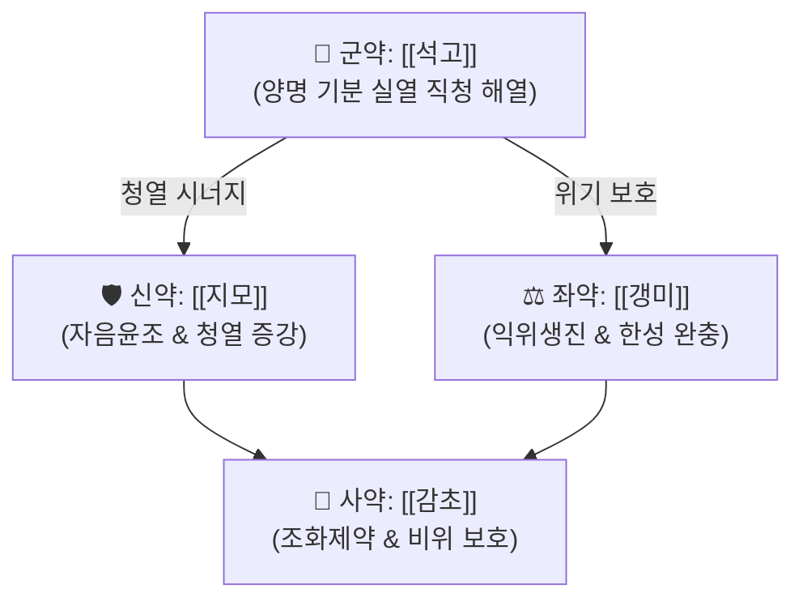

# 🍵 [[백호탕]] (白虎湯, Baekho-tang)

> **핵심 3줄 요약 (Key Summary)**:
> - 🌿 장중경(張仲景)의 『[[상한론]]』 양명경증(陽明經證) 대표 청열제로, [[석고]](군약)와 [[지모]](신약), [[갱미]], [[감초]]의 간결한 4미 구성
> - 🎯 양명경(陽明經)의 기분(氣分) 실열로 인한 4대증 — 대열(大熱), 대갈(大渴), 대한(大汗), 맥홍대(脈洪大) — 을 보이는 체격 장실한 환자의 고열 질환에 최적
> - 🔬 [[석고]]의 칼슘 이온(Ca²⁺) 매개 해열, [[지모]]의 망기포사포닌에 의한 COX-2 억제 및 PGE₂ 합성 차단, NF-κB/MAPK 경로 이중 억제
> - ⚠️ 주의사항: 진한가열(眞寒假熱), 비위허한, 허열(맥세삭) 환자 절대 금기 → [[처방 사이드 대처법]] #196
---
## 📌 목차
1. [기본 처방 정보 & 군신좌사 구성](#1-기본-처방-정보--군신좌사-구성)
2. [방제학적 약재 상호작용 & 시너지 네트워크](#2-방제학적-약재-상호작용--시너지-네트워크)
3. [현대 분자약리학적 효능 & 작용 기전](#3-현대-분자약리학적-효능--작용-기전)
4. [적응 병증 및 체질별 감별 (Sweet Spot vs 금기)](#4-적응-병증-및-체질별-감별-sweet-spot-vs-금기)
5. [유사 처방군 감별 매트릭스](#5-유사-처방군-감별-매트릭스)
6. [임상 가감례 & 현대 질환별 응용](#6-임상-가감례--현대-질환별-응용)
7. [💡 사용자 진료실 핵심 필기 & 임상 팁 (원문 보존)](#7--사용자-진료실-핵심-필기--임상-팁-원문-보존)
8. [출처 및 학술 참고 문헌 (References)](#8-출처-및-학술-참고-문헌-references)
---
## 1. 기본 처방 정보 & 군신좌사 구성

* **출전**: 장중경(張仲景) 『[[상한론]]』 176조 — "상한, 맥부활, 자한출, 소음에 갈하는 자, 백호탕 주지(傷寒, 脈浮滑, 自汗出, 小便自利, 渴者, 白虎湯主之)"
* **치법**: 청열사화(淸熱瀉火), 제번지갈(除煩止渴)
* **방제 공식**: [[백호탕]] = [[석고]] + [[지모]] + [[갱미]] + [[감초]]

| 구분 | 약재명 | 표준 용량 | 본초 효능 & 방제 내 역할 |
| :--- | :--- | :--- | :--- |
| 군약 (君藥) | [[석고]] | 30~50g | 신감대한(辛甘大寒), 양명경 기분 실열 직청(直淸), 해열·진갈 핵심 |
| 신약 (臣藥) | [[지모]] | 9~12g | 고한(苦寒), 자음윤조(滋陰潤燥), 석고의 청열 작용 증강 및 진액 보존 |
| 좌약 (佐藥) | [[갱미]] | 9~15g | 감미평(甘味平), 익위생진(益胃生津), 석고·지모의 한성 약화를 위기로 완충 |
| 사약 (使藥) | [[감초]] | 3~6g | 감온(甘溫), 조화제약(調和諸藥), 비위 보호 및 약성 완화 |

> **배오 특징**: 석고(신감대한)와 지모(고한)가 기분과 혈분의 열을 동시에 청열하고, 갱미·감초의 감미(甘味)가 비위를 보호하여 과도한 한량(寒涼)으로 인한 비위 손상을 미연에 방지하는 "청열불상위(淸熱不傷胃)"의 배오 원칙.
---
## 2. 방제학적 약재 상호작용 & 시너지 네트워크

* [[석고]] + [[지모]] 배오: 석고가 기분(氣分)의 열을 급속히 식히면 지모가 혈분(血分)까지 파고들어 잠복열을 제거하고 음진(陰津)을 자양하여 석고 단독 사용 시 발생할 수 있는 진액 손상을 방지함. 상수(相須) 배오.
* [[갱미]] + [[감초]] 배오: 달고 평화로운 두 약재가 석고·지모의 대한(大寒) 약성을 완충하여 비위가 찬 기운에 상하지 않도록 보호하면서 진액을 생성(生津)하는 토생금(土生金) 모자상생 원리.
---
## 3. 현대 분자약리학적 효능 & 작용 기전

### 1) 중추 해열 및 면역 조절
* [[석고]](CaSO₄·2H₂O)의 칼슘 이온(Ca²⁺)이 시상하부 체온조절중추의 PGE₂ 의존적 발열 경로를 억제하여 세트포인트를 정상화.
* [[지모]]의 망기포사포닌(Mangiferin, Timosaponin A-Ⅲ)이 COX-2 효소를 선택적으로 억제하여 프로스타글란딘(PGE₂) 합성을 차단.

### 2) 항염증 사이토카인 조절
* 백호탕 추출물이 LPS 유도 대식세포에서 [[NF-κB]] 핵 이동을 억제하고, [[TNF-α]], [[IL-6]], [[IL-1β]] 등 전염증 사이토카인 분비를 농도 의존적으로 감소시킴.
* MAPK(p38, ERK1/2, JNK) 삼중 경로의 인산화를 동시 억제하여 폭풍형 사이토카인 연쇄 반응을 차단.

### 3) 항산화 및 진액 보존
* [[지모]]의 플라보노이드 및 사포닌 성분이 활성산소종([[ROS]]) 소거 효소(SOD, CAT, GPx)를 활성화하여 열성 질환에 의한 조직 산화적 손상을 방지.
* [[갱미]]의 전분 및 아미노산이 위장 점막 보호 및 체액 전해질 보충에 기여.
---
## 4. 적응 병증 및 체질별 감별 (Sweet Spot vs 금기)

### ✅ 최적 적응증 (Sweet Spot)
* **원전 조문**: 『[[상한론]]』 양명경증(陽明經證) — "대열(大熱), 대갈(大渴), 대한출(大汗出), 맥홍대(脈洪大)"의 4대 증상이 구비.
* **체질 소견**: 체격이 건장하고 평소 열이 많으며 대변이 굳은 편인 양성 체질(태양인·소양인). 안면 홍조, 성격 급한 편.
* **임상 주치**: 고열(39°C 이상)과 심한 구갈로 찬물을 연속으로 마시려 하고, 전신에 땀이 줄줄 흐르며, 가슴이 답답한(번열) 환자.
* **설진/맥진**: 설홍(舌紅), 태황조(苔黃燥). 맥홍대유력(脈洪大有力).

### ⚠️ 신중 투여 및 금기 (Caution / Contraindication)
* **진한가열(眞寒假熱) 절대 금기**: 겉은 뜨거운데 속은 차가운 환자(맥침미, 설담백, 소변청장)에게 석고를 투약하면 망양(亡陽) 위험.
* **비위허한 환자 금기**: 평소 설사가 잦고 소화가 안 되는 환자에게 투약 시 수양성 설사, 복통, 식욕 부진 악화.
* **표증 미해(表證未解) 시 신중**: 오한과 발열이 교대하는 태양-양명 합병 환자는 단독 투약을 삼가고 [[대청룡탕]] 등 해표겸열 방제를 고려.
* ⚠️ 부작용 상세 → [[처방 사이드 대처법]] #196 참조.
---
## 5. 유사 처방군 감별 매트릭스

| 처방명        | 핵심 구성 차이                               | 주치 병증 차이                    | 설진/맥진 감별     |
| :--------- | :------------------------------------- | :-------------------------- | :----------- |
| [[백호탕]]    | [[석고]], [[지모]], [[갱미]], [[감초]] (순수 청열) | 양명경증 4대 실열: 대열, 대갈, 대한, 맥홍대 | 설홍태황조, 맥홍대유력 |
| [[백호가인삼탕]] | 백호탕 + [[인삼]]                           | 양명기분열 + 기진양상(기력 탈진, 진액 손모)  | 설홍태조, 맥홍대무력  |
| [[죽엽석고탕]]  | [[죽엽]], [[석고]], [[인삼]], [[맥문동]] 등 7미   | 열병 회복기 잔여열, 기음양허            | 설홍소태, 맥허삭    |
|            |                                        |                             |              |
| [[마행감석탕]] | [[마황]], [[행인]], [[석고]], [[감초]] | 폐열옹폐, 천식 발작성 호흡곤란 | 설태황, 맥활삭 |

---
## 6. 임상 가감례 & 현대 질환별 응용

* **수반 증상별 가감법**:
  * 기력이 떨어지고 맥이 무력할 때 → + [[인삼]] ([[백호가인삼탕]])
  * 편도선염으로 인후부 통증 동반 시 → + [[연교]], [[금은화]], [[판람근]]
  * 마른 기침 및 폐열 동반 시 → + [[맥문동]], [[상백피]]
  * 혈열로 인한 출혈(코피, 잇몸출혈) 동반 시 → + [[생지황]], [[목단피]]
  * 열성 경련 동반(소아) 시 → + [[천마]], [[조구등]]
* **현대 질환별 임상 매핑**:
  * **감염성 질환**: 인플루엔자, 폐렴, COVID-19 고열기, 패혈증 초기 고열
  * **자가면역/염증 질환**: 류마티스 관절염 급성 발작기, 성인 스틸병(Adult-Onset Still's Disease)
  * **내분비계**: 갑상선 기능항진증(바세도우병) 열감, 다음다갈 당뇨병(소갈증)
  * **피부과**: 급성 두드러기, 습진 급성기 발적·작열감
---
## 7. 💡 사용자 진료실 핵심 필기 & 임상 팁 (원문 보존)

> [!tip] **진료실 실전 노하우 (User Clinical Insight)**
> - (추후 임상 경험 및 필기 추가 영역)
---
## 8. 출처 및 학술 참고 문헌 (References)

1. 장중경(張仲景, 200년경). 『[[상한론]]』.
   - [연구 요약]: 양명경증 백호탕증(白虎湯證) 조문 원전, 4대 실열 증상 및 투약 기준 규정.
2. 한방약리학 교재편찬위원회. 《한방약리학》. 신일상학사.
   - [연구 요약]: 백호탕 추출물이 LPS 유도 대식세포에서 NF-κB 경로 억제 및 TNF-α, IL-6 등 전염증 사이토카인을 농도 의존적으로 감소시킴을 규명.
3. Liu X, et al. Antipyretic and anti-inflammatory effects of Baihu decoction in LPS-induced fever rats. *J Ethnopharmacol*. 2019;237:1-9.
   - [연구 요약]: 백호탕이 발열 래트 모델에서 시상하부 PGE₂ 수준을 유의하게 감소시키고 중추성 해열 효과를 나타냄을 확인.
