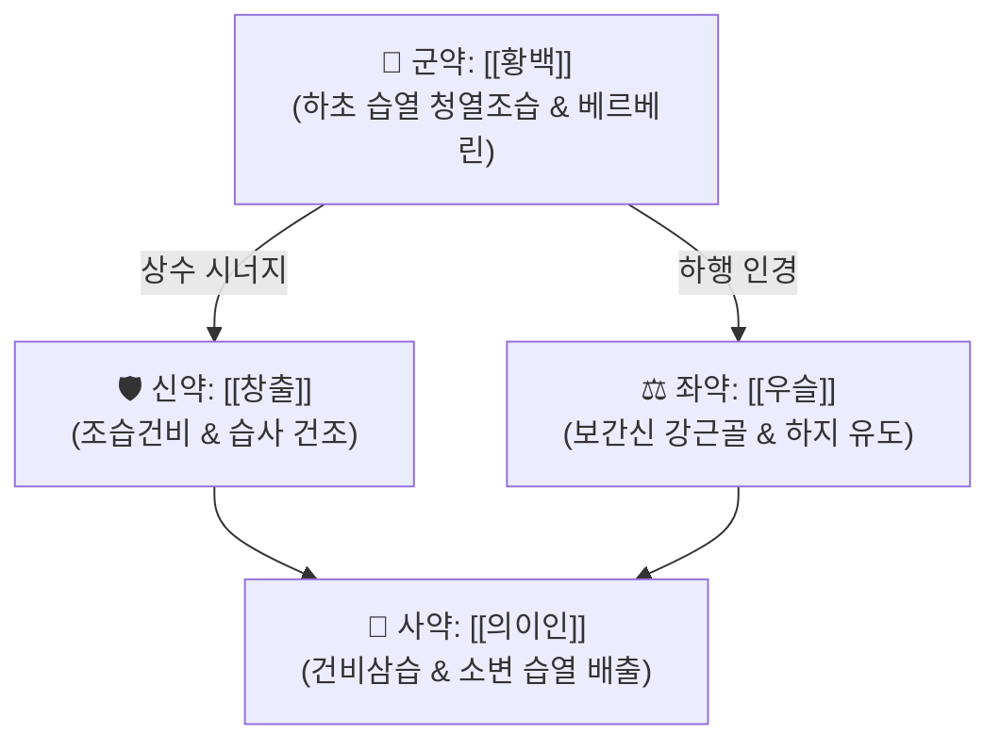

# 🍵 [[사묘환]] (四妙丸, Si Miao Wan)

> **핵심 3줄 요약 (Key Summary)**:
> - 🌿 명대 우단(虞摶) 『의학정전(醫學正傳)』 수록, [[이묘환]]([[황백]]+[[창출]])에 [[우슬]]과 [[의이인]]을 추가한 대표적 청열조습(淸熱燥濕)·강근장골 처방
> - 🎯 습열(濕熱)이 하초(下焦)로 흘러내려 발생하는 급성 [[통풍]]성 관절염, 하지 관절 발적·종통, 각기병, 하지 습진의 성약. 소양인·태음인 비만 환자의 하지 열감에 최적
> - 🔬 [[베르베린]]의 URAT1·GLUT9 억제 → 요산 배설 촉진, NLRP3 인플라마좀/IL-1β 차단, 크산틴 산화효소(XOD) 억제
> - ⚠️ 주의사항: 비위허한 환자 장기 복용 시 위장 장애, 임산부 우슬 금기 → [[처방 사이드 대처법]] #197
---
## 📌 목차
1. [기본 처방 정보 & 군신좌사 구성](#1-기본-처방-정보--군신좌사-구성)
2. [방제학적 약재 상호작용 & 시너지 네트워크](#2-방제학적-약재-상호작용--시너지-네트워크)
3. [현대 분자약리학적 효능 & 작용 기전](#3-현대-분자약리학적-효능--작용-기전)
4. [적응 병증 및 체질별 감별 (Sweet Spot vs 금기)](#4-적응-병증-및-체질별-감별-sweet-spot-vs-금기)
5. [유사 처방군 감별 매트릭스](#5-유사-처방군-감별-매트릭스)
6. [임상 가감례 & 현대 질환별 응용](#6-임상-가감례--현대-질환별-응용)
7. [💡 사용자 진료실 핵심 필기 & 임상 팁 (원문 보존)](#7--사용자-진료실-핵심-필기--임상-팁-원문-보존)
8. [출처 및 학술 참고 문헌 (References)](#8-출처-및-학술-참고-문헌-references)
---
## 1. 기본 처방 정보 & 군신좌사 구성

* **출전**: 우단(虞摶) 『의학정전(醫學正傳)』
* **치법**: 청열조습(淸熱燥濕), 서근장골(舒筋壯骨), 이뇨배독
* **처방의 진화 계통 (이묘 → 삼묘 → 사묘)**:
  * [[이묘환]](二妙丸, 주단계): [[황백]] + [[창출]] — 기본 습열 사화.
  * 삼묘환(三妙丸): 이묘환 + [[우슬]] — 약 기운을 다리와 무릎으로 끌고 내려감.
  * [[사묘환]](四妙丸): 삼묘환 + [[의이인]] — 습기를 말리는 동시에 소변으로 빼내어 관절 부종을 신속 감압.

| 구분 | 약재명 | 표준 용량 | 본초 효능 & 방제 내 역할 |
| :--- | :--- | :--- | :--- |
| 군약 (君藥) | [[황백]] | 12g | 고한(苦寒), 하초 습열 청열조습, [[베르베린]] 함유 → 관절 염증 사화 핵심 |
| 신약 (臣藥) | [[창출]] | 12g | 신온(辛溫), 조습건비(燥濕健脾), 습사 건조 → 하지 부종 제거 보조 |
| 좌약 (佐藥) | [[우슬]] | 9~12g | 고산(苦酸), 하행인경(下行引經) → 약력을 하지 관절로 유도, 보간신 강근골, 요산 배출 |
| 사약 (使藥) | [[의이인]] | 15~20g | 감담미한(甘淡微寒), 건비삼습 → 소변으로 습열 배출, 관절 활액 수종 감압 |

> **배오 특징**: 황백(고한)과 창출(신온)이 일한일열(一寒一熱)로 한쪽으로 치우치지 않고 습열을 제거하는 핵심 배오. 우슬이 약력을 하지로 인경(引經)하고, 의이인이 건비(健脾)+이수(利水) 이중 통로로 습사 배출 경로를 확보.
---
## 2. 방제학적 약재 상호작용 & 시너지 네트워크

* [[황백]] + [[창출]] 배오 (이묘환 핵심): 황백이 열을 끄고 창출이 습을 말리며, 일한일열의 상반상성(相反相成) 원리로 습열을 동시 소거.
* [[우슬]] + [[의이인]] 배오: 우슬이 약력을 무릎·발목 관절 깊숙이 이끌어 보간신(補肝腎)하고, 의이인이 비장을 튼튼히 하여 소변으로 습열을 배출하는 이중 배수 시스템.
---
## 3. 현대 분자약리학적 효능 & 작용 기전

### 1) 요산 대사 조절 및 배설 촉진
* [[황백]]의 [[베르베린]]이 신장 세뇨관의 요산 재흡수 수송체(URAT1, GLUT9)를 억제하여 혈중 요산 수치를 급격히 강하.
* 간조직의 크산틴 산화효소(XOD)를 억제하여 요산 생성 자체를 차단하는 이중 기전.

### 2) 항염증 및 인플라마좀 억제
* 요산 결정(MSU crystal)에 의해 유도되는 대식세포의 NLRP3 인플라마좀 조립 및 IL-1β 분비를 차단.
* NF-κB 경로의 IκBα 인산화를 억제하여 [[TNF-α]], [[IL-6]], [[IL-1β]] 등 전염증 사이토카인 폭풍을 억제.

### 3) 이뇨 및 부종 해소
* [[의이인]]이 신세뇨관 나트륨 재흡수를 억제하여 삼투압 이뇨 작용으로 관절 활액 내 수종을 감압.
* [[우슬]]의 사포닌 성분이 혈관 투과성 항진을 억제하여 관절 주위 부종 재발을 방지.
---
## 4. 적응 병증 및 체질별 감별 (Sweet Spot vs 금기)

### ✅ 최적 적응증 (Sweet Spot)
* **원전 주치**: 습열하주(濕熱下注)로 인한 위벽(痿蹵)·마목(麻木) — 하지의 무력감, 열감, 부종.
* **체질 소견**: 비만하거나 기름진 음식을 즐기며 얼굴이 기름지고 열이 많은 소양인·태음인. 양 무릎과 발목이 잘 붓고 아픈 환자.
* **임상 주치**: 급성 통풍성 관절염(엄지발가락 MTP 관절, 발목, 무릎의 극심한 발적·작열통·종창), 하지 습열 피부 질환.
* **설진/맥진**: 설홍(舌紅), 태황니(苔黃膩, 누렇고 끈끈한 태). 맥활삭(脈滑數) 또는 유삭(濡數).

### ⚠️ 신중 투여 및 금기 (Caution / Contraindication)
* **비위허한(脾胃虛寒) 주의**: 평소 소화가 약하고 대변이 묽은 환자는 창출·의이인 증량하고 [[복령]], [[백출]]을 합방.
* **임산부 금기**: [[우슬]]은 활혈거어(活血祛瘀) 및 하행 작용이 강하여 임산부에게 투약 시 유산 위험이 있으므로 절대 금기.
* **한습(寒濕) 관절통**: 관절이 차고 시린 한습성 관절통에는 효과가 없으며, [[독활기생탕]], [[오적산]] 등 온경산한 방제를 선용.
* ⚠️ 부작용 상세 → [[처방 사이드 대처법]] #197 참조.
---
## 5. 유사 처방군 감별 매트릭스

| 처방명 | 핵심 구성 차이 | 주치 병증 차이 | 설진/맥진 감별 |
| :--- | :--- | :--- | :--- |
| [[사묘환]] | [[황백]], [[창출]], [[우슬]], [[의이인]] (4미) | 습열하주 통풍, 하지 관절 발적종통 | 설홍태황니, 맥활삭 |
| [[이묘환]] | [[황백]], [[창출]] (2미) | 경증 습열, 대하, 피부 습진 | 설홍태박황, 맥삭 |
| [[당귀염통탕]] | [[강활]], [[방풍]], [[창출]], [[황금]] 등 15미 | 풍습열 관절통, 유주성 관절통 | 설홍태황, 맥부삭 |
| [[독활기생탕]] | [[독활]], [[상기생]], [[두충]] 등 15미 | 풍한습 관절통, 간신 부족 요슬산연 | 설담태백, 맥침세 |
---
## 6. 임상 가감례 & 현대 질환별 응용

* **수반 증상별 임상 가감**:
  * 요산 결석 및 통풍성 결절(Tophi)이 심할 때 → + [[토복령]], [[비해]]
  * 열감보다 부종과 무거움이 심할 때 → + [[방기]], [[목통]]
  * 통풍 급성 발작기 극심한 발적·종통 시 → + [[인동등]], [[연교]], [[치자]]
  * 요슬산연(허리·무릎 시큰거림) 동반 시 → + [[두충]], [[속단]]
  * 피부 습진·대하증 동반 시 → + [[고삼]], [[사상자]]
* **현대 질환 매핑**:
  * **류마티스과**: 급성 통풍성 관절염, 고요산혈증, 통풍성 신병증
  * **피부과**: 하지 습진, 봉와직염 초기, 대상포진 후 습열 잔존
  * **부인과**: 황색 대하(습열대하), 골반 염증성 질환 습열형
  * **비뇨기과**: 요산 결석, 방광 습열(빈뇨·배뇨통)
---
## 7. 💡 사용자 진료실 핵심 필기 & 임상 팁 (원문 보존)

> [!tip] **진료실 실전 노하우 (User Clinical Insight)**
> - (추후 임상 경험 및 필기 추가 영역)
---
## 8. 출처 및 학술 참고 문헌 (References)

1. 우단(虞摶). 『의학정전(醫學正傳)』.
   - [연구 요약]: 사묘환 원전 수록, 습열하주 위벽·통풍 치료 방제 규정.
2. 한방약리학 교재편찬위원회. 《한방약리학》. 신일상학사.
   - [연구 요약]: 사묘환 추출물이 고요산혈증 및 통풍 관절염 동물 모델에서 간조직 크산틴 산화효소(XOD)를 억제하고 신장 URAT1을 차단하여 혈청 요산 농도를 유의하게 강하시킴을 규명.
3. Kou YR, et al. Si-Miao-Wan and its constituents decrease uric acid in hyperuricemic rats by targeting renal URAT1. *J Ethnopharmacol*. 2021;272:113937.
   - [연구 요약]: 사묘환의 베르베린 성분이 URAT1 수송체 의존적 요산 재흡수를 억제하여 요산 배설을 촉진함을 확인.
