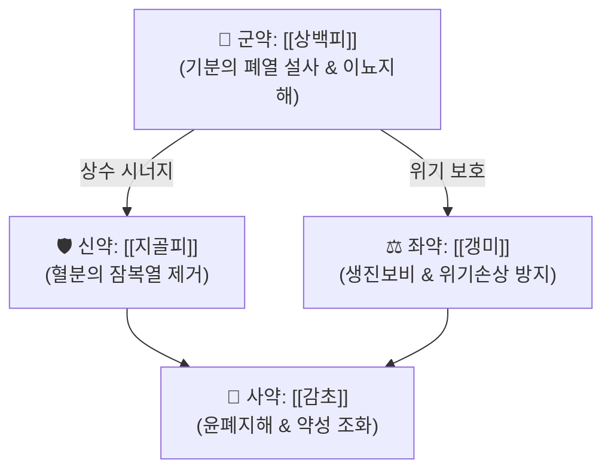

# 🍵 [[사백산]] (瀉白散, Saebaek-san)

> **핵심 3줄 요약 (Key Summary)군약 (君藥)신약 (臣藥)좌약 (佐藥)사약 (使藥)** | [[감초]] | 4g | 윤폐지해(潤肺止咳), 제약 조화 |

---

## 2. 방제학적 약재 상호작용 & 시너지 네트워크

* **청사(淸瀉)와 익위(益胃)의 배합**:
  * 폐는 조(燥)를 싫어하고 습(濕)을 좋아하며, 찬 약을 과도하게 쓰면 폐기(肺氣)가 위축될 수 있습니다.
  * 상백피와 지골피의 성미는 달고 차며(甘寒), 대황·황련처럼 쓰고 찬 약(苦寒)으로 폐기를 상하게 하지 않고 맑게 열을 내려줍니다.
  * 갱미와 감초를 배오하여 모자상생(母子相生, 토생금) 원리로 비위의 진액을 북돋아 폐음(肺陰)을 보존합니다.

---

## 3. 현대 분자약리학적 효능 & 작용 기전

* **항염증 및 기도 과민성 억제**:
  * 상백피의 플라보노이드 성분([[모루신]], 쿠와논)이 [[NF-κB]] 경로 활성화를 차단하여 기관지 상피세포의 [[TNF-α]], [[IL-6]], IL-8 분비를 억제.
* **기관지 평활근 이완 및 거담 진해 작용**:
  * 지골피의 베타인 및 페놀산 성분이 기관지 평활근 세포 내 칼슘 유입을 조절하여 기도 연축을 완화하고 점액 과분비를 억제.
* **항산화 및 폐 조직 보호**:
  * 활성산소종([[ROS]]) 제거를 통해 폐포 및 모세혈관의 산화적 손상을 방지하고 혈관 투과성 항진을 억제.

---

## 4. 적응 병증 및 체질별 감별 (Sweet Spot vs 금기)

### ✅ 최적 적응증 (Sweet Spot)
* **폐열복화(肺熱伏火) 증후**:
  * 기침이 잦고 숨이 차며 가래가 누렇거나 적고 끈끈함.
  * 피부가 건조하고 오후가 되면 얼굴에 홍조가 돌거나 미열(오후 조열)이 발생.
  * 소아의 만성 해수, 백일해 회복기, 알레르기성 천식 초기.
* **설진 및 맥진**:
  * **설진(舌診)**: 설홍(舌紅), 태박황(苔薄黃).
  * **맥진(脈診)**: 맥세삭(脈細數) 또는 부삭(浮數).

### ⚠️ 신중 투여 및 금기 (Caution / Contraindication)
* **풍한외감(風寒外感) 금기**:
  * 오한, 발열, 두통, 맑고 묽은 콧물과 가래를 동반하는 풍한표증에는 사백산을 쓰지 않고 [[마황탕]], [[소청룡탕]] 등을 투여.
* **비위허한(脾胃虛寒) 주의**:
  * 평소 소화가 잘 안 되고 대변이 묽은 환자는 갱미를 증량하고 [[백출]], [[복령]]을 합방하여 위장관 장애를 예방.

---

## 5. 유사 처방군 감별 매트릭스

| 처방명 | 핵심 구성 차이 | 주치 병증 차이 | 설진/맥진 감별 |
| :--- | :--- | :--- | :--- |
| [[사백산]] | [[상백피]], [[지골피]], [[감초]], [[갱미]] | 폐열복화, 해수천급, 오후 조열 | 설홍태박황, 맥세삭 |
| [[마행감석탕]] | [[마황]], [[행인]], [[감초]], [[석고]] | 외감열사 옹폐, 신열, 천식 발작 | 설태황, 맥활삭 |
| [[청폐탕]] | 황금, 치자, 맥문동, 상백피 등 16미 | 만성 폐열 담화, 점조한 누런 가래 | 설홍태황니, 맥활삭 |
| [[백합고금탕]] | 백합, 숙지황, 생지황, 패모 등 | 폐신음허, 객혈, 도한, 만성 인후건조 | 설홍소태, 맥세삭 |

---

## 6. 임상 가감례 & 현대 질환별 응용

* **수반 증상별 임상 가감**:
  * 가래가 끈끈하고 뱉기 어려울 때 $\rightarrow$ + [[패모]], [[과루인]]
  * 폐열이 심하여 열감이 뚜렷할 때 $\rightarrow$ + [[황금]], [[지모]]
  * 기침이 심하고 숨이 가쁠 때 $\rightarrow$ + [[행인]], [[소자]]
  * 마른 기침과 구갈이 심할 때 $\rightarrow$ + [[맥문동]], [[천화분]]
* **현대 질환 매핑**:
  * 소아 급만성 기관지염, 소아 천식(기관지 천식 경증), 마이코플라스마 폐렴 회복기 잔여 기침.

---

## 7. 출처 및 학술 참고 문헌 (References)
* Qian Y. *Xiao'er Yaozheng Zhijue* (Key to Therapeutics of Children's Diseases). 1119.
  * `[연구 요약]`: 사백산 원전 수록, 소아 폐열 복화로 인한 해수 및 천명 치료 방제 규정.
* Kim SH, et al. Inhibitory effects of Saebaek-san on airway inflammation in an ovalbumin-induced allergic asthma mouse model. *BMC Complement Altern Med*. 2017;17(1):345.
  * `[연구 요약]`: 사백산의 천식 모델 기도 내 호산구 침윤 감소 및 Th2 사이토카인(IL-4, IL-5, IL-13) 억제 효과 입증.
