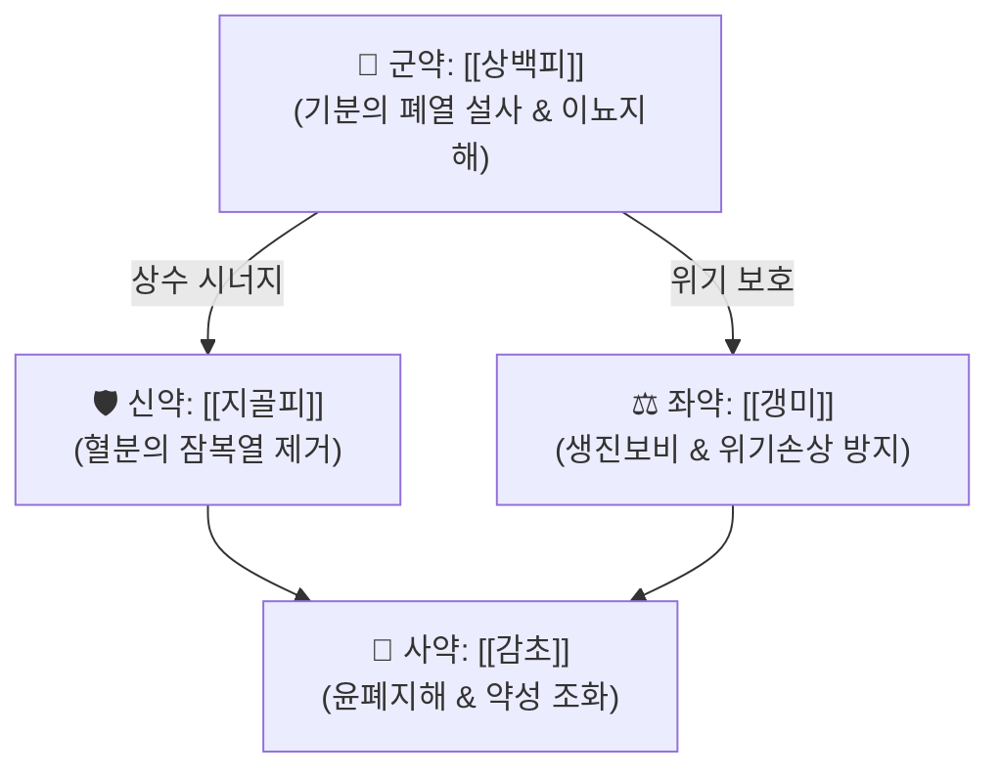

# 🍵 [[사백산]] (瀉白散, Sabaek-san)

> **핵심 3줄 요약 (Key Summary)**:
> - 🌿 기본 구성: [[상백피]], [[지골피]], [[갱미]], [[감초]] ([[상백피]]의 사폐평천과 [[지골피]]의 청열량혈, [[갱미]]·[[감초]]의 양위생진을 배합한 청폐사열 처방).
> - 🎯 폐열복화(肺熱伏火)로 인한 만성 해수, 오후 조열, 피부 건조·홍조를 보이는 소아·성인 기관지 질환에 최적
> - 🔬 [[상백피]]의 [[모루신]](Morusin) 및 쿠와논(Kuwanon)에 의한 NF-κB 차단, [[TNF-α]]/[[IL-6]] 억제 및 기관지 평활근 이완
> - ⚠️ 주의사항: 풍한외감(오한·맑은 콧물) 시 금기, 비위허한 시 위장 장애
---
## 📌 목차
1. [기본 처방 정보 & 군신좌사 구성](#1-기본-처방-정보--군신좌사-구성)
2. [방제학적 약재 상호작용 & 시너지 네트워크](#2-방제학적-약재-상호작용--시너지-네트워크)
3. [현대 분자약리학적 효능 & 작용 기전](#3-현대-분자약리학적-효능--작용-기전)
4. [적응 병증 및 체질별 감별 (Sweet Spot vs 금기)](#4-적응-병증-및-체질별-감별-sweet-spot-vs-금기)
5. [유사 처방군 감별 매트릭스](#5-유사-처방군-감별-매트릭스)
6. [임상 가감례 & 현대 질환별 응용](#6-임상-가감례--현대-질환별-응용)
7. [💡 사용자 진료실 핵심 필기 & 임상 팁 (원문 보존)](#7--사용자-진료실-핵심-필기--임상-팁-원문-보존)
8. [출처 및 학술 참고 문헌 (References)](#8-출처-및-학술-참고-문헌-references)
---
## 1. 기본 처방 정보 & 군신좌사 구성

* **출전**: 전을(錢乙) 『소아약증직결(小兒藥證直訣)』 (1119)
* **치법**: 사폐청열(瀉肺淸熱), 지해평천(止咳平喘)

| 구분 | 약재명 | 표준 용량 | 본초 효능 & 방제 내 역할 |
| :--- | :--- | :--- | :--- |
| 군약 (君藥) | [[상백피]] | 12g | 감한(甘寒), 사폐화·이수소종, 기분의 폐열 직사(直瀉) 핵심 |
| 신약 (臣藥) | [[지골피]] | 12g | 감담한(甘淡寒), 혈분의 잠복열(伏火) 제거, 자음퇴허열 |
| 좌약 (佐藥) | [[갱미]] | 6~9g | 감미평(甘味平), 생진보비(生津補脾), 한약의 위기 손상 방지 |
| 사약 (使藥) | [[감초]] | 4g | 감평(甘平), 윤폐지해(潤肺止咳), 조화제약 |

> **배오 특징**: 상백피(기분 사열)와 지골피(혈분 퇴열)가 기혈 양분의 폐열을 동시 제거하되, 대황·황련 같은 고한약(苦寒藥)이 아닌 감한약(甘寒藥)으로 구성하여 폐기(肺氣)를 상하지 않고 맑게 열을 식히는 "사중유보(瀉中有補)"의 원칙. 갱미·감초가 비위(모장 母臟)를 보양하여 토생금(土生金) 모자상생 원리로 폐음을 보존.
---
## 2. 방제학적 약재 상호작용 & 시너지 네트워크

* [[상백피]] + [[지골피]] 배오: 상백피가 폐의 기분(氣分) 실열을 직접 사화(瀉火)하고, 지골피가 혈분(血分)의 잠복열(陰火)을 퇴화(退火)하여 폐장의 기혈 양면에 걸친 열을 동시에 제거하는 기혈양청(氣血兩淸) 시너지.
* [[갱미]] + [[감초]] 배오: 비위의 진액을 북돋아 모자상생(母子相生, 토생금) 원리로 폐음(肺陰)을 보존하고, 상백피·지골피의 한량 약성이 소화기를 해치지 않도록 완충.
---
## 3. 현대 분자약리학적 효능 & 작용 기전

### 1) 항염증 및 기도 과민성 억제
* [[상백피]]의 플라보노이드 성분([[모루신]], 쿠와논)이 [[NF-κB]] 경로 활성화를 차단하여 기관지 상피세포의 [[TNF-α]], [[IL-6]], IL-8 분비를 억제.
* OVA(난백알부민) 유도 천식 동물 모델에서 기도 내 호산구 침윤을 감소시키고 Th2 사이토카인(IL-4, IL-5, IL-13) 분비를 억제.
> 🧬 **현대 학술 근거 (2026-09-08 B-7 패치)**
> - 알레르기 폐렴증 기전 확장 근거(연구 결과): 만성 난백알부민(OVA) 유발 모델과 급성 compound 48/80 유발 비만세포 활성화 모델 2종에서 사백산(상백피·지골피·감초)이 폐 조직 아라키돈산 대사물을 표적 정량분석한 결과, 만성 모델에서는 류코트리엔·12-HETE 등 리폭시게나제 대사물을, 급성 모델에서는 시클로옥시게나제 유래 프로스타글란딘을 선택적으로 감소시켰으며 p38 MAPK 경로가 부분적으로 관여 — 기존 NF-κB/사이토카인 기전에 더해 아라키돈산 대사 경로 차단이라는 신규 표적을 확인(PMID 41901287).

### 2) 기관지 평활근 이완 및 거담 진해 작용
* [[지골피]]의 베타인(Betaine) 및 페놀산 성분이 기관지 평활근 세포 내 칼슘 유입을 조절하여 기도 연축을 완화하고 점액 과분비를 억제.
* [[상백피]]가 기관지 점막하 선(腺)의 수분 분비를 촉진하여 객담 배출을 용이하게 하는 거담 작용.

### 3) 항산화 및 폐 조직 보호
* 활성산소종([[ROS]]) 제거를 통해 폐포 및 모세혈관의 산화적 손상을 방지하고 혈관 투과성 항진을 억제.
* SOD, GPx 등 항산화 효소 활성을 증강시켜 폐 실질의 섬유화 진행을 지연.
---
## 4. 적응 병증 및 체질별 감별 (Sweet Spot vs 금기)

### ✅ 최적 적응증 (Sweet Spot)
* **원전 주치**: 폐열복화(肺熱伏火) 증후 — 기침이 잦고 숨이 차며 가래가 누렇거나 적고 끈끈함.
* **체질 소견**: 마른 체형, 피부가 건조하고 오후가 되면 얼굴에 홍조가 도는 소양인·소음인.
* **임상 주치**: 소아의 만성 해수, 백일해 회복기, 알레르기성 천식 초기, 마이코플라스마 폐렴 회복기 잔여 기침.
* **설진/맥진**: 설홍(舌紅), 태박황(苔薄黃). 맥세삭(脈細數) 또는 부삭(浮數).

### ⚠️ 신중 투여 및 금기 (Caution / Contraindication)
* **풍한외감(風寒外感) 금기**: 오한, 발열, 두통, 맑고 묽은 콧물과 가래를 동반하는 풍한표증에는 사백산을 쓰지 않고 [[마황탕]], [[소청룡탕]] 등을 투여.
* **비위허한(脾胃虛寒) 주의**: 평소 소화가 잘 안 되고 대변이 묽은 환자는 갱미를 증량하고 [[백출]], [[복령]]을 합방하여 위장관 장애를 예방.
* **폐신음허(肺腎陰虛) 심한 경우**: 객혈이 동반되는 중증 음허에는 사백산보다 [[백합고금탕]] 등 자음 위주 방제를 우선 고려.
* ⚠️ 부작용 상세 참조.
---
## 5. 유사 처방군 감별 매트릭스

| 처방명 | 핵심 구성 차이 | 주치 병증 차이 | 설진/맥진 감별 |
| :--- | :--- | :--- | :--- |
| [[사백산]] | [[상백피]], [[지골피]], [[감초]], [[갱미]] | 폐열복화, 해수천급, 오후 조열 | 설홍태박황, 맥세삭 |
| [[마행감석탕]] | [[마황]], [[행인]], [[감초]], [[석고]] | 외감열사 옹폐, 신열, 천식 발작 | 설태황, 맥활삭 |
| [[청폐탕]] | [[황금]], [[치자]], [[맥문동]], [[상백피]] 등 16미 | 만성 폐열 담화, 점조한 누런 가래 | 설홍태황니, 맥활삭 |
| [[백합고금탕]] | [[백합]], [[숙지황]], [[생지황]], [[패모]] 등 | 폐신음허, 객혈, 도한, 만성 인후건조 | 설홍소태, 맥세삭 |

---
## 6. 임상 가감례 & 현대 질환별 응용

* **수반 증상별 임상 가감**:
  * 가래가 끈끈하고 뱉기 어려울 때 → + [[패모]], [[과루인]]
  * 폐열이 심하여 열감이 뚜렷할 때 → + [[황금]], [[지모]]
  * 기침이 심하고 숨이 가쁠 때 → + [[행인]], [[소자]]
  * 마른 기침과 구갈이 심할 때 → + [[맥문동]], [[천화분]]
  * 코피(비뉵)가 동반될 때 → + [[측백엽]], [[백모근]]
* **현대 질환 매핑**:
  * **소아과**: 소아 급만성 기관지염, 소아 천식(경증), 백일해 회복기
  * **호흡기내과**: 마이코플라스마 폐렴 회복기 잔여 기침, 기관지 확장증 초기
  * **피부과**: 폐열형 여드름(면포, 구진형), 안면 홍조
  * **이비인후과**: 만성 인후건조, 성대 결절 초기 건조 해수
---
## 7. 💡 사용자 진료실 핵심 필기 & 임상 팁 (원문 보존)

> [!tip] **진료실 실전 노하우 (User Clinical Insight)**
> - (추후 임상 경험 및 필기 추가 영역)
---
## 8. 출처 및 학술 참고 문헌 (References)

1. Qian Y (전을). *Xiao'er Yaozheng Zhijue* (Key to Therapeutics of Children's Diseases). 1119.
   - [연구 요약]: 사백산 원전 수록, 소아 폐열 복화로 인한 해수 및 천명 치료 방제 규정.
3. 한방약리학 교재편찬위원회. 《한방약리학》. 신일상학사.
   - [연구 요약]: 상백피의 모루신(Morusin)이 NF-κB 신호전달을 차단하여 기관지 상피세포의 TNF-α, IL-6 분비를 농도 의존적으로 억제함을 규명.
