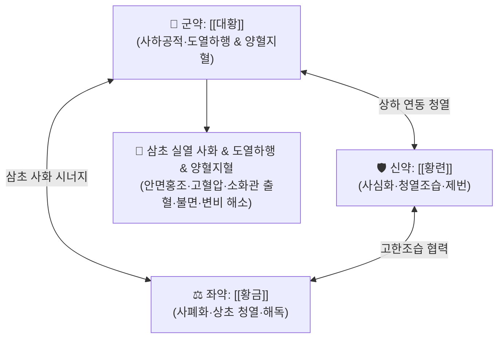

# 🍵 [[삼황사심탕]] (三黃瀉心湯, San-Huang-Xie-Xin-Tang / San'o-shashinto)

> **핵심 3줄 요약 (Key Summary)**:
> - 🌿 기본 구성: [[대황]], [[황련]], [[황금]] ([[대황]]의 사열통변과 [[황련]]·[[황금]]의 청열사화·조습을 결합하여 상초 심화와 중하초 습열을 끄는 사화해독 처방).
> - 🎯 열이 상충하여 얼굴이 붉고 가슴이 답답하며 번조(煩躁)가 심한 실열증, 고혈압성 두통·어지럼, 상부 소화관 출혈(토혈·비출혈), 급성 위염, 치질 출혈, 변비를 동반한 불면·불안.
> - 🔬 [[베르베린]]·[[바이칼린]]·[[에모딘]]·[[센노사이드]]에 의한 NF-κB 염증 경로 차단, 혈관 내피 보호 및 혈압 강하, 위점막 지혈, 장운동 촉진, 중추성 진정.
> - ⚠️ 주의사항: 대황·황련·황금의 지극히 쓰고 차가운 고한(苦寒) 약성으로 비위허한(식욕부진·설사), 허약자, 임산부 및 수유부 절대 금기.

---

## 📌 목차
1. [기본 처방 정보 & 군신좌사 구성](#1-기본-처방-정보--군신좌사-구성)
2. [방제학적 약재 상호작용 & 시너지 네트워크](#2-방제학적-약재-상호작용--시너지-네트워크)
3. [현대 분자약리학적 효능 & 작용 기전](#3-현대-분자약리학적-효능--작용-기전)
4. [적응 병증 및 체질별 감별 (Sweet Spot vs 금기)](#4-적응-병증-및-체질별-감별-sweet-spot-vs-금기)
5. [유사 처방군 감별 매트릭스](#5-유사-처방군-감별-매트릭스)
6. [임상 가감례 & 현대 질환별 응용](#6-임상-가감례--현대-질환별-응용)
7. [💡 사용자 진료실 핵심 필기 & 임상 팁 (원문 보존)](#7--사용자-진료실-핵심-필기--임상-팁-원문-보존)
8. [출처 및 학술 참고 문헌 (References)](#8-출처-및-학술-참고-문헌-references)

---

## 1. 기본 처방 정보 & 군신좌사 구성

* **출전**: 장중경(張仲景) 『[[금궤요략]]』(驚悸吐衄下血病脈證幷治) 및 『[[상한론]]』
* **이명**: 사심탕(瀉心湯), 대황황련사심탕(大黃黃連瀉心湯)
* **치법**: 사화해독(瀉火解毒), 청열조습(淸熱燥濕), 양혈지혈(涼血止血)

| 구분 | 약재명 | 표준 용량 | 본초 효능 & 방제 내 역할 |
| :--- | :--- | :--- | :--- |
| **군약 (君藥)** | [[대황]] | 4~8g | 사하공적(瀉下攻積), 청열사화(淸熱瀉火), 양혈지혈(涼血止血), 화열을 대변으로 배출하여 도열하행 |
| **신약 (臣藥)** | [[황련]] | 4~6g | 청열조습(淸熱燥濕), 사심화(瀉心火), 청열해독, 중상초의 번열(煩熱)과 심화(心火)를 사함 |
| **좌약 (佐藥)** | [[황금]] | 4~8g | 청열조습(淸熱燥濕), 사폐화(瀉肺火), 양혈안태, 상초 폐화와 간담의 울열을 진정 |

> **배오 특징**: 삼황(三黃: [[대황]], [[황련]], [[황금]])의 순수한 고한(苦寒) 3미로만 구성된 방제입니다. [[황금]]은 상초(폐·두면부), [[황련]]은 중상초(심·위), [[대황]]은 중하초(장관·혈분)의 화열을 분담하여 제어합니다. 특히 [[대황]]을 군약으로 삼아 화열이 상충하여 출혈이나 번조를 일으키는 병기를 하향 배출(도열하행 導熱下行)로 근본 차단합니다.

---

## 2. 방제학적 약재 상호작용 & 시너지 네트워크

* **대황 + 황련의 배오**: [[황련]]이 심화(心火)와 위화(胃火)를 끄고, [[대황]]이 울결된 열독을 장관을 통해 대변으로 신속히 배출시켜 열이 머리와 흉격으로 치솟는 상충 병리를 즉각 진정시킵니다.
* **황련 + 황금의 배오**: 두 고한 청열약이 결합하여 상초·중초의 습열과 화독을 강력하게 조습·사화하며, 혈관 투과성 항진을 억제하고 혈열(血熱)을 식힙니다.
* **도열하행(導熱下行)의 묘미**: 출혈이나 고혈압이 있을 때 직접 지혈제나 강압제만 쓰는 것이 아니라, 열의 원천을 아래로 쏟아내어(사하 瀉下) 혈류 압력을 감압하고 지혈을 유도하는 '부저추신(釜底抽薪, 가마솥 밑의 장작을 뺌)'의 대표 격입니다.

---

## 3. 현대 분자약리학적 효능 & 작용 기전

### 1) 강력한 항염증 및 NF-κB 신호전달 차단
* [[황련]]의 [[베르베린]](Berberine)과 [[황금]]의 [[바이칼린]](Baicalin), [[바이칼레인]](Baicalein)은 IκB 키나아제(IKK) 활성을 억제하여 NF-κB의 핵 내 이동을 차단합니다.
* TNF-α, IL-1β, IL-6, COX-2, iNOS 등 주요 염증 매개인자의 전사를 억제하여 전신성 급성 염증 반응을 강력하게 억제합니다.

### 2) 혈압 강하 및 혈관 내피 보호 작용
* [[베르베린]]은 혈관 내피세포의 eNOS(내피성 산화질소 합성효소) 경로를 활성화하여 NO 분비를 촉진하고, 혈관 평활근 세포의 세포 내 칼슘 유입을 차단하여 말초혈관을 확장시킵니다.
* 교감신경 과활성으로 인한 혈압 급상승 및 안면 두면부 혈류 울혈을 신속히 안정화시킵니다.

### 3) 상부 소화관 점막 보호 및 지혈 기전
* [[대황]]의 [[탄닌]](Tannin) 성분과 카테킨류는 손상된 점막 단백질을 응고·수렴시켜 보호막을 형성합니다.
* [[대황]]의 [[에모딘]](Emodin) 및 안트라퀴논 유도체는 혈소판 응집을 촉진하고 모세혈관 투과성을 억제하여 급성 위점막 미란, 위궤양 출혈, 코피(비출혈)를 신속히 지혈합니다.

### 4) 장운동 촉진 및 해독 배출 (사하 작용)
* [[대황]]의 [[센노사이드]](Sennoside A, B)는 대장 내 미생물에 의해 레인안트론(Rheinanthrone)으로 분해되어 대장 점막 신경총을 자극, 장 연동운동을 촉진하고 수분 재흡수를 억제하여 숙변과 장내 독소를 배출합니다.

### 5) 중추 진정 및 항불안·항흥분 작용
* [[바이칼린]]과 [[베르베린]]은 뇌 내 $GABA_A$ 수용체 복합체에 작용하여 중추신경계의 과도한 흥분을 진정시키고 수면을 유도하여, 뇌압 상승이나 심화로 인한 불면·불안·섬망을 가라앉힙니다.

---

## 4. 적응 병증 및 체질별 감별 (Sweet Spot vs 금기)

### 1) 주요 적응증 (Target Indications)
* **심화 항성 및 실열 상충**: 안면홍조, 두통, 현훈(어지럼), 눈의 충혈, 번조불안(가슴이 답답하고 화가 잘 남), 불면, 혓바늘, 구내염.
* **혈열망행(血熱妄行) 출혈**: 코피(비출혈), 토혈, 객혈, 치질 출혈, 상부 위장관 출혈.
* **소화기 실열증**: 구취, 갈증, 복부 팽만, 변비, 급성 위염, 치질 치핵 발적.
* **피부과 질환**: 열독형 여드름, 주사비(딸기코), 화농성 피부염, 모낭염.

### 2) 체질별 적합도 & 금기
* **적합 체질 (Sweet Spot)**:
  * **소양인·태음인 실열형**: 체격이 건실하고 혈색이 붉으며 맥이 침실(沈實)하거나 활삭(滑數)하고, 혀가 붉고 황태(黃苔)가 끼며 대변이 굳고 변비 경향인 환자.
* **절대 금기 (Absolute Contraindications)**:
  * **비위허한(脾胃虛寒)**: 평소 소화가 잘 안 되고 배가 차며 묽은 변을 자주 보는 환자.
  * **허약자 및 노인**: 기혈이 허약하고 맥이 미약(微弱)한 환자에게 장기 투여 시 설사로 인한 탈수 및 기운 손상 유발.
  * **임산부 및 수유부**: [[대황]]의 골반강 충혈 유발 및 자궁 수축 작용으로 유산 위험이 있으며, 모유를 통해 센노사이드 성분이 분비되어 영아 설사 유발.
  * **음허내열(陰虛內熱)**: 진액이 마른 허열 환자에게는 고한약이 진액을 더욱 말리므로 금기.

---

## 5. 유사 처방군 감별 매트릭스

| 처방명 | 기본 구성 | 주요 작용 부위 | 변증 요점 & 감별 포인트 |
| :--- | :--- | :--- | :--- |
| [[삼황사심탕]] | [[대황]], [[황련]], [[황금]] | 삼초 실열, 심·위, 혈분 | **사하통변 + 청열사화**: 변비, 안면홍조, 출혈(토혈·비출혈), 불면을 동반한 실열증 |
| [[황련해독탕]] | [[황련]], [[황금]], [[황백]], [[치자]] | 삼초 실열, 심·간·위 | **순수 청열사화(사하제 없음)**: 대변이 굳지 않고 전신성 발열·발적·피부염·번조가 심할 때 |
| [[양격산]] | [[대황]], [[망초]], [[치자]], [[연교]], [[황금]], [[박하]], [[죽엽]], [[감초]] | 상초·중초 조열 | **상초 풍열 + 중초 조열**: 인후종통, 구설생창에 대변 불통이 겹친 경우 |
| [[도적산]] | [[생지황]], [[목통]], [[죽엽]], [[감초]] | 심·소장 | **청심이뇨**: 심화가 소장으로 전이되어 구내염과 배뇨통·혈뇨를 보일 때 |
| [[백호탕]] | [[석고]], [[지모]], [[갱미]], [[감초]] | 양명 기분 | **기분 대열**: 대열, 대갈, 대한, 맥홍대의 양명경 기분 실열 |
| [[서각지황탕]] | [[서각]](수우각), [[생지황]], [[목단피]], [[적작약]] | 혈분 열독 | **청열량혈·지혈**: 혈열로 인한 반진, 토혈, 정신혼미(섬어) |

---

## 6. 임상 가감례 & 현대 질환별 응용

### 1) 변증 가감법
* **출혈(토혈·비출혈·치질 출혈)이 심할 때**: [[측백엽]], [[생지황]], [[모근]](백모근)을 가미하여 량혈지혈(涼血止血)력 강화.
* **두통·현훈 및 혈압 상승이 극심할 때**: [[국화]], [[결명자]], [[조구등]]을 가미하여 평간잠양(平肝潛陽).
* **변비가 심하고 복통이 동반될 때**: [[망초]]를 가미하여 사하력을 높임.
* **가슴 답답함과 불면이 극심할 때**: [[치자]], [[담죽엽]]을 가미하여 청심제번(淸心除煩).

### 2) 현대 임상 질환별 응용
* **순환기내과**: 고혈압성 뇌병증 전조증, 안면 상열감, 긴장성 두통, 뇌출혈 급성기 혈압 조절.
* **소화기내과**: 급성 위점막 미란, 위궤양·십이지장궤양 출혈, 급성 알코올성 위염, 치질 출혈 및 치핵 발적.
* **이비인후과·안과**: 난치성 비출혈(코피), 급성 결막염, 홍채염, 이명·돌발성 난청 실열형.
* **정신건강의학과**: 조증(躁症), 급성 화병(火病), 불면증, 공황장애 급성 흥분기.
* **피부과**: 안면 지루성 피부염, 중증 화농성 여드름, 주사비(딸기코).

---

## 7. 💡 사용자 진료실 핵심 필기 & 임상 팁 (원문 보존)

* **복용 및 전탕 팁**:
  * 사하(변비 해소) 목적이 강할 때는 [[대황]]을 후하(後下, 탕약 끓이기 종료 5~10분 전 투입)하거나 침출법을 사용하여 센노사이드 파괴를 줄입니다.
  * 반대로 지혈 및 항염증·항산화 작용을 주 목적으로 할 때는 [[대황]]을 다른 약재와 함께 통상 시간 동안 전탕하여 탄닌과 플라보노이드 추출을 극대화합니다.
* **혈압 강하 및 출혈의 응급 적용**:
  * 갑작스러운 혈압 상승과 함께 얼굴이 벌겋게 달아오르고 코피가 터지거나 두통이 심할 때 단기(1~3일) 투약하면 탁월한 감압 및 진정 효과를 보입니다.
* **대변 상태 모니터링**:
  * 대변이 무르거나 하루 2~3회 이상 설사 양상을 보이면 즉시 투약을 중단하거나 용량을 절반 이하로 감량해야 합니다.

---

## 8. 출처 및 학술 참고 문헌 (References)

* 장중경(張仲景), 『[[금궤요략]](金匱要略)』, 驚悸吐衄下血病脈證幷治.
* 전국한의과대학 방제학교수 공편저, 『방제학(方劑學)』, 영림사.
* Wang, Y., et al. (2020). "Molecular mechanisms of San-Huang-Xie-Xin-Tang in the treatment of acute upper gastrointestinal hemorrhage: A network pharmacology and experimental study." *Journal of Ethnopharmacology*, 258, 112898.
  - `[연구 요약]`: 삼황사심탕의 베르베린, 바이칼린, 에모딘이 NF-κB 활성 억제 및 위점막 VEGF 발현 촉진을 통해 급성 소화관 출혈 모델에서 점막 재생과 지혈을 가속화함을 규명함.
* Chen, J., et al. (2018). "Antihypertensive and vascular protective effects of San-Huang-Xie-Xin-Tang via eNOS phosphorylation and suppression of oxidative stress." *Phytomedicine*, 42, 182-191.
  - `[연구 요약]`: 고혈압 동물 모델에서 삼황사심탕 투여 시 eNOS 인산화를 통한 NO 생성 증가와 활성산소종(ROS) 억제를 통해 유의미한 혈압 강하 및 혈관 내피 보호 효과를 입증함.