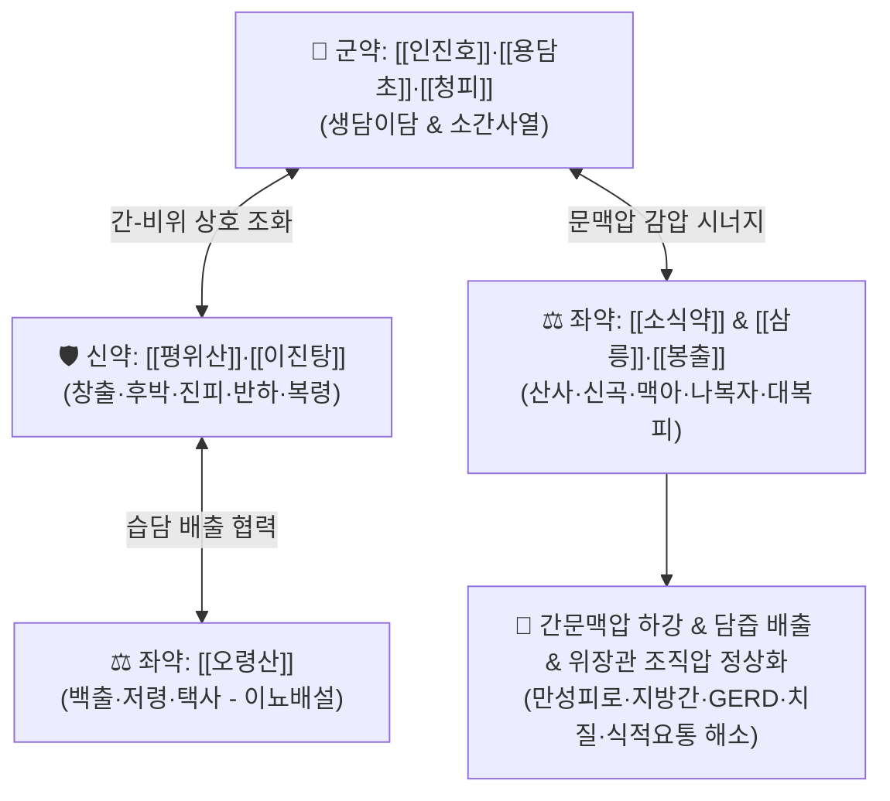

# 🍵 [[생간건비탕]] (生肝健脾湯, Sheng-Gan-Jian-Pi-Tang / Shokan-kempi-to)

> **핵심 3줄 요약 (Key Summary)**:
> - 🌿 기본 구성: [[인진호]], [[청피]], [[용담초]], [[평위산]]([[창출]]·[[후박]]·[[진피]]·[[감초]]), [[이진탕]]([[반하]]·[[복령]]·[[생강]]), [[오령산]]([[백출]]·[[저령]]·[[택사]]), [[소식약]]([[산사]]·[[신곡]]·[[맥아]]·[[사인]]·[[나복자]]), [[곽향]], [[대복피]], [[삼릉]], [[봉출]] 배오.
> - 🎯 고량후미·음주 과다·과로로 인한 만성피로, 간기울결 및 비위 습담 정체, 지방간, 알코올성 간염, 간문맥 고혈압(GERD·치질·복부팽만·식적/담음 요통), 트림·방귀.
> - 🔬 담즙 분비 촉진(생담·이담), 간세포 보호 및 지질 과산화 억제, 간문맥 압력 감압, 위장관 운동성 정상화, 이뇨 및 체액 대사 촉진.
> - ⚠️ 주의사항: 삼릉·봉출 등 강력한 파혈거어약 배오로 임산부 절대 금기, 간경변 말기 비기능 항진증(혈소판 감소성 출혈 경향) 환자 신중 투여.

---

## 📌 목차
1. [기본 처방 정보 & 군신좌사 구성](#1-기본-처방-정보--군신좌사-구성)
2. [방제학적 약재 상호작용 & 시너지 네트워크](#2-방제학적-약재-상호작용--시너지-네트워크)
3. [현대 분자약리학적 효능 & 작용 기전](#3-현대-분자약리학적-효능--작용-기전)
4. [적응 병증 및 체질별 감별 (Sweet Spot vs 금기)](#4-적응-병증-및-체질별-감별-sweet-spot-vs-금기)
5. [유사 처방군 감별 매트릭스](#5-유사-처방군-감별-매트릭스)
6. [임상 가감례 & 현대 질환별 응용](#6-임상-가감례--현대-질환별-응용)
7. [💡 사용자 진료실 핵심 필기 & 임상 팁 (원문 보존)](#7--사용자-진료실-핵심-필기--임상-팁-원문-보존)
8. [출처 및 학술 참고 문헌 (References)](#8-출처-및-학술-참고-문헌-references)

---

## 1. 기본 처방 정보 & 군신좌사 구성

* **출전**: 한국 전통 임상 간계(肝系) 질환 명방 (조헌호, 류순섭 등 현대 한의학 임상가 계승 발전)
* **치법**: 청열이습(淸熱利濕), 소간이기(疏肝理氣), 건비소식(健脾消食), 활혈화어(活血化瘀)

| 구분 | 약재군 / 약재명 | 표준 용량 | 본초 효능 & 방제 내 역할 |
| :--- | :--- | :--- | :--- |
| **군약 (君藥)** | [[인진호]], [[용담초]], [[청피]] | 각 4~8g | **생담이담·소간사열**: 간담의 습열을 끄고 담즙 생성을 촉진하며 간기 울결을 소통 |
| **신약 (臣藥)** | [[창출]], [[후박]], [[진피]], [[반하]], [[복령]] | 각 4~6g | [[평위산]] + [[이진탕]] (조습화담·이기건비): 위장관의 습담(濕痰)과 식적을 제거하고 비위 기기 소통 |
| **좌약 (佐藥)** | [[백출]], [[저령]], [[택사]] | 각 4~6g | [[오령산]] 결합 (이뇨삼습): 간문맥압 상승으로 인한 수습 정체를 소변으로 신속히 배출 |
| **좌약 (佐藥)** | [[산사]], [[신곡]], [[맥아]], [[사인]], [[나복자]] | 각 3~5g | [[소식약]] (소식도체·건위): 고량후미, 육류·주독으로 정체된 음식물을 소화 분해하여 복압 경감 |
| **좌약 (佐藥)** | [[곽향]], [[대복피]], [[삼릉]], [[봉출]] | 각 3~5g | **관흉이기 & 파혈소징**: 소·대장의 가스를 배출하고 간 조직 섬유화 및 문맥 울혈(어혈)을 타파 |
| **사약 (使藥)** | [[생강]], [[감초]] | 각 3~4g | **조화제약·화위**: 제약을 조화시키고 비위 점막을 보호 |

> **방제 구조 분석**:
> * **기저 복합 방제망**: [[평위산]](창출·후박·진피·감초) + [[이진탕]](반하·진피·복령·감초·생강) + [[오령산]](백출·저령·복령·택사) + [[소식약]](산사·신곡·맥아·사인·나복자).
> * **특화 기능군**: 생담이담제([[인진호]], [[용담초]], [[청피]]) + 장관 가스배출 소대장약([[곽향]], [[대복피]]) + 간조직 미세순환 어혈제([[삼릉]], [[봉출]]).

---

## 2. 방제학적 약재 상호작용 & 시너지 네트워크

* **인진호 + 용담초의 생담이담(生膽利膽)**: 담즙산 분비를 촉진하고 빌리루빈 대사를 활성화하여 간세포에 정체된 독소를 십이지장으로 신속히 배출시킵니다.
* **평위산 + 소식약의 소도화체(消導化滯)**: 과음·과식으로 정체된 위장관 내용물을 하향 분해하여 장내 가스 생성과 복강 내압을 즉각적으로 낮춥니다.
* **오령산 + 대복피의 이수감압(利水減壓)**: 장간막 정맥과 문맥계에 정체된 잉여 체액을 신장으로 유도하여 소변으로 배출, 간문맥 혈관의 물리적 팽창을 억제합니다.
* **삼릉 + 봉출의 파어통락(破瘀通絡)**: 만성 염증으로 진행되는 간 실질의 섬유화 및 미세 순환 장애를 개선합니다.

---

## 3. 현대 분자약리학적 효능 & 작용 기전

### 1) 간문맥 순환과 조직압 역학 (Portal Hemodynamics)
* 위장관 순환은 모두 간문맥(Portal vein)을 통해 간으로 모입니다. 간문맥혈은 장기 모세혈관을 거친 후 간의 간선태(Sinusoids) 모세혈관을 한 번 더 거치므로 산소 소모가 많고 혈류 저항에 매우 민감합니다.
* 정상 간문맥압은 5~10mmHg, 간정맥압은 약 5mmHg입니다. 간세포 손상이나 지방 축적으로 간내 저항이 증가하면 간문맥압이 상승(Portal Hypertension)하여 **위장관 조직압 상승(출혈, 부종, 염증)**이 발생합니다.

![[Pasted image 20240228172728.png]]

> [그림 설명: 위장관 정맥계에서 간문맥을 거쳐 간으로 유입되는 혈류 순환 경로]

![[Pasted image 20240228172741.png]]

> [그림 설명: 뇌하수체 문맥계 및 신장계와 유사한 이중 모세혈관 문맥 순환 구조]

### 2) 간문맥 고혈압의 4대 측부순환 병태
간문맥압이 높아지면 체액이 측부순환로(Collateral Circulation)로 몰리며 4대 영역에서 임상 증상이 발현됩니다:
1. **식도 정맥계**: 간문맥압 상승 $\rightarrow$ 식도정맥압 상승 $\rightarrow$ 역류성 식도염(GERD) 및 신물·흉통 발현.
2. **복피 표층 정맥계**: 상·하장간막정맥에서 복부 표층을 거쳐 상대정맥으로 우회 $\rightarrow$ 복압 상승 및 복피 정맥류(메두사 머리).
3. **허리 기정맥(Azygos) 경로**: 간을 거치지 않고 허리 정맥에서 기정맥으로 혈액이 울혈 $\rightarrow$ 과식·음주 후 악화되는 식적 요통(食積腰痛) 및 담음 요통 발생.
4. **항문 직장 정맥계**: 하장간막정맥 $\rightarrow$ 상직장정맥 압력 증가 $\rightarrow$ 치핵 정맥류(치질) 및 항문 출혈 발생.

![[Pasted image 20240228172755.png]]

> [그림 설명: 간문맥 울혈 시 발생하는 식도, 복벽, 척추 기정맥, 직장 항문 측부순환 경로]

### 3) 생간건비탕의 분자약리 및 감압 해독 작용
* **담즙 및 소변을 통한 간 배설물 배출**: [[인진호]]·[[용담초]]의 담즙 촉진과 [[오령산]]의 이뇨 작용으로 간압을 물리적으로 하강시킵니다.
* **간세포 보호 & 항섬유화**: [[인진호]] 카필라린, [[용담초]] 겐티오피크로시드가 간세포 글루타치온(GSH)을 보존하고 지질 과산화를 억제합니다.
* **지질 대사 개선**: [[산사]]의 우르솔산이 담즙산 수송체(BSEP)를 활성화하여 간 내 중성지방 배출을 가속화합니다.

---

## 4. 적응 병증 및 체질별 감별 (Sweet Spot vs 금기)

### 1) 주요 적응증 (Target Indications)
* **전형적 환자 프로파일**: 고량후미(기름진 음식·육류)와 술을 자주 마시고 매일 피곤한 체질, 스트레스와 과로로 지친 남성, 복부 팽만, 트림, 방귀가 잦고 대변이 끈적한 환자.
* **간 대사 질환**: 비알코올성 지방간(NAFLD), 알코올성 지방간 및 간염, 간기능 수치(AST/ALT/GGT) 상승, 만성피로.
* **문맥압 항진 관련 질환**:
  * 식도 역류증(GERD), 가슴 쓰림, 잦은 트림.
  * 치핵(치질) 발적 및 출혈.
  * 식후·음주 후 심해지는 식적 요통 및 담음 요통.

### 2) 체질별 적합도 & 금기
* **적합 체질 (Sweet Spot)**:
  * **태음인·소양인 습열형**: 체격이 건장하고 복부 비만이 있으며, 얼굴이 붉거나 기름지고 쉽게 피로를 느끼는 실증(實證) 환자.
* **절대 금기 및 주의 (Contraindications)**:
  * **임산부 절대 금기**: [[삼릉]], [[봉출]], [[대복피]]의 강력한 파혈 및 하기 작용으로 유산 위험.
  * **비위 허랭(脾胃虛冷)**: 마르고 배가 차며 맑은 물설사를 하는 순수 기혈허약자에게는 장기 투약 금기.
  * **간경변 말기 비기능 항진증**: 심각한 혈소판 감소증 환자는 출혈 위험에 주의.

---

## 5. 유사 처방군 감별 매트릭스

| 처방명 | 기본 구성 | 주요 타깃 병리 | 변증 요점 & 상황별 선택 기준 |
| :--- | :--- | :--- | :--- |
| [[생간건비탕]] | 인진, 용담, 평위, 이진, 오령, 소식, 삼릉, 봉출 | 간문맥압 상승, 습열, 식적, 지방간 | **간-비위 종합 감압**: 고량후미 음주자, 만성피로, 지방간, GERD, 치질, 식적요통 |
| [[오적산]] | 창출, 마황, 진피, 후박, 지각, 당귀, 천궁, 백작약 등 | 한·습·기·혈·담 5적 | **근골격계 요통 우선**: 한습과 풍한이 겹친 심한 요통·신경통 위주일 때 |
| [[대시호탕]] | [[시호]], [[황금]], [[대황]], [[지실]], [[작약]], [[반하]] | 소양-양명 합병, 간세포 파괴 | **간세포 급성 파괴**: 간수치 급상승, 흉협고만, 우협통, 실열 변비 |
| [[용담사간탕]] | [[용담초]], [[황금]], [[치자]], [[택사]], [[목통]], [[차전자]] | 간담 실화, 빌리루빈 울체 | **빌리루빈 배출 & 비뇨기 습열**: 눈 충혈, 구고, 황달, 음부 소양, 배뇨통 |
| [[가미소요산]] | [[시호]], [[당귀]], [[백작약]], [[백출]], [[복령]], [[목단피]], [[치자]] | 간울혈허, 화열 | **스트레스성 간울**: 신경성 소화불량, 갱년기 열감, 생리불순 |
| [[평위산]] | [[창출]], [[후박]], [[진피]], [[감초]] | 비위 습체 | **단순 위장관 정체**: 급만성 위염, 단순 식체, 복부 팽만 |

---

## 6. 임상 가감례 & 현대 질환별 응용

### 1) 변증 가감법
* **간세포 손상(AST/ALT 상승)이 심할 때**: [[시호]], [[황금]], [[울금]]을 가미하여 소간청열력 강화 ([[대시호탕]] 방향).
* **빌리루빈 상승 및 황달 경향 시**: [[치자]], [[대황]]을 가미([[인진호탕]] 합방)하여 대소변으로 색소 배출 촉진.
* **식적 요통 및 허리 무거움이 심할 때**: [[두충]], [[속단]], [[우슬]]을 가미하거나 [[오적산]]과 합방.
* **복부 가스 및 GERD 역류가 심할 때**: [[선복화]], [[대자석]], [[침향]]을 가미하여 강기화담.

### 2) 현대 임상 질환별 응용
* **소화기내과**: 비알코올성 지방간질환(NAFLD), 알코올성 지방간 및 간염, 역류성 식도염(GERD), 만성 기능성 소화불량.
* **대장항문과**: 간문맥 울혈성 치핵, 만성 치질 출혈, 상습 변비 및 가스 팽만.
* **내분비대사내과**: 대사증후군, 고중성지방혈증, 복부 비만.
* **정형외과**: 식적성 만성 요통, 둔중한 요천추부 뻐근함.

---

## 7. 💡 사용자 진료실 핵심 필기 & 임상 팁 (원문 보존)

* **상황별 핵심 감별 가이드**:
  * 요통 위주에는 [[오적산]]
  * 간세포 파괴(간수치 급상승)에는 [[대시호탕]]
  * 빌리루빈 빼내기에는 [[용담사간탕]]
  * 만성 피로와 간문맥압 항진(GERD·치질·복부팽만) 종합 관리에는 [[생간건비탕]]
* **간압 감압의 임상 핵심**:
  * 간문맥압 상승으로 인한 위장관 증상은 위장약만 투여해서는 낫지 않으며, 반드시 담즙과 소변을 통해 간의 노폐물과 수습을 배출시켜 간문맥압을 직접 낮춰주어야 근본 치료가 됩니다.

---

## 8. 출처 및 학술 참고 문헌 (References)

* 전국한의과대학 간계내과학교수 공편저, 『간계내과학(肝系內科學)』, 동양의학연구원.
