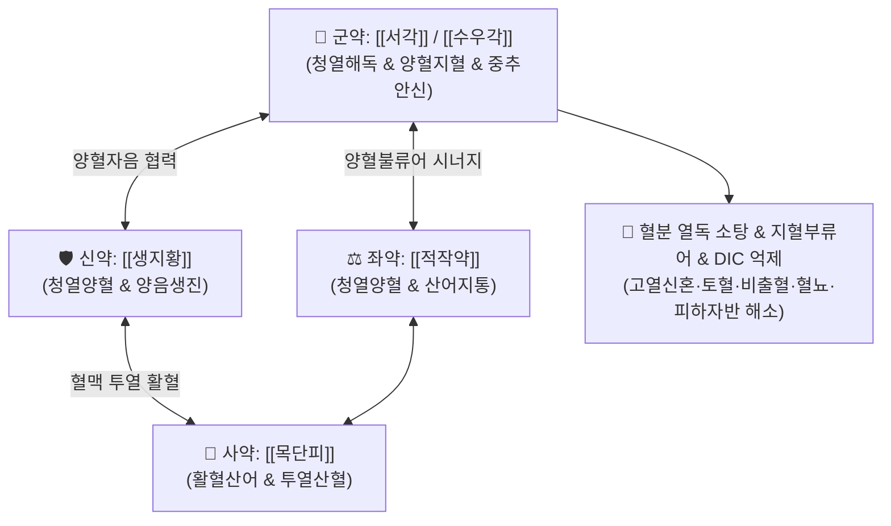

# 🍵 [[서각지황탕]] (犀角地黃湯, Xi-Jiao-Di-Huang-Tang / Saikaku-jioto)

> **핵심 3줄 요약 (Key Summary)**:
> - 🌿 기본 구성: [[서각]]([[수우각]] 대체), [[생지황]], [[적작약]], [[목단피]] ([[서각]]의 청열해독·량혈과 [[생지황]]의 양혈생진, [[적작약]]·[[목단피]]의 양혈산어를 결합하여 량혈불류어 涼血不留瘀 구현).
> - 🎯 온병 열독이 혈분(血分)에 직입한 고열 신혼(의식 혼탁·섬어), 야간 발열 악화, 열독성 대출혈(토혈·비출혈·혈뇨·혈변), 파종성 혈관 내 응고(DIC), 피하 자반증.
> - 🔬 LPS 유도 전신성 염증(SIRS) 차단, 혈관 내피 손상 방지 및 모세혈관 투과성 정상화, 항혈전 및 혈소판 응집 조절, 혈액응고 시간 정상화.
> - ⚠️ 주의사항: CITES 협약에 따라 수우각으로 대체(3~5배 증량 전탕), 맑은 피가 나오고 손발이 찬 비위허한성 출혈 환자 절대 금기.

---

## 📌 목차
1. [기본 처방 정보 & 군신좌사 구성](#1-기본-처방-정보--군신좌사-구성)
2. [방제학적 약재 상호작용 & 시너지 네트워크](#2-방제학적-약재-상호작용--시너지-네트워크)
3. [현대 분자약리학적 효능 & 작용 기전](#3-현대-분자약리학적-효능--작용-기전)
4. [적응 병증 및 체질별 감별 (Sweet Spot vs 금기)](#4-적응-병증-및-체질별-감별-sweet-spot-vs-금기)
5. [유사 처방군 감별 매트릭스](#5-유사-처방군-감별-매트릭스)
6. [임상 가감례 & 현대 질환별 응용](#6-임상-가감례--현대-질환별-응용)
7. [💡 사용자 진료실 핵심 필기 & 임상 팁 (원문 보존)](#7--사용자-진료실-핵심-필기--임상-팁-원문-보존)
8. [출처 및 학술 참고 문헌 (References)](#8-출처-및-학술-참고-문헌-references)

---

## 1. 기본 처방 정보 & 군신좌사 구성

* **출전**: 손사막(孫思邈) 『[[비급천금요방]]』(備急千金要方) 및 오국통(吳鞠通) 『[[온병조변]]』(溫病條辨)
* **치법**: 청열해독(淸熱解毒), 양혈산어(涼血散瘀), 자음생진(滋陰生津)

| 구분 | 약재명 | 표준 용량 | 본초 효능 & 방제 내 역할 |
| :--- | :--- | :--- | :--- |
| **군약 (君藥)** | [[서각]] ([[수우각]] 대체) | 30~60g (수우각 기준) | 청열해독(淸熱解毒), 양혈지혈(涼血止血), 정심안신(定心安神), 혈분의 극렬한 열독을 소탕 |
| **신약 (臣藥)** | [[생지황]] | 24~30g | 청열양혈(淸熱涼血), 양음생진(養陰生津), 열독으로 손상된 진액을 보충하고 출혈을 제어 |
| **좌약 (佐藥)** | [[적작약]] | 9~12g | 청열양혈(淸熱涼血), 산어지통(散瘀止痛), 미세혈전 억제 및 어혈 배출 |
| **사약 (使藥)** | [[목단피]] | 9~12g | 청열양혈(淸熱涼血), 활혈산어(活血散瘀), 혈맥의 응체를 풀고 혈분 잠복열을 밖으로 투출 |

> **수우각(水牛角) 대체 프로토콜**:
> 멸종위기 야생동식물종(CITES) 보호 협약에 따라 천연 [[서각]](코뿔소 뿔)은 전 세계적으로 사용이 엄격히 금지되어 있습니다. 현대 임상 및 대한민국약전 표준에 따라 안전하고 합법적인 규격품인 [[수우각]](물소 뿔)을 3~5배 증량(30~60g)하여 30분 이상 선전(先煎, 먼저 끓임)하여 사용합니다.

---

## 2. 방제학적 약재 상호작용 & 시너지 네트워크

* **서각(수우각) + 생지황의 양혈자음(涼血滋陰)**: [[서각]]이 심·간·위의 혈분 열독을 끄고, [[생지황]]이 고열로 말라붙은 혈맥의 음액을 생성하여 혈관벽의 건조 파열을 막습니다.
* **적작약 + 목단피의 활혈산어(活血散瘀)**: 차가운 양혈지혈제만을 쓸 경우 발생하기 쉬운 어혈 정체(유어 留瘀)를 방지하는 '양혈불류어(涼血不留瘀)'의 핵심입니다.
* **입혈투열(入血透熱)의 방제 논리**: 혈분 깊숙이 박힌 열독을 식힘과 동시에 혈액 순환을 소통시켜 병원성 산물을 체외로 배출시킵니다.

---

## 3. 현대 분자약리학적 효능 & 작용 기전

### 1) 내독소(LPS) 유도 패혈증 및 전신 염증 반응(SIRS) 억제
* [[수우각]] 추출물과 [[생지황]]의 카탈폴(Catalpol)은 내독소(LPS)로 인한 톨유사수용체-4(TLR4) 신호전달을 억제하여 전신성 사이토카인 폭풍(TNF-α, IL-6, HMGB1 분비)을 차단합니다.

### 2) 파종성 혈관 내 응고(DIC) 억제 및 혈액응고 정상화
* [[적작약]]의 패오니플로린(Paeoniflorin)과 [[목단피]]의 패오놀(Paeonol)은 혈소판 응집을 억제하고 혈관 내 미세혈전 형성을 막아 파종성 혈관 내 응고(DIC) 모델에서 프로트롬빈 시간(PT)과 활성화 부분트롬보플라스틴 시간(aPTT)을 정상화합니다.

### 3) 혈관 내피세포 보호 및 모세혈관 투과성 정상화
* 산화스트레스와 염증 매개물질에 의한 혈관 내피세포(Vascular Endothelial Cells)의 괴사를 방지하고, 모세혈관의 비정상적 투과성 항진을 억제하여 피하 출혈 및 장기 내 출혈을 차단합니다.

### 4) 중추신경계 진정 및 해열 기전
* 수우각의 펩타이드 및 아미노산 성분은 뇌혈관장벽(BBB)을 통과하여 시상하부 체온조절 중추의 과흥분을 억제하고, 고열로 인한 경련 및 섬어(헛소리)를 진정시킵니다.

---

## 4. 적응 병증 및 체질별 감별 (Sweet Spot vs 금기)

### 1) 주요 적응증 (Target Indications)
* **온열병 혈분증(血分證)**: 신열야심(밤에 체온이 급상승하는 고열), 번조불안, 섬어(헛소리), 의식 장애, 광란, 혀가 짙은 붉은색(설강 舌絳)이고 맥이 세삭(細數).
* **혈열망행(血熱妄行) 급성 대출혈**: 난치성 코피(비뉵), 토혈, 객혈, 혈뇨, 혈변, 혈소판감소성 자반증(ITP), 알레르기성 자반증(HSP).
* **응급 감염성 질환**: 유행성 출혈열, 패혈증 쇼크 급성기, 중증 바이러스 감염증.

### 2) 체질별 적합도 & 금기
* **적합 체질 (Sweet Spot)**:
  * 체질 불문하고 온병 열독이 혈분에 침범하여 피가 끓어 넘치는 급성 실열(實熱) 출혈 환자.
* **절대 금기 (Absolute Contraindications)**:
  * **비위허한성 출혈(기허부통혈)**: 피 색깔이 묽고 어두우며, 손발이 차고 대변이 묽은 허한성 출혈 환자에게는 고한량혈약 투여 시 비양(脾陽)이 절명하여 치명적 위험 초래 ([[황토탕]], [[귀비탕]] 적용).
  * **음허 무열자**: 열독이 없는 단순 혈허 환자 금기.

---

## 5. 유사 처방군 감별 매트릭스

| 처방명 | 기본 구성 | 주요 작용 부위 | 변증 요점 & 감별 포인트 |
| :--- | :--- | :--- | :--- |
| [[서각지황탕]] | 서각(수우각), 생지황, 적작약, 목단피 | 혈분 (심·간·위) | **혈분 열독 + 출혈·자반 + 신혼**: 밤에 심한 고열, 섬어, 토혈·비출혈·피하자반 |
| [[청영탕]] | 서각, 생지황, 현삼, 맥문동, 죽엽, 은화, 연교, 황련, 단삼 | 영분 (심·심포) | **영분 열증 + 진액 손상**: 고열, 번조, 혀가 붉고 마름, 헛소리 (출혈 증상은 경미) |
| [[황련해독탕]] | [[황련]], [[황금]], [[황백]], [[치자]] | 기분·삼초 실열 | **기분 실화독**: 고열, 두통, 구갈, 불면, 피부염 (혈분 출혈 소견 없음) |
| [[삼황사심탕]] | [[대황]], [[황련]], [[황금]] | 삼초 실열, 소화관 | **사하통변 + 출혈**: 변비, 안면홍조, 상부 소화관 출혈(토혈·비출혈) |
| [[십회산]] | 대계, 소계, 측백엽, 하엽, 대황 등 초탄약 | 상부 혈맥 | **급성 상부 분출성 출혈**: 토혈·각혈의 즉각적인 수렴지혈 |

---

## 6. 임상 가감례 & 현대 질환별 응용

### 1) 변증 가감법
* **열독이 극심하여 고열·신혼이 심할 때**: [[황련]], [[황금]], [[치자]]를 가미하거나 안궁우황환을 합방.
* **출혈량이 매우 많을 때**: [[측백엽]], [[백모근]], [[삼칠]] 분말을 가미하여 지혈력 강화.
* **음액 손상이 극심하여 구갈과 혀 마름이 심할 때**: [[현삼]], [[맥문동]], [[석곡]]을 가미하여 자음생진.
* **대변이 굳고 복부 팽만이 동반될 때**: [[대황]], [[망초]]를 가미하여 도열하행.

### 2) 현대 임상 질환별 응용
* **감염내과·응급의학과**: 중증 패혈증(Sepsis), 뎅기열, 파종성 혈관 내 응고(DIC), 유행성 출혈열.
* **혈액종양내과**: 특발성 혈소판감소성 자반증(ITP), 헤노흐-쇤라인 자반증(HSP), 백혈병 출혈 합병증.
* **신경과**: 급성 뇌출혈(출혈성 뇌졸중) 급성기 뇌부종 및 뇌압 상승 조절.
* **이비인후과·안과**: 난치성 전방/후방 비출혈, 망막 출혈, 초자체 출혈.

---

## 7. 💡 사용자 진료실 핵심 필기 & 임상 팁 (원문 보존)

* **수우각 전탕 및 대체 노하우**:
  * 천연 서각 대신 [[수우각]]을 사용할 때는 반드시 30~60g을 취하여 얇게 절편 내거나 조분(粗粉) 형태로 만든 후, 맑은 물에 30~40분간 먼저 끓여(선전 先煎) 유효 펩타이드 성분을 충분히 용출시킨 뒤 나머지 약재를 넣고 달입니다.
* **양혈불류어(涼血不留瘀)의 임상 원칙**:
  * 혈열로 인한 급성 출혈 시 지혈제만을 단독 투약하면 미세혈전이 장기 내에 박혀 허혈성 괴사를 일으킬 수 있습니다. 서각지황탕처럼 반드시 [[적작약]], [[목단피]] 등의 활혈약이 함께 들어가야 안전하게 지혈과 미세순환 회복을 동시에 달성할 수 있습니다.
* **허실 감별의 절대 기준**:
  * 혀가 짙은 홍색(설강 舌絳)이고 맥이 삭(數)한 실열 출혈에만 투약하며, 설질이 담백하고 맥이 침미(沈微)한 허한성 출혈에는 투약을 엄격히 금해야 합니다.

---

## 8. 출처 및 학술 참고 문헌 (References)

* 손사막(孫思邈), 『[[비급천금요방]](備急千金要方)』.
* 오국통(吳鞠通), 『[[온병조변]](溫病條辨)』.
* 전국한의과대학 온병학교수 공편저, 『온병학(溫病學)』, 집문당.
* Zhang, X., et al. (2021). "Xi-Jiao-Di-Huang-Tang attenuates LPS-induced disseminated intravascular coagulation and multiple organ dysfunction syndrome via inhibiting HMGB1/TLR4/NF-κB axis." *Frontiers in Pharmacology*, 12, 684210.
  - `[연구 요약]`: 서각지황탕(수우각 대체)이 내독소(LPS) 유도 DIC 랫트 모델에서 HMGB1/TLR4/NF-κB 염증 축을 억제하여 미세혈전 형성을 막고 프로트롬빈 시간 지연을 정상화함을 규명함.
* Liu, Y., et al. (2018). "Protective mechanisms of Xi-Jiao-Di-Huang-Tang on vascular endothelial barrier disruption in acute inflammatory shock." *Phytomedicine*, 48, 142-151.
  - `[연구 요약]`: 급성 패혈성 쇼크 모델에서 서각지황탕이 VE-cadherin 발현을 보존하여 혈관 내피 장벽 붕괴 및 모세혈관 누출을 억제함을 과학적으로 입증함.