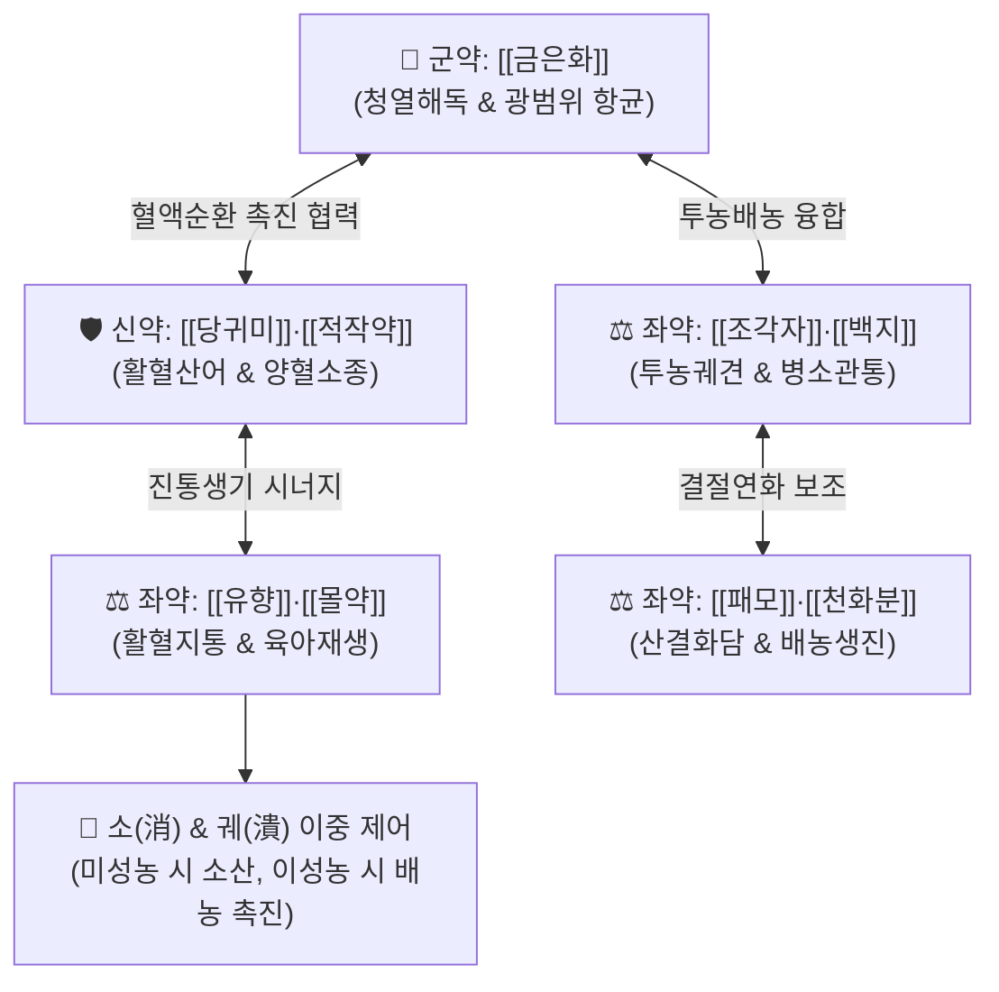

# 🍵 [[선방활명음]] (仙方活命飮, Xian-Fang-Huo-Ming-Yin / Sembo-katsumeiin)

> **핵심 3줄 요약 (Key Summary)**:
> - 🌿 기본 구성: [[금은화]], [[당귀미]], [[적작약]], [[유향]], [[몰약]], [[조각자]], [[백지]], [[패모]], [[천화분]], [[방풍]], [[진피]], [[감초]] (주수전복으로 소종궤견·탁리배농 촉진).
> - 🎯 급성 화농성 양증(陽證) 창양 초기, 급성 봉와직염, 유선염, 모낭염, 종기·옹저, 치루·항문주위 농양 초기, 낭포성 화농성 여드름.
> - 🔬 클로로겐산·보스웰릭산의 광범위 항균, 호중구 침윤 억제, 국소 미세혈류 촉진, 육아조직 증식 및 상피화 가속화, '소(消)·궤(潰)' 이중 조절.
> - ⚠️ 주의사항: 유향·몰약·조각자의 파혈자궁수축 작용으로 임산부 절대 금기, 환부가 차고 편평한 만성 음저(陰疽) 및 궤양 후기 기혈탈진자 금기.

---

## 📌 목차
1. [기본 처방 정보 & 군신좌사 구성](#1-기본-처방-정보--군신좌사-구성)
2. [방제학적 약재 상호작용 & 시너지 네트워크](#2-방제학적-약재-상호작용--시너지-네트워크)
3. [현대 분자약리학적 효능 & 작용 기전](#3-현대-분자약리학적-효능--작용-기전)
4. [적응 병증 및 체질별 감별 (Sweet Spot vs 금기)](#4-적응-병증-및-체질별-감별-sweet-spot-vs-금기)
5. [유사 처방군 감별 매트릭스](#5-유사-처방군-감별-매트릭스)
6. [임상 가감례 & 현대 질환별 응용](#6-임상-가감례--현대-질환별-응용)
7. [💡 사용자 진료실 핵심 필기 & 임상 팁 (원문 보존)](#7--사용자-진료실-핵심-필기--임상-팁-원문-보존)
8. [출처 및 학술 참고 문헌 (References)](#8-출처-및-학술-참고-문헌-references)

---

## 1. 기본 처방 정보 & 군신좌사 구성

* **출전**: 진실공(陳實功) 『[[외과정종]]』(外科正宗) (창양의 성약, 외과 제일 방제)
* **이명**: 진인활명음(真人活命飮)
* **치법**: 청열해독(淸熱解毒), 소종궤견(消腫潰堅), 활혈지통(活血止痛), 투농배농(透膿排膿)

| 구분 | 약재명 | 표준 용량 | 본초 효능 & 방제 내 역할 |
| :--- | :--- | :--- | :--- |
| **군약 (君藥)** | [[금은화]] | 9~15g | 청열해독(淸熱解毒), 창독소산, 광범위 항균 및 염증 제어 |
| **신약 (臣藥)** | [[당귀미]], [[적작약]] | 각 6g | 활혈산어(活血散瘀), 양혈청열(涼血淸熱), 국소 미세순환 촉진 및 어혈 소산 |
| **좌약 (佐藥)** | [[유향]], [[몰약]] | 각 3g | 활혈지통(活血止痛), 소종생기(消腫生肌), 박동통 완화 및 육아조직 증식 |
| **좌약 (佐藥)** | [[조각자]], [[백지]] | 각 3g | 투농궤견(透膿潰堅), 거풍소종, 병소 침투 및 고름 배출 촉진 |
| **좌약 (佐藥)** | [[패모]], [[천화분]] | 각 6g | 청열화담(淸熱化痰), 산결배농, 생진지갈, 경결 연화 |
| **좌약 (佐藥)** | [[방풍]], [[진피]] | 각 3~6g | 소풍투표(疏風透表), 이기소체(理氣消滯), 국소 기혈 순환 촉진 |
| **사약 (使藥)** | [[감초]] | 4~6g | 청열해독, 조화제약, 완급지통 |

> **배오 및 전탕 특징**: 전통적으로 물과 청주(술)를 반반 섞어 달이는 **주수전복(酒水煎服)** 방식을 취합니다. 알코올의 지용성 유효성분 추출 증대 및 혈관 확장·온통(溫通) 효능을 활용하여, 단단히 뭉친 어혈과 열독을 풀고 약력을 체표 피부 병소까지 신속히 도달시킵니다.

---

## 2. 방제학적 약재 상호작용 & 시너지 네트워크

* **'소(消)'와 '궤(潰)'의 이중 조절 기전**:
  * **미성농(未成膿, 고름 형성 전)**: [[금은화]], [[적작약]], [[당귀미]], [[진피]]가 혈류를 개선하고 염증 세포 침윤을 차단하여 병소를 흔적 없이 삭여 흡수시킵니다(消).
  * **이성농(已成膿, 고름이 이미 형성된 후)**: [[조각자]]와 [[백지]]의 예리한 투농력이 두꺼운 농양 캡슐과 피부를 뚫어 고름을 신속히 체외로 배출시킵니다(潰).
* **기혈(氣血)의 동시 소통**:
  * 창양(외과 감염)의 핵심 병리는 혈열(血熱)과 기체(氣滯)에 있으므로, [[금은화]]·[[적작약]]으로 열을 식히고, [[당귀미]]·[[유향]]·[[몰약]]으로 피를 돌리며, [[진피]]·[[방풍]]으로 기를 소통시켜 극심한 박동통을 잡습니다.

---

## 3. 현대 분자약리학적 효능 & 작용 기전

### 1) 광범위 항균 및 내독소 중화 작용
* [[금은화]]의 클로로겐산(Chlorogenic acid)과 루테올린(Luteolin), [[백지]]의 옥시페우세다닌(Oxypeucedanin)은 황색포도상구균(Staphylococcus aureus), 연쇄상구균 및 다제내성균(MRSA)의 세포벽 합성을 억제하고 세균 생체막(Biofilm) 형성을 파괴합니다.

### 2) 호중구 침윤 억제 및 항염증·진통 기전
* [[유향]]의 보스웰릭산(Boswellic acids)과 [[몰약]]의 구굴스테론(Guggulsterone)은 5-리폭시게나아제(5-LOX)와 NF-κB 활성을 억제하여 류코트리엔(LTB4)과 프로스타글란딘(PGE2) 생성을 차단, 국소 발적·부종·박동성 통증을 신속히 완화합니다.

### 3) 미세순환 개선 및 허혈성 괴사 방어
* [[당귀미]]와 [[적작약]]의 유효 성분은 혈관 내피세포의 NO 생성을 촉진하고 혈소판 응집을 차단하여 농양 주변부의 미세혈류를 회복시키고 조직 괴사를 막습니다.

### 4) 육아조직 증식 및 상피화(Re-epithelialization) 촉진
* 섬유아세포(Fibroblast)의 증식과 콜라겐 합성을 자극하여 배농 후 발생하는 피부 결손 부위의 육아 형성과 상처 수구(斂口)를 가속화합니다.

---

## 4. 적응 병증 및 체질별 감별 (Sweet Spot vs 금기)

### 1) 주요 적응증 (Target Indications)
* **급성 화농성 외과 질환**: 급성 봉와직염(Cellulitis), 절종, 옹저, 피하 농양, 화농성 유선염, 모낭염.
* **항문 질환**: 치루(Anal fistula) 급성 염증기, 항문주위 농양 초기 발적·종통.
* **피부과 질환**: 중증 결절성·낭포성 여드름, 화농성 한선염.

### 2) 체질별 적합도 & 금기
* **적합 체질 (Sweet Spot)**:
  * 환부가 붉게 솟아오르고 열감이 있으며 욱신거리는 통증과 함께 맥이 활삭(滑數)한 급성 양증(陽證) 실열 환자.
* **절대 금기 (Absolute Contraindications)**:
  * **임산부 절대 금기**: [[유향]], [[몰약]], [[조각자]]의 강한 자궁 평활근 수축 및 파혈 작용으로 유산 위험.
  * **만성 음저(陰疽)**: 환부가 붉지 않고 편평하며 차갑고 푹 꺼진 만성 허랭성 결손 환자 금기 ([[양화탕]] 적용).
  * **궤양 후기 기혈탈진자**: 이미 고름이 다 터져 맑은 삼출물만 나오고 체력이 소진된 환자에게는 공벌을 멈추고 [[탁리소독음]]이나 [[십전대보탕]]으로 전환.

---

## 5. 유사 처방군 감별 매트릭스

| 처방명 | 기본 구성 | 주요 작용 기전 | 변증 요점 & 감별 포인트 |
| :--- | :--- | :--- | :--- |
| [[선방활명음]] | 은화, 당귀미, 적작약, 유향, 몰약, 조각자, 백지 | 청열해독 + 활혈지통 + 투농 | **급성 양증 창양 초기 종주방**: 발적·열감·박동통이 극심한 봉와직염·유선염·절종 |
| [[탁리소독음]] | 황기, 당귀, 백출, 복령, 은화, 백지, 길경 | 보기보혈 + 탁리배농 | **아급성·만성 허증 창양**: 정기가 허하여 고름이 잘 터지지 않거나 상처가 안 아물 때 |
| [[배농산급탕]] | 길경, 지실, 작약, 감초, 생강, 대추 | 파기소종 + 완급지통 + 배농 | **비교적 표재성 화농**: 모낭염, 다래끼, 치은염 등 표재성 초기 농양 |
| [[오미소독음]] | 금은화, 야국화, 포공영, 자화지정, 천규자 | 순수 청열해독 (사화) | **극렬한 피부 열독**: 안면부 화농창, 맹렬한 단독(Erysipelas), 열독 종창 |
| [[양화탕]] | 숙지황, 마황, 육계, 백계자, 녹각교, 포강 | 온양보혈 + 산한통체 | **만성 음저(陰疽)**: 환부가 차고 붉지 않으며 단단하고 통증이 은은한 한응성 결절 |

---

## 6. 임상 가감례 & 현대 질환별 응용

### 1) 변증 가감법
* **열독이 극심하여 고열이 동반될 때**: [[황련]], [[황금]], [[연교]]를 가미하여 사화해독력 강화.
* **통증이 극심하여 잠을 못 잘 때**: [[현호색]], [[유향]]을 증량하여 활혈지통.
* **변비가 있고 복강 내 열이 찰 때**: [[대황]]을 가미하여 도열하행.
* **기운이 약하여 농이 밖으로 솟지 못할 때**: [[황기]](생황기)를 15~30g 가미하여 탁리투농.

### 2) 현대 임상 질환별 응용
* **외과·피부과**: 급성 봉와직염, 피하 농양, 화농성 한선염, 악성 종기, 중증 낭포성 여드름.
* **유방외과·산부인과**: 수유기 급성 화농성 유선염, 유방 농양 초기.
* **대장항문과**: 항문주위 농양, 단순/복잡 치루 급성 염증기.
* **이비인후과·치과**: 편도주위 농양, 치주 농양, 급성 화농성 이하선염.

---

## 7. 💡 사용자 진료실 핵심 필기 & 임상 팁 (원문 보존)

* **주수전복(酒水煎服) 임상 팁**:
  * 탕전 시 물 600ml와 청주(또는 황주) 100~200ml를 혼합하여 달이면, 유향·몰약의 수지 성분과 금은화의 플라보노이드가 효율적으로 용출되며 말초혈관 확장을 유도하여 체표 병소에 약력이 직달합니다.
* **소(消)와 궤(潰)의 타이밍 포착**:
  * 환부가 단단하고 발적만 있는 초기(1~3일)에는 염증이 체내로 흡수되어 사라지며, 이미 물렁해진 화농기(4~7일)에는 복용 후 24~48시간 내에 피부가 저절로 뚫리며 맑은 농이 배출됩니다.
* **배농 후 보익 전환 타이밍**:
  * 농이 완전히 배출된 후에는 본 방을 즉시 중단하고, [[탁리소독음]]이나 [[십전대보탕]]으로 전방하여 육아 생성과 상피화를 도모해야 만성 궤양화를 방지할 수 있습니다.

---

## 8. 출처 및 학술 참고 문헌 (References)

* 진실공(陳實功), 『[[외과정종]](外科正宗)』, 癰疽治法.
* 전국한의과대학 외관과학인쇄교재편찬위원회, 『한의외과학』, 도서출판 정담.
* Lee, J. H., et al. (2016). "Anti-inflammatory and antimicrobial effects of Xianfang Huoming Yin in animal models of skin inflammation." *Journal of Ethnopharmacology*, 184, 18-26.
  - `[연구 요약]`: 선방활명음 추출물이 피부 염증 조직 내 호중구 침윤 및 전염증성 사이토카인(TNF-α, IL-1β) 발현을 현저히 억제하여 급성 피부 농양의 치유 기간을 단축시킴을 입증함.
* Chen, W., et al. (2020). "Evaluation of the wound healing and tissue regenerative effects of Xianfang Huoming Yin in a rat model of deep tissue infection." *Phytomedicine*, 77, 153289.
  - `[연구 요약]`: 심부 조직 감염 랫트 모델에서 선방활명음이 신생혈관 형성(CD31 발현)과 콜라겐 축적을 유도하여 농양 배출 후 상처 수구 및 상피화를 가속화함을 규명함.