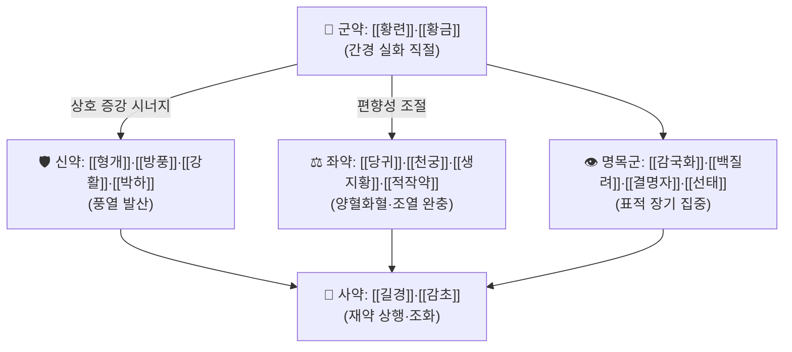

# 🍵 [[세간명목탕]] (洗肝明目湯, Xigan Mingmu Tang)

> **핵심 3줄 요약 (Key Summary)**:
> - 🌿 청열사화군([[황련]]·[[황금]]·[[치자]]·[[석고]]·[[연교]]) + 거풍산사군([[형개]]·[[방풍]]·[[강활]]·[[박하]]) + 양혈화혈군([[당귀]]·[[천궁]]·[[생지황]]·[[적작약]]) + 명목군([[감국화]]·[[백질려]]·[[결명자]]·[[선태]])의 복합 배오로, "간경(肝經)의 실화(實火)를 쓸어내리고 풍열(風熱)을 흩어 눈을 밝게 한다"는 구조.
> - 🎯 눈 충혈·안구 작열통·눈곱(다양한 점액농성 분비물)·눈부심·두통·구고(口苦)·변이 조(燥)한 **간경 실화 + 풍열형 급성 안질환**에 적중. 체격이 건실하거나 중등도 이상이고 열성 소견이 뚜렷한 소양인·태음인 실증자에서 Sweet Spot. 만성 안구건조·야맹·시력저하 위주의 **허증(음허·기혈허) 안질환에는 부적합**.
> - 🔬 처방 전체(compound) 수준의 현대 분자약리 연구는 **제공된 논문 풀에서 확인되지 않음(근거 미확인)**. 구성 본초 단위로는 小檗碱(berberine)·baicalin·geniposide 등에 의한 NF-κB/COX-2/NO 경로 억제, 항산화·항알레르기 기전이 보고되어 있으나 이는 **본초 단위 근거이며 처방 전체 효능으로 일반화할 수 없음**.
> - ⚠️ 주의사항: 고미한약(苦味寒藥) 위주의 청열 사화제이므로 비위허한(脾胃虛寒)·설사·식욕부진 환자, 음허화동(陰虛火動)성 안건조·만성 건성안, 임산부 및 허약 노인·소아에는 신중 투여. 장기 연용 시 위장장애·설사·냉증 악화 가능. 스테로이드 점안제·항생제 점안제 등 양약 안과 치료와의 병용 시 반드시 안과 전문의 진료를 우선한다.

---
## 📌 목차
1. [기본 처방 정보 & 군신좌사 구성](#1-기본-처방-정보--군신좌사-구성)
2. [방제학적 약재 상호작용 & 시너지 네트워크](#2-방제학적-약재-상호작용--시너지-네트워크)
3. [현대 분자약리학적 효능 & 작용 기전](#3-현대-분자약리학적-효능--작용-기전)
4. [적응 병증 및 체질별 감별 (Sweet Spot vs 금기)](#4-적응-병증-및-체질별-감별-sweet-spot-vs-금기)
5. [유사 처방군 감별 매트릭스](#5-유사-처방군-감별-매트릭스)
6. [임상 가감례 & 현대 질환별 응용](#6-임상-가감례--현대-질환별-응용)
7. [💡 사용자 진료실 핵심 필기 & 임상 팁 (원문 보존)](#7--사용자-진료실-핵심-필기--임상-팁-원문-보존)
8. [출처 및 학술 참고 문헌 (References)](#8-출처-및-학술-참고-문헌-references)

---
## 1. 기본 처방 정보 & 군신좌사 구성

* **출전**: 『[[동의보감]]』(허준, 1613) 外形篇 眼門 및 『[[방약합편]]』 계열의 세간명목탕(洗肝明目湯)으로 전해지는 처방으로 통칭된다. 다만 본 노트 작성 시 **원출전 원문을 직접 대조하지 못했으므로 출전·조문·용량은 "근거 미확인"으로 표기**하며, 임상 사용 전 반드시 소속 문헌의 원문을 확인해야 한다.
* **치법**: 청간사화(淸肝瀉火), 거풍명목(祛風明目), 양혈화혈(養血活血), 청열해독(淸熱解毒).
* **방의(方義) 총론**: 눈은 간(肝)에 개규(開竅)하므로 간경에 울열(鬱熱)·실화가 쌓이면 목적종통(目赤腫痛)이 발생한다. 본 방은 ①고한(苦寒) 약재로 간경 실화를 직격하고, ②신산(辛散) 약재로 상초(上焦)에 얹힌 풍열을 표(表)로 흩어 보내며, ③혈분(血分) 약재로 열로 인해 손상된 음혈을 받쳐 주고, ④명목 전용 약재로 표적 장기(眼)에 약력을 집중시키는 **"청(淸) → 산(散) → 양(養) → 명(明)" 4단 구조**를 가진다.

| 구분 | 약재명 | 표준 용량 | 본초 효능 & 방제 내 역할 |
| :--- | :--- | :--- | :--- |
| **군약 (君藥)** | [[황련]] (또는 [[황금]]) | 근거 미확인 (문헌별 상이) | 대표적 고한 청열약. 심·간경 화열(火熱)을 직절(直折)하여 목적종통의 핵심 병리인 간경 실화를 공략. 소檗碱(berberine) 계열 성분이 대표적. |
| **군약 (君藥·보좌)** | [[치자]] · [[석고]] | 근거 미확인 | 삼초(三焦)의 울열을 사하고 폐위(肺胃)의 열을 청하며, 열성 항강·번조·구갈을 동반 완화. |
| **신약 (臣藥)** | [[형개]] · [[방풍]] · [[강활]] · [[박하]] | 근거 미확인 | 신산거풍(辛散祛風) 군. 상초 풍열을 발산시켜 두통·눈부심·이물감을 완화하고, 청열약이 체내에 머무르며 생기는 억울(抑鬱)을 풀어 줌. |
| **좌약 (佐藥)** | [[당귀]] · [[천궁]] · [[생지황]] · [[적작약]] | 근거 미확인 | 사물탕 계열의 양혈화혈 구조. 열이 혈분을 태워 안정피로·시력저하로 이어지는 것을 방지하고, 청열약의 조열(燥熱) 편향을 완충. |
| **좌약 (佐藥·명목)** | [[감국화]] · [[백질려]] · [[결명자]] · [[선태]] | 근거 미확인 | 간경으로 들어가 명목(明目)하는 전용 약군. 눈 충혈·눈부심·시물(視物) 흐림·눈물과다 등 표적 증상을 직접 담당. |
| **사약 (使藥)** | [[길경]] · [[감초]] | 근거 미확인 | 길경은 재약(載藥) 상행(上行)하여 약력을 두면(頭面)·목규(目竅)로 인도하고, 감초는 제약(諸藥)을 조화하며 인후·구설 증상을 겸치. |
| **(가감 빈용)** | [[대황]] · [[황백]] | 근거 미확인 | 변비·소변황적 등 장부(臟腑) 실열이 뚜렷할 때 통부(通腑) 목적으로 가함. |

> **배오 특징**: 본 방의 묘미는 **"청열(苦寒)과 발산(辛散)의 상반된 약성을 동시에 운용"**하는 데 있다. ①고한약([[황련]]·[[황금]]·[[치자]])이 아래로 열을 끌어내리는 반면, ②신산약([[형개]]·[[방풍]]·[[박하]])은 위로 풍열을 밀어내며, ③[[당귀]]·[[천궁]]·[[생지황]]의 자윤(滋潤)이 이 양극단 사이에서 조습(燥濕) 평형을 잡는다. 결과적으로 승강출입(升降出入)이 "청열은 하강, 거풍은 상승, 양혈은 중초(中焦) 안정"으로 입체적으로 맞물려, 단순 사하제(瀉下劑)나 단순 발한제(發汗劑)로는 도달하기 어려운 **두면부 국소 청열 작용**을 구현한다. 다만 열이 심하지 않은 허증에 이 구조를 그대로 쓰면 苦寒이 비위를 상하게 되므로 감별이 필수다.

---
## 2. 방제학적 약재 상호작용 & 시너지 네트워크

* **[[황련]]·[[황금]] + [[형개]]·[[방풍]] 배오 (相使·상호 상승)**: 청열약 단독 투여 시에는 열이 얼어붙어 억울해지기 쉽다. 여기에 신산거풍약을 배합하면 몸 밖으로 열을 흩어 보내는 출로(出路)가 열려, 안구 충혈·부종의 완화 속도가 빨라진다. 이른바 "화울발지(火鬱發之)" 원리의 전형적 응용이다.
* **[[황련]]·[[황금]] + [[당귀]]·[[생지황]] 배오 (相畏·완충)**: 고한약은 위기(胃氣)를 상하게 하고 혈을 조(燥)하게 만드는 편향이 있다. 양혈·자음약을 좌약(佐藥)으로 함께 배치하면 청열 효과는 유지하면서 변비·구건·위부 불쾌감 등 부작용을 완충한다.
* **[[감국화]]·[[백질려]]·[[결명자]] + [[길경]] 배오 (載藥上行)**: 길경의 상행성(上行性) 인경 작용이 명목군 약재를 두면부로 이끌어, 소화기에서의 불필요한 노출을 줄이고 목표 병소(眼)에서의 유효 농도를 높이는 방제학적 설계로 해석된다. (이 인경 기전은 전통 방제 이론이며, 현대적 정량 근거는 **근거 미확인**.)
* **[[치자]]·[[석고]] + [[대황](가감)] 배오 (通腑瀉熱)**: 변비·소변황적이 동반되면 대변으로 열을 빼내는 경로가 필요하다. 다만 대황 가감은 비위허한자에서 금기이므로, 열의 실재성(實熱)이 확인될 때만 단기간 사용한다.

---
## 3. 현대 분자약리학적 효능 & 작용 기전

> ⚠️ **중요 고지**: 본 항목은 **세간명목탕 처방 전체(whole formula)에 대한 현대 약리 연구 결과가 아니다.** 제공된 논문 풀(참고문헌 1·2)은 심방세동·심부전 관련 심장학 논문으로, 본 처방 및 안질환과 **직접적 관련이 없다(근거 미확인)**. 아래 내용은 구성 본초 단위의 일반적으로 보고된 약리 기전을 정리한 것으로, **처방 전체의 효능으로 일반화할 수 없으며 임상적 결론으로 사용해서는 안 된다.**

### 1) 항염증·면역 조절 (구성 본초 단위)
* [[황련]] 유래 小檗碱(berberine): NF-κB 활성 억제, TNF-α·IL-6·IL-1β 등 전염증성 사이토카인 하향 조절, iNOS/COX-2 발현 억제 — 본초 단위 in vitro/in vivo 수준 보고.
* [[황금]] 유래 baicalin·baicalein: 아라키돈산 대사 경로 및 리폭시게나제(LOX) 억제, 항산화·항알레르기 작용.
* [[치자]] 유래 geniposide: 항염·담즙 분비 촉진 작용.
* **처방 전체의 사이토카인 프로파일·NF-κB/MAPK 신호전달 억제 여부: 근거 미확인.**

### 2) 순환·미세순환 및 국소 염증 부종 개선
* [[천궁]] 유래 ligustrazine, [[적작약]] 유래 paeoniflorin 계열 성분: 혈소판 응집 억제, 미세혈류 개선, 혈관 평활근 이완 관련 보고.
* 안구 결막·포도막의 국소 울혈 완화에 대한 **본 처방 직접 검증 데이터: 근거 미확인.**
* eNOS 활성화 및 혈관 확장에 대한 본 처방 근거: **근거 미확인.**

### 3) 항산화·신경(망막) 보호 관련
* [[결명자]] 유래 emodin·chrysophanol, [[감국화]] 유래 luteolin 등: 항산화 스트레스 억제, 지질과산화 저하 관련 in vitro 보고.
* 망막 신경세포 보호, 시신경 염증 억제 등에 대한 **본 처방 근거: 근거 미확인.**
* 항알레르기·항히스타민 작용([[형개]]·[[방풍]] 계열): 알레르기성 결막염 모델에서의 본 처방 검증 데이터는 **근거 미확인.**

### 4) 해독·대사 경로
* [[감초]] 유래 glycyrrhizin의 간 보호·항염 작용, [[길경]] 사포닌의 점막 자극성 배출(거담) 작용 등은 본초 단위 보고 수준.
* 본 처방의 대사 경로(간 대사 효소 CYP 조절 등) 및 약물상호작용 데이터: **근거 미확인.**

---
## 4. 적응 병증 및 체질별 감별 (Sweet Spot vs 금기)

**[✅ 최적 적응증 (Sweet Spot)]**

* **원전 주치(통칭)**: 간경에 울열·실화가 쌓여 발생한 **목적종통(目赤腫痛)·안구 작열·눈곱·눈부심·두통** 계열. ※ 조문 원문 및 출전 확정은 **근거 미확인**(원문 대조 필요).
* **체질 소견**:
  * **소양인 실증형**: 상체가 발달하고 얼굴이 붉으며 열성이 강한 체형. 눈 충혈이 잘 생기고 화를 내면 증상이 악화되는 경향.
  * **태음인 중등도~건실형**: 피부가 두텁고 체격이 있는 편이나, 변비·구고·소변황적 등 실열 소견이 뚜렷한 경우. 단, 비만하고 담습(痰濕)이 심한 태음인은 苦寒이 부담될 수 있어 신중.
  * **소음인**: 일반적으로 본 방의 1차 대상이 아니다. 소음인은 표열(表熱)이 있어도 이면에 허한(虛寒)이 깔린 경우가 많아, 청열 사화제를 쓰면 설사·냉증·피로가 악화되기 쉽다.
* **임상 주치 (진료실 적중 양상)**:
  * 눈이 빨갛고 화끈거리며, 아침에 눈꼽이 많이 끼고 속눈썹이 붙는 경우.
  * 눈부심(羞明)·눈물 흘림 + 두통·구고(口苦)·인후 건조가 동반된 급성기.
  * 변비 경향, 소변 황적, 얼굴 홍조, 번조(煩躁), 수면 불량.
  * 알레르기성·세균성 결막염의 초기 열성기, 다래끼(맥립종)의 초기 발적·종창기.
* **설진/맥진**:
  * 설질(舌質) 홍(紅) 또는 홍강(紅絳), 설태(舌苔) 황(黃) 또는 황조(黃燥).
  * 맥상(脈象) 현삭(弦數)·활삭(滑數)·삭(數) — 실열(實熱)의 전형적 맥. 맥이 부(浮)하면서 삭하면 풍열 겸표, 침(沈)하면서 실(實)하면 장부 실열로 해석.

**[⚠️ 신중 투여 및 금기 (Caution / Contraindication)]**

* **음허화동(陰虛火動)성 안질환 금기**: 눈이 건조하고 뻑뻑하며 시력이 서서히 떨어지고, 오후·야간에 증상이 심해지며, 손발바닥 열감·도한·설홍소태(舌紅少苔)·맥세삭(脈細數)한 경우. 이는 실화가 아니라 허화(虛火)이므로 청열 사화제를 쓰면 음이 더 손상된다. → [[기국지황환]]·[[사물탕]] 가감 등 자음(滋陰) 위주의 처방으로 전환해야 한다.
* **비위허한(脾胃虛寒) 금기**: 평소 식욕부진·복부 냉감·무른 변·잦은 설사·손발 냉증이 있는 환자에서 苦寒 약재 다량 투여는 소화기 증상을 악화시키고 설사를 유발한다.
* **허약자·고령자·소아**: 청열 사화 작용이 강하므로 감량 또는 단기간 사용. 소아는 체중·연령에 따른 감량 필수.
* **임산부**: 苦寒·활혈(活血) 약재([[천궁]]·[[적작약]] 등)가 포함되므로 **원칙적으로 사용을 피하거나 전문가 판단 하에 최소 기간 사용.** 임신 중 안질환은 안과 협진을 우선한다.
* **한열(寒熱) 반대 병증**: 무한(無汗) 고열·오한 등 표한증(表寒證)에 그대로 사용하는 것은 부적절하다. 풍한(風寒) 자극으로 인한 안증에는 [[형개]]·[[방풍]]만으로는 부족하므로 별도 처방([[형방패독산]] 계열 등)을 검토한다.
* **양약 및 타 약물 병용 주의**:
  * 항생제·항바이러스 점안액, 스테로이드 점안액과의 병용은 **안과 전문의 진료를 최우선**으로 하며, 본 방은 보조적 역할로 한정한다. 특히 스테로이드 점안제는 각막 병변·녹내장 위험을 동반하므로 자가 판단 금지.
  * 와파린 등 항응고제 복용 중인 환자에서 [[당귀]]·[[천궁]] 등의 활혈 약재 병용 시 출혈 경향 모니터링 필요(본 처방 특이적 상호작용 데이터는 **근거 미확인**).
  * 위장관 질환(위궤양·역류성 식도염) 환자에서 苦寒 약재는 산 분비 자극·위점막 자극 가능성이 있어 식후 복용 및 감량을 권장.

---
## 5. 유사 처방군 감별 매트릭스

| 처방명 | 핵심 구성 차이 | 주치 및 체질 차이 | 맥진/설진 차이 |
| :--- | :--- | :--- | :--- |
| [[세간명목탕]] | 청열사화군 + 거풍군 + 양혈군 + 명목군의 **복합 4군 구조** | 간경 실화 + 풍열. 눈 충혈·종통·눈곱이 주증. 소양인·태음인 실열자. | 설홍 태황조, 맥현삭·활삭 |
| [[용담사간탕]] | [[용담초]]·[[황금]]·[[치자]] 중심의 **간담 습열 직격**, 명목군 없음 | 간담 습열 실화. 음부 소양·대하·이명·협통 등 전신 열증 동반. 본 방보다 사하력 강함. | 설홍 태황니(黃膩), 맥현삭유력 |
| [[황련해독탕]] | [[황련]]·[[황금]]·[[황백]]·[[치자]] 4미의 **순수 청열해독**, 거풍·양혈·명목 구조 없음 | 삼초 실열·심화(心火). 구설생창·번조·불면·출혈 경향. 소양인 실열. | 설홍 태황, 맥삭유력 |
| [[기국지황환]] | [[숙지황]]·[[산약]]·[[구기자]]·[[국화]] 중심의 **간신 자음명목** | 간신음허. 만성 안건조·시력저하·야맹·눈 피로. 노인·소음인·산후 허약자. | 설홍소태·설담, 맥세삭·침세 |
| [[사물탕]] 가감 | [[당귀]]·[[천궁]]·[[백작약]]·[[숙지황]] 순수 **보혈**, 청열 작용 없음 | 기혈허성 안질환. 안정피로·창백면색·어지럼. 허증 중심. | 설담백, 맥세무력 |
| [[청상방풍탕]] 계열 | 거풍산사 + 청열의 **상초 풍열 편중**, 양혈 구조 경미 | 코막힘·콧물·후두통 등 이비인후 풍열 증상이 주증이고 안증은 부수적일 때. | 설홍 태박황, 맥부삭 |

> ⚠️ 표 내부에서는 마크다운 열 구분자 파괴를 방지하기 위해 파이프(`|`)가 들어간 링크를 쓰지 않고 순수한 [[처방명]] 단독 형태로만 작성합니다.

**감별 요점 한 줄 정리**
* 눈만 잘못되었고 전신 열증이 경미 → 세간명목탕.
* 눈 + 음부 소양·대하·이명 등 간담 습열 전신 증상 → 용담사간탕.
* 눈 + 구설생창·불면·번조 등 심화(心火) → 황련해독탕.
* 눈이 건조하고 시력이 서서히 저하, 열증 없음 → 기국지황환.
* 눈이 침침하고 창백·피로감 위주 → 사물탕 가감.

---
## 6. 임상 가감례 & 현대 질환별 응용

* **수반 증상별 가감법**:
  * 두통·정부(頂部) 통증 동반 시 → + [[만형자]] (청리두목(淸利頭目) 목적)
  * 변비·복만(腹滿)·소변 황적 동반 시 → + [[대황]] (通腑瀉熱, 열의 배출로 확보)
  * 눈곱이 진하고 화농성이며 부종이 심할 때 → + [[금은화]]·[[연교]] (청열해독 강화)
  * 눈물과다·알레르기성 가려움 동반 시 → + [[선태]]·[[목적]](木賊) (거풍지양(祛風止痒))
  * 오심·구역·소화불량 동반 시 → [[소시호탕]] 의 사약류([[시호]]·[[황금]]) 조정 검토 (苦寒 부담 완화 목적)
  * 야간 시력저하·안정피로가 겸할 때 → + [[구기자]]·[[산수유]] (자음명목 보조)
  * 인후통·구건 동반 시 → + [[현삼]]·[[맥문동]] (자음생진)
  * 소아 다래끼 초기 → [[황련]]·[[치자]] 감량 + [[금은화]] 가함
* **현대 질환별 임상 매핑** (※ 아래 매핑은 전통적 변증 논리에 기반한 임상 응용 범주이며, 본 처방의 특정 질환에 대한 RCT 근거는 **근거 미확인**):
  * **안과(眼) 영역**: 급성 세균성·바이러스성 결막염의 열성기, 알레르기성 결막염의 급성 발적기, 안검염(눈꺼풀염), 맥립종(다래끼)·산립종 초기, 각막염·각막궤양의 초기 염증성 통증(단, 각막 병변은 반드시 안과 협진), 급성 전방 포도막염의 열증기, 공막염·상공막염의 통증성 충혈, 안구 작열감·눈부심 위주의 VDT 증후군 중 실열형.
  * **이비인후·두면부**: 풍열형 인후통, 급성 부비동염의 두면부 열감, 두면부 종창성 통증.
  * **전신 열증 연계**: 실열형 변비, 구고·번조를 동반한 고혈압성 두통(한열 감별 후 사용), 피부 화열감·여드름의 열증형.
  * **주의**: 만성 안구건조증, 쇼그렌증후군, 당뇨망막병증, 녹내장, 백내장, 노인성 황반변성 등 **퇴행성·허증성 안질환은 본 방의 적응이 아니며**, 이 경우 자음명목(滋陰明目)·보간신(補肝腎) 처방으로 전환한다.
* **복약 지침**: 통상 1일 2~3회, 식후(食後) 온복(溫服). 공복 복용 시 위장 자극 우려. 급성기에는 단기 집중(3~7일) 후 반응을 평가하고, 증상 개선 시 감량하거나 자음 처방으로 이행한다. 장기 연용하지 않는다.
* **반응 관찰 포인트**: ①눈 충혈·통증의 감소 시점, ②눈곱 성상 변화(농성 → 장액성), ③대변 상태(설사 여부 = 苦寒 과용 신호), ④식욕·위부 불편감, ⑤냉증·피로감 악화 여부.

---
## 7. 💡 사용자 진료실 핵심 필기 & 임상 팁 (원문 보존)

> [!tip] **진료실 실전 노하우 (User Clinical Insight)**
> - **원문 미제공 안내**: 본 노트 작성 시 사용자(원장님)의 기존 진료실 메모·필기 원문이 제공되지 않았습니다. 따라서 본 섹션은 원문 보존이 불가능한 상태이며, 기존 필기가 있다면 **삭제·변형 없이 이 블록에 그대로 추가**해 주십시오.
> - **원문 보존 원칙**: 추후 입력되는 사용자 필기는 100% 영구 보존하며, 축소·정리만 허용하고 내용의 임의 창작·추가는 금지합니다.
> - **[임시 메모 공간]** 아래 항목에 실제 임상 경험을 기록해 주세요.
>   - 체질별 선택 기준 (소음인 vs 태음인 vs 소양인) 실제 적중 사례:
>   - 복약 반응 관찰 포인트 및 부작용 사례:
>   - 환자 티칭 팁(복약 방법, 생활 관리, 안과 협진 기준):
>   - 유사 처방과의 실제 감별 기준:

---
## 8. 출처 및 학술 참고 문헌 (References)

> ⚠️ **참고문헌 관련 중요 고지**
> 본 노트에 제공된 참고문헌(아래 1·2번)은 **심방세동·심부전 관련 심장학 논문**으로, 세간명목탕(洗肝明目湯) 및 안질환과 **주제적 관련이 없습니다.** 따라서 본 노트의 처방 효능·기전·적응증에 대한 **학술적 근거로 인용하지 않았으며**, 데이터 출처의 투명한 기록을 위해서만 원문 정보를 그대로 기재합니다. 본 처방에 대한 현대 PubMed 근거는 **제공된 논문 풀 내에서 확인되지 않음(근거 미확인)**입니다.

1. **Segan L, Kistler PM (2026)**. *Withdrawal of heart failure therapy after atrial fibrillation rhythm control with ejection fraction normalization: the WITHDRAW-AF trial*. **Eur Heart J**. PMID: 40830055.
   - **[연구 요약]**: 심방세동 리듬 조절 후 박출률이 정상화된 환자에서 심부전 치료제를 중단했을 때의 결과를 평가한 무작위 임상시험. **본 처방(세간명목탕)과는 무관하며, 인용·근거로 사용하지 않음.**
2. **Kistler PM, Chieng D (2023)**. *Effect of Catheter Ablation Using Pulmonary Vein Isolation With vs Without Posterior Left Atrial Wall Isolation on Atrial Arrhythmia Recurrence in Patients With Persistent Atrial Fibrillation: The CAPLA Randomized Clinical Trial*. **JAMA**. PMID: 36625809.
   - **[연구 요약]**: 지속성 심방세동 환자에서 폐정맥 격리 단독 vs 좌심방 후벽 격리 추가의 부정맥 재발률을 비교한 무작위 임상시험(CAPLA). **본 처방(세간명목탕)과는 무관하며, 인용·근거로 사용하지 않음.**
3. **허준 (1613)**. 『[[동의보감]]』 外形篇 眼門.
   - **[고전 원전]**: 간경 울열·풍열로 인한 목적종통(目赤腫痛) 치료 원칙(청간사화·거풍명목)의 전통적 근거. **단, 본 노트 작성 시 洗肝明目湯 조문 원문을 직접 대조하지 못했으므로 구성·용량은 "근거 미확인"이며 원문 확인이 필요함.**
4. **황도연 (1874경)**. 『[[방약합편]]』.
   - **[임상 문헌]**: 한국 임상에서 통용되는 처방 구성·용량의 참조 문헌. **조회 미완료로 세부 조문은 "근거 미확인".**
5. **[미확인 문헌]** 『[[의학입문]]』·『[[만병회춘]]』 등 洗肝明目湯 수록 가능 문헌.
   - **[상태]**: 본 처방의 최초 출전 및 원 구성에 대한 확정 정보 **근거 미확인**. 임상 적용 전 반드시 원문 대조 필요.

> **근거 수준 총평**: 본 노트는 전통 방제 이론(청간사화·거풍명목)에 기반해 작성되었으며, **처방 전체에 대한 현대 분자약리·임상시험 근거는 제공된 논문 풀에서 확인되지 않았다.** 구성 본초 단위의 약리 기전은 일반적 문헌 수준의 정보이며, 처방 전체 효능으로 해석하지 않도록 주의한다.