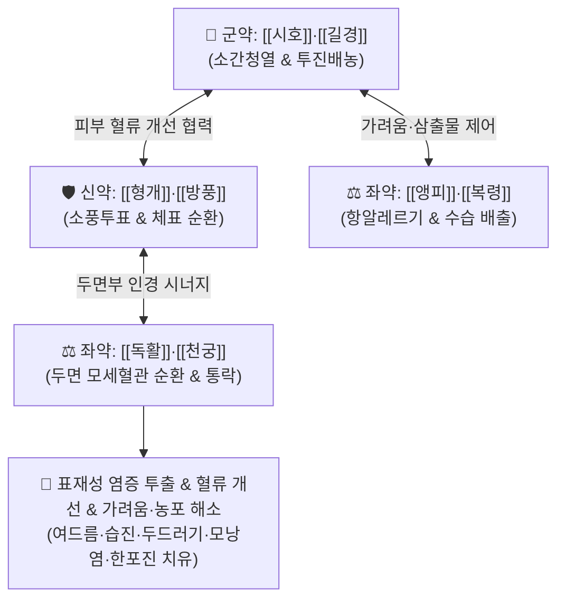

# 🍵 [[십미패독탕]] (十味敗毒湯, Shi-Wei-Bai-Du-Tang / Jumi-haidokuto)

> **핵심 3줄 요약 (Key Summary)**:
> - 🌿 기본 구성: [[시호]], [[독활]], [[방풍]], [[형개]], [[천궁]], [[길경]], [[복령]], [[앵피]](또는 [[박하]]/[[금은화]]), [[생강]], [[감초]] ([[형방패독산]] 변방으로 해표소풍·투진배농 결합).
> - 🎯 급성기 화농성 여드름, 아토피 피부염, 급성 습진, 두드러기, 여름철 호발하는 모낭염·한포진, 산발성 홍반·구진·농포.
> - 🔬 비만세포 히스타민 분비 억제(항알레르기), 호중구 탐식능 활성화 및 활성산소(ROS) 억제, 두면부 미세순환 촉진, 피지선 염증 완화.
> - ⚠️ 주의사항: 발진 후기 건조하고 각질이 심한 만성 혈허(血虛) 피부염에는 부적합하며, 위알도스테론증 방지를 위해 장기 복용 시 모니터링.

---

## 📌 목차
1. [기본 처방 정보 & 군신좌사 구성](#1-기본-처방-정보--군신좌사-구성)
2. [방제학적 약재 상호작용 & 시너지 네트워크](#2-방제학적-약재-상호작용--시너지-네트워크)
3. [현대 분자약리학적 효능 & 작용 기전](#3-현대-분자약리학적-효능--작용-기전)
4. [적응 병증 및 체질별 감별 (Sweet Spot vs 금기)](#4-적응-병증-및-체질별-감별-sweet-spot-vs-금기)
5. [유사 처방군 감별 매트릭스](#5-유사-처방군-감별-매트릭스)
6. [임상 가감례 & 현대 질환별 응용](#6-임상-가감례--현대-질환별-응용)
7. [💡 사용자 진료실 핵심 필기 & 임상 팁 (원문 보존)](#7--사용자-진료실-핵심-필기--임상-팁-원문-보존)
8. [출처 및 학술 참고 문헌 (References)](#8-출처-및-학술-참고-문헌-references)

---

## 1. 기본 처방 정보 & 군신좌사 구성

* **출전**: 하나오카 세이슈(華岡靑洲) 『[[화강청주경험방]]』(명대 공정현 『만병회춘』 [[패독산]] 변방)
* **치법**: 소풍해표(疏風解表), 청열해독(淸熱解毒), 투진배농(透疹排膿), 조화영위(調和營衛)

| 구분 | 약재명 | 표준 용량 | 본초 효능 & 방제 내 역할 |
| :--- | :--- | :--- | :--- |
| **군약 (君藥)** | [[시호]], [[길경]] | 각 4~6g | **소간해울 & 투농배농**: 염증 반응을 억제하고 상초 흉격과 피부의 독기를 상행 배출 |
| **신약 (臣藥)** | [[형개]], [[방풍]] | 각 4~6g | **혈류 개선 & 소풍투표**: 체표 미세혈류를 개선하고 풍열(風熱) 사기를 발산 |
| **좌약 (佐藥)** | [[독활]], [[천궁]] | 각 3~5g | **두면부 혈류 개선 & 통락지통**: 안면과 두경부 모세혈관 순환을 촉진하고 통증 완화 |
| **좌약 (佐藥)** | [[앵피]] (또는 [[박하]]) | 4~6g | **해독산결 & 항알레르기**: 피부 가려움증을 진정시키고 독소 배출 (일본 본초 벚나무 껍질) |
| **좌약 (佐藥)** | [[복령]] | 4~6g | **이수삼습 & 건비**: 진액 정체와 조직 부종(삼출물)을 소변으로 배출 |
| **사약 (使藥)** | [[생강]], [[감초]] | 각 2~4g | **건비화위 & 조화제약**: 생대감 조합으로 비위를 보좌하고 제약을 조화 |

> **방제 구조 특징**:
> * **혈류 개선군**: [[형개]], [[방풍]] (전신 혈류) + [[독활]], [[천궁]] (두면부 혈류 개선).
> * **항염·배농군**: [[시호]], [[길경]] (염증 반응 억제 및 배농).
> * **체액 대사 & 점막 보호군**: [[복령]], [[생강]], [[감초]] + 피부 해독 특효약 [[앵피]].

---

## 2. 방제학적 약재 상호작용 & 시너지 네트워크

* **시호 + 길경의 염증 소산(消散)**: [[시호]]의 해열·소염 작용과 [[길경]]의 배농·인경 작용이 맞물려 피부 모낭 깊숙이 정체된 화농성 독소를 체표로 밀어내어 배출합니다.
* **형개 + 방풍 + 천궁 + 독활의 두면부 혈류 개선**: 표층 모세혈관을 확장시켜 혈액 순환을 촉진, 염증 조직의 울혈과 박동성 팽만감을 해소합니다.
* **앵피(벚나무껍질) + 복령의 항알레르기·삼출물 흡수**: 두드러기와 습진의 조직 부종 및 진물을 신속히 말리고 가려움증을 가라앉힙니다.

---

## 3. 현대 분자약리학적 효능 & 작용 기전

### 1) 비만세포 탈과립 억제 및 항알레르기 작용
* [[앵피]]의 사쿠라닌(Sakuranin)과 [[방풍]]의 승마쿠마린 성분은 IgE 매개 비만세포 탈과립을 차단하고 히스타민 분비를 억제하여 급성 두드러기, 가려움증, 습진성 발진을 신속히 완화합니다.

### 2) 호중구 활성화 및 활성산소(ROS) 억제
* [[시호]]의 사이코사포닌(Saikosaponins)과 [[천궁]]의 페룰산(Ferulic acid)은 호중구의 과도한 활성산소 생성을 억제하고 염증성 사이토카인(IL-1β, TNF-α) 분비를 차단합니다.

### 3) 여드름균(C. acnes) 및 표피포도상구균 항균
* [[길경]] 플라티코딘 D와 [[형개]] 정유 성분이 *Cutibacterium acnes* 증식을 억제하고 모낭 내 피지 산화를 방지하여 면포성·구진성 여드름의 화농화를 막습니다.

### 4) 두면부 미세순환 및 림프 배액 촉진
* [[천궁]]의 리구스티라이드(Ligustilide)가 혈소판 응집을 막고 미세혈류 속도를 증가시켜 안면부 홍반과 부종을 개선합니다.

---

## 4. 적응 병증 및 체질별 감별 (Sweet Spot vs 금기)

### 1) 주요 적응증 (Target Indications)
* **피부과 급성 염증 질환**:
  * **여드름**: 구진성·농포성 화농성 여드름, 턱과 볼 주변의 붉은 뾰루지.
  * **습진 & 알레르기**: 급성 습진, 아토피 피부염 초기 발적기, 급성 두드러기, 접촉성 피부염.
  * **여름철 호발성 피부염**: 여름철 땀과 피지 분비 과다로 인한 모낭염, 손발의 한포진(Pompholyx).
  * **피부 소견**: 산발성 홍반, 구진, 농포, 가려움증을 동반한 일체의 급성 표재성 피부 질환.

### 2) 체질별 적합도 & 금기
* **적합 체질 (Sweet Spot)**:
  * 피부가 붉어지고 가려우며 뾰루지가 잘 돋는 소양인·태음인 청장년층, 피지 분비가 왕성하고 땀띠나 모낭염이 잦은 체질.
* **절대 금기 및 주의 (Contraindications)**:
  * **만성 혈허(血虛) 건조성 피부염**: 피부가 건조하고 하얗게 각질이 일어나며 가려운 만성 아토피 후기 환자에게는 발산약이 진액을 더욱 말리므로 금기 ([[당귀음자]], [[소풍산]] 적용).
  * **기혈 극허자**: 맑은 진물만 나오고 환부가 창백한 허증 환자 금기.

---

## 5. 유사 처방군 감별 매트릭스

| 처방명 | 기본 구성 | 주요 타깃 병리 | 변증 요점 & 감별 포인트 |
| :--- | :--- | :--- | :--- |
| [[십미패독탕]] | 시호, 길경, 형개, 방풍, 천궁, 독활, 복령, 앵피 | 표재성 풍열, 급성 피부 염증 | **급성기 피부질환 표준방**: 여드름, 급성 습진, 두드러기, 모낭염, 한포진 |
| [[청상방풍탕]] | 방풍, 황련, 황금, 치자, 연교, 백지, 길경 | 두면부 풍열 화독 | **상초 화열 위주**: 얼굴과 머리에 열이 펄펄 끓고 붉은 화농성 여드름이 밀집할 때 |
| [[황련해독탕]] | [[황련]], [[황금]], [[황백]], [[치자]] | 삼초 실열화독 | **극심한 발적 & 열감**: 홍반과 가려움증이 극심하여 피부가 불타는 듯할 때 (합방 다용) |
| [[소풍산]] | 형개, 방풍, 우방자, 선태, 창출, 고삼, 생지황 | 풍습열(風濕熱) 피부염 | **진물과 가려움 극심**: 삼출물이 줄줄 흐르는 아토피·습진 |
| [[당귀음자]] | 당귀, 작약, 숙지황, 백질려, 방풍, 형개, 황기 | 혈허풍조(血虛風燥) | **만성 건조성 가려움**: 노인성 피부소양증, 건성 피부염 |

---

## 6. 임상 가감례 & 현대 질환별 응용

### 1) 변증 가감법
* **가려움과 안면 홍반이 매우 심할 때**: [[황련해독탕]]을 합방하여 청열사화력 증대.
* **피부 진물과 부종(습열)이 심할 때**: [[의이인]], [[택사]], [[차전자]]를 가미하여 이수배농.
* **변비가 동반된 결절성 여드름**: [[대황]]을 1~2g 가미하여 장관으로 열독 배출.
* **화농이 깊고 경결이 단단할 때**: [[연교]], [[금은화]], [[포공영]]을 가미하여 해독 강화.

### 2) 현대 임상 질환별 응용
* **피부과**: 심상성 여드름, 주사비(딸기코) 초기, 지루성 피부염, 모낭염, 한포진, 급만성 두드러기, 아토피 피부염 급성 악화기.
* **외과**: 초기 모포염, 다래끼(맥립종), 손발톱주위염(조갑주위염).

---

## 7. 💡 사용자 진료실 핵심 필기 & 임상 팁 (원문 보존)

* **합방 팁 (홍반·소양감 극심 시)**:
  * 가려움이나 홍반이 유독 심한 급성 피부염 환자에게는 [[황련해독탕]]과 1:1로 합방하여 투약하면 2~3일 내에 가려움과 붉은 기운이 빠르게 진정됩니다.
* **여름철 호발 질환 표적 응용**:
  * 땀을 많이 흘려 피지선이 막히는 여름철 모낭염과 손발바닥에 맑은 수포가 잡히는 한포진에 1차 선택제로 탁월한 효과를 보입니다.

---

## 8. 출처 및 학술 참고 문헌 (References)

* 하나오카 세이슈(華岡靑洲), 『[[화강청주경험방]](華岡靑洲經驗方)』.
* 전국한의과대학 본초학교수 공편저, 『본초학(本草學)』, 영림사.
* Higaki, S., et al. (2018). "Antimicrobial and anti-inflammatory effects of Jumi-haidokuto on Cutibacterium acnes and human epidermal keratinocytes." *Journal of Dermatology*, 45(6), 712-719.
  - `[연구 요약]`: 십미패독탕이 C. acnes의 증식을 억제하고 각질세포에서 유도되는 CXCL8 및 IL-1α 생성을 유의미하게 억제하여 화농성 여드름 치료에 효과적임을 입증함.
* Matsumoto, T., et al. (2015). "Inhibitory effect of Jumi-haidokuto on mast cell degranulation and histamine release in allergic dermatitis models." *Phytomedicine*, 22(4), 487-494.
  - `[연구 요약]`: 십미패독탕의 앵피 성분이 비만세포 탈과립을 차단하고 히스타민 유리를 억제하여 급성 두드러기 및 아토피 가려움증을 경감함을 과학적으로 규명함.