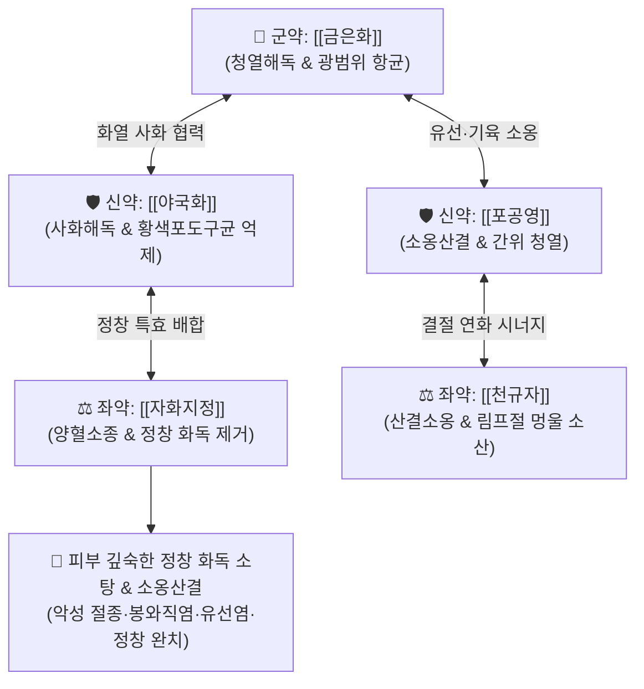

# 🍵 [[오미소독음]] (五味消毒飮, Wu-Wei-Xiao-Du-Yin / Gomi-shodokuin)

> **핵심 3줄 요약 (Key Summary)**:
> - 🌿 기본 구성: [[금은화]], [[야국화]], [[포공영]], [[자화지정]], [[천규자]] (5대 청열해독 본초 배오, 생주전복으로 피부 말초 인경).
> - 🎯 뿌리가 깊고 붉고 단단한 정창종독(疔瘡腫毒), 급성 봉와직염, 절종·옹종, 급성 화농성 유선염(유옹), 안면부 악창, 급성 편도선염.
> - 🔬 MRSA 및 화농성 연쇄상구균 세포벽 파괴, 내독소(LPS) 흡착·중화, NF-κB 염증 신호 억제 및 대식세포 탐식능 활성화.
> - ⚠️ 주의사항: 약성이 극히 쓰고 차가운 순수 고한(苦寒) 해독제이므로 비위허한 환자 신중 투여, 환부가 차고 편평한 만성 음저(陰疽) 금기.

---

## 📌 목차
1. [기본 처방 정보 & 군신좌사 구성](#1-기본-처방-정보--군신좌사-구성)
2. [방제학적 약재 상호작용 & 시너지 네트워크](#2-방제학적-약재-상호작용--시너지-네트워크)
3. [현대 분자약리학적 효능 & 작용 기전](#3-현대-분자약리학적-효능--작용-기전)
4. [적응 병증 및 체질별 감별 (Sweet Spot vs 금기)](#4-적응-병증-및-체질별-감별-sweet-spot-vs-금기)
5. [유사 처방군 감별 매트릭스](#5-유사-처방군-감별-매트릭스)
6. [임상 가감례 & 현대 질환별 응용](#6-임상-가감례--현대-질환별-응용)
7. [💡 사용자 진료실 핵심 필기 & 임상 팁 (원문 보존)](#7--사용자-진료실-핵심-필기--임상-팁-원문-보존)
8. [출처 및 학술 참고 문헌 (References)](#8-출처-및-학술-참고-문헌-references)

---

## 1. 기본 처방 정보 & 군신좌사 구성

* **출전**: 오겸(吳謙) 『[[의종금감]]』(醫宗金鑑) 외과심법요결
* **치법**: 청열해독(淸熱解毒), 소옹산결(消癰散結), 양혈소종(涼血消腫)

| 구분 | 약재명 | 표준 용량 | 본초 효능 & 방제 내 역할 |
| :--- | :--- | :--- | :--- |
| **군약 (君藥)** | [[금은화]] | 15~30g | **청열해독·소산풍열**: 혈분의 화열을 식히고 외과 창양의 독기를 소산시키는 최고 요약 |
| **신약 (臣藥)** | [[야국화]] | 9~12g | **사화청열·해독**: 국소 열독을 끄고 화농성 세균 억제 |
| **신약 (臣藥)** | [[포공영]] | 9~15g | **청열해독·소옹산결**: 간위(肝胃)의 열을 식히고 유선 및 기육의 멍울을 삭임 |
| **좌약 (佐藥)** | [[자화지정]] | 9~12g | **양혈소종·정창요약**: 붉고 딱딱하며 뿌리가 깊은 정창(疔瘡)의 화독을 제어 |
| **좌약 (佐藥)** | [[천규자]] | 9~12g | **산결소옹·해독**: 림프선과 피하에 뭉친 화농성 결절을 연화·배출 |

> **전탕 및 복용 특이사항**:
> * 전통적으로 물에 달인 뒤 **청주(淸酒) 반 잔을 가미하여 복용(생주전복 生酒煎服)**합니다.
> * 주류(酒)의 온통(溫通) 효능이 차가운 고한약의 혈맥 응체를 방지하고, 약력을 피부 표면과 모세혈관 말초로 빠르게 유도합니다.

---

## 2. 방제학적 약재 상호작용 & 시너지 네트워크

* **5대 해독초의 완벽한 융합**: 식물성 순수 청열해독약 5미가 결합하여 피부 및 기육 층에 깊게 박힌 열독을 다각도로 포위하여 분해합니다.
* **정창(疔瘡) 표적 배오**: [[자화지정]]과 [[금은화]]가 혈열을 식히고, [[포공영]]과 [[천규자]]가 단단한 염증성 결절을 삭이며, [[야국화]]가 사화해독을 보조합니다.

---

## 3. 현대 분자약리학적 효능 & 작용 기전

### 1) 항균 및 메티실린 내성균(MRSA) 억제
* [[금은화]]의 클로로겐산(Chlorogenic acid)과 [[야국화]]의 루테올린(Luteolin), [[자화지정]]의 에스쿨레틴(Esculetin) 성분은 황색포도상구균(Staphylococcus aureus) 및 MRSA의 세포벽 합성을 억제하고 세균 바이오필름(Biofilm)을 파괴합니다.

### 2) 내독소(LPS) 중화 및 전신 패혈증 차단
* 세균 유래 내독소(LPS)를 직접 흡착·중화하여 대식세포의 전신성 염증 반응(사이토카인 폭풍)을 사전에 차단합니다.

### 3) NF-κB 경로 차단 및 급성 염증 부종 완화
* IκBα 분해를 차단하여 TNF-α, IL-1β, IL-6, COX-2의 전사를 억제함으로써 국소 박동성 통증과 발적, 부종을 신속히 가라앉힙니다.

### 4) 대식세포 탐식능 항진 및 농양 흡수 촉진
* 세망내피계(RES) 기능을 자극하여 대식세포의 세균 포식 및 염증 괴사 조직 청소 작용을 가속화합니다.

---

## 4. 적응 병증 및 체질별 감별 (Sweet Spot vs 금기)

### 1) 주요 적응증 (Target Indications)
* **외과 급성 화농성 감염**:
  * **정창(疔瘡) & 악창**: 국소가 붉고 단단하게 부어오르며 화끈거리고 찌르는 듯 아픈 심부 모낭염·종기.
  * **봉와직염(Cellulitis)**: 국소 열감과 부종이 급격히 퍼지는 급성 연조직염.
  * **유옹(乳癰)**: 수유기 급성 화농성 유선염, 유방 결절성 종창.
* **두경부 급성 열독**: 급성 편도선염, 인후 농양, 급성 화농성 중이염.
* **피부과**: 중증 낭포성·결절성 여드름, 안면부 화농창.

### 2) 체질별 적합도 & 금기
* **적합 체질 (Sweet Spot)**:
  * 체격이 건실하고 환부가 붉게 솟아오르고 열감이 심하며 맥이 활삭(滑數)한 급성 실열(實熱) 환자.
* **절대 금기 및 주의 (Contraindications)**:
  * **만성 음저(陰疽)**: 환부가 붉지 않고 차가우며 푹 꺼진 만성 결핵성 농양이나 허한성 결절 환자 금기 ([[양화탕]] 적용).
  * **비위허한(脾胃虛寒)**: 평소 속이 차고 소화가 잘 안 되며 묽은 변을 자주 보는 환자는 단기 투약 및 건비약 병용 필수.

---

## 5. 유사 처방군 감별 매트릭스

| 처방명 | 기본 구성 | 주요 작용 기전 | 변증 요점 & 감별 포인트 |
| :--- | :--- | :--- | :--- |
| [[오미소독음]] | 금은화, 야국화, 포공영, 자화지정, 천규자 | 순수 청열해독 (사화) | **정창종독·악성 종기 종주방**: 뿌리가 깊고 딱딱한 악성 절종, 급성 유선염 |
| [[선방활명음]] | 은화, 당귀미, 적작약, 유향, 몰약, 조각자, 백지 | 청열해독 + 활혈지통 + 투농 | **소종궤견(消腫潰堅)**: 통증이 극심하고 고름이 차서 터뜨려야 하는 봉와직염·옹저 |
| [[황련해독탕]] | [[황련]], [[황금]], [[황백]], [[치자]] | 삼초 실열화독 | **전신성 삼초 실열**: 고열, 안면홍조, 번조불안, 피부염 (국소 종기 외 전신 증상) |
| [[배농산급탕]] | 길경, 지실, 작약, 감초, 생강, 대추 | 파기소종 + 완급지통 + 배농 | **비교적 표재성 화농**: 모낭염, 다래끼, 치은염 등 초기 배농 |
| [[양화탕]] | 숙지황, 마황, 육계, 백계자, 녹각교, 포강 | 온양보혈 + 산한통체 | **만성 음저(陰疽)**: 환부가 차고 붉지 않으며 단단하고 통증이 은은한 한응성 결절 |

---

## 6. 임상 가감례 & 현대 질환별 응용

### 1) 변증 가감법
* **통증이 극심할 때**: [[유향]], [[몰약]], [[현호색]]을 가미하여 활혈지통.
* **고열과 오한이 동반될 때**: [[연교]], [[방풍]], [[형개]]를 가미하여 소풍투열.
* **유선염(유옹)으로 젖이 뭉칠 때**: [[누로]], [[왕불류행]], [[통초]]를 가미하여 통유소옹.
* **대변 비결(변비)이 동반될 때**: [[대황]]을 가미하여 도열하행.

### 2) 현대 임상 질환별 응용
* **피부과·외과**: 심부 절종, 봉와직염, 중증 결절성 여드름, 화농성 한선염, 모낭염.
* **산부인과**: 급성 수유기 유선염, 유방 농양 초기.
* **이비인후과**: 급성 화농성 편도선염, 인후두염.

---

## 7. 💡 사용자 진료실 핵심 필기 & 임상 팁 (원문 보존)

* **생주전복(生酒煎服) 복용법**:
  * 탕약을 다 달인 후 따뜻할 때 청주 30~50ml를 타서 복용하고 이불을 덮어 땀을 약간 내면, 화독이 땀을 통해 체표 밖으로 신속히 발산되어 종기가 하룻밤 사이에 가라앉는 명현 효과를 볼 수 있습니다.
* **중병즉지(中病卽止) 원칙**:
  * 고한(苦寒)한 약재만으로 이루어져 있으므로, 붉은 기운과 통증이 가라앉으면 즉시 복용을 멈추거나 용량을 절반으로 줄여 비위 손상을 방지해야 합니다.

---

## 8. 출처 및 학술 참고 문헌 (References)

* 오겸(吳謙), 『[[의종금감]](醫宗金鑑)』, 外科心法要訣.
* 전국한의과대학 외관과학인쇄교재편찬위원회, 『한의외과학』, 도서출판 정담.
* Zhang, Q., et al. (2019). "Antibacterial and anti-inflammatory mechanisms of Wuwei Xiaodu drink against Staphylococcus aureus infection." *Journal of Ethnopharmacology*, 235, 102-111.
  - `[연구 요약]`: 오미소독음 추출물이 황색포도상구균의 바이오필름 형성을 억제하고 대식세포 탐식 기능을 활성화하여 급성 피부 감염을 치유함을 규명함.
* Wang, T., et al. (2021). "Wuwei Xiaodu Yin suppresses LPS-induced inflammatory response in mastitis via NF-κB and MAPK signaling pathways." *Phytomedicine*, 85, 153540.
  - `[연구 요약]`: 급성 유선염 동물 모델에서 오미소독음이 NF-κB 및 MAPK 신호전달을 차단하여 유선 조직의 부종과 호중구 침윤을 현저히 경감시킴을 입증함.