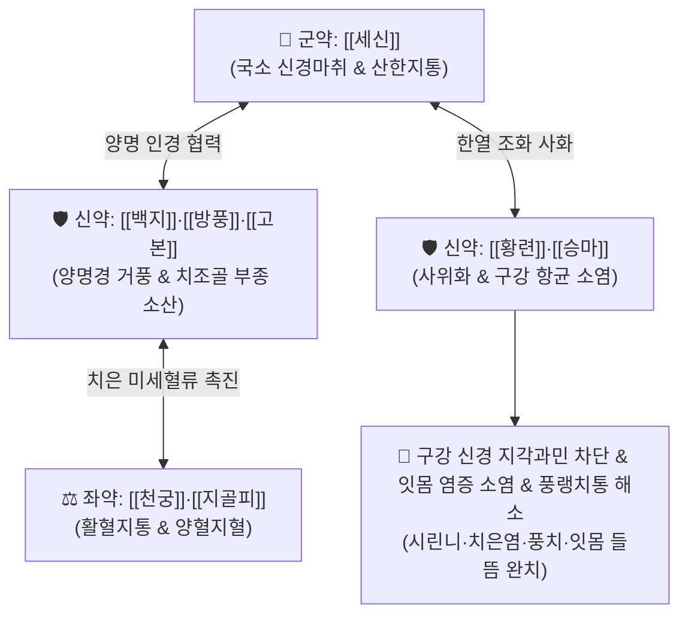

# 🍵 [[옥지산]] (玉池散, Yu-Chi-San / Gyokuchisan)

> **핵심 3줄 요약 (Key Summary)**:
> - 🌿 기본 구성: [[세신]], [[백지]], [[방풍]], [[고본]], [[승마]], [[황련]], [[감초]], [[천궁]], [[지골피]], [[생강]] (구강 치경부 인경 및 국소 마취진통·사화소염).
> - 🎯 풍랭(風冷) 및 풍열(風熱) 치통, 치은염, 치주염(풍치), 찬 것을 먹은 후 시리고 욱신거리는 잇몸 통증, 노인성 잇몸 들뜸 및 출혈.
> - 🔬 메틸유제놀(세신)의 국소 지각신경 마취·진통, 베르베린(황련)·푸라노쿠마린(백지)의 구강 세균 항균 및 치주막 염증 완화.
> - ⚠️ 주의사항: 세신의 아사론/사프롤 성분 과량 흡수를 막기 위해 가글 후 뱉어내는 함수법(含漱法) 위주 운용, 임산부 내복 금기.

---

## 📌 목차
1. [기본 처방 정보 & 군신좌사 구성](#1-기본-처방-정보--군신좌사-구성)
2. [방제학적 약재 상호작용 & 시너지 네트워크](#2-방제학적-약재-상호작용--시너지-네트워크)
3. [현대 분자약리학적 효능 & 작용 기전](#3-현대-분자약리학적-효능--작용-기전)
4. [적응 병증 및 체질별 감별 (Sweet Spot vs 금기)](#4-적응-병증-및-체질별-감별-sweet-spot-vs-금기)
5. [유사 처방군 감별 매트릭스](#5-유사-처방군-감별-매트릭스)
6. [임상 가감례 & 현대 질환별 응용](#6-임상-가감례--현대-질환별-응용)
7. [💡 사용자 진료실 핵심 필기 & 임상 팁 (원문 보존)](#7--사용자-진료실-핵심-필기--임상-팁-원문-보존)
8. [출처 및 학술 참고 문헌 (References)](#8-출처-및-학술-참고-문헌-references)

---

## 1. 기본 처방 정보 & 군신좌사 구성

* **출전**: 허준(許浚) 『[[동의보감]]』(東醫寶鑑) 이안맥설치문(耳眼面鼻口齒門) 및 송대 『태평혜민화제국방』
* **치법**: 거풍지통(祛風止痛), 청열소종(淸熱消腫), 산한온통(散寒溫通), 설열화위(泄熱和胃)

| 구분 | 약재명 | 표준 용량 | 본초 효능 & 방제 내 역할 |
| :--- | :--- | :--- | :--- |
| **군약 (君藥)** | [[세신]] | 2~4g | **온경거풍 & 국소마취진통**: 치근 신경의 지각과민을 마비·진통시키고 풍랭 치통을 타파하는 핵심 주약 |
| **신약 (臣藥)** | [[백지]], [[방풍]], [[고본]] | 각 3~5g | **거풍통락 & 지통**: 양명경(위경)과 두면부 경락의 풍사를 흩어 치조골 부종 완화 |
| **신약 (臣藥)** | [[승마]], [[황련]] | 각 3~5g | **청열해독 & 인경**: 위화(胃火)가 치아로 치솟는 것을 식히고 잇몸 염증 항균 소염 |
| **좌약 (佐藥)** | [[천궁]], [[지골피]] | 각 3~5g | **활혈지통 & 청열량혈**: 치은 미세순환을 촉진하고 잇몸 허열(虛熱)과 출혈을 제어 |
| **사약 (使藥)** | [[생강]], [[감초]] | 각 2~3g | **건비화위 & 조화제약**: 자극성 약재를 완충하고 구강 점막 보호 |

> **방제 특징**:
> * **외용 함수(含漱)와 내복의 겸용**: 탕약으로 달여 입안에 머금고 가글(함수)한 뒤 뱉거나 천천히 삼켜 구강 국소에 직접 작용시킵니다.
> * **한열병용(寒熱幷用) 구조**: 차가운 것에 잇몸이 상했을 때 [[세신]]·[[백지]]의 따뜻한 약성으로 진통시키고, [[황련]]·[[승마]]로 잇몸의 붉은 염증열을 동시에 잡습니다.

---

## 2. 방제학적 약재 상호작용 & 시너지 네트워크

* **세신 + 백지의 국소 신경 진통**: [[세신]]의 메틸유제놀과 [[백지]]의 푸라노쿠마린이 삼차신경 말단 및 치수 신경의 통각 신호 전달을 강력히 차단합니다.
* **황련 + 승마의 위열(胃熱) 사화**: 잇몸이 붉게 붓고 피가 나는 양명위열(陽明胃熱)을 가라앉히고 세균 증식을 억제합니다.
* **천궁 + 지골피의 치은 미세순환 개선**: 치주 인대와 잇몸 모세혈관의 어혈을 풀고 출혈을 지혈합니다.

---

## 3. 현대 분자약리학적 효능 & 작용 기전

### 1) 치수 신경 국소 마취 및 지각과민 완화
* [[세신]]의 핵심 유효 성분인 메틸유제놀(Methyleugenol)과 정유 성분은 전압의존성 나트륨 통로(Nav Channel)를 차단하여 리도카인과 유사한 국소 마취 및 진통 효과를 나타내어 찬물 섭취 시 찌릿한 시린니 통증을 즉각 완화합니다.

### 2) 치주염 원인균(P. gingivalis) 억제 및 항균
* [[황련]]의 [[베르베린]](Berberine)과 [[백지]]의 쿠마린 성분이 치주염 주요 원인균인 *Porphyromonas gingivalis* 및 *Streptococcus mutans*의 생체막 형성을 억제하고 세균 증식을 강력히 차단합니다.

### 3) 치은 모세혈관 수축 및 부종·출혈 억제
* 염증성 프로스타글란딘(PGE2) 및 COX-2 발현을 억제하여 잇몸이 벌겋게 붓고 양치 시 피가 나는 치은염 증상을 개선합니다.

---

## 4. 적응 병증 및 체질별 감별 (Sweet Spot vs 금기)

### 1) 주요 적응증 (Target Indications)
* **풍랭치통(風冷齒痛) & 노인성 잇몸 쇠약**:
  * 연세가 들면서 잇몸이 내려앉고 찬 것을 먹을 때마다 잇몸이 시리고 욱신거리는 통증.
  * 찬 바람을 쐬거나 찬물을 마시면 치아가 찌릿하게 아픈 치경부 마모증 및 지각과민증.
* **풍열치통(風熱齒痛) & 치주 질환**:
  * 잇몸이 붉게 부어오르고 피가 나며 욱신거리는 급·만성 치은염, 치주염(풍치).
  * 발치 후 통증, 치통으로 뺨까지 부어오를 때.

### 2) 체질별 적합도 & 금기
* **적합 체질 (Sweet Spot)**:
  * 찬 음식을 먹고 잇몸이 상한 노인층, 풍치로 잇몸이 들뜨고 욱신거리는 환자.
* **절대 금기 및 주의 (Contraindications)**:
  * **임산부 내복 금기**: [[세신]], [[천궁]]의 활혈 및 자궁 자극 가능성으로 내복은 금하며 가글(함수) 후 뱉는 방식으로만 제한 운용.
  * **중증 치수 괴사**: 신경 치료가 필요한 급성 치수염은 치과적 처치 병행 필수.

---

## 5. 유사 처방군 감별 매트릭스

| 처방명 | 기본 구성 | 주요 작용 기전 | 변증 요점 & 상황별 선택 기준 |
| :--- | :--- | :--- | :--- |
| [[옥지산]] | 세신, 백지, 방풍, 고본, 승마, 황련, 천궁 | 거풍산한 + 청열소종 + 국소마취 | **시린니 & 잇몸 상함 가글/내복**: 찬 것 먹고 잇몸 붓고 시린 통증 |
| [[청화환]] | 황련, 치자, 지모, 황백, 석고 등 | 자음강화 + 청설위화 | **내복 알약 (체질 개선)**: 위열(胃熱)과 신허(腎虛)로 인한 만성 잇몸염 (옥지산과 병용) |
| [[청위산]] | 황련, 승마, 당귀, 생지황, 목단피 | 청위양혈 (위열 사화) | **순수 위열 치통**: 잇몸이 빨갛게 붓고 입냄새가 심하며 찬물을 대면 일시 완화 |
| [[입효산]] | 세신, 방풍, 승마, 감초, 용담초 | 거풍지통 + 사간위화 | **급성 돌발 치통**: 치통이 극심하여 밤에 잠을 못 잘 때 |

---

## 6. 임상 가감례 & 현대 질환별 응용

### 1) 변증 가감법
* **찬물에 유독 이가 시리고 잇몸이 쑤실 때**: [[세신]]을 증량하고 [[건강]]을 가미하여 온경산한.
* **잇몸이 벌겋게 붓고 궤양이 생겼을 때**: [[황련]], [[석고]]를 가미하여 청열사화.
* **풍치로 치아가 흔들리고 잇몸이 약해졌을 때**: [[숙지황]], [[골쇄보]], [[구기자]]를 가미하여 보신고치(補腎固齒).
* **만성 잇몸 질환의 내복·외용 병용**: 옥지산으로 가글하면서 내복으로 [[청화환]]을 병용하여 속열과 신허를 동시 치료.

### 2) 현대 임상 질환별 응용
* **치과 질환**: 급만성 치은염, 치주염(풍치), 치경부 지각과민증(시린니), 발치 후 건성발치와 통증, 구내염.

---

## 7. 💡 사용자 진료실 핵심 필기 & 임상 팁 (원문 보존)

* **외용 함수 가글법 프로토콜**:
  * 연세가 들고 차가운 것을 많이 먹어 잇몸이 상한 증상에 탕약을 진하게 달여 **미온 상태에서 입안에 3~5분간 머금고 가글(함수 含漱)한 뒤 뱉어내는 방식**으로 활용합니다.
* **주약(세신)의 임상적 역할**:
  * 처방의 핵심 주작용은 [[세신]]의 국소 신경 마취 및 산한(散寒) 효능에서 나옵니다.
* **청화환(淸火丸)과의 병용 운용**:
  * 잇몸 겉의 염증과 시린 통증은 옥지산 가글로 신속히 잡고, 속의 위열과 신허는 [[청화환]]을 내복시켜 근본적으로 재발을 방지하는 병용 요법이 임상에서 가장 효과적입니다.

---

## 8. 출처 및 학술 참고 문헌 (References)

* 허준(許浚), 『[[동의보감]](東醫寶鑑)』, 口齒門.
* 전국한의과대학 안이비인후과학인쇄교재편찬위원회, 『한방안이비인후과학』, 도서출판 정담.
