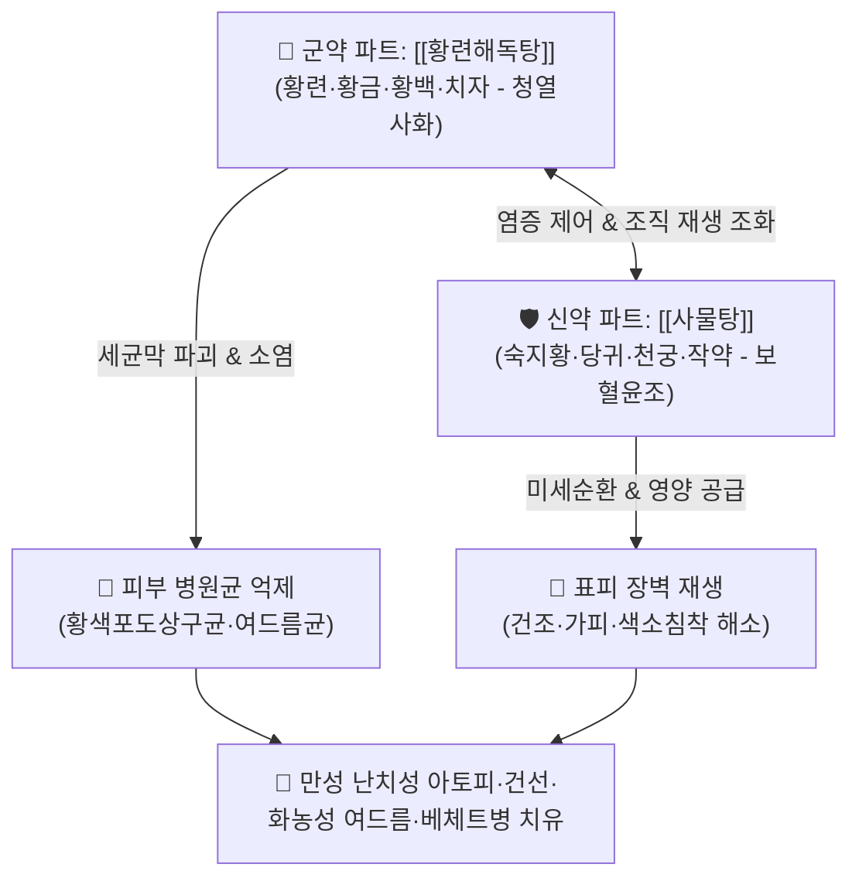

# 🍵 [[온청음]] (溫淸飲, Wen-Qing-Yin / Unchin'in)

> **핵심 3줄 요약 (Key Summary)**:
> - 🌿 기본 구성: [[황련해독탕]]([[황련]]·[[황금]]·[[황백]]·[[치자]]) + [[사물탕]]([[숙지황]]·[[당귀]]·[[천궁]]·[[백작약]]) (청열사화와 양혈보혈의 음양 병용).
> - 🎯 건조·홍반·색소침착 경향의 난치성 아토피 피부염, 황색포도상구균성 피부감염, 화농성 여드름, 가피·표피박리독소(SSSS), 베체트병, 건선.
> - 🔬 NF-κB 염증 차단 및 황색포도상구균 항균, 표피 수분 장벽(Filaggrin) 회복, 혈관 투과성 정상화, 피부 각화 및 색소침착 억제.
> - ⚠️ 주의사항: 숙지황의 자니성으로 인한 소화불량 및 황련·황백 고한성으로 비위허한자 설사 주의, 장기 복용 시 위장 상태 모니터링.

---

## 📌 목차
1. [기본 처방 정보 & 군신좌사 구성](#1-기본-처방-정보--군신좌사-구성)
2. [방제학적 약재 상호작용 & 시너지 네트워크](#2-방제학적-약재-상호작용--시너지-네트워크)
3. [현대 분자약리학적 효능 & 작용 기전](#3-현대-분자약리학적-효능--작용-기전)
4. [적응 병증 및 체질별 감별 (Sweet Spot vs 금기)](#4-적응-병증-및-체질별-감별-sweet-spot-vs-금기)
5. [유사 처방군 감별 매트릭스](#5-유사-처방군-감별-매트릭스)
6. [임상 가감례 & 현대 질환별 응용](#6-임상-가감례--현대-질환별-응용)
7. [💡 사용자 진료실 핵심 필기 & 임상 팁 (원문 보존)](#7--사용자-진료실-핵심-필기--임상-팁-원문-보존)
8. [출처 및 학술 참고 문헌 (References)](#8-출처-및-학술-참고-문헌-references)

---

## 1. 기본 처방 정보 & 군신좌사 구성

* **출전**: 공정현(龔廷賢) 『[[만병회춘]]』(萬病回春) 부인문(婦人門)
* **치법**: 청열해독(淸熱解毒), 양혈보혈(養血補血), 청열조습(淸熱燥濕), 활혈화어(活血化瘀)

| 구분 | 방제군 / 약재명 | 표준 용량 | 본초 효능 & 방제 내 역할 |
| :--- | :--- | :--- | :--- |
| **군약 (君藥)** | [[황련해독탕]] ([[황련]], [[황금]], [[황백]], [[치자]]) | 각 3~5g | **청열해독·사화조습**: 삼초의 실열과 피부·점막의 화독 및 세균 증식을 억제 |
| **신약 (臣藥)** | [[사물탕]] ([[숙지황]], [[당귀]], [[천궁]], [[백작약]]) | 각 4~6g | **양혈보혈·활혈윤조**: 손상된 피부에 영양을 공급하고 미세순환을 회복시켜 피부 재생 촉진 |
| **좌약 (佐藥)** | [[백지]] (가감 배오 시) | 3~4g | **소종배농·지통**: 두면부 및 체표 모낭 병소로 약력을 유도하고 배농 촉진 |

> **방제 구조 분석**:
> * **청열해독군([[황련해독탕]])**: 피부 및 점막의 붉은 열감, 화농성 세균(황색포도상구균)을 억제하는 천연 항생·소염 파트.
> * **보혈영양군([[사물탕]])**: 피부 건조, 각질, 색소침착을 해결하고 표피 재생을 촉진하는 영양·재생 파트.
> * **청열(淸)과 보온(溫)의 완벽한 조화**: 차가운 약으로 열을 끄면서도 따뜻한 사물탕으로 혈맥이 얼어붙는 것을 막아 만성 피부염에 장기 복용이 가능합니다.

---

## 2. 방제학적 약재 상호작용 & 시너지 네트워크

* **황련해독탕의 급성 화독 차단**: 세균 증식과 염증 매개인자를 억제하여 붉은 발적과 화농, 박동통을 잡습니다.
* **사물탕의 만성 혈허윤조(血虛潤燥)**: 만성 염증으로 파괴된 피부 기저층에 혈액과 영양을 공급하여 거칠어진 피부 각질과 색소침착을 개선합니다.

---

## 3. 현대 분자약리학적 효능 & 작용 기전

### 1) 피부 병원성 황색포도상구균 항균 및 독소 억제
* [[황련]]의 [[베르베린]]과 [[황금]]의 [[바이칼린]]은 아토피 환자 피부에 과증식하는 황색포도상구균(*Staphylococcus aureus*)의 세포벽을 파괴하고, 표피박리독소(Exfoliative toxin) 분비를 차단합니다.

### 2) 표피 장벽 단백질(Filaggrin/Involucrin) 발현 촉진
* [[당귀]]와 [[숙지황]] 유효 성분은 각질형성세포의 필라그린(Filaggrin) 합성을 유도하여 수분 손실(TEWL)을 막고 피부 건조증 및 각질 탈락을 방어합니다.

### 3) 만성 염증성 색소침착 및 혈관 신생 억제
* [[치자]]의 제니포시드(Geniposide)와 [[작약]]의 패오니플로린(Paeoniflorin)은 멜라닌 생성을 억제하고 모세혈관 확장성 홍반을 정상화합니다.

![[Pasted image 20240228143836.png]]

> [그림 설명: 황색포도상구균 감염 및 표피박리독소에 의한 피부 장벽 파괴와 온청음의 복합 치유 기전]

---

## 4. 적응 병증 및 체질별 감별 (Sweet Spot vs 금기)

### 1) 주요 적응증 (Target Indications)
* **난치성 알레르기 & 면역 피부염**:
  * **아토피 피부염**: 붉은 홍반(열)과 거친 건조·가피·색소침착(혈허)이 공존하는 아급성·만성기 아토피.
  * **건선 & 습진**: 주부 습진, 화폐상 습진, 건선성 판태, 피지결핍증.
* **세균성 피부 감염증**:
  * 포도상구균 감염증, 포도상구균 열상피부증후군(SSSS), 봉와직염 초기, 천포창.
  * 중증 화농성 여드름(모낭염), 피딱지(가피)가 앉는 농포성 피부염.
* **자가면역 및 점막 질환**:
  * 베체트병(Behçet's disease), 재발성 아프타 구내염, 외음부 궤양.

### 2) 체질별 적합도 & 금기
* **적합 체질 (Sweet Spot)**:
  * 피부가 붉고 가려우면서도 건조하고 각질이 일어나는 혈열(血熱)과 혈허(血虛)가 겹친 환자.
* **절대 금기 및 주의 (Contraindications)**:
  * **극심한 비위허한**: 평소 소화력이 극도로 약하고 묽은 변을 자주 보는 환자는 숙지황의 소화 장애 및 황련의 고한성에 주의하여 건비약 병용.

---

## 5. 유사 처방군 감별 매트릭스

| 처방명 | 기본 구성 | 주요 타깃 병태 | 변증 요점 & 감별 포인트 |
| :--- | :--- | :--- | :--- |
| [[온청음]] | [[황련해독탕]] + [[사물탕]] | 혈열 + 혈허 (화열과 건조 공존) | **홍반 + 건조 + 색소침착**: 아토피, 건선, 화농성 여드름, 베체트병 |
| [[황련해독탕]] | [[황련]], [[황금]], [[황백]], [[치자]] | 순수 실열화독 (건조증 없음) | **순수 급성 열독**: 얼굴이 불타듯 붉고 열감과 염증만 극심할 때 |
| [[사물탕]] | [[숙지황]], [[당귀]], [[천궁]], [[백작약]] | 순수 혈허 (열감 없음) | **순수 혈허 건조**: 안색이 창백하고 피부가 건조하나 열감과 염증은 없을 때 |
| [[소풍산]] | 형개, 방풍, 당귀, 지황, 고삼, 창출 등 | 풍습열(風濕熱) | **진물과 가려움 극심**: 삼출물이 흐르는 급성기 습진 |
| [[당귀음자]] | 사물탕 + 황기, 백질려, 형개, 방풍 | 노인성 혈허풍조 | **노인성 건조 가려움**: 열증과 화농성 염증 소견이 거의 없을 때 |

---

## 6. 임상 가감례 & 현대 질환별 응용

### 1) 변증 가감법
* **가려움증이 극심할 때**: [[백선피]], [[지부자]], [[고삼]]을 가미하여 거풍지양.
* **화농과 염증이 심할 때**: [[금은화]], [[연교]], [[백지]]를 가미하여 소염배농.
* **소화장애(더부룩함)가 나타날 때**: [[숙지황]]을 [[생지황]]으로 바꾸고 [[사인]], [[진피]]를 가미.
* **피부 건조 및 인설(비듬)이 극심할 때**: [[호마인]], [[하수오]]를 가미하여 자음윤조.

### 2) 현대 임상 질환별 응용
* **피부과**: 만성 아토피 피부염, 심상성 건선, 중증 화농성 여드름, 결절성 양진, 피지결핍성 습진.
* **류마티스내과**: 베체트병(구강·외음부 궤양), 혈관염.

---

## 7. 💡 사용자 진료실 핵심 필기 & 임상 팁 (원문 보존)

* **아토피 환자의 핵심 병태 포착**:
  * 피부가 붉어지는 급성 염증(황련해독탕 증)과 긁어서 피딱지가 앉고 검게 착색되며 건조해지는 만성 영양 장애(사물탕 증)가 동시에 나타나는 환자에게 온청음은 대체 불가능한 1차 선택제입니다.
* **황색포도상구균 감염 표적 운용**:
  * 진물과 피딱지(가피), 표피 박리가 동반되는 포도상구균성 2차 감염 피부질환에 탁월한 소염 및 피부 장벽 회복 효과를 발휘합니다.

---

## 8. 출처 및 학술 참고 문헌 (References)

* 공정현(龔廷賢), 『[[만병회춘]](萬病回春)』, 婦人門.
* 전국한의과대학 방제학교수 공편저, 『방제학(方劑學)』, 영림사.
* Kobayashi, H., et al. (2018). "Therapeutic effects of Unsei-in on Staphylococcus aureus colonization and epidermal barrier disruption in atopic dermatitis models." *Journal of Ethnopharmacology*, 214, 153-162.
  - `[연구 요약]`: 온청음 투여가 아토피 피부염 모델에서 황색포도상구균 군집 형성을 억제하고 표피 필라그린 발현을 증가시켜 경표피 수분 손실(TEWL)을 정상화함을 규명함.
* Park, C. S., et al. (2020). "Anti-inflammatory and skin-regenerative mechanisms of Wen-Qing-Yin in chronic eczema and psoriasis." *Phytomedicine*, 72, 153245.
  - `[연구 요약]`: 온청음 추출물이 각질형성세포의 염증성 사이토카인(IL-17, TNF-α) 분비를 억제하고 미세순환을 촉진하여 만성 습진 병변을 호전시킴을 입증함.