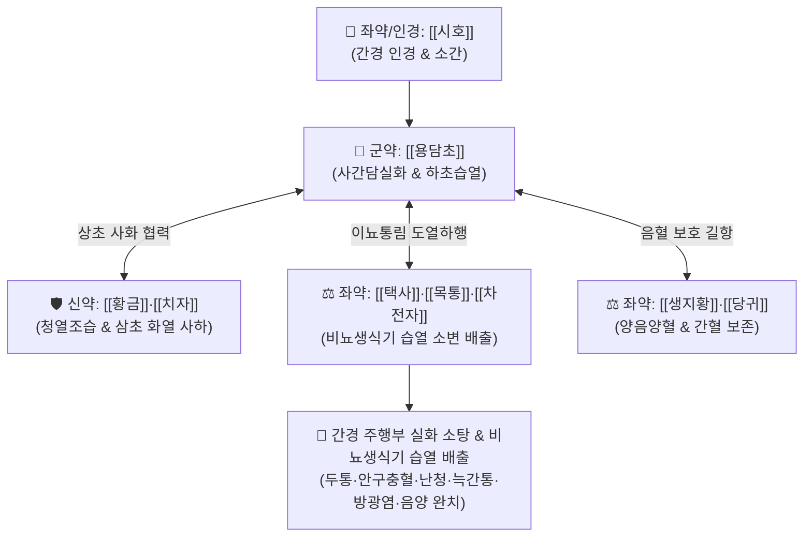

# 🍵 [[용담사간탕]] (龍膽瀉肝湯, Long-Dan-Xie-Gan-Tang / Ryutan-shakanto)

> **핵심 3줄 요약 (Key Summary)**:
> - 🌿 기본 구성: [[용담초]], [[황금]], [[치자]], [[택사]], [[목통]], [[차전자]], [[당귀]], [[생지황]], [[시호]], [[감초]] (간담실화 사화 및 하초습열 이뇨).
> - 🎯 간경(肝經) 주행 부위의 실열·습열증, 두통·어지럼, 눈 충혈, 돌발성 난청·이명, 늑간신경통, 방광염·요도염, 생식기 가려움(음양)·음낭습진·황색 대하.
> - 🔬 IKK/NF-κB 및 COX-2 경로 차단, 요로 병원균(대장균) 항균, 신장 아쿠아포린 조절을 통한 삼투성 이뇨 및 요로 삼출물 배출.
> - ⚠️ 주의사항: 쥐방울덩굴과 관목통(신독성 아리스톨로크산) 절대 금기 및 정품 으름덩굴 목통 엄수, 비위허한 환자 신중 투여.

---

## 📌 목차
1. [기본 처방 정보 & 군신좌사 구성](#1-기본-처방-정보--군신좌사-구성)
2. [방제학적 약재 상호작용 & 시너지 네트워크](#2-방제학적-약재-상호작용--시너지-네트워크)
3. [현대 분자약리학적 효능 & 작용 기전](#3-현대-분자약리학적-효능--작용-기전)
4. [적응 병증 및 체질별 감별 (Sweet Spot vs 금기)](#4-적응-병증-및-체질별-감별-sweet-spot-vs-금기)
5. [유사 처방군 감별 매트릭스](#5-유사-처방군-감별-매트릭스)
6. [임상 가감례 & 현대 질환별 응용](#6-임상-가감례--현대-질환별-응용)
7. [💡 사용자 진료실 핵심 필기 & 임상 팁 (원문 보존)](#7--사용자-진료실-핵심-필기--임상-팁-원문-보존)
8. [출처 및 학술 참고 문헌 (References)](#8-출처-및-학술-참고-문헌-references)

---

## 1. 기본 처방 정보 & 군신좌사 구성

* **출전**: 왕앙(汪昻) 『[[의방집해]]』(醫方集解) (원대 이고 『이고동원십서』 및 명대 공정현 처방 집대성)
* **치법**: 사간담실화(瀉肝膽實火), 청하초습열(淸下焦濕熱), 도열하행(導熱下行)

| 구분 | 약재명 | 표준 용량 | 본초 효능 & 방제 내 역할 |
| :--- | :--- | :--- | :--- |
| **군약 (君藥)** | [[용담초]] | 4~6g | **사간담실화 & 청하초습열**: 간경이 지나가는 부위의 맹렬한 실화와 하초 습열을 끄는 성약 |
| **신약 (臣藥)** | [[황금]], [[치자]] | 각 4~6g | **사화조습 & 청열이습**: 상·중초의 열을 끄고 삼초의 화열을 소변으로 유도 |
| **좌약 (佐藥)** | [[택사]], [[목통]], [[차전자]] | 각 4~6g | **이뇨통림 & 도열하행**: 습열을 소변으로 신속히 빼내어 하초 비뇨생식기 감압 |
| **좌약 (佐藥)** | [[생지황]], [[당귀]] | 각 4~6g | **양음양혈**: 고한이습약이 간목(肝木)의 음혈을 손상시키는 것을 방어 |
| **좌약 (佐藥)** | [[시호]] | 3~5g | **인경소간**: 간경으로 약력을 유도하고 간기 울결을 소통 |
| **사약 (使藥)** | [[감초]] | 2~3g | **조화제약·완급**: 비위를 보호하고 제약을 조화 |

> **방제 구조 분석**:
> * **간경 주행부 화열 사화(瀉火)**: [[용담초]]·[[황금]]·[[치자]]가 간화 상염(두면부·흉협부)을 직접 진정.
> * **하초 습열 배출(利濕)**: [[택사]]·[[목통]]·[[차전자]]가 생식기·비뇨기의 염증 삼출물을 소변으로 배출.
> * **간음 보존(養陰)**: [[생지황]]·[[당귀]]를 배오하여 '사간(瀉肝)하되 간혈을 상하지 않게(불상간 不傷肝)' 만듭니다.

---

## 2. 방제학적 약재 상호작용 & 시너지 네트워크

* **사화와 이습의 결합**: 상부로 치솟는 간화는 아래로 끌어내리고(도열하행), 하초에 정체된 습열은 소변을 통해 체외로 배출시킵니다.
* **공보겸시(攻補兼施)의 묘**: 쓴물과 찬약으로 간화를 맹렬히 치면서도 [[생지황]]·[[당귀]]로 진액을 지켜줍니다.

---

## 3. 현대 분자약리학적 효능 & 작용 기전

### 1) 간담계 및 두경부 급성 염증 억제
* [[용담초]]의 겐티오피크로시드(Gentiopicroside)와 [[치자]]의 제니포시드(Geniposide)는 NF-κB 활성화를 차단하여 TNF-α, IL-6 생성을 억제, 두면부 충혈과 박동성 뇌혈관 확장을 진정시킵니다.

### 2) 비뇨생식기 병원균 항균 및 항진균
* [[황금]]의 [[바이칼린]]과 [[용담초]] 추출물은 요로감염 주요 균주인 *Escherichia coli* 및 칸디다 질염 원인균인 *Candida albicans* 증식을 강력히 억제합니다.

### 3) 신장 삼투성 이뇨 및 요로 청결 작용
* [[택사]]의 알리스몰(Alismol)과 [[차전자]] 점액질 성분이 신원(Nephron)의 수분 재흡수를 억제하여 요량을 증대시키고 요로 내 염증 세포와 세균을 씻어냅니다.

---

## 4. 적응 병증 및 체질별 감별 (Sweet Spot vs 금기)

### 1) 주요 적응증 (Target Indications)
* **간경(肝經) 주행 부위의 실열(實熱) 질환**:
  * **두경부**: 간화 상충으로 인한 두통, 눈의 충혈과 통증, 돌발성 난청, 급성 이명, 화농성 중이염.
  * **흉협부**: 간기울화로 인한 협통(옆구리 결림), 늑간신경통, 대상포진 급성기 통증.
* **하초(下焦) 습열(濕熱) 질환**:
  * **비뇨기**: 급성 방광염, 요도염, 배뇨통, 빈뇨, 잔뇨감, 혼탁뇨.
  * **생식기**: 음낭 습진(낭습증), 외음부 가려움(음양), 화농성 질염, 악취 나는 황색 대하, 전립선염.

### 2) 체질별 적합도 & 금기
* **적합 체질 (Sweet Spot)**:
  * 체격이 건장하고 혈색이 붉으며 성격이 급하고 화를 잘 내며 맥이 현삭(弦數)하거나 활삭(滑數)한 소양인·태음인 간담실열 환자.
* **절대 금기 및 주의 (Contraindications)**:
  * **목통의 안전성 확보**: 신독성 물질인 아리스톨로크산이 함유된 관목통 오용 절대 금기(정품 으름덩굴 목통 사용).
  * **비위허한자**: 설사가 잦고 소화력이 약한 환자는 단기 투약 원칙.

---

## 5. 유사 처방군 감별 매트릭스

| 처방명 | 기본 구성 | 주요 타깃 부위 | 변증 요점 & 감별 포인트 |
| :--- | :--- | :--- | :--- |
| [[용담사간탕]] | 용담, 황금, 치자, 택사, 목통, 차전자, 지황, 당귀 | 간경 주행부, 비뇨생식기 | **간담실화 + 하초습열**: 눈 충혈, 이명, 늑간통, 배뇨통, 음부 가려움 |
| [[생간건비탕]] | 인진, 용담, 평위산, 이진탕, 오령산, 삼릉, 봉출 | 간문맥계, 비위 | **간-비위 울혈성 피로**: 지방간, GERD, 치질, 복부 가스 |
| [[인진호탕]] | [[인진호]], [[치자]], [[대황]] | 양명 습열, 담도계 | **급성 황달 & 변비**: 전신 황달, 갈증, 대변 비결 |
| [[시호청간탕]] | 시호, 황금, 치자, 연교, 방풍, 당귀, 작약 등 | 소양경, 경부 림프절 | **풍열 림프선염**: 소아 경부 임파선염, 편도선염 |

---

## 6. 임상 가감례 & 현대 질환별 응용

### 1) 변증 가감법
* **눈의 충혈과 통증이 극심할 때**: [[국화]], [[결명자]], [[밀몽화]]를 가미하여 청간명목.
* **대상포진 통증과 수포가 심할 때**: [[판람근]], [[자초]], [[연교]]를 가미하여 청열해독.
* **음부 가려움과 곰팡이 감염이 심할 때**: [[고삼]], [[황백]], [[백선피]]를 가미.
* **혈뇨가 동반될 때**: [[소계]], [[백모근]]을 가미하여 양혈지혈.

### 2) 현대 임상 질환별 응용
* **비뇨의학과**: 급성 방광염, 요도염, 급만성 전립선염, 음낭 습진.
* **산부인과**: 세균성/칸디다성 질염, 골반염증성 질환(PID), 황색 대하.
* **이비인후과·안과**: 돌발성 난청, 급성 삼출성 중이염, 급성 결막염, 홍채염.
* **피부과**: 급성 대상포진, 음부 포진(Herpes simplex).

---

## 7. 💡 사용자 진료실 핵심 필기 & 임상 팁 (원문 보존)

* **간경(肝經) 주행 부위 표적 진단**:
  * 두정부(정수리 두통) $\rightarrow$ 안구(눈 충혈) $\rightarrow$ 귀(돌발성 난청/이명) $\rightarrow$ 늑간(옆구리 결림/대상포진) $\rightarrow$ 생식기(음낭습진/질염)로 이어지는 족궐음간경 순환로의 실열 증상에 정확히 적중합니다.
* **정품 목통 사용 원칙**:
  * 과거 수입 관목통의 신독성 사고를 방지하기 위해 대한민국약전 규격품인 정품 목통(으름덩굴 줄기)만을 엄격히 확인하여 조제합니다.

---

## 8. 출처 및 학술 참고 문헌 (References)

* 왕앙(汪昻), 『[[의방집해]](醫方集解)』, 瀉火之劑.
* 전국한의과대학 방제학교수 공편저, 『방제학(方劑學)』, 영림사.
* * **Kuang L et al. (2016)**. Effects of a traditional Chinese medicine, Longdanxiegan formula granule, on Toll-like receptor pathway in female guinea pigs with recurrent genital herpes. *Taiwanese journal of obstetrics & gynecology*, 55: 220-8. [PMID: 27125405](https://pubmed.ncbi.nlm.nih.gov/27125405/)
