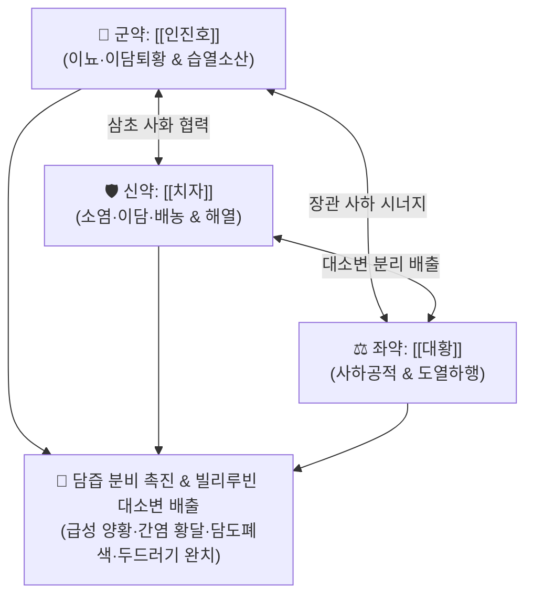

# 🍵 [[인진호탕]] (茵蔯蒿湯, Yin-Chen-Hao-Tang / Inchinko-to)

> **핵심 3줄 요약 (Key Summary)**:
> - 🌿 기본 구성: [[인진호]], [[치자]], [[대황]] (청열이습·이담퇴황의 삼미 간결 배오).
> - 🎯 양명열독(陽明熱毒)성 급만성 황달(전신 및 공막 황염), 담도 폐색, 급만성 간염, 간경변 복수 초기, 흉복부 팽만감, 갈증, 변비, 소변 붉고 찔끔거림, 만성 두드러기.
> - 🔬 담즙산 수송체(BSEP/MRP2) 발현 촉진으로 빌리루빈 직접 배출, 간세포 NF-κB 염증 차단 및 간섬유화 억제, 대장 연동운동 촉진을 통한 열독 사하.
> - ⚠️ 주의사항: 대황의 강렬한 사하성으로 설사 경향자, 안색 불량·사지 냉감의 음황(陰黃/비신양허) 환자 절대 금기, 중병즉지(황달 소퇴 후 단절).

---

## 📌 목차
1. [기본 처방 정보 & 군신좌사 구성](#1-기본-처방-정보--군신좌사-구성)
2. [방제학적 약재 상호작용 & 시너지 네트워크](#2-방제학적-약재-상호작용--시너지-네트워크)
3. [현대 분자약리학적 효능 & 작용 기전](#3-현대-분자약리학적-효능--작용-기전)
4. [적응 병증 및 체질별 감별 (Sweet Spot vs 금기)](#4-적응-병증-및-체질별-감별-sweet-spot-vs-금기)
5. [유사 처방군 감별 매트릭스](#5-유사-처방군-감별-매트릭스)
6. [임상 가감례 & 현대 질환별 응용](#6-임상-가감례--현대-질환별-응용)
7. [💡 사용자 진료실 핵심 필기 & 임상 팁 (원문 보존)](#7--사용자-진료실-핵심-필기--임상-팁-원문-보존)
8. [출처 및 학술 참고 문헌 (References)](#8-출처-및-학술-참고-문헌-references)

---

## 1. 기본 처방 정보 & 군신좌사 구성

* **출전**: 장중경(張仲景) 『[[상한론]]』(傷寒論) 양명병편 및 『[[금궤요략]]』(황달병편)
* **치법**: 청열이습(淸熱利濕), 사하퇴황(瀉下退黃), 도열하행(導熱下行)

| 구분 | 약재명 | 표준 용량 | 본초 효능 & 방제 내 역할 |
| :--- | :--- | :--- | :--- |
| **군약 (君藥)** | [[인진호]] | 18~30g (대량) | **이뇨·이담·해열**: 습열을 소변으로 빼내고 담즙 분비를 촉진하여 황달을 씻어내는 최고 성약 |
| **신약 (臣藥)** | [[치자]] | 9~12g | **소염·이담·배농·해열**: 삼초의 열독을 아래로 이끌어 소변으로 배출하고 담즙 울체 소통 |
| **좌약 (佐藥)** | [[대황]] | 6~9g (후하 권장) | **사하공적·파어도열**: 장관을 통해 어혈과 담즙 노폐물을 대변으로 쏟아내어 열독 제거 |

> **전탕 및 복용 특이사항**:
> * 전통적으로 [[인진호]]를 먼저 끓여(선전 先煎) 유효 쓴맛 성분을 충분히 우려낸 뒤, [[치자]]와 [[대황]]을 넣고 달여 복용합니다.
> * 대소변 양로(兩路)로 습열을 분리 배출시키는 '이뇨 + 사하' 복합 퇴황 메커니즘을 완성합니다.

---

## 2. 방제학적 약재 상호작용 & 시너지 네트워크

* **인진호 + 치자의 이담이뇨(利膽利尿)**: [[인진호]]가 간세포의 담즙 생성을 촉진하고, [[치자]]가 삼초의 화열을 소변으로 빼내어 혈중 빌리루빈 농도를 급격히 떨어뜨립니다.
* **대황의 도열하행(導熱下行)**: 장관 평활근을 자극하여 정체된 담즙산과 숙변을 대변으로 일거에 쏟아내어 장-간 순환(Enterohepatic circulation)을 차단합니다.

---

## 3. 현대 분자약리학적 효능 & 작용 기전

### 1) 담즙산 수송체(BSEP/MRP2) 발현 및 빌리루빈 배출
* [[인진호]]의 캡실라린(Capillarisin)과 [[치자]]의 제니포시드(Geniposide)는 간세포 담즙 수송체(BSEP) 및 다제내성 단백질-2(MRP2) 발현을 유도하여, 담도 내로의 담즙산과 직접 빌리루빈 배출을 가속화합니다.

### 2) 간세포 보호 및 항섬유화 작용
* [[대황]]의 [[에모딘]]과 인진호 유효성분이 간성상세포의 활성화를 억제하여 콜라겐 축적을 막고 간경변 및 간섬유화 진행을 차단합니다.

### 3) 장-간 순환 차단을 통한 독소 배출
* [[대황]]의 [[센노사이드]]가 대장 연동운동을 촉진하여 재흡수되는 담즙산 독소를 변으로 즉각 배출시킵니다.

![[Pasted image 20240502103527.png|466]]

> [그림 설명: 간세포 담즙 배설 경로 및 인진호탕 약재군의 담즙 분비·사하 복합 작용 기전]

---

## 4. 적응 병증 및 체질별 감별 (Sweet Spot vs 금기)

### 1) 주요 적응증 (Target Indications)
* **양황(陽黃, 급성 실열성 황달)**:
  * 눈의 흰자위(공막)와 전신 피부가 귤껍질처럼 샛노랗게 물드는 황달.
  * 상복부 및 흉부 팽만감, 불쾌감, 오심, 구역, 심한 갈증(구갈), 대변 비결(변비), 소변이 붉고 찔끔거림(요적).
* **간·담도계 급성 질환**:
  * 급성 바이러스성 간염, 중증 독성 간염, 담석증 및 담도 폐색성 황달, 간경변 초기 복수.
* **피부과**: 담즙 정체성 소양증, 만성 난치성 두드러기.

### 2) 체질별 적합도 & 금기
* **적합 체질 (Sweet Spot)**:
  * 체력이 건실하고 맥이 침실(沈實)하거나 활삭(滑數)하며 대변이 굳은 실증(實證) 양황 환자.
* **절대 금기 및 주의 (Contraindications)**:
  * **음황(陰黃) 절대 금기**: 환자가 마르고 안색이 어둡고 칙칙하며 손발이 차고 묽은 변을 보는 비신양허(脾腎陽虛) 황달 환자에게 투약 시 비양을 절명시킴 ([[인진사역탕]], [[이중탕]] 적용).
  * **설사 경향자**: 평소 대변이 무른 환자는 대황을 빼거나 대폭 감량.

---

## 5. 유사 처방군 감별 매트릭스

| 처방명 | 기본 구성 | 주요 타깃 병리 | 변증 요점 & 감별 포인트 |
| :--- | :--- | :--- | :--- |
| [[인진호탕]] | [[인진호]], [[치자]], [[대황]] | 양명 습열, 담즙 울체 | **급성 양황 & 변비 표준방**: 샛노란 황달, 구갈, 변비, 흉복부 팽만감 |
| [[인진오령산]] | [[인진호]] + [[오령산]] | 비위 습체, 수습 정체 | **습(濕)이 열보다 심할 때**: 황달이 있으나 열감과 변비는 없고 소변 불리 위주일 때 |
| [[인진사역탕]] | [[인진호]], [[부자]], [[건강]], [[감초]] | 비신양허 (음황) | **어둡고 차가운 음황**: 손발이 차고 맥이 미약한 만성 허랭성 황달 |
| [[생간건비탕]] | 인진, 용담, 평위, 이진, 오령 등 | 간문맥압 항진 | **만성 간-비위 울혈**: 지방간, 만성피로, GERD, 치질 |

---

## 6. 임상 가감례 & 현대 질환별 응용

### 1) 변증 가감법
* **담석으로 인한 산통이 극심할 때**: [[금전초]], [[해금사]], [[울금]]을 가미하여 이담배석.
* **간기울결로 협통(옆구리 통증)이 심할 때**: [[시호]], [[황금]], [[작약]]을 가미([[대시호탕]] 합방).
* **소변 불리와 부종이 심할 때**: [[택사]], [[복령]], [[차전자]]를 가미.
* **황달이 가라앉은 후**: 대황을 즉시 배제하고 건비보혈제로 전환하여 정기 회복.

### 2) 현대 임상 질환별 응용
* **소화기내과**: 급만성 간염, 전격성 간염, 담낭염, 담석증, 폐색성 황달, 비알코올성 지방간염(NASH).
* **피부과**: 담즙 울체성 소양증, 만성 두드러기.

---

## 7. 💡 사용자 진료실 핵심 필기 & 임상 팁 (원문 보존)

* **체력 및 대변 상태 확인 필수**:
  * 체력이 건실하고 변비가 있는 환자에게 적중하며, 환자가 안색이 불량하고 사지가 차며 설사 경향이 있을 때는 [[대황]]을 반드시 배제하거나 [[인진오령산]], [[인진사역탕]]으로 전방해야 합니다.
* **중병즉지(中病卽止) 퇴황 원칙**:
  * 대변이 뚫리고 소변이 맑아지며 눈과 피부의 황달이 걷히면 장기 복용을 중단하여 비위 양기 손상을 방지해야 합니다.

---

## 8. 출처 및 학술 참고 문헌 (References)

* 장중경(張仲景), 『[[상한론]](傷寒論)』, 辨陽明病脈證幷治.
* 장중경(張仲景), 『[[금궤요략]](金匱要略)』, 黃疸病脈證幷治.
* * **Zhou RY et al. (2025)**. Investigating therapeutic effects and the underlying mechanisms of jia-wei-yin-chen-hao-tang in non-alcoholic fatty liver disease based on network pharmacology analysis and experimental validation. *Journal of ethnopharmacology*, 352: 120158. [PMID: 40553824](https://pubmed.ncbi.nlm.nih.gov/40553824/)
* * **Cai H et al. (2006)**. Aqueous extract of Yin-Chen-Hao decoction, a traditional Chinese prescription, exerts protective effects on concanavalin A-induced hepatitis in mice through inhibition of NF-kappaB. *The Journal of pharmacy and pharmacology*, 58: 677-84. [PMID: 16640837](https://pubmed.ncbi.nlm.nih.gov/16640837/)
