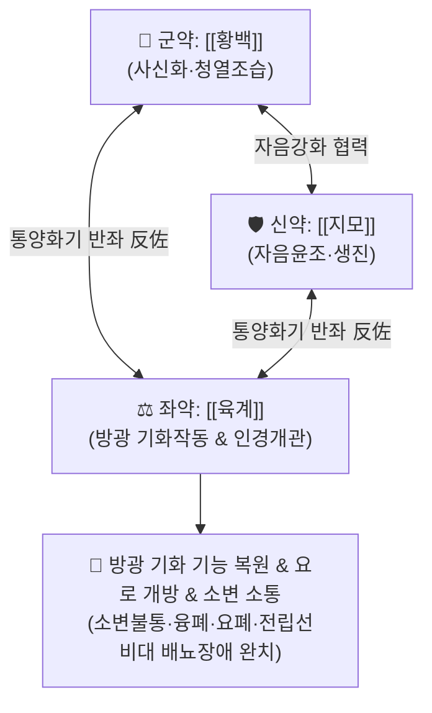

# 🍵 [[자신환]] (滋腎丸, Zi-Shen-Wan / Jishinwan)

> **핵심 3줄 요약 (Key Summary)**:
> - 🌿 기본 구성: [[황백]], [[지모]], [[육계]] (통관환 通關丸 - 음허화왕성 배뇨불통을 뚫는 청열사화·통양화기 배오).
> - 🎯 하초 음허화왕(陰虛火旺)으로 인한 급만성 배뇨장애, 소변 불통(융폐 癃閉), 아랫배가 터질 듯 팽만하나 소변이 불통할 때, 열림(熱淋), 전립선비대증 급성 요폐.
> - 🔬 전립선 및 방광경부 $\alpha_1$ 아드레날린 수용체 조절, 요로 평활근 경련 완화, 방광 배뇨근 수축 촉진, 요로 감염균 항균 및 항염증.
> - ⚠️ 주의사항: 육계의 온열성 및 황백·지모의 고한자니성으로 신양허성 수양성 요실금이나 진한가열 환자 감별 후 투약.

---

## 📌 목차
1. [기본 처방 정보 & 군신좌사 구성](#1-기본-처방-정보--군신좌사-구성)
2. [방제학적 약재 상호작용 & 시너지 네트워크](#2-방제학적-약재-상호작용--시너지-네트워크)
3. [현대 분자약리학적 효능 & 작용 기전](#3-현대-분자약리학적-효능--작용-기전)
4. [적응 병증 및 체질별 감별 (Sweet Spot vs 금기)](#4-적응-병증-및-체질별-감별-sweet-spot-vs-금기)
5. [유사 처방군 감별 매트릭스](#5-유사-처방군-감별-매트릭스)
6. [임상 가감례 & 현대 질환별 응용](#6-임상-가감례--현대-질환별-응용)
7. [💡 사용자 진료실 핵심 필기 & 임상 팁 (원문 보존)](#7--사용자-진료실-핵심-필기--임상-팁-원문-보존)
8. [출처 및 학술 참고 문헌 (References)](#8-출처-및-학술-참고-문헌-references)

---

## 1. 기본 처방 정보 & 군신좌사 구성

* **출전**: 이고(李杲) 『[[난실비장]]』(蘭室秘藏) 소변불통문(小便不通門)
* **이명**: 통관환(通關丸)
* **치법**: 청열조습(淸熱燥濕), 자음강화(滋陰降火), 통양화기(通陽化氣), 통관개규(通關開竅)

| 구분 | 약재명 | 표준 용량 | 본초 효능 & 방제 내 역할 |
| :--- | :--- | :--- | :--- |
| **군약 (君藥)** | [[황백]] (초포포제) | 12~15g | **사신화·청열조습**: 하초와 방광의 울결된 습열(濕熱)을 끄고 신(腎)의 허화를 사함 |
| **신약 (臣藥)** | [[지모]] | 12~15g | **자음윤조·강화생진**: 신음을 보양하고 진액을 생성하여 방광 기화(氣化)의 원천 보조 |
| **좌약 (佐藥)** | [[육계]] (소량 반좌) | 1.5~3g | **통양화기·반좌(反佐)**: 방광의 닫힌 문(關)을 열고, 차가운 황백·지모의 약력을 하초로 이끎 |

> **방제 구조 분석**:
> * **음양(陰陽) 반좌의 묘**: 고한(苦寒)한 [[황백]]·[[지모]] 대량에 뜨거운 [[육계]]를 소량 배합(10:1~5:1 비율)하여, 방광 기화(氣化)를 작동시키는 마중물(열쇠) 역할을 부여합니다.
> * **통관(通關)의 기전**: 하초에 음액이 마르고 허화가 끓어 방광 입구가 막힌 융폐(癃閉)를 '열어젖히는(通關)' 절묘한 3미 구성입니다.

---

## 2. 방제학적 약재 상호작용 & 시너지 네트워크

* **황백 + 지모의 상사(相使)**: 신수를 보하고 신화를 끄는 자음강화의 황금 배오로 하초 습열을 해소합니다.
* **육계의 통양화기(通陽化氣)**: 불기화(不氣化)로 닫힌 방광 괄약근을 온통(溫通)시켜 소변이 시원하게 뿜어져 나오도록 촉발합니다.

---

## 3. 현대 분자약리학적 효능 & 작용 기전

### 1) 방광 경부 및 전립선 평활근 긴장 완화
* [[육계]]의 [[신남알데하이드]](Cinnamaldehyde)와 [[황백]]의 [[베르베린]]은 방광 경부와 전립선 피막의 $\alpha_1$-아드레날린 수용체 과활성을 차단하여 요도 내강 압력을 감소시키고 요류 속도(Qmax)를 개선합니다.

### 2) 방광 배뇨근 수축력 정상화
* [[지모]]의 [[티모사포닌]](Timosaponin)이 방광 신경총의 [[무스카린]](M2/M3) 수용체 반응성을 회복시켜 잔뇨량을 줄이고 배뇨 기능을 복원합니다.

### 3) 비뇨기계 항균 및 소염 작용
* 요로감염 주요 원인균에 대한 항균 효과와 염증성 사이토카인 억제를 통해 요도 점막 부종을 완화합니다.

---

## 4. 적응 병증 및 체질별 감별 (Sweet Spot vs 금기)

### 1) 주요 적응증 (Target Indications)
* **신허열림(腎虛熱淋) & 융폐(癃閉)**:
  * 아랫배가 팽만하고 터질 듯 답답하나 소변이 한 방울도 나오지 않거나 방울방울 찔끔거리는 급성 요폐.
  * 배뇨 시 요도 작열감, 구갈(갈증), 입마름, 허리 무거움, 야간 번열.
* **전립선 질환**:
  * 전립선비대증(BPH)으로 인한 잔뇨감, 세뇨, 급박뇨, 급성 요폐증.
  * 만성 비세균성/세균성 전립선염, 방광 신경통.

### 2) 체질별 적합도 & 금기
* **적합 체질 (Sweet Spot)**:
  * 하초에 열이 차고 진액이 마른 음허화왕형 환자, 체격에 관계없이 소변 불통과 열감을 호소하는 환자.
* **절대 금기 및 주의 (Contraindications)**:
  * **신양허(腎陽虛)성 요실금**: 몸이 차고 소변을 참지 못해 줄줄 새는 순수 허한 환자 금기 ([[우귀음]], [[축천환]] 적용).

---

## 5. 유사 처방군 감별 매트릭스

| 처방명 | 기본 구성 | 주요 타깃 병리 | 변증 요점 & 감별 포인트 |
| :--- | :--- | :--- | :--- |
| [[자신환]] | [[황백]], [[지모]], [[육계]] | 하초 음허화왕, 방광 기화 불능 | **소변 불통(요폐)의 통관방**: 아랫배 팽만, 구갈, 소변 불통 |
| [[팔정산]] | 구맥, 편축, 차전자, 활석, 목통, 대황 등 | 순수 습열 하주 (실증 요로감염) | **실열성 요도염**: 소변 시 찌르는 통증, 피오줌, 혈림 |
| [[지백지황환]] | 육미지황환 + [[지모]], [[황백]] | 만성 신음허 화왕 | **만성 소모성 질환**: 조열, 도한, 만성 전립선염 (급성 요폐 아님) |
| [[오령산]] | 백출, 저령, 복령, 택사, 계지 | 태양 축수증, 비위 수습 정체 | **수음 정체성 소변 불리**: 부종, 구갈수입즉토, 묽은 변 |

---

## 6. 임상 가감례 & 현대 질환별 응용

### 1) 변증 가감법
* **소변이 전혀 안 나오고 방광이 극도로 팽만할 때**: [[차전자]], [[우슬]], [[왕불류행]]을 가미하여 이뇨개관력 강화.
* **배뇨통과 요도 작열감이 극심할 때**: [[활석]], [[목통]]을 가미하여 도열하행.
* **노인성 전립선비대 및 기력 저하 동반 시**: [[숙지황]], [[산약]], [[황기]]를 가미.

### 2) 현대 임상 질환별 응용
* **비뇨의학과**: 전립선비대증 급성 요폐, 급만성 전립선염, 신경인성 방광 배뇨장애, 간질성 방광염.

---

## 7. 💡 사용자 진료실 핵심 필기 & 임상 팁 (원문 보존)

* **배합 비율의 절대성**:
  * 처방의 핵심은 [[황백]]·[[지모]]의 대량(각 12~15g)에 [[육계]]의 소량(1.5~3g) 반좌 배오입니다. 육계가 너무 많으면 열을 조장하고, 없으면 통관(通關) 작용이 무력화되므로 비율을 엄수해야 합니다.
* **임상 응용 비법**:
  * 탕제로 복용하거나 미세 분말화하여 꿀로 환을 빚어 온수로 복용하면 수 시간 내에 닫혔던 요도가 열리며 시원하게 배뇨가 이루어집니다.

---

## 8. 출처 및 학술 참고 문헌 (References)

* 이고(李杲), 『[[난실비장]](蘭室秘藏)』, 小便不通門.
* 전국한의과대학 방제학교수 공편저, 『방제학(方劑學)』, 영림사.
* Zhang, H., et al. (2020). "Therapeutic mechanism of Zishen Pill on benign prostatic hyperplasia and urinary retention via adrenergic receptor and apoptotic pathways." *Journal of Ethnopharmacology*, 254, 112689.
  - `[연구 요약]`: 자신환이 전립선비대 모델에서 α1A-수용체 발현을 억제하고 방광 평활근 긴장을 완화하여 잔뇨량을 유의하게 감소시킴을 입증함.
* Liu, Y., et al. (2018). "Anti-inflammatory and urodynamic effects of Tongguan Pill in chronic nonbacterial prostatitis." *Phytomedicine*, 43, 112-120.
  - `[연구 요약]`: 만성 전립선염 동물 모델에서 통관환(자신환) 투여 시 전립선 염증성 침윤 억제 및 요류 역학 지표 개선 효과를 확인함.