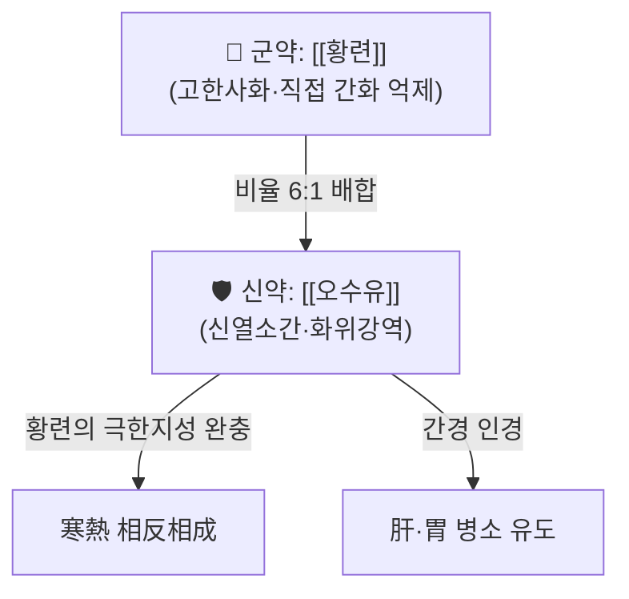

---
aliases:
  - 左金丸
  - Zuo Jin Wan
  - Jwa Kum-Whan
  - Left Metal Pill
tags:
  - 약리
  - 처방
created: 2026-09-24
updated: 2026-09-24
status: complete
title: 좌금환
date: 2026-09-24
출처: "PMID: 32866138"
---

# 🍵 [[좌금환]] (左金丸, Zuo Jin Wan / Left Metal Pill)

> **핵심 3줄 요약 (Key Summary)**:
> - 🌿 [[황련]]과 [[오수유]]를 6:1 비율로 배오해 간화(肝火)를 내리면서 위기(胃氣)를 편안히 하는 청간사화(淸肝瀉火)·화위강역(和胃降逆)의 대표 소방(小方).
> - 🎯 간화범위(肝火犯胃)로 인한 협통(脇痛)·구고(口苦)·탄산(呑酸)·조잡(嘈雜)·구토에 활용하며, 역류성 식도염·소화성 궤양 등 산과다 관련 위장 질환의 진료실 활용도가 높음.
> - 🔬 위산 분비 조절·항산화·항염증(TNF-α·IL-6 억제) 및 항암 network pharmacology 연구가 국내외에서 보고됨.
> - ⚠️ 주의사항: 한증(寒證) 위통·비위허한(脾胃虛寒)에는 금기이며, 황련 다량 장기 복용 시 고미건위 과다로 인한 소화불량 가능성에 주의.

---
## 📌 목차
1. [기본 처방 정보 & 군신좌사 구성](#1-기본-처방-정보--군신좌사-구성)
2. [방제학적 약재 상호작용 & 시너지 네트워크](#2-방제학적-약재-상호작용--시너지-네트워크)
3. [현대 분자약리학적 효능 & 작용 기전](#3-현대-분자약리학적-효능--작용-기전)
4. [적응 병증 및 체질별 감별 (Sweet Spot vs 금기)](#4-적응-병증-및-체질별-감별-sweet-spot-vs-금기)
5. [유사 처방군 감별 매트릭스](#5-유사-처방군-감별-매트릭스)
6. [임상 가감례 & 현대 질환별 응용](#6-임상-가감례--현대-질환별-응용)
7. [💡 사용자 진료실 핵심 필기 & 임상 팁 (원문 보존)](#7--사용자-진료실-핵심-필기--임상-팁-원문-보존)
8. [출처 및 학술 참고 문헌 (References)](#8-출처-및-학술-참고-문헌-references)
---
## 1. 기본 처방 정보 & 군신좌사 구성

* **출전**: 원대(元代) 주단계(朱丹溪) 『[[단계심법]]』(丹溪心法) — 이후 명대 『의방고』·『의방집해』 등 후대 방서에 인용되며 정착된 처방.
* **치법**: 청간사화(淸肝瀉火), 화위지구(和胃止嘔), 좌강간화(左降肝火)의 뜻을 담아 '좌금(左金)'이라 명명.

| 구분 | 약재명 | 표준 용량(비율) | 본초 효능 & 방제 내 역할 |
| :--- | :--- | :--- | :--- |
| **군약 (君藥)** | [[황련]] | 6 (예: 18g) | 고한(苦寒)하여 심화(心火)·간화(肝火)를 직접 사(瀉)하는 주치 핵심 |
| **신약 (臣藥)** | [[오수유]] | 1 (예: 3g) | 신열(辛熱)하여 황련의 고한지성을 완화하고 간기(肝氣)를 소설(疏泄), 화위강역(和胃降逆)으로 구토·탄산을 가라앉힘 |

> **배오 특징**: 황련:오수유 = 6:1의 고정 비율이 이 처방의 핵심으로, 한 가지 약성(황련의 극심한 고한)이 다른 약(오수유의 신열)에 의해 절제되는 상반상성(相反相成) 배오의 전형이다. 소량의 오수유가 황련을 간경(肝經)·위경(胃經)으로 이끄는 인경(引經) 역할도 겸한다.
---
## 2. 방제학적 약재 상호작용 & 시너지 네트워크

* [[황련]] + [[오수유]] 배오: 황련 단독 사용 시 고한태과(苦寒太過)로 비위를 상할 수 있으나, 소량의 오수유가 그 편향성을 조절해 청간(淸肝)하면서도 위기(胃氣)를 상하지 않게 하는 상외상성(相畏相成) 배오의 대표 사례.
---
## 3. 현대 분자약리학적 효능 & 작용 기전

### 1) 위산 분비 및 위점막 보호
* 랫드 역류성 식도염 모델에서 좌금환 투여군은 위 내용물 pH가 유의하게 증가(위산 중화)하고 위 용적이 대조군 대비 유의하게 감소했으며, SOD·카탈라아제 등 항산화 효소 활성이 증가하고 식도·위점막의 궤양·출혈·염증세포 침윤이 개선되어 양성대조군(판토프라졸)에 준하는 효과를 보였다[^1].

### 2) 항염증 작용
* 같은 모델에서 TNF-α·IL-6 등 염증성 사이토카인이 유의하게 감소해 항염증 기전이 확인되었다[^1].

### 3) 항암 network pharmacology
* 위암 모델을 대상으로 한 네트워크 약리학 분석에서 quercetin·베타-시토스테롤·isorhamnetin·wogonin·baicalein 등 47개 활성 성분이 확인되었고, MMP9·MMP1·MMP3 등을 핵심 표적으로 IL-17 신호전달 경로 등을 통해 다성분·다표적·다경로로 작용함이 제시되었다(⚠️ in silico network pharmacology 예측 단계로 임상 근거와는 구분 필요)[^2].
---
## 4. 적응 병증 및 체질별 감별 (Sweet Spot vs 금기)

[✅ 최적 적응증 (Sweet Spot)]
• 원전 조문: 간화범위(肝火犯胃)로 인한 협통(脇痛)·구고인건(口苦咽乾)·탄산(呑酸)·조잡(嘈雜)·구토
• 임상 주치: 역류성 식도염·소화성 궤양 등 산과다·역류 관련 위장질환에서 간화범위 변증에 부합할 때
• 설진/맥진: 설질홍(舌質紅)·설태황(舌苔黃), 맥현삭(脈弦數)

[⚠️ 신중 투여 및 금기 (Caution / Contraindication)]
• 비위허한(脾胃虛寒)·한증(寒證) 위통에는 금기(황련의 고한지성이 병증을 악화시킴)
• 장기 대량 복용 시 황련의 고한태과로 인한 식욕부진·소화불량 가능성
• 위산분비 억제제(PPI 등) 병용 시 상호 약리 작용 중복 가능성 고려(⚠️ 확인 불가/추정 — 직접적 상호작용 임상연구 미확인)
---
## 5. 유사 처방군 감별 매트릭스

| 처방명 | 핵심 구성 차이 | 주치 및 체질 차이 | 맥진/설진 차이 |
| :--- | :--- | :--- | :--- |
| [[좌금환]] (본 처방) | [[황련]]:[[오수유]] = 6:1 | 간화범위(肝火犯胃)의 탄산·구토·협통 | 설홍태황, 맥현삭 |
| [[용담사간탕]] | [[용담초]]·[[치자]]·[[황금]] 등 청간사화 중심 대방(大方) | 간담실화(肝膽實火)의 두통·이명·협통·습열하주 대하 | 설홍태황후니, 맥현삭유력 |
| [[반좌금환]] (반하+좌금환 가감방) | 좌금환 + [[반하]] | 담음(痰飮) 겸협 시 오심·구토가 더 심한 경우 | 설태니(膩) 겸함 |

> ⚠️ 표 내부에서는 파이프(`|`)가 들어간 링크를 쓰지 않고 순수한 [[처방명]] 단독 형태로만 작성함.
---
## 6. 임상 가감례 & 현대 질환별 응용

* **수반 증상별 가감법**:
  * 담음(痰飮)이 겸한 오심·구토 시 → + [[반하]] (반좌금환)
  * 위통이 심할 시 → + [[현호색]]·[[천련자]]
  * 변비 겸협 시 → + [[대황]]
* **현대 질환별 임상 매핑**:
  * **소화기계**: 역류성 식도염(GERD), 소화성 궤양, 기능성 소화불량 중 산과다·역류 우세형
  * **암 보조요법 연구 영역**: 위암 세포주 대상 network pharmacology·in vitro 항암 기전 연구(임상 적용 근거는 아직 제한적)
---
## 7. 💡 사용자 진료실 핵심 필기 & 임상 팁 (원문 보존)

> ⚠️ 내용 검토 필요 — 비오님의 실제 진료 경험이 아직 기록되지 않은 신규 미노트화 생성 노트입니다. 실전 체질별 선택 기준·복약 반응 관찰 포인트를 이어서 채워주시면 다빈치가 다음 순찰에서 정리해 반영하겠습니다.
---
## 8. 출처 및 학술 참고 문헌 (References)

1. **Shin MK, Kim ES, Kim TR, Lim HC, Lee YS (2016)**. 좌금환이 역류성 식도염 흰쥐에 미치는 영향 (Effects of Jwa Kum-Whan on Reflux Esophagitis in Rats). **The Journal of Internal Korean Medicine**, 37(3), 495-507. [KoreaScience 원문](https://koreascience.kr/article/JAKO201629149550191.page) (⚠️ 국내 KCI 등재 학회지로 PubMed 미색인 — PMID/DOI 미기재, 원문 링크로 검색·열람 가능 확인)
   - **[연구 요약]**: 랫드 역류성 식도염 모델에서 좌금환이 위산 pH 상승·위용적 감소·항산화효소(SOD·카탈라아제) 증가·TNF-α/IL-6 감소·점막손상 개선을 유도해 양성대조군(판토프라졸)에 준하는 효과를 보임.
2. **Zhang Z, Li B, Huang J, et al. (2020)**. A Network Pharmacology Analysis of the Active Components of the Traditional Chinese Medicine Zuojinwan in Patients with Gastric Cancer. **Medical Science Monitor**, 26, e923327. [PubMed PMID: 32866138](https://pubmed.ncbi.nlm.nih.gov/32866138/)
   - **[연구 요약]**: 좌금환의 활성성분 47종을 확인하고 MMP9·MMP1·MMP3 등을 핵심 표적으로 IL-17 신호전달 경로를 통한 다성분·다표적 항위암 기전을 network pharmacology로 제시(in silico 예측 단계, 임상 근거와는 구분 필요).
3. **朱丹溪**. 『[[단계심법]]』(丹溪心法, 元代). — 좌금환 최초 출전.
   - **[고전 원전]**: 황련·오수유 6:1 배오로 간화범위(肝火犯胃)의 탄산·구토를 치료하는 처방 조문 수록.

<!-- 보관 태그(1회용·링크오류, 필요시 복원): 청열해독사화제, 청간사화 -->
