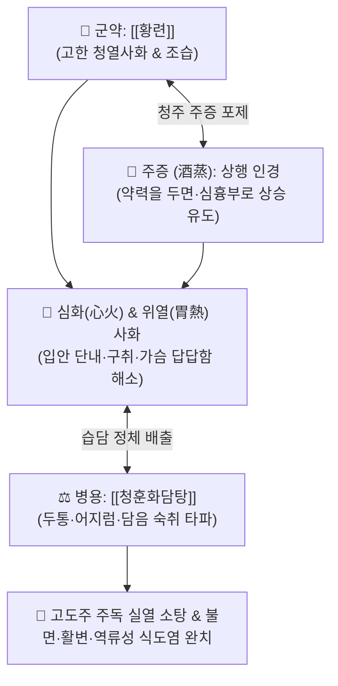

# 🍵 [[주증황련환]] (酒蒸黃連丸, Jiu-Zheng-Huang-Lian-Wan / Shujo-orenwan)

> **핵심 3줄 요약 (Key Summary)**:
> - 🌿 기본 구성: [[황련]] (청주에 축여 찌고 말리는 주증 포제, 주독 해독 및 상초 심위 사열 특화).
> - 🎯 고량주·양주 등 독주 과음 후 발생하는 주독(酒毒) 실열, 입에서 단내 및 구취, 가슴 답답함(흉격번열), 불면, 냄새가 심한 활변(설사), 안면홍조, 역류성 식도염.
> - 🔬 알코올 대사산물 아세트알데히드 분해 촉진, NF-κB/COX-2 억제를 통한 위점막 손상 방어, 혈관 내피 보호, 뇌신경 흥분 진정.
> - ⚠️ 주의사항: 황련의 강한 쓴맛과 고한성으로 인한 위장 자극 방지를 위해 미음이나 온수로 소량 복용, 비위허한자 신중 투여.

---

## 📌 목차
1. [기본 처방 정보 & 군신좌사 구성](#1-기본-처방-정보--군신좌사-구성)
2. [방제학적 약재 상호작용 & 시너지 네트워크](#2-방제학적-약재-상호작용--시너지-네트워크)
3. [현대 분자약리학적 효능 & 작용 기전](#3-현대-분자약리학적-효능--작용-기전)
4. [적응 병증 및 체질별 감별 (Sweet Spot vs 금기)](#4-적응-병증-및-체질별-감별-sweet-spot-vs-금기)
5. [유사 처방군 감별 매트릭스](#5-유사-처방군-감별-매트릭스)
6. [임상 가감례 & 현대 질환별 응용](#6-임상-가감례--현대-질환별-응용)
7. [💡 사용자 진료실 핵심 필기 & 임상 팁 (원문 보존)](#7--사용자-진료실-핵심-필기--임상-팁-원문-보존)
8. [출처 및 학술 참고 문헌 (References)](#8-출처-및-학술-참고-문헌-references)

---

## 1. 기본 처방 정보 & 군신좌사 구성

* **출전**: 주단계(朱丹溪) 『[[단계심법]]』(丹溪心法) 및 허준 『[[동의보감]]』(東醫寶鑑) 주독문(酒毒門)
* **치법**: 청열해독(淸熱解毒), 사심화(瀉心火), 청열사위(淸熱瀉胃), 해주독(解酒毒)

| 구분 | 약재명 | 표준 용량 | 본초 효능 & 방제 내 역할 |
| :--- | :--- | :--- | :--- |
| **군약 (君藥)** | [[황련]] (주증 酒蒸) | 30~60g (제환 기준) | **사심화·사위열·해주독**: 주독(酒毒)으로 치솟는 심·위의 화열을 끄고 입안 단내와 번조 제거 |
| **보조/병용** | [[청훈화담탕]] 합방 | 적량 | **거담화탁 & 식적주독 소산**: 술과 기름진 안주로 정체된 습담(濕痰)과 두통을 소통 |

> **포제 및 제환 특이사항**:
> * **주증(酒蒸) 포제의 묘미**: [[황련]]을 좋은 청주(淸酒)에 버무려 시루에 쪄서 말리는 과정을 거쳐, 황련의 침강(沈降)하는 성질을 상행(上行)시켜 두면부와 심흉부의 열독을 직접 타격하도록 약효를 변환시킵니다.

---

## 2. 방제학적 약재 상호작용 & 시너지 네트워크

* **주증(酒蒸)을 통한 약력 상승**: 고한약 특유의 비위 손상 부작용을 줄이고, 알코올성 열독이 치솟는 두면부와 가슴으로 약력을 신속히 끌어올립니다.
* **청훈화담탕과의 시너지**: 심화(황련)와 습담(청훈화담탕)을 동시에 분해하여 과음 후 두통, 현훈, 구역질을 근본적으로 해소합니다.

---

## 3. 현대 분자약리학적 효능 & 작용 기전

### 1) 알코올성 급성 위점막 손상 방어
* [[황련]]의 [[베르베린]]은 위점막 내 프로스타글란딘(PGE2) 농도를 보존하고 점액 분비를 촉진하여 고농도 알코올에 의한 급성 출혈성 위점막 미란을 차단합니다.

### 2) 간 아세트알데히드 대사 촉진 및 항염증
* 알코올 분해효소(ADH) 및 아세트알데히드 탈수소효소(ALDH) 활성을 보조하여 체내 숙취 유발 물질 축적을 억제하고 혈중 간기능 효소 상승을 방어합니다.

### 3) 중추신경계 항흥분 및 수면 안정화
* 뇌 내 GABA 신경전달을 활성화하여 알코올 섭취 후 교감신경 과흥분으로 인한 불면증, 가슴 두근거림, 불안을 신속히 안정시킵니다.

---

## 4. 적응 병증 및 체질별 감별 (Sweet Spot vs 금기)

### 1) 주요 적응증 (Target Indications)
* **독주 과음 후 급성 주독 실열(酒毒實熱)**:
  * 고량주, 위스키, 양주 등 도수가 높은 뜨거운 술을 과음한 후 입에서 단내와 악취가 나고 혀가 마르는 증상.
  * 가슴이 답답하고 열감이 치솟아 밤에 잠을 이루지 못하는 불면증.
  * 대변 냄새가 극심하고 묽게 쏟아지는 활변(滑便) 및 알코올성 장염.
  * 안면홍조, 눈 충혈, 역류성 식도염(신물 역류), 숙취성 박동성 두통.

### 2) 체질별 적합도 & 금기
* **적합 체질 (Sweet Spot)**:
  * 평소 열이 많고 술을 즐기며 과음 후 열감과 불면, 변비나 악취 나는 설사를 호소하는 실열형 환자.
* **절대 금기 및 주의 (Contraindications)**:
  * 평소 위장이 몹시 차고 맥이 침미한 순수 비위허한 환자에게는 단독 대량 투여를 피함.

---

## 5. 유사 처방군 감별 매트릭스

| 처방명 | 기본 구성 | 주요 작용 기전 | 변증 요점 & 감별 포인트 |
| :--- | :--- | :--- | :--- |
| [[주증황련환]] | 주증 [[황련]] | 상초 심화·위열 사화, 해주독 | **독주 후 단내·불면·악취 활변**: 고도주 주독 실열, 역류성 식도염 |
| [[갈화해성탕]] | 갈화, 갈근, 백두구, 사인, 저령, 복령 | 주독 발한·이뇨 | **습열 숙취 일반**: 땀과 소변으로 술독을 배출시키는 표준 주독방 |
| [[대금음자]] | 진피, 후박, 평위산 계열 | 비위 한습 정체 숙취 | **소화기 체기 위주**: 구역질, 복부 팽만, 소화불량 중심 |
| [[황련해독탕]] | 황련, 황금, 황백, 치자 | 삼초 실열화독 | **전신성 고열·피부염**: 주독 외 전신성 실열 화독 질환 |

---

## 6. 임상 가감례 & 현대 질환별 응용

### 1) 변증 가감법
* **숙취로 두통과 어지럼증이 심할 때**: [[청훈화담탕]]과 합방하여 담음과 두통을 동시 치료.
* **가슴 쓰림과 역류성 식도염이 심할 때**: [[오수유]](소량 좌약)를 가미([[좌금환]] 원리)하여 제산진통.
* **갈증과 구갈이 심할 때**: [[갈근]], [[천화분]]을 가미하여 생진지갈.

### 2) 현대 임상 질환별 응용
* **소화기내과**: 급성 알코올성 위염, 역류성 식도염(GERD), 알코올성 장염, 만성 구취증.
* **정신건강의학과**: 음주 후 알코올성 불면증, 교감신경 흥분증.

---

## 7. 💡 사용자 진료실 핵심 필기 & 임상 팁 (원문 보존)

* **주독 환자의 핵심 징후 포착**:
  * 고량주, 양주 등 뜨거운 독주를 마신 뒤 입에서 단내가 풀풀 나고 가슴이 답답하여 잠을 못 자며 냄새가 지독한 활변(설사)을 볼 때, 주증황련환은 단 1~2회 복용으로 열독과 불면을 즉각 가라앉힙니다.
* **청훈화담탕과의 병용 비법**:
  * 두통과 어지럼이 겹친 환자에게는 [[청훈화담탕]] 탕약에 주증황련환 30~50환을 함께 삼키도록 지도하면 숙취와 두통이 일거에 해결됩니다.

---

## 8. 출처 및 학술 참고 문헌 (References)

* 주단계(朱丹溪), 『[[단계심법]](丹溪心法)』.
* 허준(許浚), 『[[동의보감]](東醫寶鑑)』, 酒毒門.
* * **Zhang Z et al. (2024)**. Untargeted serum and gastric metabolomics and network pharmacology analysis reveal the superior efficacy of zingiberis rhizoma recens-/euodiae fructus-processed Coptidis Rhizoma on gastric ulcer rats. *Journal of ethnopharmacology*, 332: 118376. [PMID: 38782310](https://pubmed.ncbi.nlm.nih.gov/38782310/)
