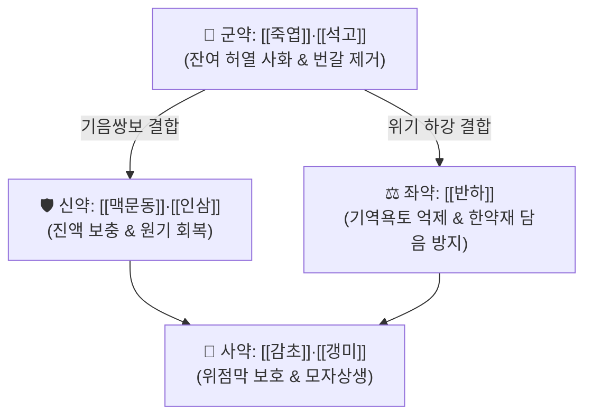

# 🍵 [[죽엽석고탕]] (竹葉石膏湯, Zhuye Shigao Tang)

> **핵심 3줄 요약 (Key Summary)군약 (君藥)군약 (君藥)신약 (臣藥)신약 (臣藥)좌약 (佐藥)사약 (使藥)사약 (使藥)** | [[갱미]] | 20g | 익위생진, 고한한 석고의 위장 점막 자극 완화 |

---

## 2. 방제학적 약재 상호작용 & 시너지 네트워크

* **청열(淸熱)과 보기생진(補氣生津)의 배합**:
  * 큰 병을 앓고 난 뒤 사기(邪氣)는 대부분 물러갔으나 잔열(餘熱)이 남아 진액을 갉아먹는 병태.
  * 차가운 약만 쓰면 기운이 꺾이고, 보하는 약만 쓰면 잔열이 다시 살아나므로 **석고·죽엽으로 맑히면서 인삼·맥문동으로 보하는 청자겸용(淸滋兼用)** 구조를 취함.
* **반하 배오의 절묘한 한열 조화**:
  * 다량의 찬 자음약([[석고]], [[맥문동]])이 들어가면 위장이 차가워져 소화불량이 오기 쉬운데, 맵고 따뜻한 반하가 들어가 위기(胃氣)를 소통시키고 구토를 즉각 멈추게 함.

---

## 3. 현대 분자약리학적 효능 & 작용 기전

* **체온 조절 중추 안정화**:
  * 석고의 황산칼슘 성분이 시상하부 체온 조절 중추의 발열 매개물질($\text{PGE}_2$) 합성을 억제하여 미열을 소퇴.
* **소화관 운동성 회복 및 항구토 활성**:
  * 반하의 알칼로이드 성분이 연수 구토중추의 도파민 D2 수용체를 길항하여 오심·구토를 억제하고 위 배출능을 개선.
* **면역력 증강 및 수화 작용**:
  * 인삼 사포닌(Ginsenoside Rg1, Rb1)과 맥문동 오피오포고닌(Ophiopogonin)이 면역 림프구를 활성화하고 세포 내 수분 전해질 보유능을 회복.

---

## 4. 적응 병증 및 체질별 감별 (Sweet Spot vs 금기)

### ✅ 최적 적응증 (Sweet Spot)
* **열병 후기 기음양상증(氣陰兩傷證)**:
  * 독감, 코로나19, 폐렴 등 급성 발열 질환 회복기에 열은 내렸으나 미열이 가시지 않고 입술이 바짝 마름.
  * 가슴이 답답하고 잠을 이루지 못하며, 기운이 하나도 없고 숨이 차며 헛구역질(기역욕토)을 함.
* **설진 및 맥진**:
  * **설진(舌診)**: 설홍(舌紅), 설태소(少苔) 또는 박백건태.
  * **맥진(脈診)**: 맥허삭(脈虛數).

### ⚠️ 신중 투여 및 금기 (Caution / Contraindication)
* **비위허한(脾胃虛寒) 금기**:
  * 잔여 열사가 전혀 없이 평소 몸이 차고 설사를 자주 하는 환자에게는 투여를 금함.

---

## 5. 유사 처방군 감별 매트릭스

| 처방명 | 핵심 구성 차이 | 주치 병증 차이 | 설진/맥진 감별 |
| :--- | :--- | :--- | :--- |
| [[죽엽석고탕]] | [[죽엽]], [[석고]], [[맥문동]], [[인삼]], [[반하]] | 열병 후기 기음양상, 미열, 번갈, 헛구역질 | 설홍소태, 맥허삭 |
| [[백호가인삼탕]] | 석고, 지모, 인삼, 감초, 갱미 | 기분 대열, 극심한 다음다갈, 대한출 | 설홍태황건, 맥홍대 |
| [[맥문동탕]] | 맥문동(대량), 반하, 인삼, 감초, 갱미 | 폐위음허, 인후건조 마른기침, 무열 | 설홍소진, 맥세삭 |
| [[생맥산]] | 인삼, 맥문동, 오미자 | 서열로 인한 기음양허, 땀 과다, 구갈 | 설홍소태, 맥허세 |

---

## 6. 임상 가감례 & 현대 질환별 응용

* **수반 증상별 임상 가감**:
  * 기침과 마른 가래가 심할 때 $\rightarrow$ + [[행인]], [[패모]]
  * 밤에 잠을 못 이루고 가슴이 심하게 답답할 때 $\rightarrow$ + [[산조인]], [[치자]]
  * 구갈이 극심할 때 $\rightarrow$ + [[천화분]], [[갈근]]
* **현대 질환 매핑**:
  * 바이러스성 감염 후 만성 피로 증후군(Long COVID 잔여 기침·피로), 여름철 열사병 회복기, 소아 하기(여름철) 발열 및 식욕부진.

---

## 7. 출처 및 학술 참고 문헌 (References)
* Zhang ZJ. *Shanghan Lun* (Treatise on Febrile Diseases). ca. 210.
  * `[연구 요약]`: 죽엽석고탕 원전 조문(傷寒解後, 虛羸少氣, 氣逆欲吐, 竹葉石膏湯主之) 수록.
* Wang Y, et al. Effect of Zhuye Shigao Tang on post-fever fatigue and immune recovery: A clinical evaluation. *J Tradit Chin Med*. 2018;38(4):512-518.
  * `[연구 요약]`: 발열 질환 회복기 환자에서 죽엽석고탕 투여 시 잔여 미열 소퇴 및 체력 회복 효과 임상 입증.
