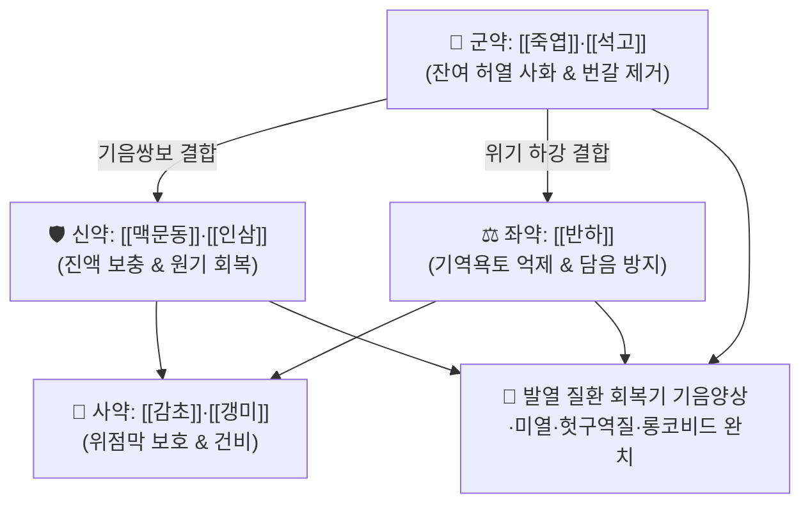

# 🍵 [[죽엽석고탕]] (竹葉石膏湯, Zhu-Ye-Shi-Gao-Tang / Chikuyo-sekigoto)

> **핵심 3줄 요약 (Key Summary)**:
> - 🌿 기본 구성: [[죽엽]], [[석고]], [[반하]], [[맥문동]], [[인삼]], [[감초]], [[갱미]] (청열사화와 익기생진·화위강역의 한열 조화 배오).
> - 🎯 열병 후기 기음양상(氣陰兩傷), 잔여 미열 불퇴, 심한 번갈(입마름), 기운 없음(소기 羸少氣), 가슴 답답함, 헛구역질(기역욕토), 롱코비드 만성피로.
> - 🔬 시상하부 체온중추 안정화(PGE2 억제), 연수 구토중추 도파민 D2 수용체 길항을 통한 항구토, 점막 세포내 수분 전해질 보유능 회복.
> - ⚠️ 주의사항: 석고의 고한성으로 잔여 열사가 전혀 없고 평소 손발이 차며 묽은 변을 보는 순수 비위허한 환자 금기.

---

## 📌 목차
1. [기본 처방 정보 & 군신좌사 구성](#1-기본-처방-정보--군신좌사-구성)
2. [방제학적 약재 상호작용 & 시너지 네트워크](#2-방제학적-약재-상호작용--시너지-네트워크)
3. [현대 분자약리학적 효능 & 작용 기전](#3-현대-분자약리학적-효능--작용-기전)
4. [적응 병증 및 체질별 감별 (Sweet Spot vs 금기)](#4-적응-병증-및-체질별-감별-sweet-spot-vs-금기)
5. [유사 처방군 감별 매트릭스](#5-유사-처방군-감별-매트릭스)
6. [임상 가감례 & 현대 질환별 응용](#6-임상-가감례--현대-질환별-응용)
7. [💡 사용자 진료실 핵심 필기 & 임상 팁 (원문 보존)](#7--사용자-진료실-핵심-필기--임상-팁-원문-보존)
8. [출처 및 학술 참고 문헌 (References)](#8-출처-및-학술-참고-문헌-references)

---

## 1. 기본 처방 정보 & 군신좌사 구성

* **출전**: 장중경(張仲景) 『[[상한론]]』(傷寒論) 辨太陽病脈證幷治 (傷寒解後, 虛羸少氣, 氣逆欲吐, 竹葉石膏湯主之)
* **치법**: 청열생진(淸熱生津), 익기화위(益氣和胃), 강역지구(降逆止嘔)

| 구분 | 약재명 | 표준 용량 | 본초 효능 & 방제 내 역할 |
| :--- | :--- | :--- | :--- |
| **군약 (君藥)** | [[죽엽]], [[석고]] | 각 12~15g (석고 15~30g) | **청열제번·사화생진**: 열병 후 폐·위에 잔존하는 허열(虛熱)을 식히고 가슴 답답함 해소 |
| **신약 (臣藥)** | [[맥문동]], [[인삼]] | 각 6~9g | **자음윤조·익기생진**: 열독으로 손상된 기운과 진액을 보충하여 원기 회복 |
| **좌약 (佐藥)** | [[반하]] | 6~9g | **강역지구·화위**: 헛구역질을 멈추고 찬 약재로 인한 비위 담음 정체를 방지 |
| **사약 (使藥)** | [[감초]], [[갱미]] | 각 4~6g (갱미 15~20g) | **건비화중·보호위기**: 위장 점막을 보호하고 차가운 석고의 자극을 완충 |

> **방제 구조 분석**:
> * **청자겸용(淸滋兼用)**: [[석고]]·[[죽엽]]으로 남은 열을 맑히면서 [[인삼]]·[[맥문동]]으로 진액을 채우는 청열과 보익의 황금 결합.
> * **반하의 한열 조화**: 찬 자음약 위주 구성에 따뜻한 [[반하]]를 배오하여 위기를 하강시키고 구역질을 멈추게 하는 절묘한 배려.

---

## 2. 방제학적 약재 상호작용 & 시너지 네트워크

* **열은 끄고 기운은 돋움**: 큰 병 후 잔열로 진액이 마를 때, 차가운 약만 쓰면 기운이 상하고 보약만 쓰면 잔열이 치솟는 모순을 완벽히 해결합니다.
* **구역감 즉각 진정**: [[반하]]와 [[생강]](또는 갱미)이 위장 연동운동을 정상화하여 헛구역질을 차단합니다.

---

## 3. 현대 분자약리학적 효능 & 작용 기전

### 1) 시상하부 체온조절 중추 안정화
* [[석고]]의 황산칼슘 성분이 시상하부 체온조절 중추의 발열 매개물질(PGE2) 합성을 억제하여 잔류 미열을 신속히 소퇴시킵니다.

### 2) 위 배출능 개선 및 항구토 작용
* [[반하]]의 알칼로이드 성분이 연수 구토중추의 도파민 D2 수용체를 길항하여 오심·헛구역질을 억제하고 위장관 배출 속도를 촉진합니다.

### 3) 세포 내 수분 보유력 및 면역 림프구 활성화
* [[인진호]] 대신 배오된 [[인삼]] 진세노사이드(Rg1, Rb1)와 [[맥문동]] 오피오포고닌(Ophiopogonin)이 세포막 아쿠아포린 수용체를 자극하여 탈수 상태의 전해질과 수분을 재충전합니다.

---

## 4. 적응 병증 및 체질별 감별 (Sweet Spot vs 금기)

### 1) 주요 적응증 (Target Indications)
* **열병 후기 기음양상증(氣陰兩傷證)**:
  * 독감, 코로나19, 폐렴, 장티푸스 등 급성 고열 질환 후 열은 내렸으나 미열이 계속 남아 있는 상태.
  * 가슴이 답답하고 잠을 잘 못 잠(번열불면), 입술과 혀가 바짝 마름(구갈).
  * 기운이 하나도 없고 숨이 차며 헛구역질(기역욕토)을 반복함.
* **롱코비드(Long COVID) 증후군**: 바이러스 감염 후 잔여 마른기침, 무기력, 만성 미열, 식욕 부진.
* **여름철 서열 질환**: 열사병 후유증, 소아 하기(여름철) 발열증.

### 2) 체질별 적합도 & 금기
* **적합 체질 (Sweet Spot)**:
  * 혀가 붉고 설태가 적으며(설홍소태 舌紅少苔), 맥이 허삭(脈虛數)한 기음양허 환자.
* **절대 금기 및 주의 (Contraindications)**:
  * **비위허한 환자**: 잔열이 전혀 없고 몸이 차며 묽은 변을 보는 순수 허한 환자 금기.

---

## 5. 유사 처방군 감별 매트릭스

| 처방명 | 기본 구성 | 주치 병증 차이 | 설진/맥진 감별 |
| :--- | :--- | :--- | :--- |
| [[죽엽석고탕]] | [[죽엽]], [[석고]], [[맥문동]], [[인삼]], [[반하]] | 열병 후기 기음양상, 미열, 번갈, 헛구역질 | 설홍소태, 맥허삭 |
| [[백호가인삼탕]] | 석고, 지모, 인삼, 감초, 갱미 | 기분 대열, 극심한 다음다갈, 대한출 | 설홍태황건, 맥홍대 |
| [[맥문동탕]] | 맥문동(대량), 반하, 인삼, 감초, 갱미 | 폐위음허, 인후건조 마른기침, 무열 | 설홍소진, 맥세삭 |
| [[생맥산]] | 인삼, 맥문동, 오미자 | 서열로 인한 기음양허, 땀 과다, 구갈 | 설홍소태, 맥허세 |

---

## 6. 임상 가감례 & 현대 질환별 응용

### 1) 변증 가감법
* **마른 기침과 인후 건조가 심할 때**: [[행인]], [[패모]], [[백합]]을 가미.
* **가슴 답답함과 불면이 심할 때**: [[산조인]], [[치자]]를 가미하여 청심안신.
* **갈증이 극심할 때**: [[천화분]], [[갈근]]을 가미하여 생진지갈.

### 2) 현대 임상 질환별 응용
* **호흡기내과·감염내과**: 롱코비드 후유증, 폐렴 회복기 미열 및 기침, 급성 기관지염 회복기.
* **소아과**: 소아 여름철 원인 불명 미열(주하병), 식욕부진.

---

## 7. 💡 사용자 진료실 핵심 필기 & 임상 팁 (원문 보존)

* **감염병 회복기 황금 처방**:
  * 독감이나 코로나 완치 판정 후에도 미열이 가시지 않고 기운이 없으며 밥 냄새만 맡아도 헛구역질이 올라오는 환자에게 죽엽석고탕 3~5일 투약은 놀라운 회복력을 보입니다.
* **반하 배오의 확인**:
  * 찬 약재로 구성된 청열제임에도 [[반하]]가 들어가 있어 위장관의 담음을 말리고 구역질을 즉시 멈추게 하므로, 소화기가 약해진 감염 후기 환자에게 안심하고 투약할 수 있습니다.

---

## 8. 출처 및 학술 참고 문헌 (References)

* 장중경(張仲景), 『[[상한론]](傷寒論)』, 辨太陽病脈證幷治.
* 전국한의과대학 방제학교수 공편저, 『방제학(方劑學)』, 영림사.
* * **Tang H et al. (2026)**. Lung Tissue Metabolome Investigation Reveals the In Vivo Effects of Zhuye Shigao Decoction in an LPS-Induced Acute Pneumonia Model in Mice. *Mediators of inflammation*, 2026: e6034066. [PMID: 42112569](https://pubmed.ncbi.nlm.nih.gov/42112569/)
