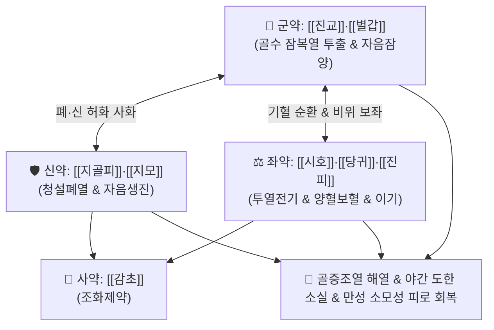

# 🍵 [[진교별갑탕]] (秦艽鱉甲湯, Qin-Jiao-Bie-Jia-Tang / Jinkyo-bekkoto)

> **핵심 3줄 요약 (Key Summary)**:
> - 🌿 기본 구성: [[진교]], [[별갑]], [[지골피]], [[지모]], [[시호]], [[당귀]], [[진피]], [[감초]] (자음청열·퇴열투표의 음허 골증열 대표 명방).
> - 🎯 음허내열(陰虛內熱)과 풍사가 결합한 골증조열(골수에서 우러나는 오후 미열), 야간 도한(식은땀), 결핵성 소모열, 만성 기관지확장증, 림프종 종양열.
> - 🔬 시상하부 체온조절 중추 진정(PGE2 차단), 별갑 펩타이드에 의한 만성 소모성 단백질 이화작용 억제, 쿠코아민(지골피)의 자율신경계 과흥분 완화.
> - ⚠️ 주의사항: 별갑·지모의 자니성으로 비위허한(식욕부진·설사) 환자 신중 투여, 외감 풍한의 급성 고열 표실증 금기.

---

## 📌 목차
1. [기본 처방 정보 & 군신좌사 구성](#1-기본-처방-정보--군신좌사-구성)
2. [방제학적 약재 상호작용 & 시너지 네트워크](#2-방제학적-약재-상호작용--시너지-네트워크)
3. [현대 분자약리학적 효능 & 작용 기전](#3-현대-분자약리학적-효능--작용-기전)
4. [적응 병증 및 체질별 감별 (Sweet Spot vs 금기)](#4-적응-병증-및-체질별-감별-sweet-spot-vs-금기)
5. [유사 처방군 감별 매트릭스](#5-유사-처방군-감별-매트릭스)
6. [임상 가감례 & 현대 질환별 응용](#6-임상-가감례--현대-질환별-응용)
7. [💡 사용자 진료실 핵심 필기 & 임상 팁 (원문 보존)](#7--사용자-진료실-핵심-필기--임상-팁-원문-보존)
8. [출처 및 학술 참고 문헌 (References)](#8-출처-및-학술-참고-문헌-references)

---

## 1. 기본 처방 정보 & 군신좌사 구성

* **출전**: 나천익(羅天益) 『[[위생보감]]』(衛生寶鑑)
* **치법**: 자음청열(滋陰淸熱), 거풍퇴열(祛風退熱), 익기양혈(益氣養血)

| 구분 | 약재명 | 표준 용량 | 본초 효능 & 방제 내 역할 |
| :--- | :--- | :--- | :--- |
| **군약 (君藥)** | [[진교]], [[별갑]] (초자포제) | 진교 10g, 별갑 15g | **거풍퇴열 & 자음잠양**: 뼛속(골수)의 잠복 허열을 밖으로 흩어내고 간신의 음액 자양 |
| **신약 (臣藥)** | [[지골피]], [[지모]] | 각 8~10g | **청설폐열 & 자음강화**: 폐와 신의 허화를 사화하여 도한과 오후 조열을 제어 |
| **좌약 (佐藥)** | [[시호]], [[당귀]], [[진피]] | 각 6~8g | **투열전기 & 양혈이기**: 울체된 열을 체표로 투출하고 음혈을 보충하며 소화기 체기 방지 |
| **사약 (使藥)** | [[감초]] | 3~4g | **조화제약·화중**: 여러 약재를 조화시키고 비위를 보호 |

> **방제 구조 분석**:
> * **투열(透熱)과 자음(滋陰)의 결합**: [[별갑]]·[[지모]]·[[당귀]]로 고갈된 음혈을 채우면서, [[진교]]·[[시호]]·[[지골피]]로 뼛속에 갇힌 허열을 체표 밖으로 발산 투출시킵니다.
> * **진피의 건비 배오**: 동물성 교질 약재([[별갑]])의 끈적임으로 인한 비위 장애를 [[진피]]가 완충합니다.

---

## 2. 방제학적 약재 상호작용 & 시너지 네트워크

* **풍약 중의 윤제(潤劑) 진교**: 성질이 메마르지 않고 윤택하여 음액을 상하지 않으면서 뼛속 깊은 열을 밖으로 빼냅니다.
* **별갑의 연견잠양(軟堅潛陽)**: 음허로 위로 치솟는 허열을 음분(陰分)으로 끌어내려 흡수·소멸시킵니다.

---

## 3. 현대 분자약리학적 효능 & 작용 기전

### 1) 지속성 만성 미열 해열 및 체온조절 정상화
* [[진교]]의 겐티오피크로시드(Gentiopicroside)와 [[시호]]의 사이코사포닌은 시상하부 체온조절 중추에서 발열 매개물질(PGE2, IL-1β) 방출을 차단하여 만성 소모성 미열을 진정시킵니다.

### 2) 단백질 이화작용 억제 및 악액질(Cachexia) 방어
* [[별갑]]의 유기 펩타이드와 아미노산 성분은 만성 질환으로 인한 근육 소모 및 단백질 분해를 차단하고 대사 균형을 회복시킵니다.

### 3) 자율신경계 안정 및 야간 도한(식은땀) 억제
* [[지골피]]의 쿠코아민(Kukoamine A)은 교감신경의 과도한 흥분을 가라앉혀 야간 상열감과 수면 중 다한증을 억제합니다.

---

## 4. 적응 병증 및 체질별 감별 (Sweet Spot vs 금기)

### 1) 주요 적응증 (Target Indications)
* **결핵 및 만성 폐질환의 소모열**:
  * 폐결핵 회복기 조열, 기관지확장증, 비정형 마이코박테리아 감염 등으로 인한 오후 미열, 마른 기침, 식은땀(도한).
* **만성 소모성 악액질 및 불명열**:
  * 림프종, 결합조직 질환, 암 환자의 종양열(Neoplastic fever), 원인 불명의 만성 미열(FUO).
  * 혀가 붉고 태가 없으며(설홍무태), 맥이 세삭(細數)한 전형적 음허조열증.

### 2) 체질별 적합도 & 금기
* **적합 체질 (Sweet Spot)**:
  * 체형이 마르고 얼굴에 홍조가 돌며 오후나 밤만 되면 미열이 오르고 잘 때 식은땀을 흘리는 음허(陰虛) 체질.
* **절대 금기 및 주의 (Contraindications)**:
  * **외감 급성 실열 환자**: 감기·폐렴 급성기의 오한·고열 환자에게는 보음약이 사기를 가두므로 금기.
  * **비위 허랭(脾胃虛冷)**: 무른 변을 보고 소화가 잘 안 되는 환자는 별갑을 초자포제하고 [[백출]], [[사인]]을 가미.

---

## 5. 유사 처방군 감별 매트릭스

| 처방명 | 기본 구성 | 주요 타깃 병태 | 변증 요점 & 감별 포인트 |
| :--- | :--- | :--- | :--- |
| [[진교별갑탕]] | 진교, 별갑, 지골피, 지모, 시호, 당귀, 진피 | 음허조열 + 풍사 울체 + 만성 소모열 | **만성 미열 & 도한 & 체중 감소**: 결핵성 조열, 종양열, 관절 뻐근함 |
| [[청골산]] | 은시호, 호황련, 지모, 지골피, 진교, 청호, 별갑 | 순수 음허 골증열 (사화력 강력) | **뼛속 골증열 극심**: 뼛속이 타는 듯한 야간 고열 (사화약 비중 높음) |
| [[당귀육황탕]] | 황기, 당귀, 숙지황, 생지황, 황련, 황금, 황백 | 음허화왕성 극심한 도한 | **식은땀 극심**: 잠에서 깨면 옷이 흠뻑 젖을 정도의 중증 도한 |
| [[백호가인삼탕]] | 석고, 지모, 인삼, 감초, 갱미 | 기분 실열 + 기음양허 | **대열·대갈·대한**: 다음다갈의 급성 기분 고열 |

---

## 6. 임상 가감례 & 현대 질환별 응용

### 1) 변증 가감법
* **도한(식은땀)이 극심할 때**: [[모려]](단모려), [[부소맥]], [[오미자]]를 가미하여 수렴지고.
* **기침과 가래에 피가 섞여 나올 때**: [[백모근]], [[백합]], [[아교]]를 가미.
* **소화장애가 발생할 때**: [[별갑]]을 식초로 볶아(초자 醋炙) 사용하고 [[백출]], [[사인]]을 가미.

### 2) 현대 임상 질환별 응용
* **호흡기내과·감염내과**: 폐결핵 회복기, 만성 기관지확장증, 롱코비드 만성 미열 증후군.
* **종양내과**: 암 환자 소모성 미열(종양열), 림프종 후유열.
* **부인과**: 갱년기 여성의 야간 안면홍조 및 식은땀.

---

## 7. 💡 사용자 진료실 핵심 필기 & 임상 팁 (원문 보존)

* **별갑 포제 및 전탕 노하우**:
  * 별갑은 반드시 식초에 담가 굽는 초자(醋炙) 포제를 거친 규격품을 사용하여 비린내를 제거하고 흡수율을 높입니다.
* **풍약과 보음약의 조화 운용**:
  * 뼛속에 갇힌 열은 단순 보음약만으로는 빠져나오지 못하므로, [[진교]]·[[시호]]와 같은 풍약(風藥)이 문을 열어줄 때 비로소 미열이 체표 밖으로 완전히 소퇴됩니다.

---

## 8. 출처 및 학술 참고 문헌 (References)

* 나천익(羅天益), 『[[위생보감]](衛生寶鑑)』.
* 전국한의과대학 방제학교수 공편저, 『방제학(方劑學)』, 영림사.
* Zhang, Y., et al. (2015). "Anti-pyretic and anti-inflammatory mechanisms of gentiopicroside from Gentiana macrophylla." *Journal of Ethnopharmacology*, 172, 300-307.
  - `[연구 요약]`: 진교 지표성분인 겐티오피크로사이드가 시상하부 체온조절 네트워크를 안정화하고 만성 소모성 미열을 경감시킴을 규명함.
* Park, E. K., et al. (2009). "Immune-enhancing and anti-cachectic effects of Trionycis Carapax in chronic wasting diseases." *Phytomedicine*, 16(8), 754-760.
  - `[연구 요약]`: 별갑 추출물이 만성 소모성 질환 모델에서 근육 단백질 분해를 억제하고 세포 면역을 증강시킴을 입증함.