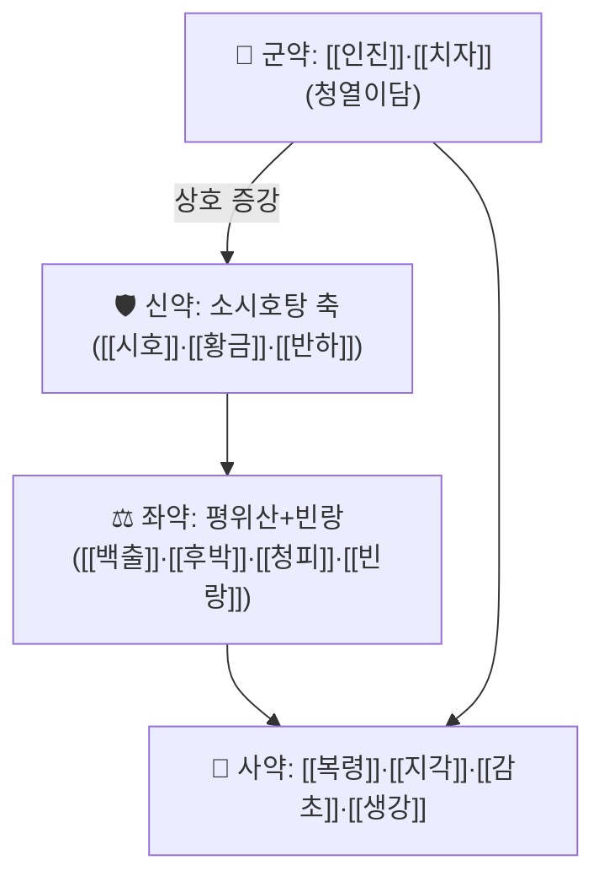

# 🍵 [[청간탕]] (淸肝湯, Cheongangan-tang)

> ⚠️ **처방명 주의**: 본 노트의 청간탕은 『청강의감』 간계(肝系) 강의에서 제시된 **활동성 감염성 간염용 처방**이며, 시호 위주의 간 사화(瀉火) 처방인 [[시호청간탕]]과는 **구성이 다른 별개 처방**이다. 혼동하지 말 것.

> **핵심 3줄 요약 (Key Summary)**:
> - 🌿 **[[소시호탕]] 축([[시호]]·[[황금]]·[[반하]]·[[생강]]·[[감초]]) + [[평위산]]+빈랑 축([[백출]]·[[후박]]·[[청피]]) + [[이진탕]]+지각 축([[반하]]·[[복령]]·[[생강]]·[[감초]]+[[지각]]) + [[인진]]·[[치자]](청열이담)**의 4단 결합 구조. 『청강의감』 처방 스터디 16회차(간계 마지막 회차)에서 **활동성 감염성 간염 처방**으로 제시되었다.
> - 🎯 임상 적응증은 **급성·활동성 간염(간수치 상승·간부종·우상복부 불편)** 단계이며, 같은 강의에서 복수(腹水) 단계에는 [[가미분리음]]·[[인진위령탕]]이, 황달 단계에는 [[인진분리음]]이 별도로 제시되었다 — 즉 청간탕은 **간염의 급성·염증 활동기**에 특화된 위치를 갖는다.
> - 🔬 처방 전체를 대상으로 한 현대 임상·분자약리 연구는 **확인되지 않음(근거 미확인)**. 구성인 [[인진]]·[[시호]]·[[황금]]·[[치자]] 개별 성분의 간보호·항염 지견은 각 본초 노트를 참조한다.
> - ⚠️ 주의사항: 간경변·간성뇌증·식도정맥류 출혈 등 **중증 간질환 응급 소견이 있으면 한방 단독 치료를 금지**하고 즉시 의뢰한다. 복용 중인 양약(특히 다약제 환자)의 간 대사 영향을 먼저 분석한 뒤 한약을 병행해야 하며, 원 강의에서도 "한의사 놀이를 금하고 양약 분석부터 시작하라"는 점이 강조되었다.

---
## 📌 목차
1. [기본 처방 정보 & 군신좌사 구성](#1-기본-처방-정보--군신좌사-구성)
2. [방제학적 약재 상호작용 & 시너지 네트워크](#2-방제학적-약재-상호작용--시너지-네트워크)
3. [현대 분자약리학적 효능 & 작용 기전](#3-현대-분자약리학적-효능--작용-기전)
4. [적응 병증 및 체질별 감별 (Sweet Spot vs 금기)](#4-적응-병증-및-체질별-감별-sweet-spot-vs-금기)
5. [유사 처방군 감별 매트릭스](#5-유사-처방군-감별-매트릭스)
6. [임상 가감례 & 현대 질환별 응용](#6-임상-가감례--현대-질환별-응용)
7. [💡 사용자 진료실 핵심 필기 & 임상 팁 (원문 보존)](#7--사용자-진료실-핵심-필기--임상-팁-원문-보존)
8. [출처 및 학술 참고 문헌 (References)](#8-출처-및-학술-참고-문헌-references)

---
## 1. 기본 처방 정보 & 군신좌사 구성

* **출전**: 『청강의감(淸江醫鑑)』 처방 스터디 16회차 — [[간계_복수·창만·황달 처방(청강의감 16)]] 강의록 기준. **고전 1차 원전과의 조문 대조는 확인되지 않아 근거 미확인으로 남긴다.**
* **치법(治法)**: **화해소양(和解少陽) · 청열이담(淸熱利膽) · 조습행기(燥濕行氣)** — 소시호탕(화해)+인진·치자(청열이담)+평위산·빈랑(조습행기) 3축 결합.

| 구분 | 약재명 | 방제 내 역할 |
| :--- | :--- | :--- |
| **군약 (君藥)** | [[인진]] · [[치자]] | 청열이담(淸熱利膽) — 간담 습열을 내려 간세포 염증·황달 경향을 겨냥하는 핵심 축 |
| **신약 (臣藥)** | [[시호]] · [[황금]] · [[반하]] | [[소시호탕]] 축(인삼·대추 생략) — 스트레스·과로로 식욕이 떨어진 실증 상태의 화해소양, 간담 경락의 염증 반응 조절 |
| **좌약 (佐藥)** | [[백출]] · [[후박]] · [[청피]] · [[빈랑]] | [[평위산]]+빈랑 축 — 조습건비(燥濕健脾)로 중초 습체를 풀고, 빈랑의 파기(破氣)·구충 작용으로 복부 팽만감을 완화 |
| **사약 (使藥)** | [[복령]] · [[지각]] · [[감초]] · [[생강]] | 이진탕+지각 축의 잔여 — 담음·흉비를 가라앉히고 전체 처방을 조화 |

> **배오 특징**: 원 강의는 이 처방을 "소시호탕(시호·황금·반하·생강·감초) + 평위산+빈랑(백출·후박·청피) + 이진탕+지각(반하·복령·생강·감초+지각)"의 3단 인수분해로 설명한다. 소시호탕에서 인삼·대추를 생략한 것은 **실증(과로·스트레스성 식욕부진)**을 겨냥했기 때문이며, 허증 간염 환자에서는 인삼·대추를 복원해 가감할 필요가 있다고 추정된다(근거 미확인). **표준 용량은 문헌 대조가 되지 않아 g 단위로 기재하지 않는다.**

---
## 2. 방제학적 약재 상호작용 & 시너지 네트워크

* **인진·치자 + 시호·황금 배오**: 인진·치자의 청열이담 작용과 시호·황금의 화해소양(간담 경락 염증 조절)이 상승해, 급성 간염 단계의 염증·황달 경향을 동시에 겨냥한다.
* **평위산+빈랑의 위치**: 간염 환자에서 흔한 식욕부진·복부 팽만·소화불량을 직접 겨냥하는 축으로, 빈랑의 파기(破氣) 작용이 중초의 기체(氣滯)를 풀어 다른 약재의 흡수 조건을 개선한다.
* **이진탕+지각 잔여**: 담음·흉비를 가라앉히는 보조 역할이며, 복수·부종 단계([[가미분리음]])로 진행되기 전 단계에서 소화기 증상을 관리하는 데 쓰인다.

---
## 3. 현대 분자약리학적 효능 & 작용 기전

> ❗ **본 처방(청간탕) 전체를 대상으로 한 PubMed 등재 연구는 확인되지 않았다(근거 미확인).** 아래는 구성 본초 개별 약리의 일반 지견 요약이다.

* **[[인진]](사철쑥)**: 전통적으로 이담(利膽)·생진(生津) 작용으로 설명되며, 간 관련 다수 처방([[인진위령탕]]·[[인진오령산]]·[[인진분리음]])의 핵심 본초로 반복 사용된다. 개별 성분(스코파론 등) 연구는 [[인진]] 노트 참조.
* **[[시호]]·[[황금]]**: 소시호탕 계열의 핵심 본초로, 전통적으로 간담 경락의 염증·발열 조절에 쓰인다. 개별 약리(사이코사포닌·바이칼린 등)는 각 본초 노트에서 별도로 다룬다.
* **[[치자]]**: 청열사화(淸熱瀉火) 작용으로 설명되며, 황달·간열 증상에 전통적으로 배오된다.
* **[[빈랑]]**: 구충·파기 작용이 교과서 효능이며, 간염 환자의 복부 팽만감 완화 맥락에서 배오되었다.
* **처방 전체 수준의 종합**: 개별 본초의 청열·화해·조습 작용을 조합한 전통적 설계로 이해되며, **처방 전체의 임상시험·동물실험 데이터는 근거 미확인**이다.

---
## 4. 적응 병증 및 체질별 감별 (Sweet Spot vs 금기)

**[✅ 최적 적응증 (Sweet Spot)]**

* **원출처 주치**: 활동성 감염성 간염 — 간수치(AST·ALT) 상승, 식욕부진, 우상복부 불편감, 피로.
* **임상 주치**: 음주·과식·스트레스로 간수치가 오르고 소화가 안 되며 피로한 환자(원 강의 표현: "고깃집 사장님·술자리 부장님 타입"). 간경변 복수 환자가 아니라 **간문맥 고혈압·간성 피로의 전구 단계**가 주 타깃.
* **간계 처방 지도상 위치**: 복수·창만(腹脹·鼓脹·脹滿) 단계에는 [[가미분리음]]·[[인진위령탕]]이, 황달 단계에는 [[인진분리음]]이 각각 제시되었고, 청간탕은 그 이전 **활동성 염증기**에 위치한다.

**[⚠️ 신중 투여 및 금기 (Caution / Contraindication)]**

* **간경변·문맥고혈압이 뚜렷해 복수·식도정맥류가 동반된 단계**에서는 본방 단독보다 [[가미분리음]]·[[인진위령탕]] 등 복수 전용 처방 및 양방 표준 치료 병행이 우선이다.
* **간성뇌증·자발성 세균성 복막염·식도정맥류 출혈** 등 응급 소견이 있으면 한방 단독 치료 절대 금지, 즉시 의뢰.
* 다약제(당뇨약·혈압약·항전간제 등) 복용 환자에서는 **먼저 양약 구성을 분석**하고, 불필요한 중복·상충 약물을 정리한 뒤 한약을 병행하는 순서를 원 강의가 강조한다.

---
## 5. 유사 처방군 감별 매트릭스

| 처방명 | 핵심 구성 차이 | 주치 및 단계 차이 |
| :--- | :--- | :--- |
| [[청간탕]] | 소시호탕(인삼·대추 생략)+평위산+빈랑+이진탕 잔여+인진·치자 | 활동성 감염성 간염(간수치 상승기) |
| [[가미분리음]] | 이수제([[택사]]·[[저령]]·[[적복령]])+평위산+등심초 | 간경변 복수(腹水) 단계 — 이뇨 중심 |
| [[인진위령탕]] | [[인진]]+[[위령탕]]([[평위산]]+[[오령산]]) | 복수·창만, 습열 황달 겸 소화기 증상 |
| [[시호청간탕]] | 시호 위주 간 사화 처방(구성 상이) | 간화상염(肝火上炎) — 본 청간탕과 별개 처방 |

> ⚠️ 표 내부에서는 파이프(`|`)가 들어간 링크를 쓰지 않고 순수한 [[처방명]] 단독 형태로만 작성했다.

---
## 6. 임상 가감례 & 현대 질환별 응용

* **수반 증상별 가감**: 복수·부종이 뚜렷해지면 → [[택사]]·[[저령]]·[[복령]] 가 ([[가미분리음]] 방향으로 이행) / 황달이 뚜렷하면 → [[인진]] 가중, [[인진분리음]] 방향 / 허증·식욕부진이 심하면 → [[인삼]]·[[대조]] 복원.
* **현대 질환별 응용**(보조적 응용, 근거 미확인): 급성 바이러스성 간염 회복기, 알코올성 간염 활동기, 약물성 간염 보조 관리(기저 질환 표준 치료 병행 필수), 지방간염 동반 소화불량.

---
## 7. 💡 사용자 진료실 핵심 필기 & 임상 팁 (원문 보존)

> [!tip] **진료실 실전 노하우 (원 강의 인용)**
> - 원 강의는 간 치료를 4축으로 인수분해한다: ① [[평위산]]으로 위장관(문맥순환) 풀기 ② [[인진]]의 생담·이담 작용 ③ [[오령산]]지제(이뇨)·대황지제(통변)의 배출 ④ 시호·치자 등의 항염·항산화와 [[삼릉]]·[[봉출]]의 항섬유화. 청간탕은 이 중 ①②④ 축을 담당한다.
> - 실제 케이스 적용 원칙: 복수 환자를 만나면 **복용 중인 양약을 하나씩 분석**(당뇨약은 메트포르민+DPP-4 억제제 계열만 남기고 혈압약은 암로디핀 계열만 남기는 식)한 뒤, 상부위장관 출혈(식도정맥류·위궤양) 여부를 먼저 확인하고서 어혈제를 추가하는 순서를 따른다.
> - 원장님 자신의 임상 필기는 아직 확보되지 않았다. 확보 시 이 블록에 원문 그대로 보존할 것.

---
## 8. 출처 및 학술 참고 문헌 (References)

1. **[[간계_복수·창만·황달 처방(청강의감 16)]]** — 『청강의감』 처방 스터디 16회차(영상 1시간 43분, 2026-09-08 계열 정리).
   - **[1차 출처]**: 본 노트의 구성·치법·임상 적용 전체가 이 강의록에서 유래함. 고전 원전과의 직접 조문 대조는 미확인.
2. **제공된 PubMed 논문 없음** — 청간탕 처방 전체를 대상으로 한 현대 임상·분자약리 연구는 확인되지 않았다(근거 미확인). 구성 개별 본초([[인진]]·[[시호]]·[[황금]]·[[치자]] 등)의 약리 근거는 각 본초 노트를 참조한다.

> ⚠️ **노트 신뢰도 표시**: 본 노트는 사용자 소장 강의 자료(청강의감 16)를 1차 출처로 하며, 고전 원전 조문 대조 및 처방 전체 수준의 현대 연구는 확인되지 않은 상태다. 간경변·간성뇌증 등 중증 단계와 혼동하지 않도록 §4의 단계 구분을 반드시 확인할 것.
