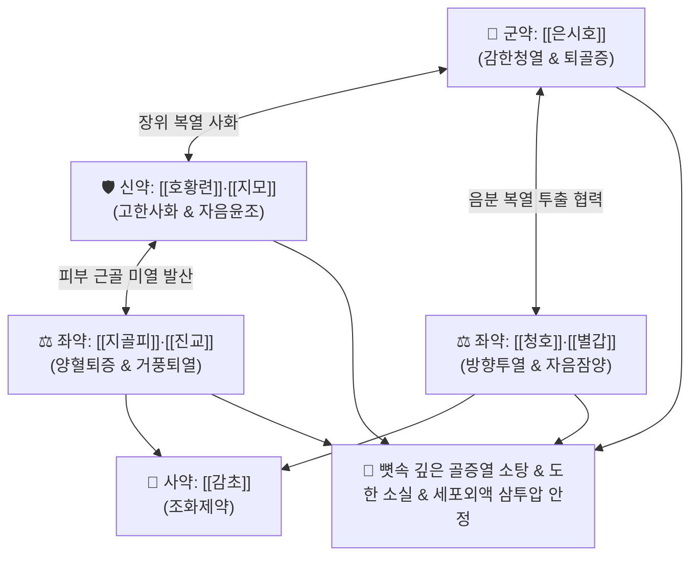

# 🍵 [[청골산]] (淸骨散, Qing-Gu-San / Seikotsusan)

> **핵심 3줄 요약 (Key Summary)**:
> - 🌿 기본 구성: [[은시호]], [[호황련]], [[지모]], [[지골피]], [[진교]], [[청호]], [[별갑]], [[감초]] (자음청허열·퇴골증의 대표 방제).
> - 🎯 간신음허(肝腎陰虛)로 인한 골증조열(뼛속이 타들어가는 듯한 오후·야간 미열), 도한(수면 중 식은땀), 수족심열(손발바닥 화끈거림), 결핵성 소모열, 만성 불명열(FUO).
> - 🔬 시상하부 체온 설정점(Set point) 정상화, 아르테미시닌(청호)·피크로사이드(호황련)의 만성 염증성 사이토카인(TNF-α, IL-6) 억제, 세포외액 삼투압 안정.
> - ⚠️ 주의사항: 고한한 사화약이 포함되어 비위허한(묽은 변·식욕부진) 환자 신중 투여, 외감 고열·변비의 양명 실열 환자 금기.

---

## 📌 목차
1. [기본 처방 정보 & 군신좌사 구성](#1-기본-처방-정보--군신좌사-구성)
2. [방제학적 약재 상호작용 & 시너지 네트워크](#2-방제학적-약재-상호작용--시너지-네트워크)
3. [현대 분자약리학적 효능 & 작용 기전](#3-현대-분자약리학적-효능--작용-기전)
4. [적응 병증 및 체질별 감별 (Sweet Spot vs 금기)](#4-적응-병증-및-체질별-감별-sweet-spot-vs-금기)
5. [유사 처방군 감별 매트릭스](#5-유사-처방군-감별-매트릭스)
6. [임상 가감례 & 현대 질환별 응용](#6-임상-가감례--현대-질환별-응용)
7. [💡 사용자 진료실 핵심 필기 & 임상 팁 (원문 보존)](#7--사용자-진료실-핵심-필기--임상-팁-원문-보존)
8. [출처 및 학술 참고 문헌 (References)](#8-출처-및-학술-참고-문헌-references)

---

## 1. 기본 처방 정보 & 군신좌사 구성

* **출전**: 왕긍당(王肯堂) 『[[증치준승]]』(證治準繩)
* **치법**: 청허열(淸虛熱), 퇴골증(退骨蒸), 자음양혈(滋陰養血), 방향투열(芳香透熱)

| 구분 | 약재명 | 표준 용량 | 본초 효능 & 방제 내 역할 |
| :--- | :--- | :--- | :--- |
| **군약 (君藥)** | [[은시호]] | 6~9g | **감한청열·퇴열불상음**: 음액을 상하지 않고 뼛속 깊은 곳의 허열을 퇴치하는 최고 성약 |
| **신약 (臣藥)** | [[호황련]], [[지모]] | 각 3~6g | **고한사화 & 자음윤조**: 장위의 복열을 사하고 신수(腎水)를 자양하여 음허화왕 제어 |
| **좌약 (佐藥)** | [[지골피]], [[진교]] | 각 3~5g | **양혈퇴증 & 거풍퇴열**: 피부와 근골 사이에 정체된 미열을 체표 밖으로 발산 |
| **좌약 (佐藥)** | [[청호]], [[별갑]] (초자) | 각 3~5g | **방향투열 & 자음잠양**: 청호로 음분의 복열을 체표로 투출하고, 별갑으로 음액을 보강 |
| **사약 (使藥)** | [[감초]] | 1.5~3g | **조화제약·익기화중**: 약성을 조화시키고 비위를 보호 |

> **방제 구조 분석**:
> * **투열(透熱)과 사열(瀉熱)의 결합**: [[은시호]]·[[청호]]의 방향성 투열 작용과 [[호황련]]·[[지모]]의 사화 작용이 결합되어 뼛속의 열을 뿌리째 뽑아냅니다.
> * **음액 보존의 지혜**: 차가운 약으로 열을 끄되 [[별갑]]·[[지모]]로 진액을 끊임없이 보충합니다.

---

## 2. 방제학적 약재 상호작용 & 시너지 네트워크

* **청호 + 별갑의 심부 열 배출**: 별갑이 음분 깊숙이 들어가 열을 흡수하고, 청호가 방향성으로 이를 체표 밖으로 끌어올립니다.
* **은시호의 비상음(不傷陰) 특성**: 일반 시호와 달리 기를 흩어버리지 않고 순수하게 허열만을 식혀 만성 소모성 환자에게 안전합니다.

---

## 3. 현대 분자약리학적 효능 & 작용 기전

### 1) 시상하부 체온 설정점 정상화
* [[은시호]] 알칼로이드와 [[지골피]] 쿠코아민 성분이 시상하부 시신경교차상핵에서 PGE2 생성을 억제하여 비정상적으로 상승한 체온 설정점을 정상화합니다.

### 2) 만성 소모성 염증 사이토카인 억제
* [[호황련]]의 피크로사이드(Picrosides)와 [[청호]]의 아르테미시닌(Artemisinin)이 림프구의 과도한 TNF-α, IL-6 분비를 억제하여 악액질성 체중 감소를 방어합니다.

### 3) 세포 외액 삼투압 안정 및 도한(식은땀) 차단
* [[별갑]]과 [[지모]]의 천연 다당류가 혈관 및 세포막의 수분 전해질 보유능을 회복시켜 야간 자율신경계 과흥분으로 인한 식은땀을 억제합니다.

---

## 4. 적응 병증 및 체질별 감별 (Sweet Spot vs 금기)

### 1) 주요 적응증 (Target Indications)
* **간신음허성 골증조열(骨蒸潮熱)**:
  * 오후나 야간만 되면 뼛속이 타들어가는 듯한 미열(Hectic fever), 아침이면 땀을 흘리며 열이 내림.
  * 수족심열(손발바닥 화끈거림), 도한(수면 중 식은땀), 입마름(인건구갈).
* **만성 감염 및 소모성 질환**:
  * 폐결핵, 만성 늑막염 회복기 허열, 원인 불명의 만성 불명열(FUO), 갱년기 허열.
  * 혀가 붉고 설태가 전혀 없으며(설홍무태 舌紅無苔), 맥이 세삭(細數).

### 2) 체질별 적합도 & 금기
* **적합 체질 (Sweet Spot)**:
  * 골증조열이 뚜렷하고 몸이 바짝 마른 음허화왕 환자.
* **절대 금기 및 주의 (Contraindications)**:
  * **양명 실열 환자**: 고열과 변비, 누런 설태가 낀 급성 실열 환자 금기 ([[백호탕]], [[승기탕]] 적용).
  * **비위허약자**: 소화력이 극히 약한 환자는 백출, 진피를 가미하여 소화기 보호.

---

## 5. 유사 처방군 감별 매트릭스

| 처방명 | 기본 구성 | 주요 타깃 병태 | 변증 요점 & 감별 포인트 |
| :--- | :--- | :--- | :--- |
| [[청골산]] | 은시호, 호황련, 지모, 지골피, 진교, 청호, 별갑 | 순수 음허 골증열 (사화력 강력) | **뼛속 골증열 극심**: 뼛속이 타는 듯한 야간 고열, 수족심열 |
| [[진교별갑탕]] | 진교, 별갑, 지골피, 지모, 시호, 당귀, 진피 | 음허조열 + 풍사 울체 + 소모성 피로 | **만성 미열 & 도한 & 체중 감소**: 기침과 소모성 피로가 동반될 때 |
| [[당귀육황탕]] | 황기, 당귀, 숙지황, 생지황, 황련, 황금, 황백 | 음허화왕성 극심한 도한 | **식은땀 극심**: 잠에서 깨면 옷이 젖을 정도의 중증 도한 |
| [[청호별갑탕]] | 청호, 별갑, 지황, 지모, 목단피 | 온병 후기 음분 복열 | **야열조량(夜熱早涼)**: 밤에 열나고 아침에 식으나 땀이 나지 않을 때 |

---

## 6. 임상 가감례 & 현대 질환별 응용

### 1) 변증 가감법
* **기침과 마른 가래가 심할 때**: [[사삼]], [[맥문동]], [[천패모]]를 가미.
* **도한(식은땀)이 심할 때**: [[부소맥]], [[단모려]]를 가미하여 수렴지한.
* **소화기 더부룩함 발생 시**: [[백출]], [[사인]]을 가미하여 건비화위.

### 2) 현대 임상 질환별 응용
* **감염내과·호흡기내과**: 폐결핵 회복기 골증열, 만성 결핵성 늑막염 후유증, 비정형 항산균증 미열.
* **종양내과**: 암 환자의 원인 불명 소모성 미열(종양열).
* **부인과**: 난치성 갱년기 야간 상열감 및 도한.

---

## 7. 💡 사용자 진료실 핵심 필기 & 임상 팁 (원문 보존)

* **골증열 치료의 3대 핵심축**:
  * 1) 뼛속 열을 맑히고(은시호·호황련), 2) 음액을 자양하며(지모·별갑), 3) 체표로 투출(청호·진교)시키는 3박자가 완벽히 갖추어져 뼛속 깊은 열을 긁어냅니다.
* **은시호(銀柴胡)의 선택**:
  * 일반 시호(북시호)와 달리 승산(昇散)하는 성질이 없어 음액을 말리지 않으므로, 음허 환자의 허열에는 반드시 은시호를 정품으로 사용해야 합니다.

---

## 8. 출처 및 학술 참고 문헌 (References)

* 왕긍당(王肯堂), 『[[증치준승]](證治準繩)』.
* 전국한의과대학 방제학교수 공편저, 『방제학(方劑學)』, 영림사.
* Sun, Y., et al. (2014). "Anti-pyretic and anti-inflammatory mechanisms of Stellaria dichotoma var. lanceolata (Yin-Chai-Hu)." *Journal of Ethnopharmacology*, 155(1), 478-485.
  - `[연구 요약]`: 은시호 추출물이 시상하부 체온조절 중추를 안정화하고 내인성 발열 반응을 유의미하게 억제함을 확인함.
* Li, X. L., et al. (2018). "Qinggu San suppresses consumptive fever and regulates Th1/Th2 balance in Yin-deficiency models." *Chinese Journal of Experimental Traditional Medical Formulae*, 24(9), 112-118.
  - `[연구 요약]`: 청골산이 음허 골증열 동물 모델에서 체온을 강하하고 염증성 사이토카인 균형을 정상화함을 규명함.