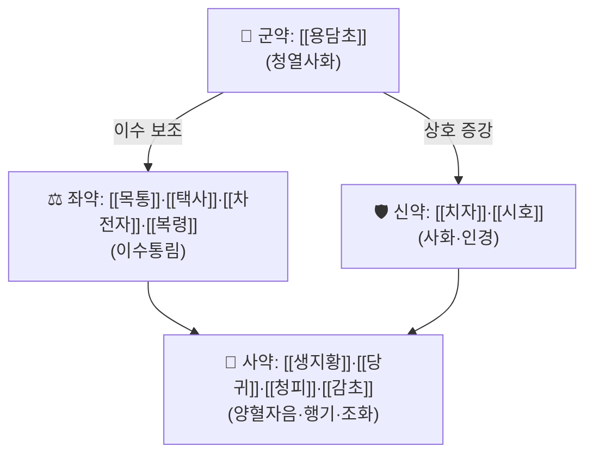

# 🍵 [[청대탕]] (淸帶湯, Cheongdae-tang) — 청리산(淸利散) 동방이명

> ⚠️ **처방명 주의**: 『청강의감』 원 강의는 청대탕을 "**=청리산(淸利散)**"으로 병기하며 같은 처방으로 설명한다. 미노트화 목록의 [[청리산]] 항목은 본 노트로 해소하되, 이름·출전의 1차 문헌 대조는 미확인이므로 추후 원전 확인 시 교정이 필요하다.

> **핵심 3줄 요약 (Key Summary)**:
> - 🌿 **[[용담사간탕]]에 [[청피]]를 가미한 변방**([[용담초]]·[[목통]]·[[택사]]·[[복령]]·[[시호]]·[[생지황]]·[[당귀]]·[[차전자]]·[[청피]]·[[치자]]·[[감초]]). 『청강의감』 처방 스터디 32회차(부인과 대하·질염 처방 5종 중 1번)에서 **"한방 항생제"**로 소개되었다.
> - 🎯 임상 적응증은 **비뇨생식기계 감염성 질환**(방광염·전립선염·요도염·질염)이며, 원 강의는 **세균성·칸디다(진균)성 질염 모두 커버 가능**하다고 설명한다. 같은 회차의 무균성(비감염성) 질염에는 [[증보오화음]]·[[난궁양혈탕]]·[[가감섭영전]]·[[가미석홍전]]이 별도로 제시되었다.
> - 🔬 처방 전체를 대상으로 한 현대 임상·분자약리 연구는 **확인되지 않음(근거 미확인)**. 모방(母方)인 [[용담사간탕]]의 개별 약리 근거는 해당 노트를 참조한다.
> - ⚠️ 주의사항: 청열이습(淸熱利濕) 성미가 강한 처방이므로 **허한성·비위허약 체질에는 신중 투여**가 필요하다. 감염성 질염은 산부인과 균배양·PCR 검사로 원인균을 먼저 확인하는 것이 원칙이며, 본방은 **항생제 불응성 만성·재발 질염 또는 항생제 치료와의 보조적 병행** 상황에서 활용 가치가 높다(원 강의 맥락).

---
## 📌 목차
1. [기본 처방 정보 & 군신좌사 구성](#1-기본-처방-정보--군신좌사-구성)
2. [방제학적 약재 상호작용 & 시너지 네트워크](#2-방제학적-약재-상호작용--시너지-네트워크)
3. [현대 분자약리학적 효능 & 작용 기전](#3-현대-분자약리학적-효능--작용-기전)
4. [적응 병증 및 체질별 감별 (Sweet Spot vs 금기)](#4-적응-병증-및-체질별-감별-sweet-spot-vs-금기)
5. [유사 처방군 감별 매트릭스](#5-유사-처방군-감별-매트릭스)
6. [임상 가감례 & 현대 질환별 응용](#6-임상-가감례--현대-질환별-응용)
7. [💡 사용자 진료실 핵심 필기 & 임상 팁 (원문 보존)](#7--사용자-진료실-핵심-필기--임상-팁-원문-보존)
8. [출처 및 학술 참고 문헌 (References)](#8-출처-및-학술-참고-문헌-references)

---
## 1. 기본 처방 정보 & 군신좌사 구성

* **출전**: 『청강의감(淸江醫鑑)』 처방 스터디 32회차(부인과 대하·질염 편) — [[부인과_대하·질염 처방(청강의감 32)]] 강의록 기준. **고전 1차 원전과의 조문 대조는 확인되지 않아 근거 미확인으로 남긴다.**
* **치법(治法)**: **청열이습(淸熱利濕) · 사화해독(瀉火解毒)** — [[용담사간탕]](간담 습열 청리) + [[청피]](행기) 가미.

| 구분 | 약재명 | 방제 내 역할 |
| :--- | :--- | :--- |
| **군약 (君藥)** | [[용담초]] | 청열사화(간경 습열을 직접 겨냥) — 비뇨생식기 감염성 염증에 대한 핵심 주치 작용 |
| **신약 (臣藥)** | [[치자]] · [[시호]] | 치자는 청열사화를 보조, 시호는 간경으로 인경(引經)하며 화해 작용 겸함 |
| **좌약 (佐藥)** | [[목통]] · [[택사]] · [[차전자]] · [[복령]] | 이수통림(利水通淋) — 하초 습열을 소변으로 배출, 비뇨생식기 증상(소변불리·뇨삽·백탁) 완화 |
| **사약 (使藥)** | [[생지황]] · [[당귀]] · [[청피]] · [[감초]] | 생지황·당귀로 청열제의 진액 손상을 완충(양혈자음), 청피로 행기, 감초로 조화제약 |

> **배오 특징**: 원 강의는 본방을 "**용담사간탕에 청피를 가미한 변방**"으로 설명한다. 용담사간탕 자체가 간경 습열을 청리하는 대표 처방이며, 여기에 청피(행기)를 더해 하초의 기체(氣滯)까지 함께 풀도록 변형한 것으로 이해된다. **표준 용량은 문헌 대조가 되지 않아 g 단위로 기재하지 않는다.**

---
## 2. 방제학적 약재 상호작용 & 시너지 네트워크

* **용담초 + 목통·택사·차전자 배오**: 용담사간탕의 핵심인 "청열(淸熱)+이수(利水)" 축이 그대로 유지되어, 비뇨생식기계 감염 시 염증과 배뇨 증상(소변불리·뇨삽·임력)을 동시에 겨냥한다.
* **생지황·당귀 배오**: 청열이습제는 성미가 강해 진액을 손상시키기 쉬운데, 생지황·당귀의 양혈자음(養血滋陰) 작용이 이를 완충한다.
* **청피 가미의 의미**: 원방(용담사간탕) 대비 청피를 더한 것은 하초의 기체(氣滯)·팽만감을 함께 풀기 위한 변형으로, 질염에 흔히 동반되는 하복부 불편감을 겨냥한 가감으로 추정된다(근거 미확인).

---
## 3. 현대 분자약리학적 효능 & 작용 기전

> ❗ **본 처방(청대탕) 전체를 대상으로 한 PubMed 등재 연구는 확인되지 않았다(근거 미확인).** 모방인 [[용담사간탕]]의 개별 약리 지견은 해당 노트를 참조하고, 본 노트에서는 중복 기재하지 않는다.

* **[[용담초]]**: 전통적으로 청간이담(淸肝利膽)·사화 작용으로 설명되며, 이리도이드 배당체(겐티오피크린 등) 성분 연구는 [[용담초]] 노트 참조.
* **[[치자]]**: 청열사화 작용이 교과서 효능이며, 지황·황금 등과 배오되어 염증성 질환에 전통적으로 쓰인다.
* **[[목통]]·[[차전자]]**: 이수통림(利水通淋) 작용으로 비뇨기계 배뇰 증상 완화에 전통적으로 활용된다.
* **처방 전체 수준의 종합**: "청열+이수+자음"의 전통적 설계로 이해되며, **처방 전체의 임상시험·동물실험 데이터(항균·항진균 효과 포함)는 근거 미확인**이다. "한방 항생제"라는 원 강의의 표현은 **임상 경험적 서술이며, 미생물학적 검증(최소억제농도 MIC 등)에 기반한 것이 아님**을 분명히 한다.

---
## 4. 적응 병증 및 체질별 감별 (Sweet Spot vs 금기)

**[✅ 최적 적응증 (Sweet Spot)]**

* **원출처 주치**: 비뇨생식기계 감염성 질환 — 방광염·전립선염·요도염(소변불리·뇨삽·임력·백탁·뇨혈), 세균성·칸디다성 질염.
* **임상 주치**: 산부인과 항생제·항진균 질정제 치료에 불응하거나 재발이 반복되는 만성 질염 환자. 분비물이 누렇고 냄새가 나며 외음부 가려움·작열감을 동반하는 **습열형 대하**.
* **부인과 대하 처방 지도상 위치**: 같은 강의에서 무균성(비감염성) 질염에는 [[증보오화음]](생리통·복통형)·[[난궁양혈탕]](만성·위축성)이, 혈성 냉에는 [[가감섭영전]]·[[가미석홍전]]이 제시되었다 — 청대탕은 그중 **감염성(감염 소견이 뚜렷한) 대하**에 특화된 위치를 갖는다.

**[⚠️ 신중 투여 및 금기 (Caution / Contraindication)]**

* **허한성·비위허약 체질**(평소 손발이 차고 설사가 잦으며 맥이 약한 경우)에는 청열이습 성미가 강한 본방이 오히려 소화불량·설사를 유발할 수 있어 신중 투여.
* **급성 감염 초기**에는 산부인과 균배양·PCR 검사로 원인균(세균·진균·트리코모나스 등)을 먼저 확인하고, 표준 항생제·항진균 치료를 우선하거나 병행하는 것이 원칙이다. 본방을 항생제의 대체물로 단독 신뢰하지 않는다.
* **임신 중**에는 용담초·목통 등 청열이습제의 안전성 자료가 제한적이므로 신중 투여 또는 전문가 판단이 필요하다.

---
## 5. 유사 처방군 감별 매트릭스

| 처방명 | 핵심 구성 차이 | 주치 및 체질 차이 |
| :--- | :--- | :--- |
| [[청대탕]] | [[용담사간탕]]+[[청피]] | 감염성 질염·비뇨기 감염("한방 항생제") |
| [[용담사간탕]] | 청피 가미 전 원방 | 간경 습열 전반(황달·음부 습양 등 포괄) |
| [[증보오화음]] | 생리통·복통 처방 구조 | 무균성 질염+하복통·성교통 |
| [[난궁양혈탕]] | 온경·양혈 축 | 만성·위축성(폐경기) 질염 |

> ⚠️ 표 내부에서는 파이프(`|`)가 들어간 링크를 쓰지 않고 순수한 [[처방명]] 단독 형태로만 작성했다.

---
## 6. 임상 가감례 & 현대 질환별 응용

* **수반 증상별 가감**: 가려움이 심하면 → [[백선피]]·[[고삼]] 가 / 분비물에 혈성이 섞이면 → [[가감섭영전]] 방향으로 전환 고려 / 하복통이 뚜렷하면 → [[증보오화음]] 방향으로 전환 고려.
* **현대 질환별 응용**(보조적 응용, 근거 미확인): 항생제 불응성 재발성 질염, 만성 방광염·요도염 보조 관리, 전립선염 보조 관리(남성에도 원방인 용담사간탕 활용 전통이 있음).

---
## 7. 💡 사용자 진료실 핵심 필기 & 임상 팁 (원문 보존)

> [!tip] **진료실 실전 노하우 (원 강의 인용)**
> - 원 강의 핵심 틀: "대하 = 여성 생식기의 감기"로 접근하며, 산부인과는 STD 검사(균배양·PCR) → 항생제/항진균 질정제로 급성 감염성 질염을 처리하므로 **한의원에 남는 환자군은 항생제 불응성 만성·재발 질염과 무균성(비감염성) 질염**이라는 진료 환경 인식이 전제된다.
> - "냉은 질 점막이 뱉어내는 콧물" — 무색·무취 분비물 증가는 감염이 아니며, 치료의 완성은 처방이 아니라 **식이 티칭**(알레르겐 프리·저탄수화물 식이)이라는 점이 원 강의의 핵심 강조점이다.
> - 원장님 자신의 임상 필기는 아직 확보되지 않았다. 확보 시 이 블록에 원문 그대로 보존할 것.

---
## 8. 출처 및 학술 참고 문헌 (References)

1. **[[부인과_대하·질염 처방(청강의감 32)]]** — 『청강의감』 처방 스터디 32회차(PPT 19슬라이드+음성 강의 약 62분, 2026-09-08 계열 정리).
   - **[1차 출처]**: 본 노트의 구성·치법·임상 적용 전체가 이 강의록에서 유래함. 고전 원전과의 직접 조문 대조 및 "청리산"과의 이명 관계는 미확인.
2. **제공된 PubMed 논문 없음** — 청대탕 처방 전체를 대상으로 한 현대 임상·분자약리 연구는 확인되지 않았다(근거 미확인). 모방인 [[용담사간탕]]의 약리 근거는 해당 노트를 참조한다.

> ⚠️ **노트 신뢰도 표시**: 본 노트는 사용자 소장 강의 자료(청강의감 32)를 1차 출처로 하며, 고전 원전 조문 대조 및 처방 전체 수준의 현대 연구는 확인되지 않은 상태다. "한방 항생제"라는 표현은 경험적 서술로, 미생물학적 검증 자료가 아님에 유의한다.
