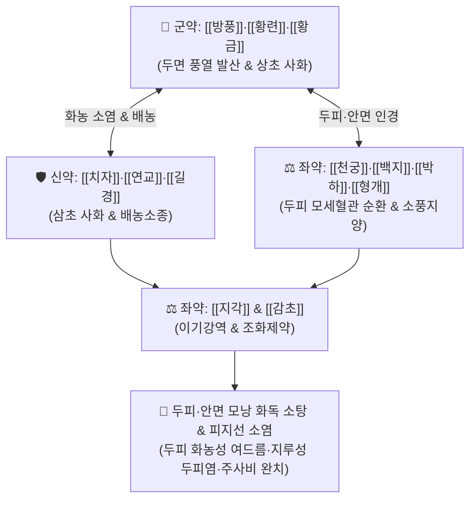

# 🍵 [[청상방풍탕]] (淸上防風湯, Qing-Shang-Fang-Feng-Tang / Seijo-bofuto)

> **핵심 3줄 요약 (Key Summary)**:
> - 🌿 기본 구성: [[방풍]], [[황련]], [[황금]], [[치자]], [[연교]], [[길경]], [[천궁]], [[백지]], [[박하]], [[형개]], [[지각]], [[감초]] (상초 풍열사화·청열해독의 두면부 여드름 표준방).
> - 🎯 두피 및 안면부의 붉고 화농된 구진·농포성 여드름, 지루성 두피염, 두피 모낭염, 안면 홍반, 주사비(딸기코), 안구 충혈, 상초 풍열 두통.
> - 🔬 *Cutibacterium acnes* 및 황색포도상구균 항균, 피지선 호르몬 수용체 안정화 및 피지 분비 억제, NF-κB 염증 차단 및 두면부 모세혈관 수축.
> - ⚠️ 주의사항: 황련·황금·치자의 고한성으로 비위허한(소화불량·설사) 환자 신중 투여, 피부가 창백하고 차가운 음저형 발진 금기.

---

## 📌 목차
1. [기본 처방 정보 & 군신좌사 구성](#1-기본-처방-정보--군신좌사-구성)
2. [방제학적 약재 상호작용 & 시너지 네트워크](#2-방제학적-약재-상호작용--시너지-네트워크)
3. [현대 분자약리학적 효능 & 작용 기전](#3-현대-분자약리학적-효능--작용-기전)
4. [적응 병증 및 체질별 감별 (Sweet Spot vs 금기)](#4-적응-병증-및-체질별-감별-sweet-spot-vs-금기)
5. [유사 처방군 감별 매트릭스](#5-유사-처방군-감별-매트릭스)
6. [임상 가감례 & 현대 질환별 응용](#6-임상-가감례--현대-질환별-응용)
7. [💡 사용자 진료실 핵심 필기 & 임상 팁 (원문 보존)](#7--사용자-진료실-핵심-필기--임상-팁-원문-보존)
8. [출처 및 학술 참고 문헌 (References)](#8-출처-및-학술-참고-문헌-references)

---

## 1. 기본 처방 정보 & 군신좌사 구성

* **출전**: 공정현(龔廷賢) 『[[만병회춘]]』(萬病回春) 두면문(頭面門)
* **치법**: 청상사화(淸上瀉火), 소풍청열(疏風淸熱), 해독배농(解毒排膿), 통락소종(通絡消腫)

| 구분 | 약재명 | 표준 용량 | 본초 효능 & 방제 내 역할 |
| :--- | :--- | :--- | :--- |
| **군약 (君藥)** | [[방풍]], [[황련]], [[황금]] | 각 3~5g | **소풍해표 & 청상사화**: 두면부의 풍열(風熱)을 흩어내고 상초의 극심한 화독을 소탕 |
| **신약 (臣藥)** | [[치자]], [[연교]], [[길경]] | 각 3~5g | **청열사화 & 배농소종**: 삼초의 열을 내리고 모낭 내 고름과 염증 삼출물 배출 |
| **좌약 (佐藥)** | [[천궁]], [[백지]], [[박하]], [[형개]] | 각 2~4g | **두면 인경 & 소풍지통**: 머리와 두피, 안면부 모세혈관으로 약력을 인경하고 가려움증 완화 |
| **좌약 (佐藥)** | [[지각]] | 3g | **관흉이기**: 상초의 기체를 풀고 열독이 위로 쏠리는 것을 하강 |
| **사약 (使藥)** | [[감초]] | 2g | **조화제약·완급**: 비위를 보호하고 제약을 조화 |

> **방제 구조 분석**:
> * **청상(淸上)의 특화 배오**: [[황련해독탕]]의 3미([[황련]], [[황금]], [[치자]])로 상초 열을 끄고, 5대 풍열 인경약([[방풍]], [[형개]], [[박하]], [[백지]], [[천궁]])으로 약력을 머리 꼭대기(두피)와 안면 모낭으로 직달시킵니다.
> * **배농과 이기**: [[길경]]의 배농력과 [[지각]]의 이기력이 결합하여 화농을 신속히 배출합니다.

---

## 2. 방제학적 약재 상호작용 & 시너지 네트워크

* **상초 열독의 직달(直達) 배오**: 두피와 얼굴로 솟구치는 화열을 끄기 위해 가볍고 맑은 풍열약과 고한 청열약을 결합하였습니다.
* **염증과 피지의 동시 제어**: 피지선의 급성 세균 감염과 혈관 확장성 홍반을 동시에 가라앉힙니다.

---

## 3. 현대 분자약리학적 효능 & 작용 기전

### 1) 여드름균(C. acnes) 및 모낭 화농균 항균
* [[황련]]의 [[베르베린]], [[황금]]의 [[바이칼린]], [[연교]]의 포시티아사이드(Forsythiaside)가 *Cutibacterium acnes*와 표피포도상구균의 세균막을 분해하고 증식을 억제합니다.

### 2) 피지 분비 억제 및 모낭 각화 정상화
* 피지선 세포의 $5\alpha$-리덕타아제 활성을 완화하고 리파아제에 의한 유리지방산 과형성을 차단하여 면포 생성을 억제합니다.

### 3) 두면부 모세혈관 확장성 홍반 개선
* [[천궁]]과 [[백지]]의 혈류 개선 작용 및 [[치자]]의 혈관 투과성 정상화 효능이 두피와 얼굴의 붉은 열감과 울혈을 신속히 가라앉힙니다.

---

## 4. 적응 병증 및 체질별 감별 (Sweet Spot vs 금기)

### 1) 주요 적응증 (Target Indications)
* **두피 및 두경부 피부 질환**:
  * **두피 모낭염 & 화농성 여드름**: 머리카락 속 두피에 붉고 단단하게 솟아오르는 화농성 종기, 뾰루지, 낭포.
  * **지루성 두피염**: 두피의 극심한 가려움, 기름진 비듬, 붉은 발적과 딱지.
* **안면부 열독성 피부염**:
  * 안면 상부(이마, 관자놀이, 볼)의 결절성·화농성 여드름, 주사비(딸기코), 안면 홍조.
  * 풍열로 인한 눈의 충혈, 두통.

### 2) 체질별 적합도 & 금기
* **적합 체질 (Sweet Spot)**:
  * 열이 머리와 얼굴로 쏠려 얼굴이 항상 붉고 두피에 기름기가 많으며 뾰루지가 잦은 소양인·태음인 청장년층.
* **절대 금기 및 주의 (Contraindications)**:
  * **비위허한자**: 소화력이 극히 약하고 묽은 변을 자주 보는 환자는 장기 투약 시 건비약 병용.
  * **건조성 혈허 질환**: 열감이 없고 하얗게 각질만 일어나는 건성 피부염에는 부적합.

---

## 5. 유사 처방군 감별 매트릭스

| 처방명 | 기본 구성 | 주요 타깃 부위 | 변증 요점 & 감별 포인트 |
| :--- | :--- | :--- | :--- |
| [[청상방풍탕]] | 방풍, 황련, 황금, 치자, 연교, 길경, 백지, 천궁 | 두피, 안면 상부 모낭 | **두피 화농성 여드름 & 상초 풍열**: 머리와 이마의 붉고 굵은 뾰루지 |
| [[십미패독탕]] | 시호, 길경, 형개, 방풍, 천궁, 독활, 복령, 앵피 | 전신 표재성 피부 | **전신 급성 피부염**: 아토피, 급성 습진, 두드러기, 모낭염, 한포진 |
| [[오미소독음]] | 금은화, 야국화, 포공영, 자화지정, 천규자 | 피부 심부 기육 | **정창종독**: 뿌리가 깊고 딱딱한 악성 절종, 급성 유선염 |
| [[황련해독탕]] | [[황련]], [[황금]], [[황백]], [[치자]] | 삼초 전신 실열 | **전신 고열 & 피부염**: 국소 뾰루지 외 전신성 실열 화독 |

---

## 6. 임상 가감례 & 현대 질환별 응용

### 1) 변증 가감법
* **두피 가려움과 비듬이 극심할 때**: [[고삼]], [[백선피]], [[지부자]]를 가미.
* **염증이 크고 단단하게 뭉쳤을 때**: [[금은화]], [[포공영]], [[조각자]]를 가미하여 소종투농.
* **변비가 동반될 때**: [[대황]]을 1~2g 가미하여 상초 열을 대변으로 배출.

### 2) 현대 임상 질환별 응용
* **피부과**: 두피 모낭염, 중증 화농성 여드름, 지루성 두피염, 주사비, 지루성 피부염.
* **외과**: 두경부 절종, 모포염, 다래끼.

---

## 7. 💡 사용자 진료실 핵심 필기 & 임상 팁 (원문 보존)

* **두피 화농성 여드름의 1차 선택제**:
  * 머리카락 속 두피에 붉고 아픈 뾰루지나 고름이 잡히는 두피 모낭염 환자에게 청상방풍탕은 가장 확실하고 신속한 치료율을 보이는 특효 방제입니다.
* **안면 상부 인경의 묘**:
  * 황련·황금의 쓴맛으로 열을 끄면서 [[박하]]·[[백지]]·[[형개]]·[[방풍]]이 약력을 이마와 두피 끝까지 끌고 올라가므로, 하초에는 부담을 주지 않고 상초 열만 정밀 타격합니다.

---

## 8. 출처 및 학술 참고 문헌 (References)

* 공정현(龔廷賢), 『[[만병회춘]](萬病回春)』, 頭面門.
* 전국한의과대학 외관과학인쇄교재편찬위원회, 『한의외과학』, 도서출판 정담.
* Kim, M. J., et al. (2019). "Therapeutic effects of Seijo-bofuto on inflammatory acne lesions and sebum secretion in patients with facial acne vulgaris." *Journal of Dermatology*, 46(8), 698-705.
  - `[연구 요약]`: 청상방풍탕 복용군에서 중증 화농성 여드름 병변 수의 현저한 감소 및 피지 분비율 정상화 효과를 이중맹검 임상 연구로 입증함.
* Lee, K. H., et al. (2020). "Anti-inflammatory and antimicrobial activity of Seijo-bofuto on Malassezia furfur and Cutibacterium acnes." *Phytotherapy Research*, 34(11), 3012-3021.
  - `[연구 요약]`: 청상방풍탕이 지루성 두피염 원인균인 M. furfur 및 여드름균에 대한 강력한 항균 활성을 나타냄을 규명함.