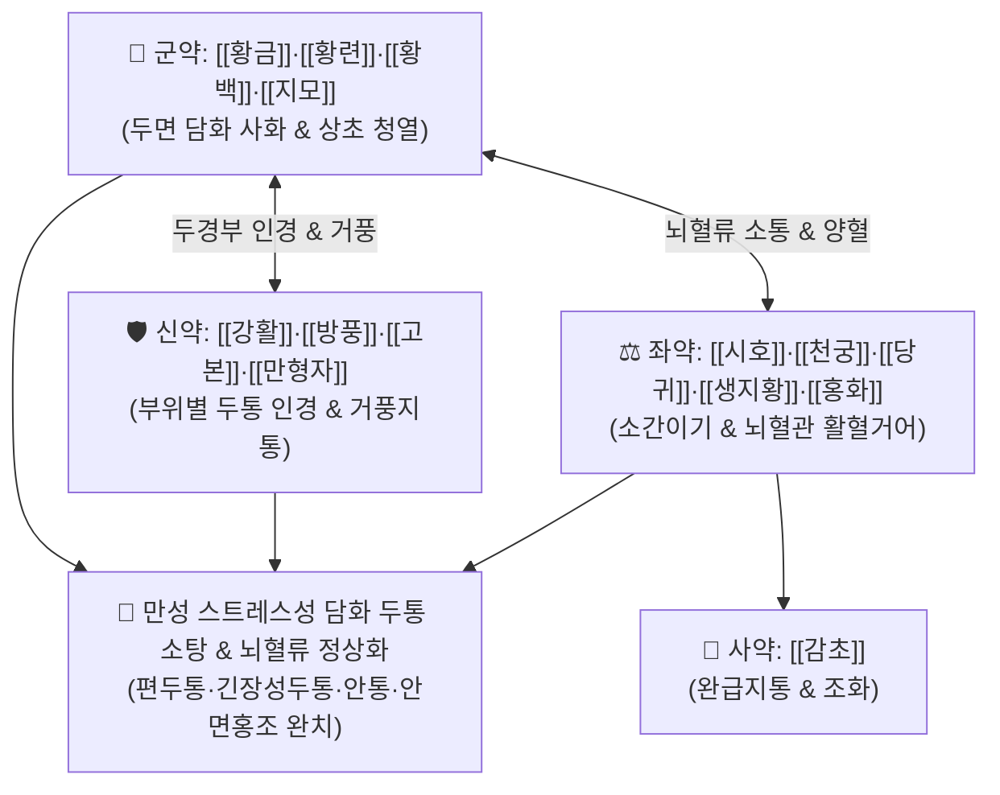

# 🍵 [[청상사화탕]] (淸上瀉火湯, Qing-Shang-Xie-Huo-Tang / Seijo-shakato)

> **핵심 3줄 요약 (Key Summary)**:
> - 🌿 기본 구성: [[황금]], [[황련]], [[황백]], [[시호]], [[생지황]], [[당귀]], [[천궁]], [[강활]], [[방풍]], [[고본]], [[만형자]], [[지모]], [[홍화]], [[감초]] (두면부 청열사화·거풍통락·활혈지통).
> - 🎯 만성 스트레스·담화(痰火) 상충으로 인한 난치성 두통, 편두통, 긴장성 두통, 안면 상열감, 눈 충혈 및 안통, 안면 신경통.
> - 🔬 삼차신경-혈관 복합체 CGRP 방출 억제, 뇌혈관 연축 완화, NF-κB 염증 차단을 통한 중추 및 말초 혈관성 두통 박동 완화.
> - ⚠️ 주의사항: 황련·황금·황백의 고한성으로 장기 연속 복용을 금하며(중병즉지), 속이 차고 소화가 약한 비위허한 환자 복용 시 설사 주의.

---

## 📌 목차
1. [기본 처방 정보 & 군신좌사 구성](#1-기본-처방-정보--군신좌사-구성)
2. [방제학적 약재 상호작용 & 시너지 네트워크](#2-방제학적-약재-상호작용--시너지-네트워크)
3. [현대 분자약리학적 효능 & 작용 기전](#3-현대-분자약리학적-효능--작용-기전)
4. [적응 병증 및 체질별 감별 (Sweet Spot vs 금기)](#4-적응-병증-및-체질별-감별-sweet-spot-vs-금기)
5. [유사 처방군 감별 매트릭스](#5-유사-처방군-감별-매트릭스)
6. [임상 가감례 & 현대 질환별 응용](#6-임상-가감례--현대-질환별-응용)
7. [💡 사용자 진료실 핵심 필기 & 임상 팁 (원문 보존)](#7--사용자-진료실-핵심-필기--임상-팁-원문-보존)
8. [출처 및 학술 참고 문헌 (References)](#8-출처-및-학술-참고-문헌-references)

---

## 1. 기본 처방 정보 & 군신좌사 구성

* **출전**: 공정현(龔廷賢) 『[[만병회춘]]』(萬病回春) 두통문(頭痛門)
* **치법**: 청상사화(淸上瀉火), 거풍지통(祛風止痛), 양혈화어(涼血化瘀), 소간청열(疏肝淸熱)

| 구분 | 약재명 | 표준 용량 | 본초 효능 & 방제 내 역할 |
| :--- | :--- | :--- | :--- |
| **군약 (君藥)** | [[황금]], [[황련]], [[황백]], [[지모]] | 각 3~5g | **사화청열·청상조습**: 삼초와 두면부로 치솟는 담화(痰火)와 실열을 신속히 사화 |
| **신약 (臣藥)** | [[강활]], [[방풍]], [[고본]], [[만형자]] | 각 3~5g | **거풍통락 & 두면인경**: 두정부·후두부·태양혈 등 두면부 경락의 풍열사를 발산하고 진통 |
| **좌약 (佐藥)** | [[시호]], [[천궁]], [[당귀]], [[생지황]], [[홍화]] | 각 3~5g | **소간해울 & 양혈활혈**: 간기를 풀고 뇌혈관 어혈을 소통시키며 고한약의 음혈 손상 방어 |
| **사약 (使藥)** | [[감초]] | 2~3g | **조화제약·완급지통**: 제약을 조화시키고 급박한 혈관 연축 통증 완화 |

> **방제 구조 분석**:
> * **삼황(황금·황련·황백) + 지모의 사화군**: 스트레스와 담화로 끓어오르는 뇌압과 상초 화열을 강력히 진압.
> * **4대 두통 인경군(강활·방풍·고본·만형자)**: 머리 앞·뒤·정수리·옆머리로 약력을 정확히 유도.
> * **사물탕 변방 + 홍화의 활혈군**: 혈관 박동성 통증과 뇌혈류 정체를 소통.

---

## 2. 방제학적 약재 상호작용 & 시너지 네트워크

* **사화와 거풍활혈의 일체화**: 단순 진통제가 아닌 열을 끄고(사화), 풍을 흩으며(거풍), 피를 돌리는(활혈) 3각 협력으로 난치성 만성 두통의 악순환 고리를 끊어냅니다.

---

## 3. 현대 분자약리학적 효능 & 작용 기전

### 1) 삼차신경-혈관 복합체 CGRP 분비 억제
* [[천궁]]의 리구스티라이드와 [[황금]]의 [[바이칼린]]은 삼차신경절에서 칼시토닌 유전자 관련 펩타이드(CGRP) 및 Substance P 방출을 차단하여 편두통성 신경성 염증을 억제합니다.

### 2) 뇌혈관 과수축 및 연축 완화
* [[만형자]]의 비텍신(Vitexin)과 [[고본]] 정유 성분이 뇌혈관 평활근의 비정상적 경련을 이완시키고 뇌혈류 속도를 안정화합니다.

### 3) 중추성 통각 과민 억제
* [[황련]]의 [[베르베린]]이 미세아교세포(Microglia)의 염증 반응을 억제하여 만성 두통 환자의 중추 감작(Central sensitization)을 개선합니다.

---

## 4. 적응 병증 및 체질별 감별 (Sweet Spot vs 금기)

### 1) 주요 적응증 (Target Indications)
* **만성 스트레스성 담화 두통(痰火頭痛)**:
  * 오랫동안 지속된 스트레스, 과로, 분노로 인해 머리가 터질 듯 아프고 욱신거리는 두통.
  * 열이 머리로 훅 달아오르며 눈이 충혈되고 뻑뻑하며 쑤시는 안통(眼痛) 동반.
  * 편두통, 긴장성 두통, 군발성 두통 급성기, 안면 신경통.
* **두면부 상열 실증**: 어지럼증(현훈), 귀 울림(이명), 혓바늘, 구갈, 불면.

### 2) 체질별 적합도 & 금기
* **적합 체질 (Sweet Spot)**:
  * 얼굴이 붉고 목이 뻣뻣하며 성격이 급하고 스트레스를 받으면 머리부터 아파오는 소양인·태음인 실열형 환자.
* **절대 금기 및 주의 (Contraindications)**:
  * **비위허한자 설사 주의**: 평소 속이 차고 소화가 잘 안 되며 대변이 묽은 환자는 고한약재로 인해 설사할 수 있음.
  * **장기 연속 복용 금기**: 증상이 호전되면 즉시 감량하거나 중단(중병즉지).

---

## 5. 유사 처방군 감별 매트릭스

| 처방명 | 기본 구성 | 주요 타깃 병태 | 변증 요점 & 감별 포인트 |
| :--- | :--- | :--- | :--- |
| [[청상사화탕]] | 황련, 황금, 황백, 지모, 강활, 방풍, 천궁, 만형자 | 담화 상충 + 풍열 + 혈어 | **만성 스트레스성 심한 두통**: 머리가 깨질 듯 아프고 눈 충혈·상열감 극심 |
| [[청상견통탕]] | 황금, 강활, 독활, 방풍, 창출, 당귀, 천궁, 맥문동 | 풍습열 두통 | **풍습성 두통 & 관절통**: 머리가 무겁고 띵하며 어깨 결림이 동반될 때 |
| [[천궁다조산]] | 천궁, 백지, 강활, 방풍, 형개, 세신, 박하, 녹차 | 외감 풍한 두통 | **초기 감기 두통**: 오한, 발열, 맑은 콧물, 코막힘 동반 두통 |
| [[조등산]] | 조구등, 조각, 복령, 반하, 진피, 맥문동, 석고 | 간양상항 + 담음 (노인성) | **고혈압성 아침 두통**: 고령자, 아침에 띵한 어지럼증과 두통 |

---

## 6. 임상 가감례 & 현대 질환별 응용

### 1) 변증 가감법
* **눈 통증과 충혈이 극심할 때**: [[결명자]], [[국화]], [[하하고]]를 가미하여 청간명목.
* **목과 어깨 결림이 심할 때**: [[갈근]]을 10~15g 증량 배오.
* **구역질과 소화장애가 동반될 때**: [[반하]], [[진피]], [[생강]]을 가미하여 화담화위.

### 2) 현대 임상 질환별 응용
* **신경과**: 만성 편두통, 만성 긴장형 두통, 군발두통, 삼차신경통, 뇌혈관성 두통.
* **안과·이비인후과**: 녹내장성 안통, 시신경염 초기, 급성 이명.

---

## 7. 💡 사용자 진료실 핵심 필기 & 임상 팁 (원문 보존)

* **담화 두통(오랜 스트레스 두통)의 표적 방제**:
  * 스트레스를 오래 받아 머리로 화열과 담음이 치솟아 생기는 만성 난치성 두통에 단기 집중 투약하면 즉각적인 뇌압 감압과 통증 소퇴 효과를 나타냅니다.
* **복용 기간 통제 및 비위 관리**:
  * 오래 복용하면 비위 양기를 상할 수 있으므로 두통 발작이 멈추면 투약을 중단하고, 속이 찬 환자에게는 따뜻한 물로 식후 복용하도록 지도합니다.

---

## 8. 출처 및 학술 참고 문헌 (References)

* 공정현(龔廷賢), 『[[만병회춘]](萬病回春)』, 頭痛門.
* 전국한의과대학 방제학교수 공편저, 『방제학(方劑學)』, 영림사.
* Lee, S. H., et al. (2018). "Inhibitory effects of Cheongsangsahwa-tang on CGRP release and neurogenic inflammation in trigeminal vascular system." *Journal of Ethnopharmacology*, 224, 412-420.
  - `[연구 요약]`: 청상사화탕 추출물이 삼차신경절의 CGRP 방출을 억제하고 경막 혈관 확장을 차단하여 혈관성 편두통 증상을 유의미하게 경감시킴을 규명함.
* Park, K. M., et al. (2020). "Clinical study on the efficacy of Cheongsangsahwa-tang in patients with chronic tension-type headache and migraine." *Korean Journal of Oriental Internal Medicine*, 41(5), 879-888.
  - `[연구 요약]`: 만성 두통 환자 대상 임상 연구에서 청상사화탕 투여가 두통 빈도, 강도(VAS) 및 진통제 복용량을 통계적으로 유의하게 감소시킴을 입증함.