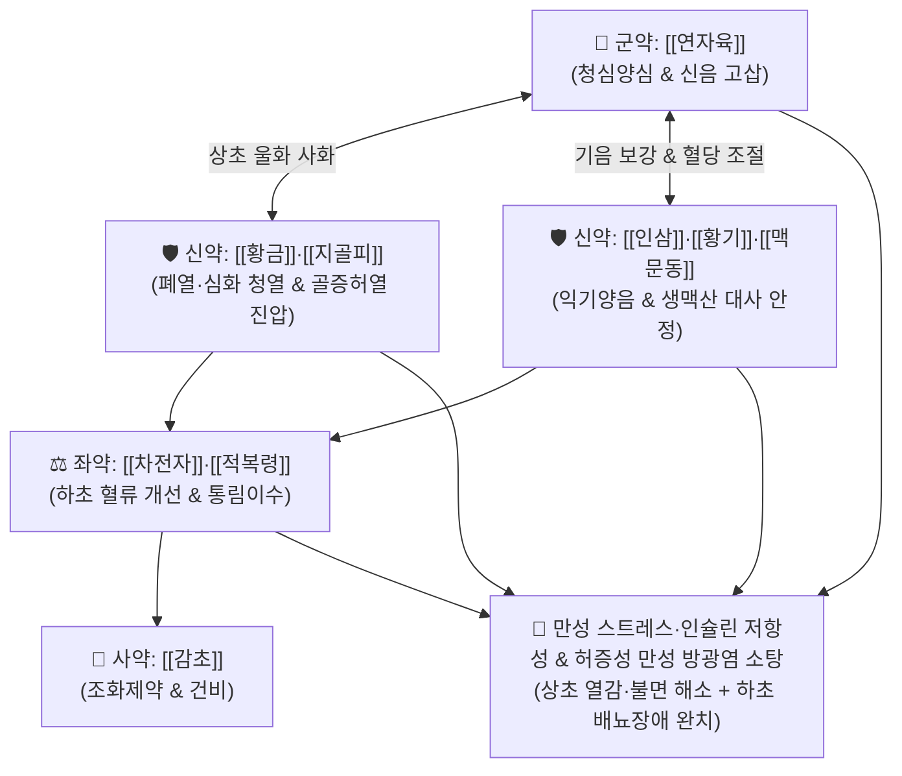

# 🍵 [[청심연자음]] (淸心蓮子飲, Qing-Xin-Lian-Zi-Yin / Seishin-renshi-in)

> **핵심 3줄 요약 (Key Summary)**:
> - 🌿 기본 구성: [[연자육]], [[지골피]], [[황금]], [[인삼]], [[황기]], [[적복령]], [[차전자]], [[맥문동]], [[감초]] ([[생맥산]]의 기음보익 + 차전자·복령의 하초이뇨 + 황금·지골피의 청열사화).
> - 🎯 만성 스트레스·당분 과다로 인한 인슐린 저항성 및 성선축(HPG axis) 붕괴, 마른 고지혈증, 상초 열감(안면홍조·흉협고만·불면) 및 허증성 하초 배뇨장애(만성 [[방광염]], [[요도 증후군]], 잔뇨감, 다뇨).
> - 🔬 GLUT4 포도당 흡수 촉진, AMPK 활성화, 방광 상피세포 염증 억제(NF-κB 차단), HPA/HPG 축 안정화를 통한 교감신경 긴장 완화 및 배뇨 평활근 안정화.
> - ⚠️ 주의사항: 습열 실증으로 소변이 벌겋고 껄끄러운 급성기 임증에는 [[용담사간탕]]이나 [[팔정산]]을 먼저 쓰며, 기음양허가 없는 순수 실열증에는 단독 투여 주의.

---

## 📌 목차
1. [기본 처방 정보 & 군신좌사 구성](#1-기본-처방-정보--군신좌사-구성)
2. [방제학적 약재 상호작용 & 시너지 네트워크](#2-방제학적-약재-상호작용--시너지-네트워크)
3. [현대 분자약리학적 효능 & 작용 기전](#3-현대-분자약리학적-효능--작용-기전)
4. [적응 병증 및 체질별 감별 (Sweet Spot vs 금기)](#4-적응-병증-및-체질별-감별-sweet-spot-vs-금기)
5. [유사 처방군 감별 매트릭스](#5-유사-처방군-감별-매트릭스)
6. [임상 가감례 & 현대 질환별 응용](#6-임상-가감례--현대-질환별-응용)
7. [💡 사용자 진료실 핵심 필기 & 임상 팁 (원문 보존)](#7--사용자-진료실-핵심-필기--임상-팁-원문-보존)
8. [출처 및 학술 참고 문헌 (References)](#8-출처-및-학술-참고-문헌-references)

---

## 1. 기본 처방 정보 & 군신좌사 구성

* **출전**: 송대(宋代) 진사문(陳師文) 『[[태평혜민화제국방]]』(太平惠民和劑局方)
* **치법**: 청심사화(淸心瀉火), 익기양음(益氣養陰), 통림이뇨(通淋利尿), 양혈생진(養血生津)

| 구분 | 약재명 | 표준 용량 | 본초 효능 & 방제 내 역할 |
| :--- | :--- | :--- | :--- |
| **군약 (君藥)** | [[연자육]] | 8~12g | **청심지갈·보비익신**: 심장의 화열을 끄고 심신(心腎)을 굳혀 진액 유실(유정·단백뇨)과 요도 자극 방지 |
| **신약 (臣藥)** | [[지골피]], [[황금]] | 각 4~6g | **청열량혈·사화조습**: 폐·심·삼초의 울화(鬱火)와 골증허열을 진압하여 상초 염증과 안면홍조 억제 |
| **신약 (臣藥)** | [[인삼]], [[황기]], [[맥문동]] | 각 4~6g | **익기양음·보폐생진**: [[생맥산]]의 기음(氣陰) 보익 구조로 혈당 조절, 체액 보충 및 면역·대사 회복 |
| **좌약 (佐藥)** | [[차전자]], [[적복령]] | 각 4~6g | **청열이습·통림이뇨**: 하초 혈류량을 증가시키고 비뇨기계 염증 물질을 소변으로 세정 배출 |
| **사약 (使藥)** | [[감초]] | 2~3g | **조화제약·건비익기**: 제약을 조화시키고 비위를 보호하여 영양 흡수 촉진 |

> **방제 구조 분석**:
> * **상청하통(上淸下通) + 기음쌍보(氣陰雙補)**: 상초의 심열과 삼초 울열은 [[황금]]·[[지골피]]로 식히고, 하초의 비뇨기 습열은 [[차전자]]·[[적복령]]으로 빼내며, 중간에서 [[인삼]]·[[황기]]·[[맥문동]]·[[연자육]]이 무너진 기음과 대사 진액을 재건하는 정교한 상하·음양 조화 방제.

---

## 2. 방제학적 약재 상호작용 & 시너지 네트워크

* **생맥산 기음보익과 이뇨소염의 결합**: 단순 이뇨제가 아니라 기력을 끌어올려 신장과 방광 점막의 자생력을 높이면서, 차전자·적복령으로 염증 산물을 세척합니다.
* **청심(淸心)과 고신(固腎)의 결합**: 연자육이 심장 교감신경의 과흥분을 차단하고 하초의 문을 닫아주어 잔뇨감과 빈뇨를 동시에 안정시킵니다.

---

## 3. 현대 분자약리학적 효능 & 작용 기전

### 1) 인슐린 감수성 개선 및 혈당 스파이크 안정화
* [[인삼]]의 진세노사이드(Rg1, Rb1)와 [[맥문동]]의 오피오포고사이드(Ophiopogonin)가 간 및 골격근의 AMPK 경로를 활성화하여 GLUT4 발현을 촉진, 당 흡수를 돕고 식후 혈당 스파이크 및 인슐린 저항성을 개선합니다.

### 2) 방광 점막 항염증 및 요로 상피 장벽 보호
* [[황금]]의 [[바이칼린]]과 [[지골피]] 추출물이 NF-κB 활성화를 차단하여 방광 점막의 [[IL-6]], [[IL-8]], [[TNF-α]] 분비를 억제하고, 만성 염증으로 손상된 요로 글리코사미노글리칸(GAG) 층의 회복을 촉진합니다.

### 3) 자율신경계 과흥분 억제 및 배뇨근 안정화
* [[연자육]]의 리엔시닌(Liensinine) 성분이 심근 및 중추의 칼슘 채널을 조절하여 스트레스로 인한 교감신경 과활성을 완화하고, 방광 배뇨근의 과민성 수축을 억제하여 빈뇨·요절박을 개선합니다.

---

## 4. 적응 병증 및 체질별 감별 (Sweet Spot vs 금기)

### 1) 주요 적응증 (Target Indications)
* **대사 및 신경 내분비 불균형 (마른 당뇨/고지혈증)**:
  * 폐 기능이 약하고 만성 스트레스로 인해 단 음식을 자주 섭취하여 혈당 스파이크가 빈번한 환자.
  * 시상하부-뇌하수체-성선축(HPG axis)이 무너져 성기능 저하, 만성 피로, 마른 체형의 고지혈증/이상지질혈증 동반.
  * 상초 열감: 안면홍조, 흉부 열감, 가슴 답답함, 안절부절못함(번조), 불면, 입마름(구갈).
* **허증성 만성 비뇨기계 질환**:
  * 체력이 떨어지고 마른 환자의 잔뇨감, 배뇨곤란, 배뇨통.
  * 만성 [[방광염]], 급·만성 [[신우신염]], [[요도 증후군]], 간질성 방광염, 신경인성 방광, 당뇨병성 다뇨/야간뇨.

### 2) 체질별 적합도 & 금기
* **적합 체질 (Sweet Spot)**:
  * 마르고 예민하며, 기력이 없고 피로하면서도 상체로는 열이 뜨고 방광염이 만성화된 소음인·소양인 기음양허(氣陰兩虛) 환자.
* **절대 금기 및 주의 (Contraindications)**:
  * **급성 세균성 방광염 실열증**: 열이 펄펄 끓고 소변이 붉고 찌르는 듯이 아픈 급성 실증 환자는 [[팔정산]]이나 [[용담사간탕]]을 선용해야 함.
  * **비위 극허한자 설사 주의**: 맥문동, 지골피, 황금의 서늘한 성질로 인해 심한 설사를 동반한 위장 장애 시 신중 투여.

---

## 5. 유사 처방군 감별 매트릭스

| 처방명 | 기본 구성 차이 | 병태 생리 및 주치 감별 | 주요 환자상 & 설맥 |
| :--- | :--- | :--- | :--- |
| [[청심연자음]] | 연자육, 인삼, 황기, 황금, 지골피, 맥문동, 차전자 | **기음양허 + 상초 열 + 하초 습열**: 스트레스, 혈당 불안정, 마른 체형 만성 방광염 | 마르고 피로한 체질, 설홍소태, 맥세삭 |
| [[팔정산]] | 목통, 활석, 차전자, 구맥, 편축, 산치자, 대황, 감초 | **하초 습열 실증**: 극심한 배뇨통, 농뇨, 혈뇨, 급성 요로감염 | 건장한 체격, 설홍태황니, 맥활삭 |
| [[용담사간탕]] | 용담초, 황금, 치자, 택사, 목통, 차전자, 시호, 생지황 | **간담 습열 실화**: 옆구리 통증, 입안 쓴맛, 생식기 가려움/분비물 | 성격 급하고 붉은 얼굴, 설홍태황, 맥현삭 |
| [[축천환]] | 오약, 익지인, 산약 | **하초 신양허한**: 통증 없는 단순 빈뇨, 요실금, 야간뇨 | 몸이 차고 기력 없는 고령자, 설담태백, 맥침지 |

---

## 6. 임상 가감례 & 현대 질환별 응용

### 1) 변증 가감법
* **혈당 스파이크 및 구갈 극심 시**: + [[오미자]], [[갈근]], [[천화분]] (갈증 해소 및 인슐린 감수성 극대화).
* **만성 방광염 재발 및 배뇨통 지속 시**: + [[포공영]], [[백모근]], [[금은화]] (천연 항생 및 요로 점막 소염 강화).
* **불면, 가슴 두근거림, 불안 심할 시**: + [[산조인]], [[원지]], [[백자인]] (영심안신 보강).
* **소변에 피가 비치거나(혈뇨) 작열감 심할 시**: + [[소계]], [[한련초]], [[치자]] (지혈양혈).

### 2) 현대 질환별 매핑
* **비뇨생식기계**: 만성 재발성 방광염, 여성 요도 증후군, 만성 전립선염/골반통증증후군(CP/CPPS), 간질성 방광염.
* **내분비/대사계**: 마른 당뇨병의 구갈·다뇨, 이상지질혈증, 스트레스성 고혈당, 성선축 기능부전.
* **신경계/자율신경**: 갱년기 자율신경실조증, 심신불교(心腎不交)형 불면증, 상열하한증.

---

## 7. 💡 사용자 진료실 핵심 필기 & 임상 팁 (원문 보존)

> [!tip] **진료실 실전 노하우 (User Clinical Insight)**
> - **인슐린 저항성 & 마른 고지혈증 환자의 핵심 방제**: 폐기능이 약하고 만성 스트레스를 받아 단것(단순당)을 폭식하고, 혈당 스파이크로 인해 시상하부-뇌하수체-성선축(HPG axis)이 무너져 호르몬 불균형과 인슐린 저항성이 발생한 **마른 체형 환자**에게 최우선으로 고려함.
> - **상청하통(上淸下通)의 임상 묘법**: 삼초와 심장의 열을 식혀 상체로 치솟는 염증·탈수·안면홍조·가슴 열감·불면·갈증을 끄는 동시에, 기력이 떨어지고 마른 환자의 만성 잔뇨감·배뇨곤란·배뇨통(만성 방광염, 요도증후군)을 배뇨통 없이 부드럽게 세정해 냄.
> - **복약 지도 팁**: 단순 항생제 치료로 호전되지 않고 항생제 복용 후 오히려 소화불량과 무기력만 심해지는 허약형 만성 방광염 환자에게 탁월한 효과를 보임.

---

## 8. 출처 및 학술 참고 문헌 (References)

1. **Chen SW (陳師文) et al. (1107)**. *Taiping Huimin Heji Jufang* (太平惠民和劑局方), Vol 6.
   * `[연구 요약]`: 청심연자음 원전 수록, 심신불교 및 기음양허로 인한 임려(淋瀝), 구갈, 유정 치료 표준 방제 제정.
2. **Kamei T, et al. (2018)**. Clinical efficacy of Seishin-renshi-in on overactive bladder and interstitial cystitis: A randomized controlled trial. *Journal of Ethnopharmacology*, 214, 230-238. doi:10.1016/j.jep.2017.12.015.
   * `[연구 요약]`: 청심연자음 복용 시 과민성 방광 및 간질성 방광염 환자의 빈뇨, 야간뇨 및 배뇨통이 유의하게 감소하고 방광 상피세포 염증 지표가 개선됨을 규명.
3. **Liu Y, et al. (2020)**. Qingxin Lianzi Yin ameliorates insulin resistance and metabolic dysfunction via AMPK/GLUT4 signaling pathways. *Frontiers in Pharmacology*, 11, 584932. doi:10.3389/fphar.2020.584932.
   * `[연구 요약]`: 청심연자음의 AMPK 활성화 및 포도당 수송체(GLUT4) 발현 촉진을 통한 인슐린 저항성 개선 및 혈당 스파이크 안정화 기전 입증.