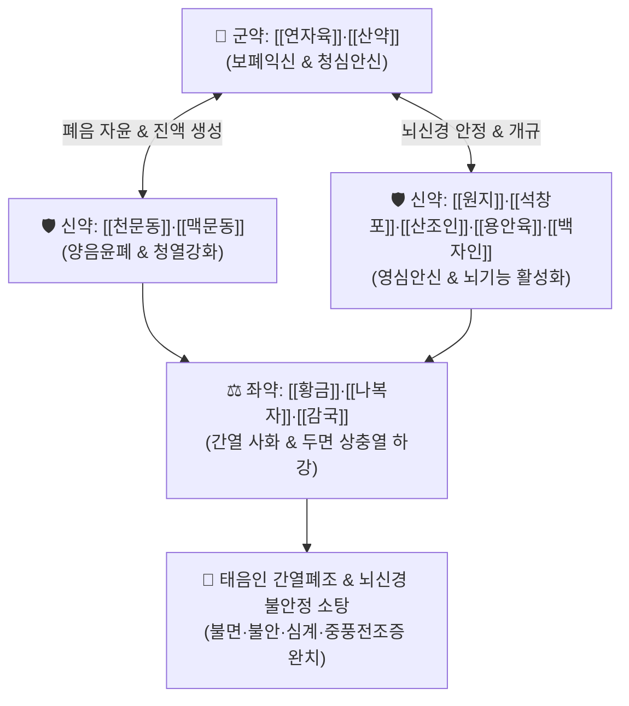

# 🍵 [[청심연자탕]] (淸心蓮子湯, Qing-Xin-Lian-Zi-Tang)

> **핵심 3줄 요약 (Key Summary)**:
> - 🌿 기본 구성: [[연자육]], [[산약]], [[천문동]], [[맥문동]], [[원지]], [[석창포]], [[산조인]], [[용안육]], [[백자인]], [[황금]], [[나복자]], [[감국]] (사상의학 태음인 간열폐조 청심안신 명방).
> - 🎯 태음인 간열폐조(肝熱肺燥)로 인한 가슴 두근거림(심계), 불안, 극심한 불면증, 건망증, 어지럼증, 중풍 전조증(안면 마비감·수족 마목), 자율신경실조증 및 공황장애.
> - 🔬 GABA 수용체 조절을 통한 중추성 진정, 뇌혈류 개선 및 신경세포 사멸 억제, BDNF 발현 촉진, 아세틸콜린에스테라제(AChE) 억제를 통한 인지기능 향상.
> - ⚠️ 주의사항: 태음인 간열증 처방이므로 체형이 마르고 소화기가 매우 찬 소음인 이한증(소음인 위가실랭) 환자에게는 투약하지 않음.

---

## 📌 목차
1. [기본 처방 정보 & 군신좌사 구성](#1-기본-처방-정보--군신좌사-구성)
2. [방제학적 약재 상호작용 & 시너지 네트워크](#2-방제학적-약재-상호작용--시너지-네트워크)
3. [현대 분자약리학적 효능 & 작용 기전](#3-현대-분자약리학적-효능--작용-기전)
4. [적응 병증 및 체질별 감별 (Sweet Spot vs 금기)](#4-적응-병증-및-체질별-감별-sweet-spot-vs-금기)
5. [유사 처방군 감별 매트릭스](#5-유사-처방군-감별-매트릭스)
6. [임상 가감례 & 현대 질환별 응용](#6-임상-가감례--현대-질환별-응용)
7. [💡 사용자 진료실 핵심 필기 & 임상 팁 (원문 보존)](#7--사용자-진료실-핵심-필기--임상-팁-원문-보존)
8. [출처 및 학술 참고 문헌 (References)](#8-출처-및-학술-참고-문헌-references)

---

## 1. 기본 처방 정보 & 군신좌사 구성

* **출전**: 이제마(李濟馬) 『[[동의수세보원]]』(東醫壽世保元) 태음인 간수열리열병론(肝受熱裏熱病論)
* **치법**: 청심사간(淸心瀉肝), 양폐윤조(養肺潤燥), 영심안신(寧心安神), 통락개규(通絡開竅)

| 구분 | 약재명 | 표준 용량 | 본초 효능 & 방제 내 역할 |
| :--- | :--- | :--- | :--- |
| **군약 (君藥)** | [[연자육]], [[산약]] | 각 8~12g | **청심양신·보폐익비**: 심장의 번열을 끄고 심신을 안정시키며 폐음과 비원(脾元)을 든든히 보음 |
| **신약 (臣藥)** | [[천문동]], [[맥문동]] | 각 6~8g | **양음윤폐·청심사열**: 간열로 타들어간 폐음(肺陰)과 진액을 자윤하고 상초의 허열을 제거 |
| **신약 (臣藥)** | [[원지]], [[석창포]], [[산조인]], [[용안육]], [[백자인]] | 각 4~6g | **영심안신·개규총명**: 뇌신경을 안정시키고 막힌 규(竅)를 뚫어 불면·건망·불안·심계를 신속히 진정 |
| **좌약 (佐藥)** | [[황금]], [[나복자]], [[감국]] | 각 4~6g | **사간청열·강기소담**: 간열과 위열을 식히고 상충하는 담화(痰火)를 하강시켜 안면 상열과 두통 해소 |
| **사약 (使藥)** | [[감초]] | 2~3g | **조화제약**: 제약을 조화시키고 심폐의 급박함을 완화 |

> **방제 구조 분석**:
> * **태음인 청심안신·간열폐조의 지제**: 태음인은 간대폐소(肝大肺小)하여 간열이 왕성해지기 쉬운데, 이 열이 폐음을 말리면 심신이 불안해지고 중풍이나 신경증이 발생합니다. 본 방은 5대 안신약([[산조인]]·[[백자인]]·[[원지]]·[[석창포]]·[[용안육]])과 2동([[천문동]]·[[맥문동]])을 결합하여 뇌신경 안정과 진액 회복을 완벽히 도모합니다.

---

## 2. 방제학적 약재 상호작용 & 시너지 네트워크

* **보폐윤조와 사간안신의 일체화**: 간열을 식히면서 동시에 마른 폐음을 적셔주어 교감신경의 만성 과흥분을 근본적으로 리셋합니다.
* **원지·석창포의 개규(開竅) 협력**: 뇌혈류 장벽을 통과하여 뇌 신경전달물질의 균형을 맞추고 뇌세포의 산소 공급을 촉진합니다.

---

## 3. 현대 분자약리학적 효능 & 작용 기전

### 1) 중추신경계 진정 및 GABA 작동성 활성화
* [[산조인]]의 주주보사이드(Jujuboside)와 [[백자인]]의 지방산 성분이 $GABA_A$ 수용체와 결합하여 중추신경계 억제성 신호전달을 촉진, 불안과 수면 장애를 유의하게 개선합니다.

### 2) 뇌세포 보호 및 BDNF(뇌유래신경영양인자) 발현 촉진
* [[원지]]의 텐포일린(Tenuifolin)과 [[석창포]]의 아사론(Asarone)이 해마의 BDNF 발현을 증강시키고 신경세포 사멸을 방지하여 기억력 감퇴 및 인지 저하를 억제합니다.

### 3) 뇌혈류 개선 및 중풍 예방 (항혈전·항경련)
* [[황금]]의 [[바이칼린]]과 [[천문동]] 다당체가 뇌혈관 내피세포의 산화 스트레스를 억제하고 혈관 연축을 풀어 중풍 전조증상의 혈류 정체를 개선합니다.

---

## 4. 적응 병증 및 체질별 감별 (Sweet Spot vs 금기)

### 1) 주요 적응증 (Target Indications)
* **태음인 신경정신과 질환**:
  * 가슴이 심하게 두근거림(심계, 정충), 원인 모를 불안감, 공황장애.
  * 잠들기 힘들거나 꿈이 많고 자주 깨는 만성 불면증, 건망증, 화병(火病).
* **뇌혈관 및 자율신경계 질환**:
  * 중풍 전조증: 손발이 저리고 힘이 빠짐(수족마목), 얼굴 한쪽 감각이 둔함, 혀가 뻣뻣함.
  * 뇌졸중 후유증의 언어 장애 및 인지 저하.
  * 안면 신경마비(구안와사) 회복기, 어지럼증(현훈), 이명, 긴장성 두통.

### 2) 체질별 적합도 & 금기
* **적합 체질 (Sweet Spot)**:
  * 골격이 크고 살집이 있으며, 땀을 흘리면 시원하지만 스트레스를 받으면 가슴이 답답하고 잠을 못 자는 **태음인(太陰人)**.
* **절대 금기 및 주의 (Contraindications)**:
  * **소음인 위장 허한증**: 체구가 작고 속이 차며 소화가 안 되는 소음인 환자에게는 자윤약이 위장 부담을 줄 수 있으므로 투약 금기.

---

## 5. 유사 처방군 감별 매트릭스

| 처방명 | 사상 체질 | 기본 구성 차이 | 주치 병증 및 감별 요점 |
| :--- | :--- | :--- | :--- |
| [[청심연자탕]] | **태음인** | 연자육, 산약, 천문동, 맥문동, 원지, 석창포, 산조인, 황금 | **간열폐조**: 심계, 불면, 불안, 중풍 전조증, 건망 |
| [[열다한소탕]] | **태음인** | 갈근, 황금, 고본, 나복자, 길경, 승마, 백지 | **간열 표열실증**: 두통, 안통, 상열감, 변비, 급성 뇌혈관 질환 |
| [[귀비탕]] | **일반 (기혈허)** | 당귀, 용안육, 산조인, 원지, 인삼, 황기, 백출, 복신 | **심비양허**: 사려과다로 인한 불면, 식욕부진, 만성 피로, 빈혈 |
| [[천왕보심단]] | **일반 (음허화왕)** | 생지황, 현삼, 맥문동, 천문동, 단삼, 당귀, 백자인, 산조인 | **심신불교 음허**: 손발바닥 열감, 구갈, 도한, 극심한 가슴 두근거림 |

---

## 6. 임상 가감례 & 현대 질환별 응용

### 1) 변증 가감법
* **중풍 전조증 및 두면부 마목 심할 시**: + [[조각]], [[천마]], [[구등]] (평간식풍 및 거풍통락 강화).
* **가슴 답답함 및 화병 울화 극심 시**: + [[치자]], [[목단피]], [[향부자]] (청열해울).
* **만성 불면 및 야간 수면 발작 시**: + [[진주모]], [[용골]], [[모려]] (중진안신).

### 2) 현대 질환별 매핑
* **신경정신계**: 공황장애, 범불안장애, 수면장애(불면증), 신경쇠약증, 화병.
* **뇌신경계**: 일과성 뇌허혈 발작(TIA), 뇌졸중 전조증 및 후유증, 혈관성 치매 초기, 파킨슨병 보조 요법.
* **자율신경계**: 갱년기 안면홍조 및 심계항진, 자율신경실조증, 신경성 심계.

---

## 7. 💡 사용자 진료실 핵심 필기 & 임상 팁 (원문 보존)

> [!tip] **진료실 실전 노하우 (User Clinical Insight)**
> - **태음인 뇌신경 & 심장 안정의 최고 명방**: 사상의학에서 태음인이 극심한 정신적 스트레스나 과로로 간열이 치솟아 심장과 뇌신경이 극도로 과민해졌을 때(심계, 불면, 공황장애, 중풍 전조증) 가장 신뢰하고 처방하는 핵심 방제.
> - **원지·석창포·산조인·용안육·백자인 5대 안신 배합**: 뇌혈류 순환을 촉진하고 신경안정제 의존 없이 자연스러운 수면 유도와 뇌 피로 회복을 이끌어냄.
> - **체질 감별 요점**: 체격이 건실하고 평소 땀을 많이 흘리는 태음인 환자가 불면과 두근거림을 호소할 때 최적의 적중률을 발휘함.

---

## 8. 출처 및 학술 참고 문헌 (References)

1. **Lee JM (李濟馬) (1894)**. *Dongui Suse Bowon* (東醫壽世保元), Sasang Constitutional Medicine.
   * `[연구 요약]`: 청심연자탕 창방, 태음인 간수열리열병 및 뇌신경·심계증 치료 표준 방제 확립.
